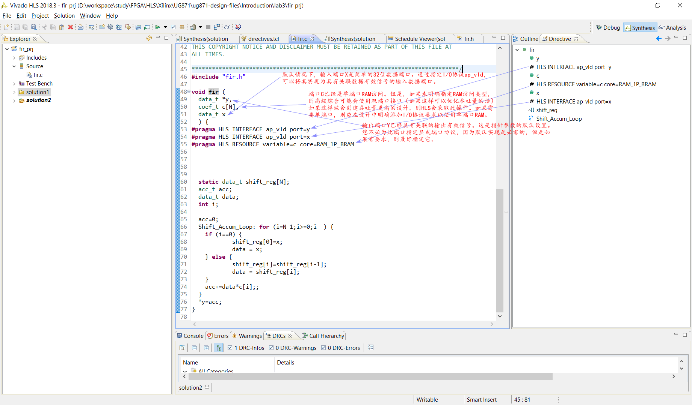
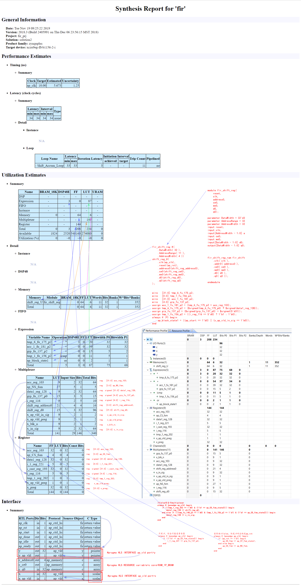
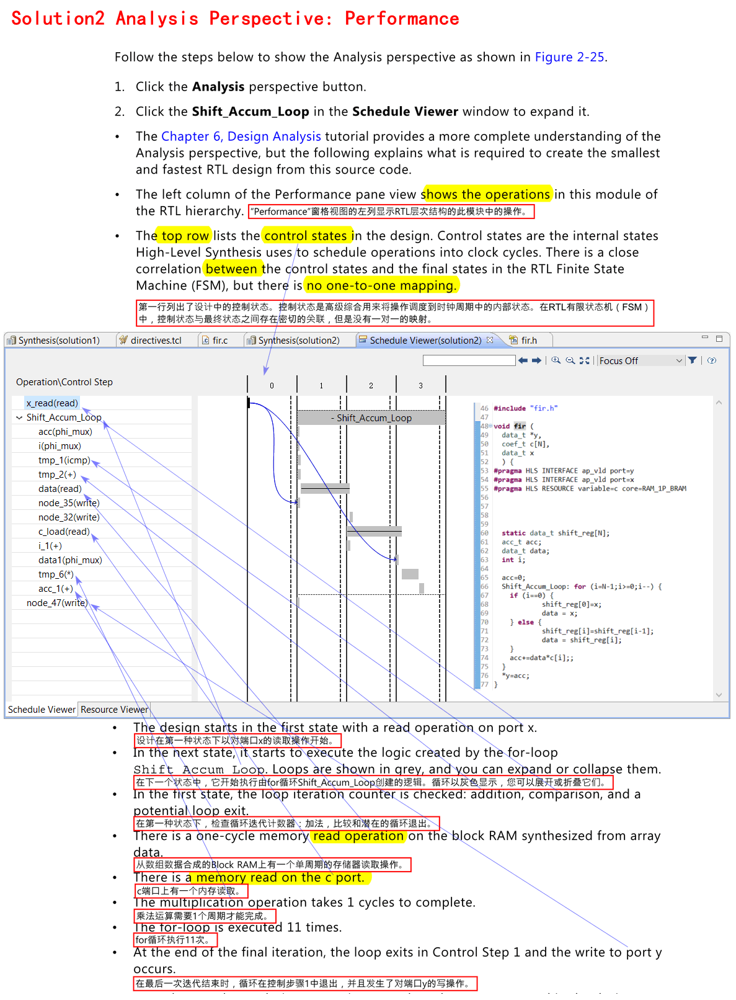
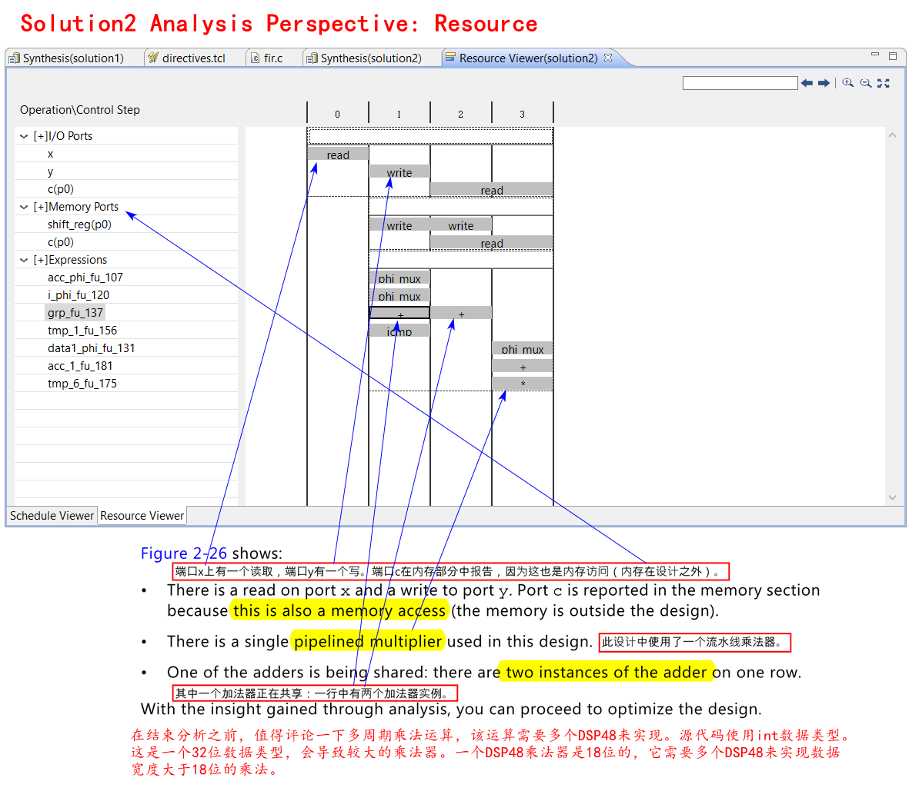
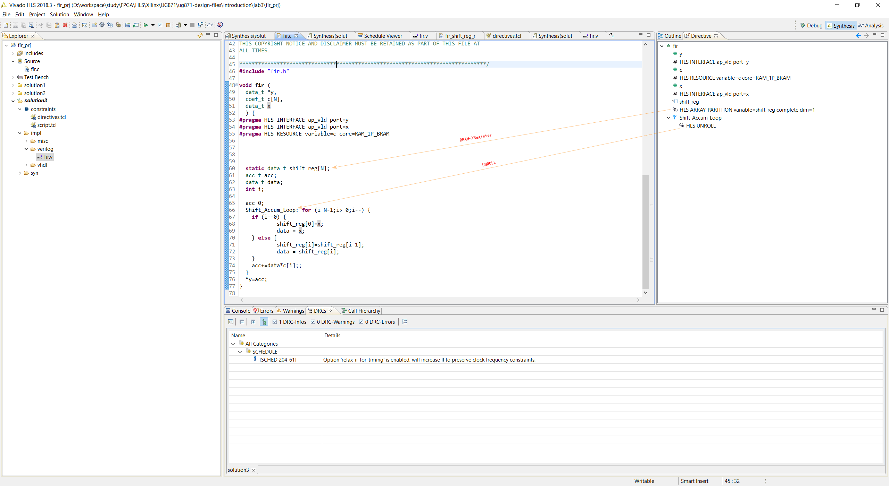
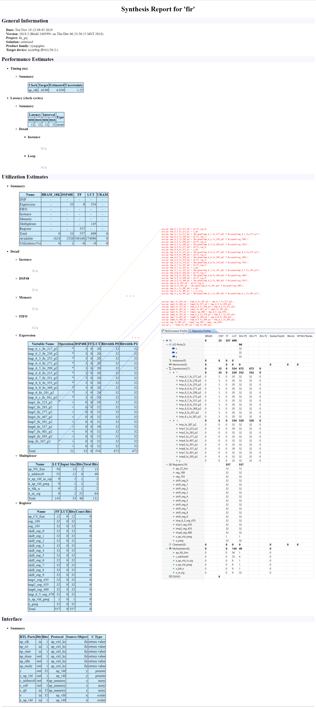
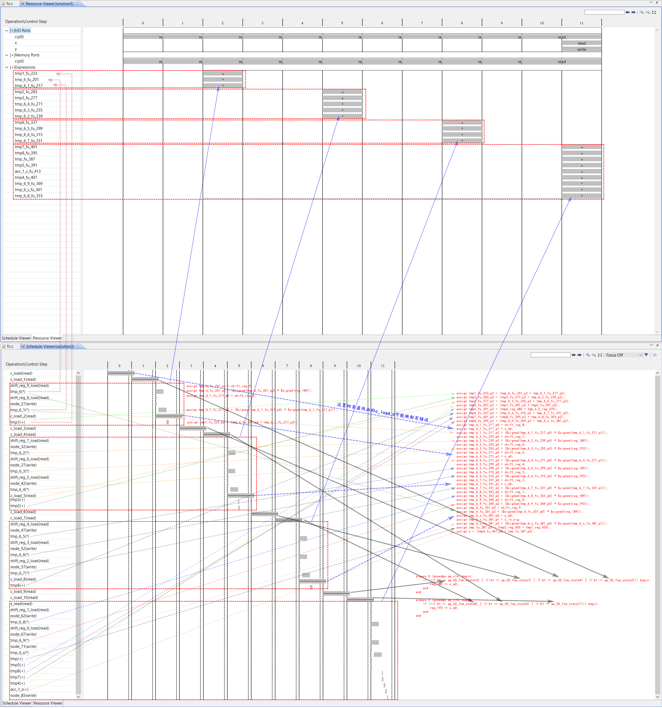

# Ch2 High-Level Synthesis Introduction
## Overview
本教程介绍了Vivado®高级综合（HLS）。您可以使用图形用户界面（GUI）和Tcl环境学习执行高级综合的主要任务。

本教程说明了如何使用优化指令将初始RTL实现转换为低面积和高吞吐量的实现。

### Lab 1 Description
说明如何建立高级综合（HLS）项目并执行HLS设计流程中的所有主要步骤：
- 验证C代码。
- 创建并综合解决方案。
- 验证RTL并打包IP。

### Lab 2 Description
演示如何使用Tcl接口。

### Lab 3 Description
向您展示如何使用优化指令优化设计。本实验创建了多个版本的RTL实现，并比较了不同的解决方案。

## Tutorial Design Description
本教程使用tutorial目录中的设计文件。Vivado_HLS_Tutorial\Introduction。

本教程中使用的示例设计是FIR滤波器。此FIR设计项目的硬件目标是：
- 创建具有最高吞吐量的此设计版本。

最终设计必须处理提供有输入有效信号的数据，并产生伴随输出有效信号的输出数据。滤波器系数将存储在FIR设计的外部，在单个端口RAM中。

## Lab 1: Creating a High-Level Synthesis Project
- 一个项目可以有多个解决方案，每个解决方案都使用不同的目标技术，程序包，约束和/或综合指令。


## Lab 3: Using Solutions for Design Optimization

### Step 1: Creating a New Project

```tcl
D:\workspace\study\FPGA\HLS\Xilinx\UG871\ug871-design-files\Introduction>cd lab3

D:\workspace\study\FPGA\HLS\Xilinx\UG871\ug871-design-files\Introduction\lab3>ls
fir.c  fir.h  fir_test.c  out.gold.dat  run_hls.tcl

D:\workspace\study\FPGA\HLS\Xilinx\UG871\ug871-design-files\Introduction\lab3>cat run_hls.tcl
############################################################
## This file is generated automatically by Vivado HLS.
## Please DO NOT edit it.
## Copyright (C) 2013 Xilinx Inc. All rights reserved.
############################################################

# Create a Vivado HLS project
open_project -reset fir_prj
set_top fir
add_files fir.c
add_files -tb out.gold.dat
add_files -tb fir_test.c

# Solution1 *************************
open_solution -reset "solution1"
set_part  {xcvu9p-flgb2104-1-e}
create_clock -period 10

# Run C simulation
csim_design
# Run Synthesis
csynth_design
# Run RTL verification
cosim_design
# Create the IP package
export_design

exit

// 运行project

D:\workspace\study\FPGA\HLS\Xilinx\UG871\ug871-design-files\Introduction\lab3>cat ../lab2/run_hls.tcl
############################################################
## This file is generated automatically by Vivado HLS.
## Please DO NOT edit it.
## Copyright (C) 1986-2018 Xilinx, Inc. All Rights Reserved.
############################################################
open_project -reset fir_prj
set_top fir
add_files fir.c
add_files -tb fir_test.c
add_files -tb out.gold.dat
open_solution "solution1"
set_part {xczu9eg-ffvb1156-2-i}
create_clock -period 10 -name default
config_compile -no_signed_zeros=0 -unsafe_math_optimizations=0
config_sdx -optimization_level none -target none
config_schedule -effort medium -relax_ii_for_timing=0
#source "./fir_prj/solution1/directives.tcl"
csim_design
csynth_design
cosim_design
export_design -rtl verilog -format ip_catalog
exit

D:\workspace\study\FPGA\HLS\Xilinx\UG871\ug871-design-files\Introduction\lab3>notepad run_hls.tcl

D:\workspace\study\FPGA\HLS\Xilinx\UG871\ug871-design-files\Introduction\lab3>vivado_hls -f run_hls.tcl

****** Vivado(TM) HLS - High-Level Synthesis from C, C++ and SystemC v2018.3 (64-bit)
  **** SW Build 2405991 on Thu Dec  6 23:38:27 MST 2018
  **** IP Build 2404404 on Fri Dec  7 01:43:56 MST 2018
    ** Copyright 1986-2018 Xilinx, Inc. All Rights Reserved.

source C:/Xilinx/Vivado/2018.3/scripts/vivado_hls/hls.tcl -notrace
INFO: [HLS 200-10] Running 'C:/Xilinx/Vivado/2018.3/bin/unwrapped/win64.o/vivado_hls.exe'
INFO: [HLS 200-10] For user 'skd22' on host 'desktop-cl29dn1' (Windows NT_amd64 version 6.2) on Mon Nov 18 17:20:15 +0800 2019
INFO: [HLS 200-10] In directory 'D:/workspace/study/FPGA/HLS/Xilinx/UG871/ug871-design-files/Introduction/lab3'
INFO: [HLS 200-10] Creating and opening project 'D:/workspace/study/FPGA/HLS/Xilinx/UG871/ug871-design-files/Introduction/lab3/fir_prj'.
INFO: [HLS 200-10] Adding design file 'fir.c' to the project
INFO: [HLS 200-10] Adding test bench file 'out.gold.dat' to the project
INFO: [HLS 200-10] Adding test bench file 'fir_test.c' to the project
INFO: [HLS 200-10] Creating and opening solution 'D:/workspace/study/FPGA/HLS/Xilinx/UG871/ug871-design-files/Introduction/lab3/fir_prj/solution1'.
INFO: [HLS 200-10] Cleaning up the solution database.
INFO: [HLS 200-10] Setting target device to 'xczu9eg-ffvb1156-2-i'
INFO: [SYN 201-201] Setting up clock 'default' with a period of 10ns.
INFO: [SIM 211-2] *************** CSIM start ***************
INFO: [SIM 211-4] CSIM will launch GCC as the compiler.
   Compiling(apcc) ../../../../fir_test.c in debug mode
INFO: [HLS 200-10] Running 'C:/Xilinx/Vivado/2018.3/bin/unwrapped/win64.o/apcc.exe'
INFO: [HLS 200-10] For user 'skd22' on host 'desktop-cl29dn1' (Windows NT_amd64 version 6.2) on Mon Nov 18 17:20:18 +0800 2019
INFO: [HLS 200-10] In directory 'D:/workspace/study/FPGA/HLS/Xilinx/UG871/ug871-design-files/Introduction/lab3/fir_prj/solution1/csim/build'
INFO: [APCC 202-3] Tmp directory is apcc_db
INFO: [APCC 202-1] APCC is done.
   Compiling(apcc) ../../../../fir.c in debug mode
INFO: [HLS 200-10] Running 'C:/Xilinx/Vivado/2018.3/bin/unwrapped/win64.o/apcc.exe'
INFO: [HLS 200-10] For user 'skd22' on host 'desktop-cl29dn1' (Windows NT_amd64 version 6.2) on Mon Nov 18 17:20:22 +0800 2019
INFO: [HLS 200-10] In directory 'D:/workspace/study/FPGA/HLS/Xilinx/UG871/ug871-design-files/Introduction/lab3/fir_prj/solution1/csim/build'
INFO: [APCC 202-3] Tmp directory is apcc_db
INFO: [APCC 202-1] APCC is done.
   Generating csim.exe
Comparing against output data
*******************************************
PASS: The output matches the golden output!
*******************************************
INFO: [SIM 211-1] CSim done with 0 errors.
INFO: [SIM 211-3] *************** CSIM finish ***************
INFO: [SCHED 204-61] Option 'relax_ii_for_timing' is enabled, will increase II to preserve clock frequency constraints.
INFO: [HLS 200-10] Analyzing design file 'fir.c' ...
INFO: [HLS 200-111] Finished Linking Time (s): cpu = 00:00:01 ; elapsed = 00:00:14 . Memory (MB): peak = 103.203 ; gain = 18.242
INFO: [HLS 200-111] Finished Checking Pragmas Time (s): cpu = 00:00:01 ; elapsed = 00:00:14 . Memory (MB): peak = 103.203 ; gain = 18.242
INFO: [HLS 200-10] Starting code transformations ...
INFO: [HLS 200-111] Finished Standard Transforms Time (s): cpu = 00:00:01 ; elapsed = 00:00:15 . Memory (MB): peak = 104.703 ; gain = 19.742
INFO: [HLS 200-10] Checking synthesizability ...
INFO: [HLS 200-111] Finished Checking Synthesizability Time (s): cpu = 00:00:01 ; elapsed = 00:00:15 . Memory (MB): peak = 104.957 ; gain = 19.996
INFO: [HLS 200-111] Finished Pre-synthesis Time (s): cpu = 00:00:01 ; elapsed = 00:00:15 . Memory (MB): peak = 126.738 ; gain = 41.777
INFO: [HLS 200-111] Finished Architecture Synthesis Time (s): cpu = 00:00:01 ; elapsed = 00:00:15 . Memory (MB): peak = 126.738 ; gain = 41.777
INFO: [HLS 200-10] Starting hardware synthesis ...
INFO: [HLS 200-10] Synthesizing 'fir' ...
INFO: [HLS 200-10] ----------------------------------------------------------------
INFO: [HLS 200-42] -- Implementing module 'fir'
INFO: [HLS 200-10] ----------------------------------------------------------------
INFO: [SCHED 204-11] Starting scheduling ...
INFO: [SCHED 204-11] Finished scheduling.
INFO: [HLS 200-111]  Elapsed time: 15.109 seconds; current allocated memory: 77.327 MB.
INFO: [HLS 200-434] Only 0 loops out of a total 1 loops have been pipelined in this design.
INFO: [BIND 205-100] Starting micro-architecture generation ...
INFO: [BIND 205-101] Performing variable lifetime analysis.
INFO: [BIND 205-101] Exploring resource sharing.
INFO: [BIND 205-101] Binding ...
INFO: [BIND 205-100] Finished micro-architecture generation.
INFO: [HLS 200-111]  Elapsed time: 0.13 seconds; current allocated memory: 77.563 MB.
INFO: [HLS 200-10] ----------------------------------------------------------------
INFO: [HLS 200-10] -- Generating RTL for module 'fir'
INFO: [HLS 200-10] ----------------------------------------------------------------
INFO: [RTGEN 206-500] Setting interface mode on port 'fir/y' to 'ap_vld'.
INFO: [RTGEN 206-500] Setting interface mode on port 'fir/c' to 'ap_memory'.
INFO: [RTGEN 206-500] Setting interface mode on port 'fir/x' to 'ap_none'.
INFO: [RTGEN 206-500] Setting interface mode on function 'fir' to 'ap_ctrl_hs'.
INFO: [RTGEN 206-100] Finished creating RTL model for 'fir'.
INFO: [HLS 200-111]  Elapsed time: 0.177 seconds; current allocated memory: 77.842 MB.
INFO: [RTMG 210-278] Implementing memory 'fir_shift_reg_ram (RAM)' using distributed RAMs with power-on initialization.
INFO: [HLS 200-111] Finished generating all RTL models Time (s): cpu = 00:00:02 ; elapsed = 00:00:17 . Memory (MB): peak = 126.738 ; gain = 41.777
INFO: [SYSC 207-301] Generating SystemC RTL for fir.
INFO: [VHDL 208-304] Generating VHDL RTL for fir.
INFO: [VLOG 209-307] Generating Verilog RTL for fir.
INFO: [COSIM 212-47] Using XSIM for RTL simulation.
INFO: [COSIM 212-14] Instrumenting C test bench ...
   Build using "C:/Xilinx/Vivado/2018.3/msys64/mingw64/bin/g++"
   Compiling apatb_fir.cpp
   Compiling (apcc) fir.c_pre.c.tb.c
INFO: [HLS 200-10] Running 'C:/Xilinx/Vivado/2018.3/bin/unwrapped/win64.o/apcc.exe'
INFO: [HLS 200-10] For user 'skd22' on host 'desktop-cl29dn1' (Windows NT_amd64 version 6.2) on Mon Nov 18 17:20:41 +0800 2019
INFO: [HLS 200-10] In directory 'D:/workspace/study/FPGA/HLS/Xilinx/UG871/ug871-design-files/Introduction/lab3/fir_prj/solution1/sim/wrapc'
clang: warning: argument unused during compilation: '-fno-builtin-isinf'
clang: warning: argument unused during compilation: '-fno-builtin-isnan'
INFO: [APCC 202-3] Tmp directory is apcc_db
INFO: [APCC 202-1] APCC is done.
   Compiling (apcc) fir_test.c_pre.c.tb.c
INFO: [HLS 200-10] Running 'C:/Xilinx/Vivado/2018.3/bin/unwrapped/win64.o/apcc.exe'
INFO: [HLS 200-10] For user 'skd22' on host 'desktop-cl29dn1' (Windows NT_amd64 version 6.2) on Mon Nov 18 17:20:45 +0800 2019
INFO: [HLS 200-10] In directory 'D:/workspace/study/FPGA/HLS/Xilinx/UG871/ug871-design-files/Introduction/lab3/fir_prj/solution1/sim/wrapc'
clang: warning: argument unused during compilation: '-fno-builtin-isinf'
clang: warning: argument unused during compilation: '-fno-builtin-isnan'
INFO: [APCC 202-3] Tmp directory is apcc_db
INFO: [APCC 202-1] APCC is done.
   Generating cosim.tv.exe
INFO: [COSIM 212-302] Starting C TB testing ...
Comparing against output data
*******************************************
PASS: The output matches the golden output!
*******************************************
INFO: [COSIM 212-333] Generating C post check test bench ...
INFO: [COSIM 212-12] Generating RTL test bench ...
INFO: [COSIM 212-323] Starting verilog simulation.
INFO: [COSIM 212-15] Starting XSIM ...

D:\workspace\study\FPGA\HLS\Xilinx\UG871\ug871-design-files\Introduction\lab3\fir_prj\solution1\sim\verilog>set PATH=

D:\workspace\study\FPGA\HLS\Xilinx\UG871\ug871-design-files\Introduction\lab3\fir_prj\solution1\sim\verilog>call C:/Xilinx/Vivado/2018.3/bin/xelab xil_defaultlib.apatb_fir_top glbl -prj fir.prj -L smartconnect_v1_0 -L axi_protocol_checker_v1_1_12 -L axi_protocol_checker_v1_1_13 -L axis_protocol_checker_v1_1_11 -L axis_protocol_checker_v1_1_12 -L xil_defaultlib -L unisims_ver -L xpm --initfile "C:/Xilinx/Vivado/2018.3/data/xsim/ip/xsim_ip.ini" --lib "ieee_proposed=./ieee_proposed" -s fir
INFO: [XSIM 43-3496] Using init file passed via -initfile option "C:/Xilinx/Vivado/2018.3/data/xsim/ip/xsim_ip.ini".
Vivado Simulator 2018.3
Copyright 1986-1999, 2001-2018 Xilinx, Inc. All Rights Reserved.
Running: C:/Xilinx/Vivado/2018.3/bin/unwrapped/win64.o/xelab.exe xil_defaultlib.apatb_fir_top glbl -prj fir.prj -L smartconnect_v1_0 -L axi_protocol_checker_v1_1_12 -L axi_protocol_checker_v1_1_13 -L axis_protocol_checker_v1_1_11 -L axis_protocol_checker_v1_1_12 -L xil_defaultlib -L unisims_ver -L xpm --initfile C:/Xilinx/Vivado/2018.3/data/xsim/ip/xsim_ip.ini --lib ieee_proposed=./ieee_proposed -s fir
Multi-threading is on. Using 6 slave threads.
INFO: [VRFC 10-2263] Analyzing SystemVerilog file "D:/workspace/study/FPGA/HLS/Xilinx/UG871/ug871-design-files/Introduction/lab3/fir_prj/solution1/sim/verilog/glbl.v" into library work
INFO: [VRFC 10-311] analyzing module glbl
INFO: [VRFC 10-2263] Analyzing SystemVerilog file "D:/workspace/study/FPGA/HLS/Xilinx/UG871/ug871-design-files/Introduction/lab3/fir_prj/solution1/sim/verilog/AESL_automem_c.v" into library xil_defaultlib
INFO: [VRFC 10-311] analyzing module AESL_automem_c
INFO: [VRFC 10-2263] Analyzing SystemVerilog file "D:/workspace/study/FPGA/HLS/Xilinx/UG871/ug871-design-files/Introduction/lab3/fir_prj/solution1/sim/verilog/fir.autotb.v" into library xil_defaultlib
INFO: [VRFC 10-311] analyzing module apatb_fir_top
INFO: [VRFC 10-2263] Analyzing SystemVerilog file "D:/workspace/study/FPGA/HLS/Xilinx/UG871/ug871-design-files/Introduction/lab3/fir_prj/solution1/sim/verilog/fir.v" into library xil_defaultlib
INFO: [VRFC 10-311] analyzing module fir
INFO: [VRFC 10-2263] Analyzing SystemVerilog file "D:/workspace/study/FPGA/HLS/Xilinx/UG871/ug871-design-files/Introduction/lab3/fir_prj/solution1/sim/verilog/fir_shift_reg.v" into library xil_defaultlib
INFO: [VRFC 10-311] analyzing module fir_shift_reg_ram
INFO: [VRFC 10-311] analyzing module fir_shift_reg
Starting static elaboration
Completed static elaboration
Starting simulation data flow analysis
Completed simulation data flow analysis
Time Resolution for simulation is 1ps
Compiling module xil_defaultlib.fir_shift_reg_ram
Compiling module xil_defaultlib.fir_shift_reg(DataWidth=32,Addre...
Compiling module xil_defaultlib.fir
Compiling module xil_defaultlib.AESL_automem_c
Compiling module xil_defaultlib.apatb_fir_top
Compiling module work.glbl
Built simulation snapshot fir

****** Webtalk v2018.3 (64-bit)
  **** SW Build 2405991 on Thu Dec  6 23:38:27 MST 2018
  **** IP Build 2404404 on Fri Dec  7 01:43:56 MST 2018
    ** Copyright 1986-2018 Xilinx, Inc. All Rights Reserved.

source D:/workspace/study/FPGA/HLS/Xilinx/UG871/ug871-design-files/Introduction/lab3/fir_prj/solution1/sim/verilog/xsim.dir/fir/webtalk/xsim_webtalk.tcl -notrace
webtalk_transmit: Time (s): cpu = 00:00:00 ; elapsed = 00:00:12 . Memory (MB): peak = 83.281 ; gain = 0.969
INFO: [Common 17-206] Exiting Webtalk at Mon Nov 18 17:21:04 2019...

****** xsim v2018.3 (64-bit)
  **** SW Build 2405991 on Thu Dec  6 23:38:27 MST 2018
  **** IP Build 2404404 on Fri Dec  7 01:43:56 MST 2018
    ** Copyright 1986-2018 Xilinx, Inc. All Rights Reserved.

source xsim.dir/fir/xsim_script.tcl
# xsim {fir} -autoloadwcfg -tclbatch {fir.tcl}
Vivado Simulator 2018.3
Time resolution is 1 ps
source fir.tcl
## run all
////////////////////////////////////////////////////////////////////////////////////
// Inter-Transaction Progress: Completed Transaction / Total Transaction
// Intra-Transaction Progress: Measured Latency / Latency Estimation * 100%
//
// RTL Simulation : "Inter-Transaction Progress" ["Intra-Transaction Progress"] @ "Simulation Time"
////////////////////////////////////////////////////////////////////////////////////
// RTL Simulation : 0 / 601 [0.00%] @ "125000"
// RTL Simulation : 1 / 601 [100.00%] @ "485000"
// RTL Simulation : 2 / 601 [100.00%] @ "835000"
...
// RTL Simulation : 600 / 601 [100.00%] @ "210135000"
// RTL Simulation : 601 / 601 [100.00%] @ "210485000"
////////////////////////////////////////////////////////////////////////////////////
$finish called at time : 210525 ns : File "D:/workspace/study/FPGA/HLS/Xilinx/UG871/ug871-design-files/Introduction/lab3/fir_prj/solution1/sim/verilog/fir.autotb.v" Line 335
## quit
INFO: [Common 17-206] Exiting xsim at Mon Nov 18 17:21:14 2019...
INFO: [COSIM 212-316] Starting C post checking ...
Comparing against output data
*******************************************
PASS: The output matches the golden output!
*******************************************
INFO: [COSIM 212-1000] *** C/RTL co-simulation finished: PASS ***
INFO: [IMPL 213-8] Exporting RTL as a Vivado IP.

****** Vivado v2018.3 (64-bit)
  **** SW Build 2405991 on Thu Dec  6 23:38:27 MST 2018
  **** IP Build 2404404 on Fri Dec  7 01:43:56 MST 2018
    ** Copyright 1986-2018 Xilinx, Inc. All Rights Reserved.

source run_ippack.tcl -notrace
INFO: [IP_Flow 19-234] Refreshing IP repositories
INFO: [IP_Flow 19-1704] No user IP repositories specified
INFO: [IP_Flow 19-2313] Loaded Vivado IP repository 'C:/Xilinx/Vivado/2018.3/data/ip'.
INFO: [Common 17-206] Exiting Vivado at Mon Nov 18 17:21:23 2019...
INFO: [HLS 200-112] Total elapsed time: 69.027 seconds; peak allocated memory: 77.842 MB.
INFO: [Common 17-206] Exiting vivado_hls at Mon Nov 18 17:21:24 2019...

// 打开GUI project
D:\workspace\study\FPGA\HLS\Xilinx\UG871\ug871-design-files\Introduction\lab3>vivado_hls -p fir_prj

****** Vivado(TM) HLS - High-Level Synthesis from C, C++ and SystemC v2018.3 (64-bit)
  **** SW Build 2405991 on Thu Dec  6 23:38:27 MST 2018
  **** IP Build 2404404 on Fri Dec  7 01:43:56 MST 2018
    ** Copyright 1986-2018 Xilinx, Inc. All Rights Reserved.

source C:/Xilinx/Vivado/2018.3/scripts/vivado_hls/hls.tcl -notrace
INFO: [HLS 200-10] Running 'C:/Xilinx/Vivado/2018.3/bin/unwrapped/win64.o/vivado_hls.exe'
INFO: [HLS 200-10] For user 'skd22' on host 'desktop-cl29dn1' (Windows NT_amd64 version 6.2) on Mon Nov 18 17:21:52 +0800 2019
INFO: [HLS 200-10] In directory 'D:/workspace/study/FPGA/HLS/Xilinx/UG871/ug871-design-files/Introduction/lab3'
INFO: [HLS 200-10] Bringing up Vivado HLS GUI ...
```

### Step 2: Optimize the I/O Interfaces
- 由于设计规范包括I/O协议，因此您执行的**第一个优化**将创建正确的I/O协议和端口。您选择的I/O协议类型可能会影响可能的设计优化。如果有I/O协议要求，则应在设计周期中尽早设置I/O协议。
  - 端口C必须具有**单端口RAM**访问。
  - 端口X必须具有**输入数据有效**(ap_vld)信号。
  - 端口Y必须具有**输出数据有效**(ap_vld)信号。
    - 指针默认有输出有效信号，但是最好指定它
- 由于I/O协议不太可能更改，因此可以将这些优化指令作为pragmas程序添加到源代码中，以确保在设计中嵌入正确的I/O协议。
- 代码修改
  
  

- Verilog

  - fir.v

  ```verilog
  // ==============================================================
  // RTL generated by Vivado(TM) HLS - High-Level Synthesis from C, C++ and SystemC
  // Version: 2018.3
  // Copyright (C) 1986-2018 Xilinx, Inc. All Rights Reserved.
  // 
  // ===========================================================

  `timescale 1 ns / 1 ps 

  (* CORE_GENERATION_INFO="fir,hls_ip_2018_3,{HLS_INPUT_TYPE=c,HLS_INPUT_FLOAT=0,HLS_INPUT_FIXED=0,HLS_INPUT_PART=xczu9eg-ffvb1156-2-i,HLS_INPUT_CLOCK=10.000000,HLS_INPUT_ARCH=others,HLS_SYN_CLOCK=5.673000,HLS_SYN_LAT=34,HLS_SYN_TPT=none,HLS_SYN_MEM=0,HLS_SYN_DSP=3,HLS_SYN_FF=208,HLS_SYN_LUT=234,HLS_VERSION=2018_3}" *)

  module fir (
          ap_clk,
          ap_rst,
          ap_start,
          ap_done,
          ap_idle,
          ap_ready,
          y,
          y_ap_vld,
          c_address0,
          c_ce0,
          c_q0,
          x,
          x_ap_vld
  );

  parameter    ap_ST_fsm_state1 = 4'd1;
  parameter    ap_ST_fsm_state2 = 4'd2;
  parameter    ap_ST_fsm_state3 = 4'd4;
  parameter    ap_ST_fsm_state4 = 4'd8;

  input   ap_clk;
  input   ap_rst;
  input   ap_start;
  output   ap_done;
  output   ap_idle;
  output   ap_ready;
  output  [31:0] y;
  output   y_ap_vld;
  output  [3:0] c_address0;
  output   c_ce0;
  input  [31:0] c_q0;
  input  [31:0] x;
  input   x_ap_vld;

  reg ap_done;
  reg ap_idle;
  reg ap_ready;
  reg y_ap_vld;
  reg c_ce0;

  (* fsm_encoding = "none" *) reg   [3:0] ap_CS_fsm;
  wire    ap_CS_fsm_state1;
  reg   [31:0] x_preg;
  reg   [31:0] x_in_sig;
  reg    x_ap_vld_preg;
  reg    x_ap_vld_in_sig;
  reg   [3:0] shift_reg_address0;
  reg    shift_reg_ce0;
  reg    shift_reg_we0;
  reg   [31:0] shift_reg_d0;
  wire   [31:0] shift_reg_q0;
  reg    x_blk_n;
  reg    ap_block_state1;
  wire  signed [31:0] i_cast_fu_144_p1;
  reg  signed [31:0] i_cast_reg_193;
  wire    ap_CS_fsm_state2;
  wire   [0:0] tmp_1_fu_156_p2;
  reg   [0:0] tmp_1_reg_202;
  wire   [0:0] tmp_fu_148_p3;
  wire    ap_CS_fsm_state3;
  wire   [4:0] grp_fu_137_p2;
  reg   [4:0] i_1_reg_221;
  wire   [31:0] acc_1_fu_181_p2;
  wire    ap_CS_fsm_state4;
  reg   [31:0] acc_reg_103;
  wire  signed [4:0] ap_phi_mux_i_phi_fu_120_p4;
  reg  signed [4:0] i_reg_116;
  reg  signed [31:0] data1_reg_128;
  wire   [63:0] tmp_3_fu_162_p1;
  wire   [63:0] tmp_4_fu_167_p1;
  wire   [63:0] tmp_5_fu_171_p1;
  reg  signed [4:0] grp_fu_137_p0;
  wire  signed [31:0] tmp_6_fu_175_p0;
  wire   [31:0] tmp_6_fu_175_p2;
  reg   [3:0] ap_NS_fsm;

  // power-on initialization
  initial begin
  #0 ap_CS_fsm = 4'd1;
  #0 x_preg = 32'd0;
  #0 x_ap_vld_preg = 1'b0;
  end

  fir_shift_reg #(
      .DataWidth( 32 ),
      .AddressRange( 11 ),
      .AddressWidth( 4 ))
  shift_reg_U(
      .clk(ap_clk),
      .reset(ap_rst),
      .address0(shift_reg_address0),
      .ce0(shift_reg_ce0),
      .we0(shift_reg_we0),
      .d0(shift_reg_d0),
      .q0(shift_reg_q0)
  );

  always @ (posedge ap_clk) begin
      if (ap_rst == 1'b1) begin
          ap_CS_fsm <= ap_ST_fsm_state1;
      end else begin
          ap_CS_fsm <= ap_NS_fsm;
      end
  end

  always @ (posedge ap_clk) begin
      if (ap_rst == 1'b1) begin
          x_ap_vld_preg <= 1'b0;
      end else begin
          if (((tmp_fu_148_p3 == 1'd1) & (1'b1 == ap_CS_fsm_state2))) begin
              x_ap_vld_preg <= 1'b0;
          end else if ((~((ap_start == 1'b0) & (1'b1 == ap_CS_fsm_state1)) & (x_ap_vld == 1'b1))) begin
              x_ap_vld_preg <= x_ap_vld;
          end
      end
  end

  always @ (posedge ap_clk) begin
      if (ap_rst == 1'b1) begin
          x_preg <= 32'd0;
      end else begin
          if ((~((ap_start == 1'b0) & (1'b1 == ap_CS_fsm_state1)) & (x_ap_vld == 1'b1))) begin
              x_preg <= x;
          end
      end
  end

  always @ (posedge ap_clk) begin
      if ((1'b1 == ap_CS_fsm_state4)) begin
          acc_reg_103 <= acc_1_fu_181_p2;
      end else if ((~((ap_start == 1'b0) | (x_ap_vld_in_sig == 1'b0)) & (1'b1 == ap_CS_fsm_state1))) begin
          acc_reg_103 <= 32'd0;
      end
  end

  always @ (posedge ap_clk) begin
      if (((tmp_1_reg_202 == 1'd0) & (1'b1 == ap_CS_fsm_state3))) begin
          data1_reg_128 <= shift_reg_q0;
      end else if (((tmp_fu_148_p3 == 1'd0) & (tmp_1_fu_156_p2 == 1'd1) & (1'b1 == ap_CS_fsm_state2))) begin
          data1_reg_128 <= x_in_sig;
      end
  end

  always @ (posedge ap_clk) begin
      if ((1'b1 == ap_CS_fsm_state4)) begin
          i_reg_116 <= i_1_reg_221;
      end else if ((~((ap_start == 1'b0) | (x_ap_vld_in_sig == 1'b0)) & (1'b1 == ap_CS_fsm_state1))) begin
          i_reg_116 <= 5'd10;
      end
  end

  always @ (posedge ap_clk) begin
      if ((1'b1 == ap_CS_fsm_state3)) begin
          i_1_reg_221 <= grp_fu_137_p2;
      end
  end

  always @ (posedge ap_clk) begin
      if ((1'b1 == ap_CS_fsm_state2)) begin
          i_cast_reg_193 <= i_cast_fu_144_p1;
      end
  end

  always @ (posedge ap_clk) begin
      if (((tmp_fu_148_p3 == 1'd0) & (1'b1 == ap_CS_fsm_state2))) begin
          tmp_1_reg_202 <= tmp_1_fu_156_p2;
      end
  end

  always @ (*) begin
      if (((tmp_fu_148_p3 == 1'd1) & (1'b1 == ap_CS_fsm_state2))) begin
          ap_done = 1'b1;
      end else begin
          ap_done = 1'b0;
      end
  end

  always @ (*) begin
      if (((ap_start == 1'b0) & (1'b1 == ap_CS_fsm_state1))) begin
          ap_idle = 1'b1;
      end else begin
          ap_idle = 1'b0;
      end
  end

  always @ (*) begin
      if (((tmp_fu_148_p3 == 1'd1) & (1'b1 == ap_CS_fsm_state2))) begin
          ap_ready = 1'b1;
      end else begin
          ap_ready = 1'b0;
      end
  end

  always @ (*) begin
      if ((1'b1 == ap_CS_fsm_state3)) begin
          c_ce0 = 1'b1;
      end else begin
          c_ce0 = 1'b0;
      end
  end

  always @ (*) begin
      if ((1'b1 == ap_CS_fsm_state3)) begin
          grp_fu_137_p0 = i_reg_116;
      end else if ((1'b1 == ap_CS_fsm_state2)) begin
          grp_fu_137_p0 = ap_phi_mux_i_phi_fu_120_p4;
      end else begin
          grp_fu_137_p0 = 'bx;
      end
  end

  always @ (*) begin
      if ((1'b1 == ap_CS_fsm_state3)) begin
          shift_reg_address0 = tmp_4_fu_167_p1;
      end else if (((tmp_fu_148_p3 == 1'd0) & (tmp_1_fu_156_p2 == 1'd1) & (1'b1 == ap_CS_fsm_state2))) begin
          shift_reg_address0 = 4'd0;
      end else if (((tmp_fu_148_p3 == 1'd0) & (tmp_1_fu_156_p2 == 1'd0) & (1'b1 == ap_CS_fsm_state2))) begin
          shift_reg_address0 = tmp_3_fu_162_p1;
      end else begin
          shift_reg_address0 = 'bx;
      end
  end

  always @ (*) begin
      if (((1'b1 == ap_CS_fsm_state3) | ((tmp_fu_148_p3 == 1'd0) & (tmp_1_fu_156_p2 == 1'd0) & (1'b1 == ap_CS_fsm_state2)) | ((tmp_fu_148_p3 == 1'd0) & (tmp_1_fu_156_p2 == 1'd1) & (1'b1 == ap_CS_fsm_state2)))) begin
          shift_reg_ce0 = 1'b1;
      end else begin
          shift_reg_ce0 = 1'b0;
      end
  end

  always @ (*) begin
      if ((1'b1 == ap_CS_fsm_state3)) begin
          shift_reg_d0 = shift_reg_q0;
      end else if (((tmp_fu_148_p3 == 1'd0) & (tmp_1_fu_156_p2 == 1'd1) & (1'b1 == ap_CS_fsm_state2))) begin
          shift_reg_d0 = x_in_sig;
      end else begin
          shift_reg_d0 = 'bx;
      end
  end

  always @ (*) begin
      if ((((tmp_1_reg_202 == 1'd0) & (1'b1 == ap_CS_fsm_state3)) | ((tmp_fu_148_p3 == 1'd0) & (tmp_1_fu_156_p2 == 1'd1) & (1'b1 == ap_CS_fsm_state2)))) begin
          shift_reg_we0 = 1'b1;
      end else begin
          shift_reg_we0 = 1'b0;
      end
  end

  always @ (*) begin
      if ((x_ap_vld == 1'b1)) begin
          x_ap_vld_in_sig = x_ap_vld;
      end else begin
          x_ap_vld_in_sig = x_ap_vld_preg;
      end
  end

  always @ (*) begin
      if (((ap_start == 1'b1) & (1'b1 == ap_CS_fsm_state1))) begin
          x_blk_n = x_ap_vld;
      end else begin
          x_blk_n = 1'b1;
      end
  end

  always @ (*) begin
      if ((x_ap_vld == 1'b1)) begin
          x_in_sig = x;
      end else begin
          x_in_sig = x_preg;
      end
  end

  always @ (*) begin
      if (((tmp_fu_148_p3 == 1'd1) & (1'b1 == ap_CS_fsm_state2))) begin
          y_ap_vld = 1'b1;
      end else begin
          y_ap_vld = 1'b0;
      end
  end

  always @ (*) begin
      case (ap_CS_fsm)
          ap_ST_fsm_state1 : begin
              if ((~((ap_start == 1'b0) | (x_ap_vld_in_sig == 1'b0)) & (1'b1 == ap_CS_fsm_state1))) begin
                  ap_NS_fsm = ap_ST_fsm_state2;
              end else begin
                  ap_NS_fsm = ap_ST_fsm_state1;
              end
          end
          ap_ST_fsm_state2 : begin
              if (((tmp_fu_148_p3 == 1'd1) & (1'b1 == ap_CS_fsm_state2))) begin
                  ap_NS_fsm = ap_ST_fsm_state1;
              end else begin
                  ap_NS_fsm = ap_ST_fsm_state3;
              end
          end
          ap_ST_fsm_state3 : begin
              ap_NS_fsm = ap_ST_fsm_state4;
          end
          ap_ST_fsm_state4 : begin
              ap_NS_fsm = ap_ST_fsm_state2;
          end
          default : begin
              ap_NS_fsm = 'bx;
          end
      endcase
  end

  assign acc_1_fu_181_p2 = (tmp_6_fu_175_p2 + acc_reg_103);

  assign ap_CS_fsm_state1 = ap_CS_fsm[32'd0];

  assign ap_CS_fsm_state2 = ap_CS_fsm[32'd1];

  assign ap_CS_fsm_state3 = ap_CS_fsm[32'd2];

  assign ap_CS_fsm_state4 = ap_CS_fsm[32'd3];

  always @ (*) begin
      ap_block_state1 = ((ap_start == 1'b0) | (x_ap_vld_in_sig == 1'b0));
  end

  assign ap_phi_mux_i_phi_fu_120_p4 = i_reg_116;

  assign c_address0 = tmp_5_fu_171_p1;

  assign grp_fu_137_p2 = ($signed(grp_fu_137_p0) + $signed(5'd31));

  assign i_cast_fu_144_p1 = i_reg_116;

  assign tmp_1_fu_156_p2 = ((i_reg_116 == 5'd0) ? 1'b1 : 1'b0);

  assign tmp_3_fu_162_p1 = grp_fu_137_p2;

  assign tmp_4_fu_167_p1 = $unsigned(i_cast_reg_193);

  assign tmp_5_fu_171_p1 = $unsigned(i_cast_reg_193);

  assign tmp_6_fu_175_p0 = c_q0;

  assign tmp_6_fu_175_p2 = ($signed(tmp_6_fu_175_p0) * $signed(data1_reg_128));

  assign tmp_fu_148_p3 = i_reg_116[32'd4];

  assign y = acc_reg_103;

  endmodule //fir

  ```

  - fir_shift_reg.v
  
  ```verilog
  // ==============================================================
  // File generated on Tue Nov 19 09:25:23 +0800 2019
  // Vivado(TM) HLS - High-Level Synthesis from C, C++ and SystemC v2018.3 (64-bit)
  // SW Build 2405991 on Thu Dec  6 23:38:27 MST 2018
  // IP Build 2404404 on Fri Dec  7 01:43:56 MST 2018
  // Copyright 1986-2018 Xilinx, Inc. All Rights Reserved.
  // ==============================================================
  `timescale 1 ns / 1 ps
  module fir_shift_reg_ram (addr0, ce0, d0, we0, q0,  clk);

  parameter DWIDTH = 32;
  parameter AWIDTH = 4;
  parameter MEM_SIZE = 11;

  input[AWIDTH-1:0] addr0;
  input ce0;
  input[DWIDTH-1:0] d0;
  input we0;
  output reg[DWIDTH-1:0] q0;
  input clk;

  (* ram_style = "distributed" *)reg [DWIDTH-1:0] ram[0:MEM_SIZE-1];

  initial begin
      $readmemh("./fir_shift_reg_ram.dat", ram);
  end


  always @(posedge clk)  
  begin 
      if (ce0) 
      begin
          if (we0) 
          begin 
              ram[addr0] <= d0; 
          end 
          q0 <= ram[addr0];
      end
  end


  endmodule

  `timescale 1 ns / 1 ps
  module fir_shift_reg(
      reset,
      clk,
      address0,
      ce0,
      we0,
      d0,
      q0);

  parameter DataWidth = 32'd32;
  parameter AddressRange = 32'd11;
  parameter AddressWidth = 32'd4;
  input reset;
  input clk;
  input[AddressWidth - 1:0] address0;
  input ce0;
  input we0;
  input[DataWidth - 1:0] d0;
  output[DataWidth - 1:0] q0;


  fir_shift_reg_ram fir_shift_reg_ram_U(
      .clk( clk ),
      .addr0( address0 ),
      .ce0( ce0 ),
      .we0( we0 ),
      .d0( d0 ),
      .q0( q0 ));

  endmodule
  ```

- 综合分析
  
  

### Step 3: Analyze the Results





### Step 4: Optimize for the Highest Throughput (Lowest Interval)

限制此设计中的**吞吐量**的两个问题是：
- for循环。默认情况下，循环保持rolled状态：循环体的一个副本被合成并在每次迭代中重复使用。这样可以确保循环的每次迭代都按顺序执行。您可以**展开for循环**以允许所有操作并行发生。
- 用于shift_reg的Block RAM。由于变量shift_reg是C源代码中的数组，因此默认情况下将其实现为Block RAM。但是，这阻止了其实现为移位寄存器。因此，您应该**将此Block RAM划分为单独的寄存器**。

- 代码修改

  

- Verilog

  - fir.v
  ```verilog
  // ==============================================================
  // RTL generated by Vivado(TM) HLS - High-Level Synthesis from C, C++ and SystemC
  // Version: 2018.3
  // Copyright (C) 1986-2018 Xilinx, Inc. All Rights Reserved.
  // 
  // ===========================================================

  `timescale 1 ns / 1 ps 

  (* CORE_GENERATION_INFO="fir,hls_ip_2018_3,{HLS_INPUT_TYPE=c,HLS_INPUT_FLOAT=0,HLS_INPUT_FIXED=0,HLS_INPUT_PART=xczu9eg-ffvb1156-2-i,HLS_INPUT_CLOCK=10.000000,HLS_INPUT_ARCH=others,HLS_SYN_CLOCK=6.850000,HLS_SYN_LAT=11,HLS_SYN_TPT=none,HLS_SYN_MEM=0,HLS_SYN_DSP=33,HLS_SYN_FF=557,HLS_SYN_LUT=699,HLS_VERSION=2018_3}" *)

  module fir (
          ap_clk,
          ap_rst,
          ap_start,
          ap_done,
          ap_idle,
          ap_ready,
          y,
          y_ap_vld,
          c_address0,
          c_ce0,
          c_q0,
          x,
          x_ap_vld
  );

  parameter    ap_ST_fsm_state1 = 12'd1;
  parameter    ap_ST_fsm_state2 = 12'd2;
  parameter    ap_ST_fsm_state3 = 12'd4;
  parameter    ap_ST_fsm_state4 = 12'd8;
  parameter    ap_ST_fsm_state5 = 12'd16;
  parameter    ap_ST_fsm_state6 = 12'd32;
  parameter    ap_ST_fsm_state7 = 12'd64;
  parameter    ap_ST_fsm_state8 = 12'd128;
  parameter    ap_ST_fsm_state9 = 12'd256;
  parameter    ap_ST_fsm_state10 = 12'd512;
  parameter    ap_ST_fsm_state11 = 12'd1024;
  parameter    ap_ST_fsm_state12 = 12'd2048;

  input   ap_clk;
  input   ap_rst;
  input   ap_start;
  output   ap_done;
  output   ap_idle;
  output   ap_ready;
  output  [31:0] y;
  output   y_ap_vld;
  output  [3:0] c_address0;
  output   c_ce0;
  input  [31:0] c_q0;
  input  [31:0] x;
  input   x_ap_vld;

  reg ap_done;
  reg ap_idle;
  reg ap_ready;
  reg y_ap_vld;
  reg[3:0] c_address0;
  reg c_ce0;

  (* fsm_encoding = "none" *) reg   [11:0] ap_CS_fsm;
  wire    ap_CS_fsm_state1;
  reg   [31:0] x_preg;
  reg   [31:0] x_in_sig;
  reg    x_ap_vld_preg;
  reg    x_ap_vld_in_sig;
  reg   [31:0] shift_reg_9;
  reg   [31:0] shift_reg_8;
  reg   [31:0] shift_reg_7;
  reg   [31:0] shift_reg_6;
  reg   [31:0] shift_reg_5;
  reg   [31:0] shift_reg_4;
  reg   [31:0] shift_reg_3;
  reg   [31:0] shift_reg_2;
  reg   [31:0] shift_reg_1;
  reg   [31:0] shift_reg_0;
  reg    x_blk_n;
  wire    ap_CS_fsm_state12;
  reg  signed [31:0] reg_189;
  wire    ap_CS_fsm_state2;
  wire    ap_CS_fsm_state4;
  wire    ap_CS_fsm_state7;
  wire    ap_CS_fsm_state10;
  reg  signed [31:0] reg_193;
  wire    ap_CS_fsm_state5;
  wire    ap_CS_fsm_state8;
  wire    ap_CS_fsm_state11;
  wire    ap_CS_fsm_state3;
  wire   [31:0] tmp1_fu_223_p2;
  reg   [31:0] tmp1_reg_435;
  wire    ap_CS_fsm_state6;
  wire   [31:0] tmp2_fu_283_p2;
  reg   [31:0] tmp2_reg_455;
  wire   [31:0] tmp_6_5_fu_299_p2;
  reg   [31:0] tmp_6_5_reg_470;
  wire    ap_CS_fsm_state9;
  wire   [31:0] tmp6_fu_337_p2;
  reg   [31:0] tmp6_reg_480;
  wire  signed [31:0] tmp_6_fu_201_p0;
  wire  signed [31:0] tmp_6_1_fu_217_p0;
  wire  signed [31:0] tmp_6_1_fu_217_p1;
  wire   [31:0] tmp_6_fu_201_p2;
  wire   [31:0] tmp_6_1_fu_217_p2;
  wire  signed [31:0] tmp_6_2_fu_239_p0;
  wire  signed [31:0] tmp_6_3_fu_255_p0;
  wire  signed [31:0] tmp_6_4_fu_271_p0;
  wire  signed [31:0] tmp_6_4_fu_271_p1;
  wire   [31:0] tmp_6_3_fu_255_p2;
  wire   [31:0] tmp_6_4_fu_271_p2;
  wire   [31:0] tmp3_fu_277_p2;
  wire   [31:0] tmp_6_2_fu_239_p2;
  wire  signed [31:0] tmp_6_5_fu_299_p0;
  wire  signed [31:0] tmp_6_6_fu_315_p0;
  wire  signed [31:0] tmp_6_7_fu_331_p0;
  wire  signed [31:0] tmp_6_7_fu_331_p1;
  wire   [31:0] tmp_6_6_fu_315_p2;
  wire   [31:0] tmp_6_7_fu_331_p2;
  wire  signed [31:0] tmp_6_8_fu_353_p0;
  wire  signed [31:0] tmp_6_9_fu_369_p0;
  wire  signed [31:0] tmp_6_s_fu_381_p0;
  wire  signed [31:0] tmp_6_s_fu_381_p1;
  wire   [31:0] tmp_6_9_fu_369_p2;
  wire   [31:0] tmp_6_s_fu_381_p2;
  wire   [31:0] tmp8_fu_395_p2;
  wire   [31:0] tmp_6_8_fu_353_p2;
  wire   [31:0] tmp7_fu_401_p2;
  wire   [31:0] tmp5_fu_391_p2;
  wire   [31:0] tmp4_fu_407_p2;
  wire   [31:0] tmp_fu_387_p2;
  reg   [11:0] ap_NS_fsm;

  // power-on initialization
  initial begin
  #0 ap_CS_fsm = 12'd1;
  #0 x_preg = 32'd0;
  #0 x_ap_vld_preg = 1'b0;
  #0 shift_reg_9 = 32'd0;
  #0 shift_reg_8 = 32'd0;
  #0 shift_reg_7 = 32'd0;
  #0 shift_reg_6 = 32'd0;
  #0 shift_reg_5 = 32'd0;
  #0 shift_reg_4 = 32'd0;
  #0 shift_reg_3 = 32'd0;
  #0 shift_reg_2 = 32'd0;
  #0 shift_reg_1 = 32'd0;
  #0 shift_reg_0 = 32'd0;
  end

  always @ (posedge ap_clk) begin
      if (ap_rst == 1'b1) begin
          ap_CS_fsm <= ap_ST_fsm_state1;
      end else begin
          ap_CS_fsm <= ap_NS_fsm;
      end
  end

  always @ (posedge ap_clk) begin
      if (ap_rst == 1'b1) begin
          x_ap_vld_preg <= 1'b0;
      end else begin
          if (((x_ap_vld_in_sig == 1'b1) & (1'b1 == ap_CS_fsm_state12))) begin
              x_ap_vld_preg <= 1'b0;
          end else if ((~((ap_start == 1'b0) & (1'b1 == ap_CS_fsm_state1)) & (x_ap_vld == 1'b1))) begin
              x_ap_vld_preg <= x_ap_vld;
          end
      end
  end

  always @ (posedge ap_clk) begin
      if (ap_rst == 1'b1) begin
          x_preg <= 32'd0;
      end else begin
          if ((~((ap_start == 1'b0) & (1'b1 == ap_CS_fsm_state1)) & (x_ap_vld == 1'b1))) begin
              x_preg <= x;
          end
      end
  end

  always @ (posedge ap_clk) begin
      if (((1'b1 == ap_CS_fsm_state10) | (1'b1 == ap_CS_fsm_state7) | (1'b1 == ap_CS_fsm_state4) | (1'b1 == ap_CS_fsm_state2))) begin
          reg_189 <= c_q0;
      end
  end

  always @ (posedge ap_clk) begin
      if (((1'b1 == ap_CS_fsm_state8) | (1'b1 == ap_CS_fsm_state5) | (1'b1 == ap_CS_fsm_state11))) begin
          reg_193 <= c_q0;
      end
  end

  always @ (posedge ap_clk) begin
      if (((x_ap_vld_in_sig == 1'b1) & (1'b1 == ap_CS_fsm_state12))) begin
          shift_reg_0 <= x_in_sig;
          shift_reg_1 <= shift_reg_0;
          shift_reg_2 <= shift_reg_1;
      end
  end

  always @ (posedge ap_clk) begin
      if ((1'b1 == ap_CS_fsm_state9)) begin
          shift_reg_3 <= shift_reg_2;
          shift_reg_4 <= shift_reg_3;
          shift_reg_5 <= shift_reg_4;
          tmp6_reg_480 <= tmp6_fu_337_p2;
          tmp_6_5_reg_470 <= tmp_6_5_fu_299_p2;
      end
  end

  always @ (posedge ap_clk) begin
      if ((1'b1 == ap_CS_fsm_state6)) begin
          shift_reg_6 <= shift_reg_5;
          shift_reg_7 <= shift_reg_6;
          shift_reg_8 <= shift_reg_7;
          tmp2_reg_455 <= tmp2_fu_283_p2;
      end
  end

  always @ (posedge ap_clk) begin
      if ((1'b1 == ap_CS_fsm_state3)) begin
          shift_reg_9 <= shift_reg_8;
          tmp1_reg_435 <= tmp1_fu_223_p2;
      end
  end

  always @ (*) begin
      if (((x_ap_vld_in_sig == 1'b1) & (1'b1 == ap_CS_fsm_state12))) begin
          ap_done = 1'b1;
      end else begin
          ap_done = 1'b0;
      end
  end

  always @ (*) begin
      if (((ap_start == 1'b0) & (1'b1 == ap_CS_fsm_state1))) begin
          ap_idle = 1'b1;
      end else begin
          ap_idle = 1'b0;
      end
  end

  always @ (*) begin
      if (((x_ap_vld_in_sig == 1'b1) & (1'b1 == ap_CS_fsm_state12))) begin
          ap_ready = 1'b1;
      end else begin
          ap_ready = 1'b0;
      end
  end

  always @ (*) begin
      if ((1'b1 == ap_CS_fsm_state11)) begin
          c_address0 = 64'd0;
      end else if ((1'b1 == ap_CS_fsm_state10)) begin
          c_address0 = 64'd1;
      end else if ((1'b1 == ap_CS_fsm_state9)) begin
          c_address0 = 64'd2;
      end else if ((1'b1 == ap_CS_fsm_state8)) begin
          c_address0 = 64'd3;
      end else if ((1'b1 == ap_CS_fsm_state7)) begin
          c_address0 = 64'd4;
      end else if ((1'b1 == ap_CS_fsm_state6)) begin
          c_address0 = 64'd5;
      end else if ((1'b1 == ap_CS_fsm_state5)) begin
          c_address0 = 64'd6;
      end else if ((1'b1 == ap_CS_fsm_state4)) begin
          c_address0 = 64'd7;
      end else if ((1'b1 == ap_CS_fsm_state3)) begin
          c_address0 = 64'd8;
      end else if ((1'b1 == ap_CS_fsm_state2)) begin
          c_address0 = 64'd9;
      end else if ((1'b1 == ap_CS_fsm_state1)) begin
          c_address0 = 64'd10;
      end else begin
          c_address0 = 'bx;
      end
  end

  always @ (*) begin
      if (((1'b1 == ap_CS_fsm_state8) | (1'b1 == ap_CS_fsm_state5) | (1'b1 == ap_CS_fsm_state10) | (1'b1 == ap_CS_fsm_state7) | (1'b1 == ap_CS_fsm_state4) | (1'b1 == ap_CS_fsm_state2) | (1'b1 == ap_CS_fsm_state9) | (1'b1 == ap_CS_fsm_state6) | (1'b1 == ap_CS_fsm_state3) | (1'b1 == ap_CS_fsm_state11) | ((1'b1 == ap_CS_fsm_state1) & (ap_start == 1'b1)))) begin
          c_ce0 = 1'b1;
      end else begin
          c_ce0 = 1'b0;
      end
  end

  always @ (*) begin
      if ((x_ap_vld == 1'b1)) begin
          x_ap_vld_in_sig = x_ap_vld;
      end else begin
          x_ap_vld_in_sig = x_ap_vld_preg;
      end
  end

  always @ (*) begin
      if ((1'b1 == ap_CS_fsm_state12)) begin
          x_blk_n = x_ap_vld;
      end else begin
          x_blk_n = 1'b1;
      end
  end

  always @ (*) begin
      if ((x_ap_vld == 1'b1)) begin
          x_in_sig = x;
      end else begin
          x_in_sig = x_preg;
      end
  end

  always @ (*) begin
      if (((x_ap_vld_in_sig == 1'b1) & (1'b1 == ap_CS_fsm_state12))) begin
          y_ap_vld = 1'b1;
      end else begin
          y_ap_vld = 1'b0;
      end
  end

  always @ (*) begin
      case (ap_CS_fsm)
          ap_ST_fsm_state1 : begin
              if (((1'b1 == ap_CS_fsm_state1) & (ap_start == 1'b1))) begin
                  ap_NS_fsm = ap_ST_fsm_state2;
              end else begin
                  ap_NS_fsm = ap_ST_fsm_state1;
              end
          end
          ap_ST_fsm_state2 : begin
              ap_NS_fsm = ap_ST_fsm_state3;
          end
          ap_ST_fsm_state3 : begin
              ap_NS_fsm = ap_ST_fsm_state4;
          end
          ap_ST_fsm_state4 : begin
              ap_NS_fsm = ap_ST_fsm_state5;
          end
          ap_ST_fsm_state5 : begin
              ap_NS_fsm = ap_ST_fsm_state6;
          end
          ap_ST_fsm_state6 : begin
              ap_NS_fsm = ap_ST_fsm_state7;
          end
          ap_ST_fsm_state7 : begin
              ap_NS_fsm = ap_ST_fsm_state8;
          end
          ap_ST_fsm_state8 : begin
              ap_NS_fsm = ap_ST_fsm_state9;
          end
          ap_ST_fsm_state9 : begin
              ap_NS_fsm = ap_ST_fsm_state10;
          end
          ap_ST_fsm_state10 : begin
              ap_NS_fsm = ap_ST_fsm_state11;
          end
          ap_ST_fsm_state11 : begin
              ap_NS_fsm = ap_ST_fsm_state12;
          end
          ap_ST_fsm_state12 : begin
              if (((x_ap_vld_in_sig == 1'b1) & (1'b1 == ap_CS_fsm_state12))) begin
                  ap_NS_fsm = ap_ST_fsm_state1;
              end else begin
                  ap_NS_fsm = ap_ST_fsm_state12;
              end
          end
          default : begin
              ap_NS_fsm = 'bx;
          end
      endcase
  end

  assign ap_CS_fsm_state1 = ap_CS_fsm[32'd0];

  assign ap_CS_fsm_state10 = ap_CS_fsm[32'd9];

  assign ap_CS_fsm_state11 = ap_CS_fsm[32'd10];

  assign ap_CS_fsm_state12 = ap_CS_fsm[32'd11];

  assign ap_CS_fsm_state2 = ap_CS_fsm[32'd1];

  assign ap_CS_fsm_state3 = ap_CS_fsm[32'd2];

  assign ap_CS_fsm_state4 = ap_CS_fsm[32'd3];

  assign ap_CS_fsm_state5 = ap_CS_fsm[32'd4];

  assign ap_CS_fsm_state6 = ap_CS_fsm[32'd5];

  assign ap_CS_fsm_state7 = ap_CS_fsm[32'd6];

  assign ap_CS_fsm_state8 = ap_CS_fsm[32'd7];

  assign ap_CS_fsm_state9 = ap_CS_fsm[32'd8];

  assign tmp1_fu_223_p2 = (tmp_6_fu_201_p2 + tmp_6_1_fu_217_p2);

  assign tmp2_fu_283_p2 = (tmp3_fu_277_p2 + tmp_6_2_fu_239_p2);

  assign tmp3_fu_277_p2 = (tmp_6_3_fu_255_p2 + tmp_6_4_fu_271_p2);

  assign tmp4_fu_407_p2 = (tmp7_fu_401_p2 + tmp5_fu_391_p2);

  assign tmp5_fu_391_p2 = (tmp6_reg_480 + tmp_6_5_reg_470);

  assign tmp6_fu_337_p2 = (tmp_6_6_fu_315_p2 + tmp_6_7_fu_331_p2);

  assign tmp7_fu_401_p2 = (tmp8_fu_395_p2 + tmp_6_8_fu_353_p2);

  assign tmp8_fu_395_p2 = (tmp_6_9_fu_369_p2 + tmp_6_s_fu_381_p2);

  assign tmp_6_1_fu_217_p0 = shift_reg_8;

  assign tmp_6_1_fu_217_p1 = c_q0;

  assign tmp_6_1_fu_217_p2 = ($signed(tmp_6_1_fu_217_p0) * $signed(tmp_6_1_fu_217_p1));

  assign tmp_6_2_fu_239_p0 = shift_reg_7;

  assign tmp_6_2_fu_239_p2 = ($signed(tmp_6_2_fu_239_p0) * $signed(reg_189));

  assign tmp_6_3_fu_255_p0 = shift_reg_6;

  assign tmp_6_3_fu_255_p2 = ($signed(tmp_6_3_fu_255_p0) * $signed(reg_193));

  assign tmp_6_4_fu_271_p0 = shift_reg_5;

  assign tmp_6_4_fu_271_p1 = c_q0;

  assign tmp_6_4_fu_271_p2 = ($signed(tmp_6_4_fu_271_p0) * $signed(tmp_6_4_fu_271_p1));

  assign tmp_6_5_fu_299_p0 = shift_reg_4;

  assign tmp_6_5_fu_299_p2 = ($signed(tmp_6_5_fu_299_p0) * $signed(reg_189));

  assign tmp_6_6_fu_315_p0 = shift_reg_3;

  assign tmp_6_6_fu_315_p2 = ($signed(tmp_6_6_fu_315_p0) * $signed(reg_193));

  assign tmp_6_7_fu_331_p0 = shift_reg_2;

  assign tmp_6_7_fu_331_p1 = c_q0;

  assign tmp_6_7_fu_331_p2 = ($signed(tmp_6_7_fu_331_p0) * $signed(tmp_6_7_fu_331_p1));

  assign tmp_6_8_fu_353_p0 = shift_reg_1;

  assign tmp_6_8_fu_353_p2 = ($signed(tmp_6_8_fu_353_p0) * $signed(reg_189));

  assign tmp_6_9_fu_369_p0 = shift_reg_0;

  assign tmp_6_9_fu_369_p2 = ($signed(tmp_6_9_fu_369_p0) * $signed(reg_193));

  assign tmp_6_fu_201_p0 = shift_reg_9;

  assign tmp_6_fu_201_p2 = ($signed(tmp_6_fu_201_p0) * $signed(reg_189));

  assign tmp_6_s_fu_381_p0 = c_q0;

  assign tmp_6_s_fu_381_p1 = x_in_sig;

  assign tmp_6_s_fu_381_p2 = ($signed(tmp_6_s_fu_381_p0) * $signed(tmp_6_s_fu_381_p1));

  assign tmp_fu_387_p2 = (tmp2_reg_455 + tmp1_reg_435);

  assign y = (tmp4_fu_407_p2 + tmp_fu_387_p2);

  endmodule //fir

  ```

- 综合分析

  

- 结果分析

  