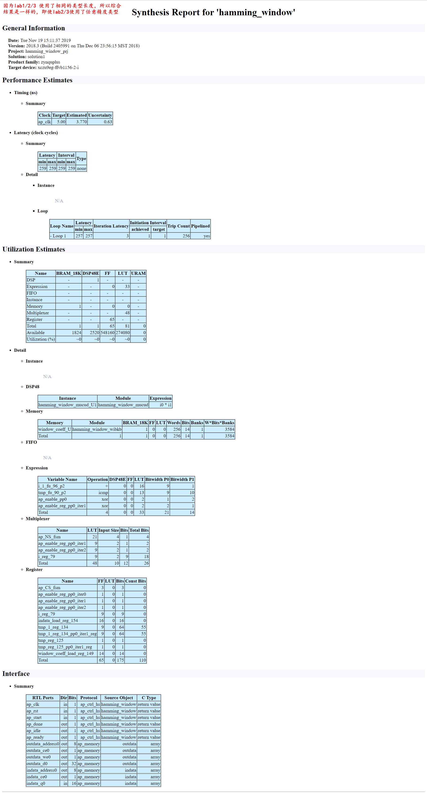

# Ch3 C Validation
C算法的验证是高级综合（HLS）过程的重要组成部分。确保C算法执行正确的操作并创建C测试平台所花费的时间，可以确认结果正确，减少了“按设计”分析不正确设计所花费的时间，并确保可以自动执行RTL验证。

本教程包含三个实验练习。
## Lab 1: C Validation and Debug
- 本练习回顾了良好的C测试平台的各个方面，并说明了高级综合C调试环境的基本操作。

### Step 1: Create and Open the Project

```tcl
D:\workspace\study\FPGA\HLS\Xilinx\UG871\ug871-design-files\C_Validation\lab1>vivado_hls -f run_hls.tcl

****** Vivado(TM) HLS - High-Level Synthesis from C, C++ and SystemC v2018.3 (64-bit)
  **** SW Build 2405991 on Thu Dec  6 23:38:27 MST 2018
  **** IP Build 2404404 on Fri Dec  7 01:43:56 MST 2018
    ** Copyright 1986-2018 Xilinx, Inc. All Rights Reserved.

source C:/Xilinx/Vivado/2018.3/scripts/vivado_hls/hls.tcl -notrace
INFO: [HLS 200-10] Running 'C:/Xilinx/Vivado/2018.3/bin/unwrapped/win64.o/vivado_hls.exe'
INFO: [HLS 200-10] For user 'skd22' on host 'desktop-cl29dn1' (Windows NT_amd64 version 6.2) on Tue Nov 19 14:51:56 +0800 2019
INFO: [HLS 200-10] In directory 'D:/workspace/study/FPGA/HLS/Xilinx/UG871/ug871-design-files/C_Validation/lab1'
INFO: [HLS 200-10] Opening and resetting project 'D:/workspace/study/FPGA/HLS/Xilinx/UG871/ug871-design-files/C_Validation/lab1/hamming_window_prj'.
INFO: [HLS 200-10] Adding design file 'hamming_window.c' to the project
INFO: [HLS 200-10] Adding test bench file 'hamming_window_test.c' to the project
INFO: [HLS 200-10] Opening and resetting solution 'D:/workspace/study/FPGA/HLS/Xilinx/UG871/ug871-design-files/C_Validation/lab1/hamming_window_prj/solution1'.
INFO: [HLS 200-10] Cleaning up the solution database.
INFO: [HLS 200-10] Setting target device to 'xczu9eg-ffvb1156-2-i'
INFO: [SYN 201-201] Setting up clock 'default' with a period of 5ns.
INFO: [SIM 211-2] *************** CSIM start ***************
INFO: [SIM 211-4] CSIM will launch GCC as the compiler.
   Compiling(apcc) ../../../../hamming_window_test.c in debug mode
INFO: [HLS 200-10] Running 'C:/Xilinx/Vivado/2018.3/bin/unwrapped/win64.o/apcc.exe'
INFO: [HLS 200-10] For user 'skd22' on host 'desktop-cl29dn1' (Windows NT_amd64 version 6.2) on Tue Nov 19 14:51:59 +0800 2019
INFO: [HLS 200-10] In directory 'D:/workspace/study/FPGA/HLS/Xilinx/UG871/ug871-design-files/C_Validation/lab1/hamming_window_prj/solution1/csim/build'
INFO: [APCC 202-3] Tmp directory is apcc_db
INFO: [APCC 202-1] APCC is done.
   Compiling(apcc) ../../../../hamming_window.c in debug mode
INFO: [HLS 200-10] Running 'C:/Xilinx/Vivado/2018.3/bin/unwrapped/win64.o/apcc.exe'
INFO: [HLS 200-10] For user 'skd22' on host 'desktop-cl29dn1' (Windows NT_amd64 version 6.2) on Tue Nov 19 14:52:04 +0800 2019
INFO: [HLS 200-10] In directory 'D:/workspace/study/FPGA/HLS/Xilinx/UG871/ug871-design-files/C_Validation/lab1/hamming_window_prj/solution1/csim/build'
INFO: [APCC 202-3] Tmp directory is apcc_db
INFO: [APCC 202-1] APCC is done.
   Generating csim.exe
Running DUT...done.
Testing DUT results
................................................................
................................................................
................................................................
................................................................
*** Test Passed ***
INFO: [SIM 211-1] CSim done with 0 errors.
INFO: [SIM 211-3] *************** CSIM finish ***************
INFO: [Common 17-206] Exiting vivado_hls at Tue Nov 19 14:52:08 2019...
D:\workspace\study\FPGA\HLS\Xilinx\UG871\ug871-design-files\C_Validation\lab1>vivado_hls -p hamming_window_prj

****** Vivado(TM) HLS - High-Level Synthesis from C, C++ and SystemC v2018.3 (64-bit)
  **** SW Build 2405991 on Thu Dec  6 23:38:27 MST 2018
  **** IP Build 2404404 on Fri Dec  7 01:43:56 MST 2018
    ** Copyright 1986-2018 Xilinx, Inc. All Rights Reserved.

source C:/Xilinx/Vivado/2018.3/scripts/vivado_hls/hls.tcl -notrace
INFO: [HLS 200-10] Running 'C:/Xilinx/Vivado/2018.3/bin/unwrapped/win64.o/vivado_hls.exe'
INFO: [HLS 200-10] For user 'skd22' on host 'desktop-cl29dn1' (Windows NT_amd64 version 6.2) on Tue Nov 19 14:52:20 +0800 2019
INFO: [HLS 200-10] In directory 'D:/workspace/study/FPGA/HLS/Xilinx/UG871/ug871-design-files/C_Validation/lab1'
INFO: [HLS 200-10] Bringing up Vivado HLS GUI ...
```

### Step 2: Review Test Bench and Run C Simulation


## Lab 2: C Validation with ANSI C Arbitrary Precision Types
### Introduction
本练习使用具有任意精度C类型的设计。您将在GUI中检查和调试设计。

### Step 1: Create and Open the Project

```bat
D:\workspace\study\FPGA\HLS\Xilinx\UG871\ug871-design-files\C_Validation\lab2>vivado_hls -f run_hls.tcl
D:\workspace\study\FPGA\HLS\Xilinx\UG871\ug871-design-files\C_Validation\lab2>vivado_hls -p hamming_window_prj
```

- hamming_window.h
  ```c++
  #ifndef HAMMING_WINDOW_H_
  #define HAMMING_WINDOW_H_

  #include <stdint.h>
  #include <math.h>

  #ifndef M_PI
  #define M_PI           3.14159265358979323846
  #endif

  // If WINDOW_LEN is not defined by the user, define a default value
  #ifndef WINDOW_LEN
  #define WINDOW_LEN 256
  #endif
  // If WIN_COEFF_FRACBITS not defined by user, set a default value
  #ifndef WIN_COEFF_FRACBITS
  #define WIN_COEFF_FRACBITS (14)
  #endif
  // Set the scale factor for the window coefficients
  #define WIN_COEFF_SCALE ((float)(1 << WIN_COEFF_FRACBITS))

  // This function applies an Hamming window function to the 'indata' buffer,
  // returning the windowed data in 'outdata'.  The coefficients are 16-bit
  // scaled integer, which may be interpreted as a signed fixed point format,
  // with WIN_COEFF_FRACBITS bits after the binary point.

  //typedef int16_t		in_data_t;
  //typedef int32_t		out_data_t;
  #include "ap_cint.h"
  typedef int16		in_data_t;
  typedef int32		out_data_t;

  void hamming_window(out_data_t outdata[], in_data_t indata[]);

  #endif // HAMMING_WINDOW_H_ not defined
  ```
- hamming_window.c
  ```c++
  #include "hamming_window.h" // Provides default WINDOW_LEN if not user defined

  // Translation module function prototypes:
  static void hamming_rom_init(in_data_t rom_array[]);

  // Function definitions:
  void hamming_window(out_data_t outdata[WINDOW_LEN], in_data_t indata[WINDOW_LEN])
  {
    static in_data_t window_coeff[WINDOW_LEN];
    unsigned i;

    // In order to ensure that 'window_coeff' is inferred and properly
    // initialized as a ROM, it is recommended that the arrya initialization
    // be done in a sub-function with global (wrt this source file) scope.
    hamming_rom_init(window_coeff);

    for (i = 0; i < WINDOW_LEN; i++) {
  #pragma AP pipeline
        outdata[i] = (out_data_t)window_coeff[i] * (out_data_t)indata[i];
    }
  }

  // This initialization function will be optimized away during high level
  // sythesis (HLS), resulting in the underlying memory being inferred as a ROM
  // by RTL synthesis.
  static void hamming_rom_init(in_data_t rom_array[WINDOW_LEN])
  {
    int i;
    for (i = 0; i < WINDOW_LEN; i++) {
        float real_val = 0.54f -
          0.46f * cos(2.0f * M_PI * i / (float)(WINDOW_LEN - 1));
        rom_array[i] = (in_data_t)(WIN_COEFF_SCALE * real_val);
    }
  }

  ```
### Step 2: Run the C Debugger

:star: 重要说明：使用任意精度类型时，只能将Vivado HLS调试环境与C++或SystemC一起使用。在ANSI C中使用任意精度类型时，无法使用调试环境。使用ANSI C，您必须改为使用printf或fprintf语句进行调试。

## Lab 3: C Validation with C++ Arbitrary Precision Types
- hamming_window.h
  ```c++
  *******************************************************************************/
  #ifndef HAMMING_WINDOW_H_
  #define HAMMING_WINDOW_H_

  #include <cmath>
  #include <fstream>
  #include <iostream>
  #include <iomanip>
  #include <cstdlib>
  using namespace std;

  #ifndef M_PI
  #define M_PI           3.14159265358979323846
  #endif

  // If WINDOW_LEN is not defined by the user, define a default value
  #ifndef WINDOW_LEN
  #define WINDOW_LEN 256
  #endif
  // If WIN_COEFF_FRACBITS not defined by user, set a default value
  #ifndef WIN_COEFF_FRACBITS
  #define WIN_COEFF_FRACBITS (14)
  #endif
  // Set the scale factor for the window coefficients
  #define WIN_COEFF_SCALE ((float)(1 << WIN_COEFF_FRACBITS))

  // This function applies an Hamming window function to the 'indata' buffer,
  // returning the windowed data in 'outdata'.  The coefficients are 16-bit
  // scaled integer, which may be interpreted as a signed fixed point format,
  // with WIN_COEFF_FRACBITS bits after the binary point.

  //typedef int16_t		in_data_t;
  //typedef int32_t		out_data_t;
  #include "ap_int.h"
  typedef ap_int<16>		in_data_t;
  typedef ap_int<32>		out_data_t;

  void hamming_window(out_data_t outdata[], in_data_t indata[]);

  #endif // HAMMING_WINDOW_H_ not defined
  ```

- 注意：在本实验中，设计与实验1和实验2相同，但有一个例外。现在的设计是C++，并且类型已更新为使用由Vivado HLS提供并在头文件ap_int.h中定义的C++任意精度类型ap_int <#N>。

- 任意精度类型是创建高性能，精确位硬件设计的有力手段。但是，在调试环境中，可以通过逐步执行头文件定义来降低生产率。使用断点和单步返回功能可以跳过低级计算并在“变量”选项卡中查看变量的值。

- 综合分析

  