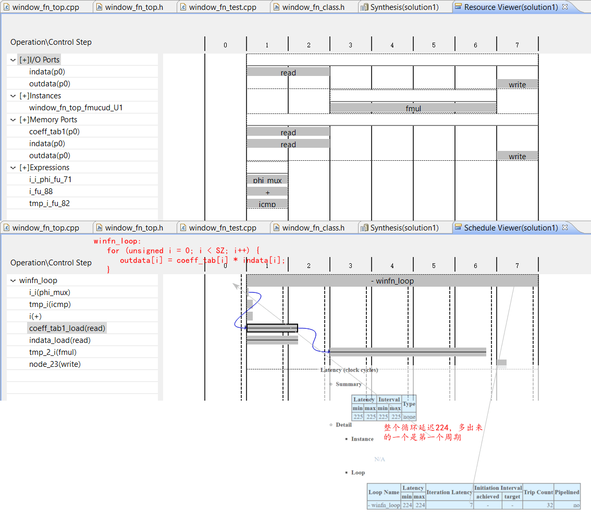
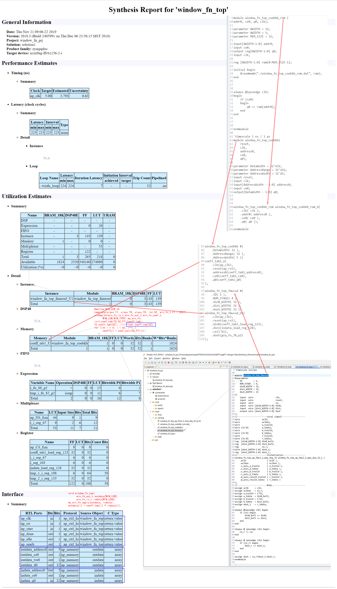
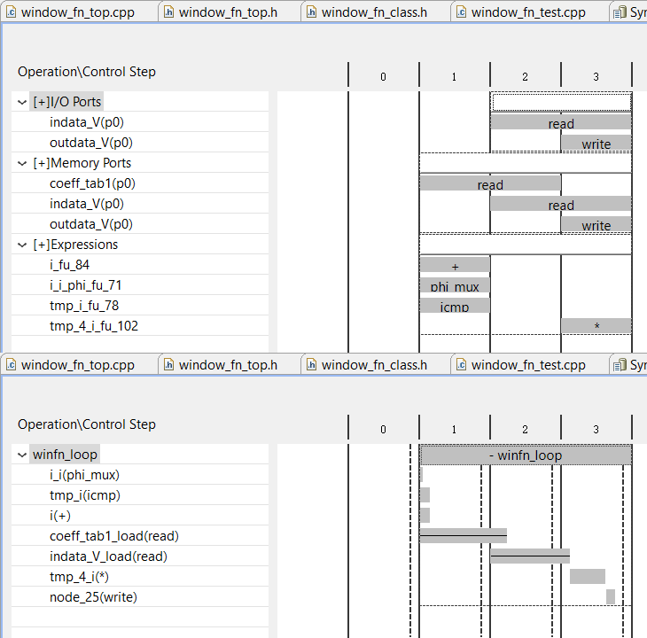
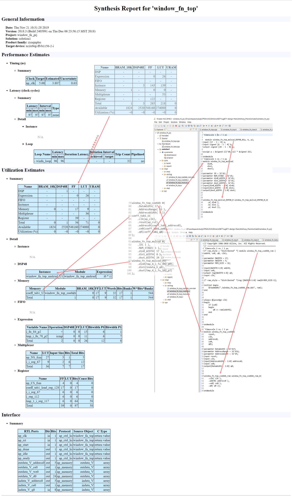

# Ch5 Arbitrary Precision Types

创建硬件时，通常需要更精确的位宽。例如，考虑到滤波器的输入为12位并且结果的累加仅需要27位的最大范围的情况。使用标准C数据类型进行硬件设计会导致不必要的硬件成本。操作可能会使用超出所需精度所需的更多LUT和寄存器，并且延迟甚至可能超过时钟周期，从而需要更多的周期来计算结果。

Vivado高级综合（HLS）提供了许多位精度或任意精度的数据类型，使您可以使用任何（任意）宽度来建模变量。

[Reading: UG902-Data Types for Efficient Hardware](..\UG902\Chapter-1-High-Level-Synthesis\CH1.5-Data-Types-for-Efficient-Hardware.md)

## Lab 1: Arbitrary Precision

任意精度Lab1：查看使用标准C/C++类型的设计。

### Step 1: Create and Open the Project

```tcl
D:\workspace\study\FPGA\HLS\Xilinx\UG871\ug871-design-files\Arbitrary_Precision\lab1>vivado_hls -f run_hls.tcl

****** Vivado(TM) HLS - High-Level Synthesis from C, C++ and SystemC v2018.3 (64-bit)
  **** SW Build 2405991 on Thu Dec  6 23:38:27 MST 2018
  **** IP Build 2404404 on Fri Dec  7 01:43:56 MST 2018
    ** Copyright 1986-2018 Xilinx, Inc. All Rights Reserved.

source C:/Xilinx/Vivado/2018.3/scripts/vivado_hls/hls.tcl -notrace
INFO: [HLS 200-10] Running 'C:/Xilinx/Vivado/2018.3/bin/unwrapped/win64.o/vivado_hls.exe'
INFO: [HLS 200-10] For user 'skd22' on host 'desktop-cl29dn1' (Windows NT_amd64 version 6.2) on Thu Nov 21 08:52:24 +0800 2019
INFO: [HLS 200-10] In directory 'D:/workspace/study/FPGA/HLS/Xilinx/UG871/ug871-design-files/Arbitrary_Precision/lab1'
INFO: [HLS 200-10] Creating and opening project 'D:/workspace/study/FPGA/HLS/Xilinx/UG871/ug871-design-files/Arbitrary_Precision/lab1/window_fn_prj'.
INFO: [HLS 200-10] Adding design file 'window_fn_top.cpp' to the project
INFO: [HLS 200-10] Adding test bench file 'window_fn_test.cpp' to the project
INFO: [HLS 200-10] Creating and opening solution 'D:/workspace/study/FPGA/HLS/Xilinx/UG871/ug871-design-files/Arbitrary_Precision/lab1/window_fn_prj/solution1'.
INFO: [HLS 200-10] Cleaning up the solution database.
INFO: [HLS 200-10] Setting target device to 'xczu9eg-ffvb1156-2-i'
INFO: [SYN 201-201] Setting up clock 'default' with a period of 5ns.
INFO: [SIM 211-2] *************** CSIM start ***************
INFO: [SIM 211-4] CSIM will launch GCC as the compiler.
   Compiling ../../../../window_fn_test.cpp in debug mode
   Compiling ../../../../window_fn_top.cpp in debug mode
   Generating csim.exe
Checking results against a tolerance of 0
i = 0   hw_result = 0.00000      sw_result = 0.00000
i = 1   hw_result = 0.61487      sw_result = 0.61487
i = 2   hw_result = 2.43585      sw_result = 2.43585
i = 3   hw_result = 5.39297      sw_result = 5.39297
i = 4   hw_result = 9.37258      sw_result = 9.37258
i = 5   hw_result = 14.22175     sw_result = 14.22175
i = 6   hw_result = 19.75413     sw_result = 19.75413
i = 7   hw_result = 25.75711     sw_result = 25.75711
i = 8   hw_result = 32.00000     sw_result = 32.00000
i = 9   hw_result = 38.24289     sw_result = 38.24289
i = 10  hw_result = 44.24587     sw_result = 44.24587
i = 11  hw_result = 49.77825     sw_result = 49.77825
i = 12  hw_result = 54.62742     sw_result = 54.62742
i = 13  hw_result = 58.60703     sw_result = 58.60703
i = 14  hw_result = 61.56414     sw_result = 61.56414
i = 15  hw_result = 63.38513     sw_result = 63.38513
i = 16  hw_result = 64.00000     sw_result = 64.00000
i = 17  hw_result = 63.38513     sw_result = 63.38513
i = 18  hw_result = 61.56414     sw_result = 61.56414
i = 19  hw_result = 58.60703     sw_result = 58.60703
i = 20  hw_result = 54.62742     sw_result = 54.62742
i = 21  hw_result = 49.77825     sw_result = 49.77825
i = 22  hw_result = 44.24587     sw_result = 44.24587
i = 23  hw_result = 38.24289     sw_result = 38.24289
i = 24  hw_result = 32.00000     sw_result = 32.00000
i = 25  hw_result = 25.75711     sw_result = 25.75711
i = 26  hw_result = 19.75413     sw_result = 19.75413
i = 27  hw_result = 14.22175     sw_result = 14.22175
i = 28  hw_result = 9.37258      sw_result = 9.37258
i = 29  hw_result = 5.39297      sw_result = 5.39297
i = 30  hw_result = 2.43585      sw_result = 2.43585
i = 31  hw_result = 0.61487      sw_result = 0.61487

Test Passed
INFO: [SIM 211-1] CSim done with 0 errors.
INFO: [SIM 211-3] *************** CSIM finish ***************
INFO: [Common 17-206] Exiting vivado_hls at Thu Nov 21 08:52:34 2019...
D:\workspace\study\FPGA\HLS\Xilinx\UG871\ug871-design-files\Arbitrary_Precision\lab1>vivado_hls -p window_fn_prj

****** Vivado(TM) HLS - High-Level Synthesis from C, C++ and SystemC v2018.3 (64-bit)
  **** SW Build 2405991 on Thu Dec  6 23:38:27 MST 2018
  **** IP Build 2404404 on Fri Dec  7 01:43:56 MST 2018
    ** Copyright 1986-2018 Xilinx, Inc. All Rights Reserved.

source C:/Xilinx/Vivado/2018.3/scripts/vivado_hls/hls.tcl -notrace
INFO: [HLS 200-10] Running 'C:/Xilinx/Vivado/2018.3/bin/unwrapped/win64.o/vivado_hls.exe'
INFO: [HLS 200-10] For user 'skd22' on host 'desktop-cl29dn1' (Windows NT_amd64 version 6.2) on Thu Nov 21 08:52:50 +0800 2019
INFO: [HLS 200-10] In directory 'D:/workspace/study/FPGA/HLS/Xilinx/UG871/ug871-design-files/Arbitrary_Precision/lab1'
INFO: [HLS 200-10] Bringing up Vivado HLS GUI ...
```

- window_fn_class.h

  ```c++
  #ifndef WINDOW_FN_CLASS_H_
  #define WINDOW_FN_CLASS_H_

  #include <cmath>
  using namespace std;

  // Create a unique namespace which can help avoid name clashes
  namespace xhls_window_fn {

  // Enumerated type for window type
  typedef enum {
    RECT = 0, HANN, HAMMING, GAUSSIAN
  } win_fn_t;

  // The window_fn template class
  // TI: input type - can be any floating or fixed point (ap_fixed<>) type
  // TO: ouput type - same as TI
  // TC: coefficient type - same as TI
  // SZ: window size
  // FT: function type - Hann, Hamming, etc; enumerated above
  template<class TI, class TO, class TC, int SZ, win_fn_t FT = RECT>
  class window_fn {
    const int win_len;
    const win_fn_t win_type;

  public:
    window_fn(void) : win_len(SZ), win_type(FT) {};

    // The method that convolves indata w/ the window coeffs
    void apply(TO *outdata, TI *indata);

    // Get methods for polling class instance info - if not used, no hardware
    // will be created for them
    int get_len(void) { return win_len; };
    win_fn_t get_type(void) { return win_type; };
  };

  // This template function selects the coefficient equation specific to the
  // window function type chosen at class object instantiation.
  template<int SZ, win_fn_t FT>
  double coef_calc(int i)
  {
    double coef_val;

    switch(FT) {
    case RECT:
        coef_val = 1.0;
        break;
    case HANN:
        coef_val = 0.5 * (1.0 - cos(2.0 * M_PI * i / double(SZ)));
        break;
    case HAMMING:
        coef_val = 0.54 - 0.46 * cos(2.0 * M_PI * i / double(SZ));
        break;
    case GAUSSIAN:
        const double gaussian_sigma = 0.5;
        double x = (i - SZ / 2) / (gaussian_sigma * (SZ / 2));
        coef_val = exp(-0.5 * x * x);
        break;
    }
    return coef_val;
  }

  // This template function is used to initialize the contents of the 
  // coefficient table.  Currently, in order for the table to be mapped to
  // a ROM it must be defined at file (global) scope, i.e. it cannot be
  // a class method (member function).
  template<class TC, int SZ, win_fn_t FT>
  void init_coef_tab(TC *coeff)
  {
    for (int i = 0; i < SZ; i++) {
        coeff[i] = coef_calc<SZ,FT>(i);
    }
  };

  template<class TI, class TO, class TC, int SZ, win_fn_t FT>
  void window_fn<TI,TO,TC,SZ,FT>::apply(TO *outdata, TI *indata)
  {
    TC coeff_tab[SZ];
    // To ensure coeff_tab is implemented as a ROM on the FPGA, it must
    // be initialized by a separate function. No hardware is synthesized
    // for ROM initialization.
    init_coef_tab<TC,SZ,FT>(coeff_tab);
  winfn_loop:
    for (unsigned i = 0; i < SZ; i++) {
  //#pragma AP PIPELINE // implemented as TCL directive in this example
        outdata[i] = coeff_tab[i] * indata[i];
    }
  }

  }; // namespace xhls_window_fn

  #endif // WINDOW_FN_CLASS_H_

  ```

- window_fn_top.h
  
  ```c++
  #ifndef WINDOW_FN_TOP_H_
  #define WINDOW_FN_TOP_H_

  #include "window_fn_class.h"

  // Test parameters
  #define FLOAT_DATA // Used to select error tolerance in test program
  #define WIN_TYPE xhls_window_fn::HANN
  #define WIN_LEN 32

  // Define floating point types for input, output and window coefficients
  typedef float win_fn_in_t;
  typedef float win_fn_out_t;
  typedef float win_fn_coef_t;

  // Top level function prototype - wraps all object, method and functions for HLS
  void window_fn_top(win_fn_out_t outdata[WIN_LEN], win_fn_in_t indata[WIN_LEN]);

  #endif // WINDOW_FN_TOP_H_
  ```
- window_fn_top.cpp
  
  ```c++
  #include "window_fn_top.h" // Provides typedefs and params

  // Include the entire xhls_window_fn namespace so that scope resolution --
  // i.e. prepending xhls_window_fn:: to everything -- is not necessary
  using namespace xhls_window_fn;

  //Vivado HLS requires a top-level function definition that wraps all object
  // instantiations and method calls to be synthesized as well as mapping
  // the top-level I/O (function arguments) into/out of the methods/functions.
  void window_fn_top(
        win_fn_out_t outdata[WIN_LEN],
        win_fn_in_t indata[WIN_LEN])
  {
    // Instantiate a window_fn object - types and params defined in header file
    window_fn<win_fn_in_t,win_fn_out_t,win_fn_coef_t,
        WIN_LEN,WIN_TYPE> my_win_fn;

    // Call the apply() method - an input data set is windowed for each "call"
    // to window_fn_top()
    my_win_fn.apply(outdata, indata);
  }
  ```

### Step 2: Review Test Bench and Run C Simulation

此设计对所有数据操作使用标准C/C++浮点类型。只要操作是标准算术运算（+，-，*，％），Vivado高级综合可以将浮点类型直接合成为硬件。

```c++
#include <iostream>
#include <iomanip>
using namespace std;

#include "window_fn_top.h"

#ifdef FLOAT_DATA
#define ABS_ERR_THRESH 0.0
#else
#define ABS_ERR_THRESH 0.001
#endif

#define WINDOW_FN_DEBUG 1

int main(void)
{
   win_fn_in_t testdata[WIN_LEN];
   win_fn_out_t hw_result[WIN_LEN];
   float sw_result[WIN_LEN];
   unsigned err_cnt = 0;

   // Generate test vectors and expected (real valued) results
   for (int i = 0; i < WIN_LEN; i++) {
      float samp_i = 64.0;
      // Use the coefficient calculation function from class for convenience
      float win_i = xhls_window_fn::coef_calc<WIN_LEN,WIN_TYPE>(i);
      testdata[i] = samp_i; // implicit conversion from float to ap_fixed<>
      sw_result[i] = samp_i * win_i; // generate floating point expected values
   }

   // Run the DUT
   window_fn_top(hw_result, testdata);

   // Check results
   cout << "Checking results against a tolerance of " << ABS_ERR_THRESH << endl;
   cout << fixed << setprecision(5);
   for (unsigned i = 0; i < WIN_LEN; i++) {
      float abs_err = float(hw_result[i]) - sw_result[i];
#if WINDOW_FN_DEBUG
      cout << "i = " << i << "\thw_result = " << hw_result[i];
      cout << "\t sw_result = " << sw_result[i] << endl;
#endif
      if (fabs(abs_err) > ABS_ERR_THRESH) {
         cout << "Error threshold exceeded: i = " << i;
         cout << "  Expected: " << sw_result[i];
         cout << "  Got: " << hw_result[i];
         cout << "  Delta: " << abs_err << endl;
         err_cnt++;
      }
   }
   cout << endl;

   // Print final status message
   if (err_cnt) {
      cout << "!!! TEST FAILED - " << err_cnt;
      cout << " results out of tolerance." << endl;
   } else
      cout << "Test Passed" << endl;

   // Only return 0 on success
   return err_cnt;
}
```
### Step 3: Synthesize the Design and Review Results





## Lab 2: Arbitrary Precision

### Step 1: Create and Simulate the Project

```tcl
D:\workspace\study\FPGA\HLS\Xilinx\UG871\ug871-design-files\Arbitrary_Precision\lab2>vivado_hls -f run_hls.tcl

****** Vivado(TM) HLS - High-Level Synthesis from C, C++ and SystemC v2018.3 (64-bit)
  **** SW Build 2405991 on Thu Dec  6 23:38:27 MST 2018
  **** IP Build 2404404 on Fri Dec  7 01:43:56 MST 2018
    ** Copyright 1986-2018 Xilinx, Inc. All Rights Reserved.

source C:/Xilinx/Vivado/2018.3/scripts/vivado_hls/hls.tcl -notrace
INFO: [HLS 200-10] Running 'C:/Xilinx/Vivado/2018.3/bin/unwrapped/win64.o/vivado_hls.exe'
INFO: [HLS 200-10] For user 'skd22' on host 'desktop-cl29dn1' (Windows NT_amd64 version 6.2) on Thu Nov 21 10:02:16 +0800 2019
INFO: [HLS 200-10] In directory 'D:/workspace/study/FPGA/HLS/Xilinx/UG871/ug871-design-files/Arbitrary_Precision/lab2'
INFO: [HLS 200-10] Creating and opening project 'D:/workspace/study/FPGA/HLS/Xilinx/UG871/ug871-design-files/Arbitrary_Precision/lab2/window_fn_prj'.
INFO: [HLS 200-10] Adding design file 'window_fn_top.cpp' to the project
INFO: [HLS 200-10] Adding test bench file 'window_fn_test.cpp' to the project
INFO: [HLS 200-10] Creating and opening solution 'D:/workspace/study/FPGA/HLS/Xilinx/UG871/ug871-design-files/Arbitrary_Precision/lab2/window_fn_prj/solution1'.
INFO: [HLS 200-10] Cleaning up the solution database.
INFO: [HLS 200-10] Setting target device to 'xczu9eg-ffvb1156-2-i'
INFO: [SYN 201-201] Setting up clock 'default' with a period of 5ns.
INFO: [SIM 211-2] *************** CSIM start ***************
INFO: [SIM 211-4] CSIM will launch GCC as the compiler.
   Compiling ../../../../window_fn_test.cpp in debug mode
   Compiling ../../../../window_fn_top.cpp in debug mode
   Generating csim.exe
In file included from C:/Xilinx/Vivado/2018.3/include/floating_point_v7_0_bitacc_cmodel.h:143:0,
                 from C:/Xilinx/Vivado/2018.3/include/hls_fpo.h:186,
                 from C:/Xilinx/Vivado/2018.3/include/hls_half.h:44,
                 from C:/Xilinx/Vivado/2018.3/include/etc/ap_private.h:90,
                 from C:/Xilinx/Vivado/2018.3/include/ap_common.h:641,
                 from C:/Xilinx/Vivado/2018.3/include/ap_int.h:54,
                 from ../../../../window_fn_top.h:55,
                 from ../../../../window_fn_test.cpp:49:
C:/Xilinx/Vivado/2018.3/include/gmp.h:62:0: warning: "__GMP_LIBGMP_DLL" redefined
 #define __GMP_LIBGMP_DLL  0

In file included from C:/Xilinx/Vivado/2018.3/include/hls_fpo.h:186:0,
                 from C:/Xilinx/Vivado/2018.3/include/hls_half.h:44,
                 from C:/Xilinx/Vivado/2018.3/include/etc/ap_private.h:90,
                 from C:/Xilinx/Vivado/2018.3/include/ap_common.h:641,
                 from C:/Xilinx/Vivado/2018.3/include/ap_int.h:54,
                 from ../../../../window_fn_top.h:55,
                 from ../../../../window_fn_test.cpp:49:
C:/Xilinx/Vivado/2018.3/include/floating_point_v7_0_bitacc_cmodel.h:135:0: note: this is the location of the previous definition
 #define __GMP_LIBGMP_DLL 1

In file included from C:/Xilinx/Vivado/2018.3/include/floating_point_v7_0_bitacc_cmodel.h:143:0,
                 from C:/Xilinx/Vivado/2018.3/include/hls_fpo.h:186,
                 from C:/Xilinx/Vivado/2018.3/include/hls_half.h:44,
                 from C:/Xilinx/Vivado/2018.3/include/etc/ap_private.h:90,
                 from C:/Xilinx/Vivado/2018.3/include/ap_common.h:641,
                 from C:/Xilinx/Vivado/2018.3/include/ap_int.h:54,
                 from ../../../../window_fn_top.h:55,
                 from ../../../../window_fn_top.cpp:45:
C:/Xilinx/Vivado/2018.3/include/gmp.h:62:0: warning: "__GMP_LIBGMP_DLL" redefined
 #define __GMP_LIBGMP_DLL  0

In file included from C:/Xilinx/Vivado/2018.3/include/hls_fpo.h:186:0,
                 from C:/Xilinx/Vivado/2018.3/include/hls_half.h:44,
                 from C:/Xilinx/Vivado/2018.3/include/etc/ap_private.h:90,
                 from C:/Xilinx/Vivado/2018.3/include/ap_common.h:641,
                 from C:/Xilinx/Vivado/2018.3/include/ap_int.h:54,
                 from ../../../../window_fn_top.h:55,
                 from ../../../../window_fn_top.cpp:45:
C:/Xilinx/Vivado/2018.3/include/floating_point_v7_0_bitacc_cmodel.h:135:0: note: this is the location of the previous definition
 #define __GMP_LIBGMP_DLL 1

Checking results against a tolerance of 0.001
i = 0   hw_result = 0    sw_result = 0.00000
i = 1   hw_result = 0.61426      sw_result = 0.61487
i = 2   hw_result = 2.4355       sw_result = 2.43585
i = 3   hw_result = 5.3926       sw_result = 5.39297
i = 4   hw_result = 9.3721       sw_result = 9.37258
i = 5   hw_result = 14.222       sw_result = 14.22175
i = 6   hw_result = 19.754       sw_result = 19.75413
i = 7   hw_result = 25.757       sw_result = 25.75711
i = 8   hw_result = 31.999       sw_result = 32.00000
i = 9   hw_result = 38.242       sw_result = 38.24289
i = 10  hw_result = 44.245       sw_result = 44.24587
i = 11  hw_result = 49.777       sw_result = 49.77825
i = 12  hw_result = 54.627       sw_result = 54.62742
i = 13  hw_result = 58.606       sw_result = 58.60703
i = 14  hw_result = 61.563       sw_result = 61.56414
i = 15  hw_result = 63.385       sw_result = 63.38513
i = 16  hw_result = 64   sw_result = 64.00000
i = 17  hw_result = 63.385       sw_result = 63.38513
i = 18  hw_result = 61.563       sw_result = 61.56414
i = 19  hw_result = 58.606       sw_result = 58.60703
i = 20  hw_result = 54.627       sw_result = 54.62742
i = 21  hw_result = 49.777       sw_result = 49.77825
i = 22  hw_result = 44.245       sw_result = 44.24587
i = 23  hw_result = 38.242       sw_result = 38.24289
i = 24  hw_result = 32   sw_result = 32.00000
i = 25  hw_result = 25.757       sw_result = 25.75711
i = 26  hw_result = 19.754       sw_result = 19.75413
i = 27  hw_result = 14.222       sw_result = 14.22175
i = 28  hw_result = 9.3721       sw_result = 9.37258
i = 29  hw_result = 5.3926       sw_result = 5.39297
i = 30  hw_result = 2.4355       sw_result = 2.43585
i = 31  hw_result = 0.61426      sw_result = 0.61487

Test Passed
INFO: [SIM 211-1] CSim done with 0 errors.
INFO: [SIM 211-3] *************** CSIM finish ***************
INFO: [Common 17-206] Exiting vivado_hls at Thu Nov 21 10:02:27 2019...
D:\workspace\study\FPGA\HLS\Xilinx\UG871\ug871-design-files\Arbitrary_Precision\lab2>vivado_hls -p window_fn_prj

****** Vivado(TM) HLS - High-Level Synthesis from C, C++ and SystemC v2018.3 (64-bit)
  **** SW Build 2405991 on Thu Dec  6 23:38:27 MST 2018
  **** IP Build 2404404 on Fri Dec  7 01:43:56 MST 2018
    ** Copyright 1986-2018 Xilinx, Inc. All Rights Reserved.

source C:/Xilinx/Vivado/2018.3/scripts/vivado_hls/hls.tcl -notrace
INFO: [HLS 200-10] Running 'C:/Xilinx/Vivado/2018.3/bin/unwrapped/win64.o/vivado_hls.exe'
INFO: [HLS 200-10] For user 'skd22' on host 'desktop-cl29dn1' (Windows NT_amd64 version 6.2) on Thu Nov 21 10:02:33 +0800 2019
INFO: [HLS 200-10] In directory 'D:/workspace/study/FPGA/HLS/Xilinx/UG871/ug871-design-files/Arbitrary_Precision/lab2'
INFO: [HLS 200-10] Bringing up Vivado HLS GUI ...
```

- window_fn_top.h 其它文件同lab1
  ```c++
  #ifndef WINDOW_FN_TOP_H_
  #define WINDOW_FN_TOP_H_

  #include "window_fn_class.h"

  // Test parameters
  #define WIN_TYPE xhls_window_fn::HANN
  #define WIN_LEN 32

  // Types and top-level function prototype
  #include <ap_int.h>
  // Define widths of fixed point fields
  #define W_IN    8
  #define IW_IN   8
  #define W_OUT   24
  #define IW_OUT  8
  #define W_COEF  18
  #define IW_COEF 2

  // Define fixed  point types for input, output and coefficients
  typedef ap_fixed<W_IN,IW_IN> win_fn_in_t;
  typedef ap_fixed<W_OUT,IW_OUT> win_fn_out_t;
  typedef ap_fixed<W_COEF,IW_COEF> win_fn_coef_t;

  // Top level function prototype - wraps all object, method and functions for HLS
  void window_fn_top(win_fn_out_t outdata[WIN_LEN], win_fn_in_t indata[WIN_LEN]);

  #endif // WINDOW_FN_TOP_H_
  ```

当您修改C代码以使用任意精度类型而不是标准C类型时，必须进行的最常见更改之一是**减小数据类型的大小**。在这种情况下，您将设计更改为使用8位，24位和18位字，而不是32位浮点类型。这样可以减少操作数，减小面积并减少时钟周期。

当您更改更常见的C类型（例如int，short和char）时，类似的优化会有所帮助。例如，从int（32位）更改仅需要18位的数据类型可确保只需要一个DSP48即可执行任何乘法。

在这两种情况下，您都**必须确认设计仍然可以执行正确的操作，并且以所需的精度执行操作**。Vivado高级综合提供的任意精度类型的好处是，您可以模拟更新的C代码以确认其功能和准确性。

### Step 2: Synthesize the Design and Review Results





