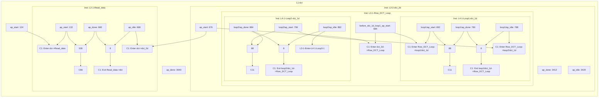

```mermaid

  graph LR
    subgraph L1-dct
      L1-1[ap_start: 124]
        L1-Enter-L2-1(C1: Enter dct->Read_data)
        L1-1-->L1-Enter-L2-1

      subgraph Inst: L2-1-Read_data
      L2-1-1[ap_start: 132]
        L2-1-C1[528]
          L2-1-C1-1[C66]
        L2-1-1-->L1-Enter-L2-1
        L2-1-1-->L2-1-C1
      L2-1-2[ap_done: 660]
        L2-1-2-->L2-1-C1-->L2-1-C1-1
        L2-1-2-->L2-1-C2
      L2-1-3[ap_idle: 668]
        L2-1-C2[8]
          L2-1-C2-1[C1: Exit Read_data->dct]
        L2-1-3-->L2-1-C2-->L2-1-C2-1
        L2-1-3-->L1-Enter-L2-2
      end

      
      L1-Enter-L2-2[C1: Enter dct->dct_2d]
      
      subgraph Inst: L2-2-dct_2d
      L2-2-1[ap_start: 676]
        L2-2-1-->L1-Enter-L2-2
        L2-2-Enter-L3-1(C1: Enter dct_2d->Row_DCT_Loop)
        L2-2-1-->L2-2-Enter-L3-1
        subgraph Inst: L3-1-Row_DCT_Loop
          L3-1-1[before_dct_1d_loop1_ap_start: 684]
          L3-1-1-->L2-2-Enter-L3-1
          L3-1-Enter-L4-1-Loop1-1(C1: Enter Row_DCT_Loop->loop1/dct_1d)
          L3-1-1-->L3-1-Enter-L4-1-Loop1-1
          subgraph Inst: L4-1-Loop1-dct_1d
          L4-1-Loop1-1[loop1/ap_start: 692]
            L4-1-Loop1-C1[88]-->L4-1-Loop1-C1-1[C11]
            L4-1-Loop1-1-->L3-1-Enter-L4-1-Loop1-1
            L4-1-Loop1-1-->L4-1-Loop1-C1          
          L4-1-Loop1-2[loop1/ap_done: 780]
            L4-1-Loop1-2-->L4-1-Loop1-C1
            L4-1-Loop1-2-->L4-1-Loop1-C2
          L4-1-Loop1-3[loop1/ap_idle: 788]
            L4-1-Loop1-C2[8]-->L4-1-Loop1-C2-1[C1: Exit loop1/dct_1d->Row_DCT_Loop]
            L4-1-Loop1-3-->L4-1-Loop1-C2
            L4-1-Loop1-3-->L3-1-Enter-L4-1-Loop2-1
          end

          L3-1-Enter-L4-1-Loop2-1(C1: Enter Row_DCT_Loop->loop2/dct_1d)

          subgraph Inst: L4-1-Loop2-dct_1d
          L4-1-Loop2-1[loop2/ap_start: 796]
            L4-1-Loop2-C1[88]-->L4-1-Loop2-C1-1[C11]
            L4-1-Loop2-1-->L3-1-Enter-L4-1-Loop2-1
            L4-1-Loop2-1-->L4-1-Loop2-C1          
          L4-1-Loop2-2[loop2/ap_done: 884]
            L4-1-Loop2-2-->L4-1-Loop2-C1
            L4-1-Loop2-2-->L4-1-Loop2-C2
          L4-1-Loop2-3[loop2/ap_idle: 892]
            L4-1-Loop2-C2[8]-->L4-1-Loop2-C2-1[C1: Exit loop2/dct_1d->Row_DCT_Loop]
            L4-1-Loop2-3-->L4-1-Loop2-C2
            L4-1-Loop2-3-->L3-1-Enter-L4-1-Loop3-1
          end

        end
      L2-2-2[ap_done: 3412]
      L2-2-3[ap_idle: 3420]
      end

      L1-2[ap_done: 3940]
    end

```