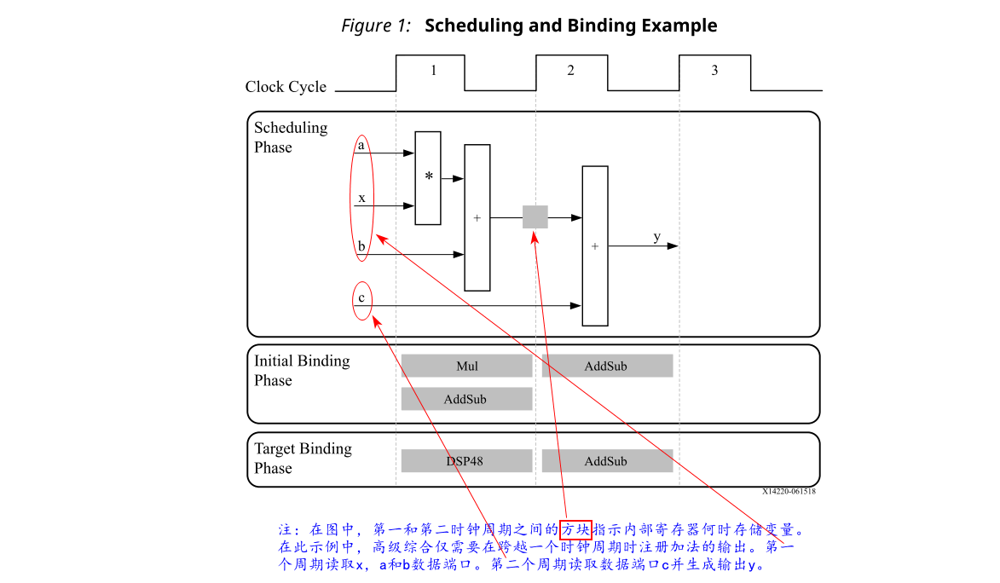
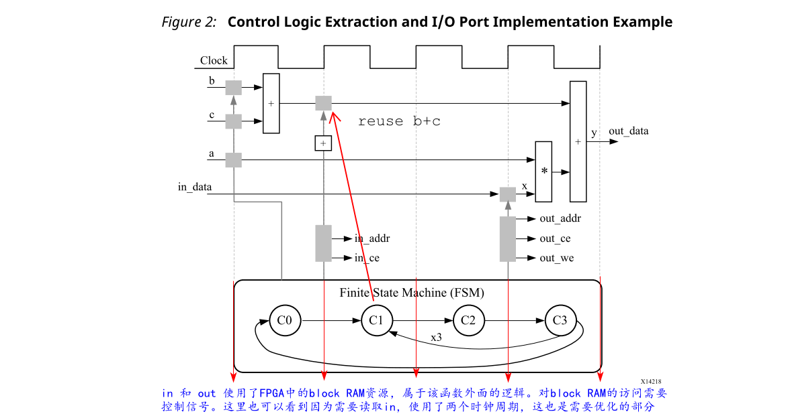
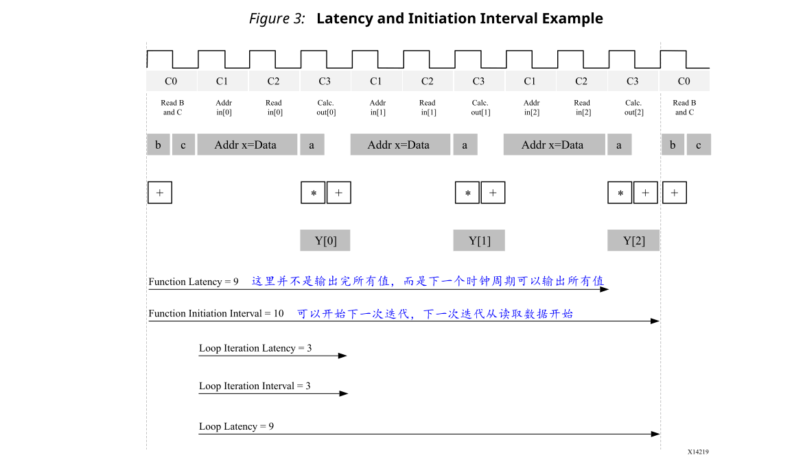

# 1.2 High-Level Synthesis Basics
**高级综合包括以下阶段**：
- Scheduling
  
  根据以下信息确定在每个时钟周期内发生哪些操作：
  - 时钟周期或时钟频率的长度
  - 根据目标设备的定义，完成操作所需的时间
  - 用户指定的优化指令
  
  如果时钟周期更长或以更快的FPGA为目标，则更多的操作将在一个时钟周期内完成，所有操作可能会在一个时钟周期内完成。相反，如果时钟周期较短或以较慢的FPGA为目标，则高级综合自动在更多时钟周期内调度操作，并且某些操作可能需要实现为多周期资源。
- Binding

  确定哪个硬件资源实现哪个计划的操作。为了实现最佳解决方案，高级综合使用有关目标设备的信息。
- Control logic extraction

  提取控制逻辑以创建有限状态机（FSM），以在RTL设计中对操作进行排序。

**高级综合按如下方式合成C代码**：
- 关于参数的**Top-level function**综合到**RTL I/O Port**中
- 将**C函数**综合为RTL层次结构中的**Block**
  
  如果C代码包括sub-functions的层次结构，则最终的RTL设计将包括与原始C函数在层次结构上一一对应的modules或entities的层次结构。函数的所有实例都使用相同的RTL实现或Block。
- 默认情况下，C函数中的循环保持rolled状态

  当循环是rolled时，综合会为循环的一个迭代创建逻辑，并且RTL设计会按顺序为循环的每个迭代执行此逻辑。使用优化指令，您可以unroll循环，从而允许所有迭代并行发生。循环也可以通过有**限状态机的细粒度实现（loop pipelining）或更粗略的基于握手的实现(dataflow)** 来流水线化。

- 在最终的FPGA设计中，C代码中的数组将综合成为Block RAM或UltraRAM
  
  如果该数组位于顶层函数接口中，则高级综合会将数组实现为设计之外访问Block RAM的端口。

高层综合基于默认行为，约束和您指定的任何优化指令来创建优化的实现。您可以使用优化指令来修改和控制内部逻辑和I/O端口的默认行为。这使您可以从相同的C代码生成硬件实现的变体。

:star:要确定设计是否满足您的要求，您可以在由高级综合生成的综合报告中查看性能指标。在分析报告之后，您可以使用优化指令来确定实施方案。综合报告包含有关以下性能指标的信息：
- 区域（Area）：根据FPGA中可用的资源，包括查找表（LUT）、寄存器、Block RAMs和DSP48s，来实现设计所需的硬件资源数量。
- 延迟（Lateny）：**函数**计算**得到所有输出**值所需的时钟周期数。
- 启动间隔（Initiation interval）（II）：**函数**可以**接受新输入数据之前**的时钟周期数。
- 循环迭代延迟（Loop iteration latency）：完成**一个循环迭代**所需的时钟周期数。
- 循环启动间隔（Loop initiation interval）：**下一个循环迭代开始处理数据之前**的时钟周期数。
- 循环延迟（Loop latency）：执行**循环所有迭代**的时钟周期数。

### Scheduling and Binding Example
下面的图显示了此代码示例的调度和绑定阶段的示例：
```c
int foo(char x, char a, char b, char c) {
 char y;
 y = x*a+b+c;
 return y;
}
```



在此示例的调度阶段，在每个时钟周期期间，高级综合调度以下操作：
- 第一个时钟周期：乘法和第一次加法
- 第二个时钟周期：第二次加法和输出生成

在最终的硬件实现中，高级综合将顶层函数的**参数**作为**输入和输出（I/O）端口**实现。在此示例中，参数是简单数据端口。因为每个输入变量都是char类型，所以输入数据端口均为8位宽。函数的返回值是32位int数据类型，所以输出数据端口是32位宽。

___
:star:重要！在硬件中实现C代码的优势在于，所有操作都可以在较短的时钟周期内完成。在该示例中，操作仅在两个时钟周期内完成。在中央处理器（CPU）中，即使这个简单的代码示例也需要花费更多的时钟周期才能完成。
___

在此示例的初始绑定阶段，高级综合使用组合乘法器（Mul）来实现乘法器操作，并使用组合加法器/减法器（AddSub）来实现这两个加法操作。

在目标绑定阶段，高级综合使用DSP48资源同时实现乘法器和其中一个加法操作。DSP48资源是FPGA架构中可用的计算模块，可在高性能和高效实现之间实现理想的平衡。
### Extracting Control Logic and Implementing I/O Ports Example
下图显示了此代码示例的控制逻辑的提取和I/O端口的实现：
```c
void foo(int in[3], char a, char b, char c, int out[3]) {
  int x,y;
  for(int i = 0; i < 3; i++) {
    x = in[i]; 
    y = a*x + b + c; 
    out[i] = y;
  }
}
```

此代码示例执行与上一个示例相同的操作。但是，它在for循环内执行操作，并且函数中的两个参数是数组。当调度代码时，设计结果将执行三次for循环内的逻辑。高级综合自动从C代码中提取控制逻辑，并在RTL设计中创建FSM以对这些操作进行排序。高层综合在最终RTL设计中将顶层函数参数实现为端口。char类型的标量变量映射到标准的8位数据总线端口。数组参数（例如in和out）包含整个收集的数据。

在高级综合中，默认情况下将数组综合到Block RAM中，但也可以进行其他优化，例如FIFO，分布式RAM和单个寄存器。在顶层函数中使用数组作为参数时，高级综合假设Block RAM在顶层函数之外，并且自动创建端口以访问函数设计之外的Block RAM，例如数据端口，地址端口，以及任何所需的芯片使能或写使能信号。

FSM控制寄存器何时存储数据与控制任何I/O控制信号的状态。FSM在状态C0中启动。在下一个时钟，它进入状态C1，然后进入状态C2，然后进入状态C3。在返回状态C0之前，它总共返回到状态C1（以及C2，C3）三次。

:star: 注意：这非常类似于C代码for循环中的控制结构。状态的完整序列为：C0，{C1，C2，C3}，{C1，C2，C3}，{C1，C2，C3}，然后返回到C0。

设计只需要一次b和c的加法。高级综合将操作移到for循环之外并进入状态C0。每次设计进入状态C3，就重复使用加法的结果。

设计从in读取数据并将数据存储在x中。FSM在状态C1中生成第一个元素的地址。此外，在状态C1中，加法器递增，以跟踪设计必须在状态C1，C2和C3周围迭代的次数。在状态C2中，block RAM返回in的数据并将其存储为变量x。

高级综合从端口a读取具有其他值的数据以执行计算并生成第一个y输出。FSM确保生成正确的地址和控制信号以将该值存储在块外。然后，设计返回到状态C1，以从数组/Block RAM中读取下一个值。该过程继续进行，直到所有输出都被写完为止。然后设计返回到状态C0以读取b和c的下一个值，以再次开始该过程。


### Performance Metrics Example

下图显示了上一个示例中代码的完整逐周期执行，包括每个时钟周期的状态，读取操作，计算操作和写入操作。


以下是此示例的性能指标：
- 延迟：需要9个时钟周期的函数才能输出所有值。
  
  注意：当输出是数组时，延迟将测量到最后一个数组值输出。
- II：II为10，这意味着该函数需要10个时钟周期才能启动一组新的输入读取并开始处理下一组输入数据。
  
  注意：执行一个功能的一个完整执行的时间称为一个事务。在此示例中，函数需要11个时钟周期才能接收下一个事务的数据。
- 循环迭代的延迟：每个循环迭代的延迟为3个时钟周期。
- 循环II：间隔为3。
- 循环延迟：延迟为9个时钟周期。