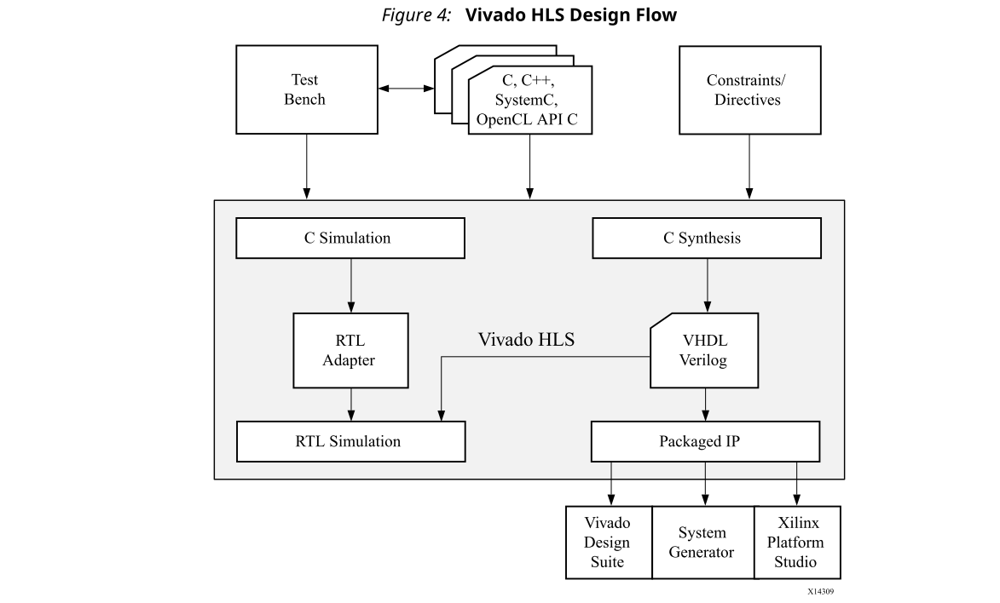
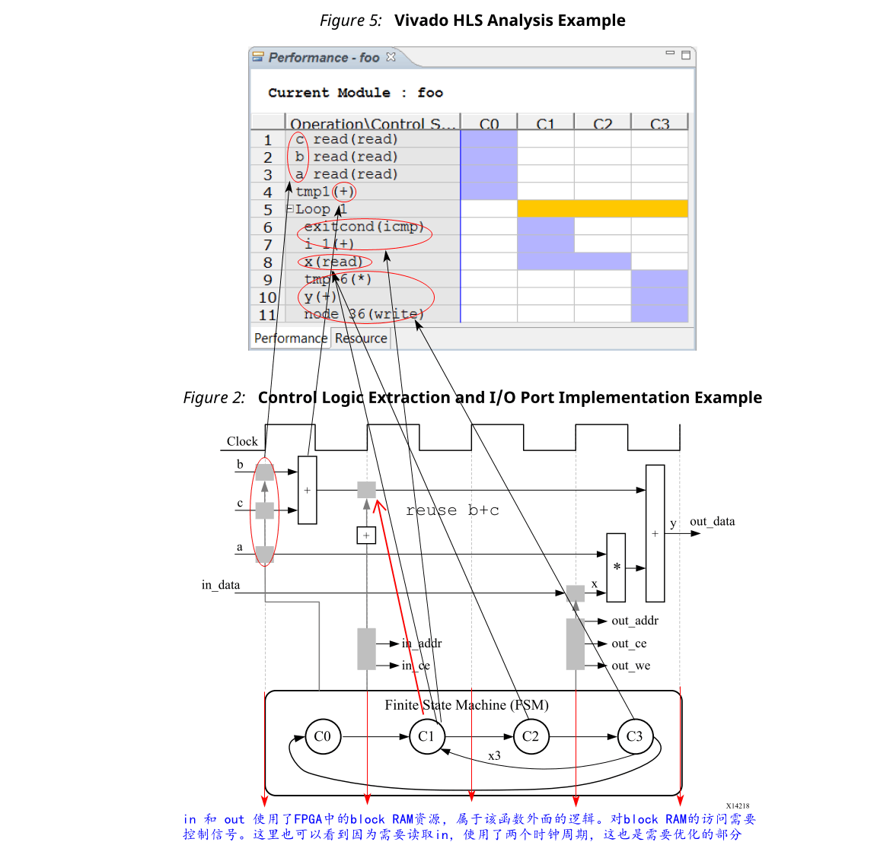

## 1.3 Understanding Vivado HLS
Xilinx Vivado HLS工具将C函数综合成IP块中，您可以将其集成到硬件系统中。它与Xilinx的其余设计工具完全集成，并提供了全面的语言支持和功能，可为您的C算法创建最佳实现。

以下是Vivado HLS设计流程：
1. 编译，执行（仿真）和调试C算法。
2. 使用用户优化指令将C算法综合到RTL实现中。
3. 生成综合报告并分析设计。
4. 使用pushbutton流程对RTL实施进行验证。
5. 将RTL实现打包为选择的IP格式。

:star: 注意：在高级综合中，运行已编译的C程序称为C Simulation。执行C算法可对函数进行仿真，以验证算法是否正确。

### Inputs and Outputs
以下是Vivado® HLS输入：
- 使用C，C ++或SystemC编写的C函数。

  这是Vivado HLS的主要输入。该函数可以包含子函数的层次结构。

- 约束条件

  约束条件是必需的，包括时钟周期，时钟不确定性和FPGA目标。如果未指定，则时钟不确定度默认为时钟周期的12.5％。

- 指令

  指令是最佳的，可以指导综合过程以实现特定的行为或最佳化。

- C测试台和任何关联的文件

  Vivado HLS在综合之前使用C测试台来模拟C函数，并使用C/RTL Cosimulation来验证RTL输出。

您可以使用Vivado HLS图形用户界面（GUI）或在命令提示符下使用Tcl命令，将C输入文件，方向和约束，交互地添加到Vivado HLS项目中。您也可以创建Tcl文件并以批处理模式执行命令。

以下是Vivado HLS的输出：
- 以**硬件描述语言（HDL）格式的RTL实现文件**(注意是Verilog或VHDL，不是门级电路之类的)

  这是Vivado HLS的主要输出。使用Vivado综合，您可以将RTL综合为门级实现和FPGA位流文件。RTL具有以下行业标准格式：
  - VHDL（IEEE 1076-2000）
  - Verilog（IEEE 1364-2001）

  Vivado HLS将实现文件打包为IP块，以与Xilinx®设计文件中的其他工具一起使用。使用逻辑综合，您可以将打包的IP综合到FPGA比特流中。

- 报告文件
  
  此输出是综合，C/RTL协同仿真和IP打包的结果。

下图概述了Vivado HLS输入和输出文件。

### Test Bench, Language Support, and C Libraries
在任何C程序中，顶层函数都称为main()。在Vivado® HLS设计流程中，您可以将main()下的任何子函数指定为用于综合的顶层函数。您不能把main()作为顶层函数。以下是其他规则：
- 仅允许一个函数用作综合的顶层函数。
- 层次结构中用于综合的顶层函数下的所有子功能也被综合。
- 如果要综合不在顶层函数下的层次结构中的函数，则必须将函数合并到单个顶层函数中以进行综合。

#### Test Bench
使用Vivado® HLS设计流程时，综合一个功能不正确的C函数，然后分析实现细节以确定函数为何无法按预期执行，这是很麻烦的。为了提高生产率，在综合之前，请使用Test bench来验证C函数是否正确。

C测试平台包括main()函数以及不在待综合顶层函数层次结构下的任何子函数。这些函数通过为综合函数提供刺激并消耗其输出，来验证用于综合的顶层函数是否正确。

Vivado HLS使用测试平台来编译和执行C仿真。在编译过程中，您可以选择“启动调试器”选项以打开完整的C调试环境，从而可以分析C仿真。

:star: 推荐：由于Vivado HLS使用测试平台在综合之前验证C函数并自动验证RTL输出，因此强烈建议使用测试平台。

#### Language Support
Vivado HLS支持以下C编译/仿真标准：
- ANSI-C（GCC 4.6）
- C ++（G ++ 4.6）
- SystemC（IEEE 1666-2006，版本2.2）

##### C, C++, and SystemC Language Constructs
Vivado HLS支持许多C，C ++和System C语言构件以及每种语言的所有自然数据类型，包括浮点和双精度类型。但是，综合不支持某些构件，包括：
- Dynamic memory allocation
  
  FPGA具有一组固定的资源，并且不支持动态创建和释放内存资源。
- Operating  system(OS) operations

  必须将所有往返于FPGA的数据从输入端口读取，或者将其写入输出端口。OS操作，例如文件读/写或OS查询（如日期和日期）不支持。相反，C Test bench可以执行这些操作，并将数据作为参数传递到待综合函数中。

有关受支持和不受支持的C构造的详细信息以及每个主要构造的示例，请参见第3章：High-Level Synthesis Coding Styles。

#### C Libraries
C库包含为在FPGA中实现而进行了优化的函数和构造。使用这些库有助于确保高质量的结果（QoR），也就是说，最终的输出是一种优化资源使用率的高性能设计。因为这些库是用C，C ++或SystemC提供的，所以您可以将这些库合并到C函数中并对其进行仿真，以在合成之前验证函数的正确性。

Vivado® HLS提供以下C库来扩展标准C语言：
- 任意精度的数据类型
- 半精度（16位）浮点数据类型
- 数学运算
- Xilinx® IP函数，包括快速傅里叶变换（FFT）和有限冲激响应（FIR）
- FPGA资源功能有助于最大程度地利用移位寄存器LUT（SRL）资源

##### C Library Example
C库确保了比标准C类型更高的QoR。标准C类型基于8位边界（8位，16位，32位，64位）。但是，当针对硬件平台时，使用特定宽度的数据类型通常更为有效。

例如，具有用于通信协议的过滤功能的设计需要10位输入数据和18位输出数据才能满足数据传输要求。使用标准C数据类型，输入数据必须至少为16位，而输出数据必须至少为32位。在最终的硬件中，这会在输入和输出之间创建一个超出必要范围的数据路径，使用更多的资源，并且具有更长的延迟（例如，一个32位乘32位乘法需要的时间比18位乘以18位乘法更长的时间），并且需要更多的时钟周期才能完成。

取而代之的是，在此设计中使用任意精度的数据类型，您可以在综合之前指定要在C代码中指定的确切位大小，模拟更新的C代码，并在使用C仿真之前验证输出的质量。为C和C++提供的任意精度的数据类型，允许您对1到1024位任何宽度的数据类型进行建模。例如，您可以对某些高达32768位的C++类型进行建模。

:star:注意：任意精度类型仅在函数内是必需的，因为Vivado HLS优化了内部逻辑，并删除了不扇出至输出端口的数据位和逻辑。
### Synthesis, Optimization, and Analysis
Vivado® HLS是基于项目的。每个项目都包含一组C代码，并且可以包含多个解决方案。每个解决方案可以具有不同的约束条件和优化指令。您可以在Vivado HLS GUI中分析和比较每个解决方案的结果。

以下是Vivado HLS设计过程中的综合，优化和分析步骤：
1. 创建一个具有初始解决方案的项目。
2. 验证C仿真是否正确执行。
3. 运行综合以获得一组结果。
4. 分析结果。

在分析结果之后，您可以为具有不同约束条件和优化指令的项目创建新的解决方案，并综合新的解决方案。您可以重复此过程，直到设计具有所需的性能特征为止。使用多种解决方案可让您继续开发，同时保留以前的结果。
#### Optimization
使用Vivado® HLS，您可以对设计应用不同的优化指令，包括：
- 指示任务流水线执行，从而允许任务的下一个执行在当前执行完成之前开始。
- 为函数，循环和某个作用域的执行完成指定等待时间。
- 指定使用的资源数量限制。
- 覆盖代码中固有或隐含的依赖性，并允许指定的操作。例如，如果可以放弃或忽略初始数据值（例如在视频流中），则允许在写入之前先读取存储器，以提高性能。
- 选择I/O协议以确保最终设计可以连接到具有相同I/O协议的其他硬件模块。

:star: 注意：Vivado HLS**自动确定任何子函数使用的I/O协议**。您不能控制这些端口，除非指定端口是否已注册。

您可以使用Vivado HLS GUI将优化指令直接放置到源代码中。另外，您也可以使用Tcl命令应用优化指令。

#### Analysis
综合完成后，Vivado® HLS会自动创建综合报告，以帮助您了解实施的性能。在Vivado HLS GUI中，“分析范围”包括“性能”选项卡，通过该选项卡，您可以详细地交互分析结果。下图显示了提取控制逻辑和实现I/O端口示例的“性能”视图。

“性能”选项卡针对每种状态显示以下内容：
- C0：第一状态包括端口a，b和c上的读取操作以及加法操作。
- C1和C2：设计进入循环并检查循环增量计数器并退出状态。然后，设计将数据读入变量x，这需要两个时钟周期。
因为设计正在访问Block RAM，所以需要两个时钟周期，访问地址一个时钟周期，读取数据需要下一个时钟周期。
- C3：设计执行计算并将输出写入端口y。然后，循环返回到开始。
### RTL Verification
如果在项目中添加了C Test bench，则可以使用它来验证RTL是否与原始C的功能相同。C Test bench将验证顶层函数综合后的输出，如果RTL的功能完全相同，则main（）返回0。Vivado® HLS使用此返回值进行C仿真和C/RTL协同仿真，以确定结果是否正确。如果C Test bench返回非零值，则Vivado HLS报告模拟失败。有关更多信息，请参见Test Bench Requirements。

:bulb: 提示：Vivado HLS自动创建用于执行C/RTL协同仿真的基础结构，并使用以下受支持的RTL仿真器之一自动执行仿真：
- Vivado Simulator (XSim)
- ModelSim simulator
- VCS
- NCSim
- Riviera
- Xcelium

如果您选择Verilog或VHDL HDL进行模拟，则Vivado HLS使用您指定的HDL模拟器。Xilinx®设计工具包括Vivado Simulator。第三方HDL模拟器需要第三方供应商的许可证。仅Linux操作系统支持VCS和NCSim仿真器。

### RTL Export
使用Vivado® HLS，您可以导出Xilinx® IP格式的RTL并将最终的RTL输出文件打包为IP。
- Vivado IP Catalog
  
  导入到Vivado IP Catalog中，以在Vivado Design Suite中使用。
- System Generator for DSP

  将HLS设计导入System Generator。
- Synthesized Checkpoint (.dcp)

  以与导入任何Vivado Design Suite checkpoint相同的方式直接导入Vivado Design Suite。

  :star:注意：综合后的checkpoint格式调用逻辑综合，并将RTL实现编译为门级实现，该实现包含在IP包中。

对于除综合checkpoint以外的所有IP格式，您都可以在Vivado HLS中优化执行逻辑综合，以评估RTL综合或实现的结果。通过该优化步骤，您可以在移交IP软件包之前确认Vivado HLS提供的估计时间和区域。这些门级结果未包含在打包的IP中。

:star: 注意：Vivado HLS会基于每个FPGA的内置库来估算时间和区域资源。当您使用逻辑综合将RTL编译为门级实现，在FPGA中对门进行物理布局并在门之间进行路由时，逻辑综合可能添加附加优化，这些会更改Vivado HLS估算值。

