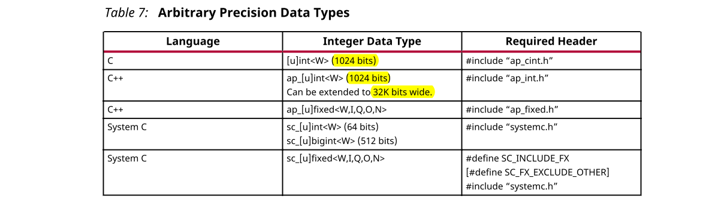
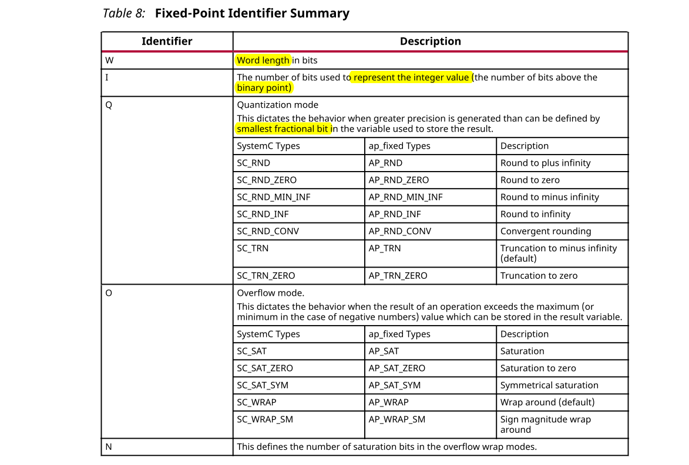

## 1.5 Data Types for Efficient Hardware
基于C的原始数据类型都位于8位边界（8、16、32、64位）上。RTL总线（对应于硬件）支持任意数据长度。使用标准C数据类型可能会导致硬件效率低下。例如，FPGA中的基本乘法单元是DSP48宏。这提供了一个18*18位的乘法器。如果需要17位乘法，则不应强迫您使用32位C数据类型来实现此功能：本来只需要一个，现在需要三个DSP48宏来实现乘法器。

任意精度数据类型的优点是，它们允许C代码更新为使用位宽较小的变量，然后重新执行C仿真以验证功能是否相同或可接受。较小的位宽会导致硬件操作数变得更小，更快。反过来，这允许在FPGA中放置更多逻辑，并允许该逻辑以更高的时钟频率执行。

### Advantages of Hardware Efficient Data Types
以下代码执行一些基本的算术运算：
```c
#include "types.h"
void apint_arith(dinA_t  inA, dinB_t  inB, dinC_t  inC, dinD_t  inD,
          dout1_t *out1, dout2_t *out2, dout3_t *out3, dout4_t *out4
  ) {
 // Basic arithmetic operations
 *out1 = inA * inB;
 *out2 = inB + inA;
 *out3 = inC / inA;
 *out4 = inD % inA;
}
```

数据类型`dinA_t`，`dinB_t`等在头文件`types.h`中定义。强烈建议使用诸如`types.h`之类用于项目范围内的头文件，因为这样可以轻松地将标准C类型转换为任意精度类型，并有助于将任意精度类型重新定义为最佳大小。

如果以上示例中的数据类型定义为：
```c
typedef char dinA_t;
typedef short dinB_t;
typedef int dinC_t;
typedef long long dinD_t;
typedef int dout1_t;
typedef unsigned int dout2_t;
typedef int32_t dout3_t;
typedef int64_t dout4_t;
```

该设计在综合之后给出了以下结果：
```
+ Timing (ns): 
    * Summary: 
    +---------+-------+----------+------------+
    |  Clock  | Target| Estimated| Uncertainty|
    +---------+-------+----------+------------+
    |default  |   4.00|      3.85|        0.50|
    +---------+-------+----------+------------+
+ Latency (clock cycles): 
    * Summary: 
    +-----+-----+-----+-----+---------+
    |  Latency  |  Interval | Pipeline|
    | min | max | min | max |   Type  |
    +-----+-----+-----+-----+---------+
    |   66|   66|   67|   67|   none  |
    +-----+-----+-----+-----+---------+
* Summary: 
+-----------------+---------+-------+--------+--------+
|       Name      | BRAM_18K| DSP48E|   FF   |   LUT  |
+-----------------+---------+-------+--------+--------+
|Expression       |        -|      -|       0|      17|
|FIFO             |        -|      -|       -|       -|
|Instance         |        -|      1|   17920|   17152|
|Memory           |        -|      -|       -|       -|
|Multiplexer      |        -|      -|       -|       -|
|Register         |        -|      -|       7|       -|
+-----------------+---------+-------+--------+--------+
|Total            |        0|      1|   17927|   17169|
+-----------------+---------+-------+--------+--------+
|Available        |      650|    600|  202800|  101400|
+-----------------+---------+-------+--------+--------+
|Utilization (%)  |        0|   ~0  |       8|      16|
+-----------------+---------+-------+--------+--------+
```
如果不需要使用标准C类型来实现数据的宽度，而是以小于，但仍然大于下一个最小标准C类型（例如以下）的宽度来实现，如下：
```c
typedef int6 dinA_t;
typedef int12 dinB_t;
typedef int22 dinC_t;
typedef int33 dinD_t;
typedef int18 dout1_t;
typedef uint13 dout2_t;
typedef int22 dout3_t;
typedef int6 dout4_t;
```

综合后的结果表明，最大时钟频率，等待时间得到了改善，面积减少了75％。
```
+ Timing (ns): 
    * Summary: 
    +---------+-------+----------+------------+
    |  Clock  | Target| Estimated| Uncertainty|
    +---------+-------+----------+------------+
    |default  |   4.00|      3.49|        0.50|
    +---------+-------+----------+------------+
+ Latency (clock cycles): 
    * Summary: 
    +-----+-----+-----+-----+---------+
    |  Latency  |  Interval | Pipeline|
    | min | max | min | max |   Type  |
    +-----+-----+-----+-----+---------+
    |   35|   35|   36|   36|   none  |
    +-----+-----+-----+-----+---------+
* Summary: 
+-----------------+---------+-------+--------+--------+
|       Name      | BRAM_18K| DSP48E|   FF   |   LUT  |
+-----------------+---------+-------+--------+--------+
|Expression       |        -|      -|       0|      13|
|FIFO             |        -|      -|       -|       -|
|Instance         |        -|      1|    4764|    4560|
|Memory           |        -|      -|       -|       -|
|Multiplexer      |        -|      -|       -|       -|
|Register         |        -|      -|       6|       -|
+-----------------+---------+-------+--------+--------+
|Total            |        0|      1|    4770|    4573|
+-----------------+---------+-------+--------+--------+
|Available        |      650|    600|  202800|  101400|
+-----------------+---------+-------+--------+--------+
|Utilization (%)  |        0|   ~0  |       2|       4|
+-----------------+---------+-------+--------+--------+
```

两种设计之间的时延差异很大，这是由于除法和余数运算需要花费多个周期才能完成。使用精确的数据类型，而不是将设计强制设置为标准C数据类型，可以实现更高质量的FPGA实现：相同的精度，运行速度更快，资源更少。

### Overview of Arbitrary Precision Integer Data Types

Vivado® HLS为C，C++提供整数和定点的任意精度数据类型，并支持System C的任意精度数据类型。



Vivado® HLS还提供了定义任意精度类型的头文件，这些头文件是独立的软件包，您有权在自己的源代码中使用它们。软件包xilinx_hls_lib_<release_number>.tgz在Vivado® HLS安装区域的include目录中提供。该软件包不包含ap_cint.h中定义的C个任意精度类型。这些类型不能与标准C编译器一起使用--仅与Vivado® HLS一起使用。

#### Arbitrary Precision Integer Types with C
对于C语言，头文件`ap_cint.h`定义任意精度整数数据类型`[u]int`。要在C函数中使用任意精度的整数数据类型，请执行以下操作：
- 将头文件`ap_cint.h`添加到源代码中。
- 将位类型更改为`intN`或`uintN`，其中`N`是从1到1024的位大小。

#### Arbitrary Precision Types with C++
对于C++语言，头文件`ap_int.h`定义任意精度整数数据类型`ap_[u]int`。要在C++函数中使用任意精度的整数数据类型，请执行以下操作：
- 将头文件`ap_int.h`添加到源代码中。
- 将位类型更改为`ap_int<N>`或`ap_uint<N>`，其中`N`是从1到1024的位大小。

下面的示例说明如何添加头文件以及实现两个变量以使用9位整数和10位无符号整数类型：
```c
#include "ap_int.h"
void foo_top () {
ap_int<9>  var1;             // 9-bit
ap_uint<10>  var2;           // 10-bit unsigned
```
`ap_[int]`数据类型允许的默认最大宽度为1024位。在包含`ap_int.h`头文件之前，可以通过定义正整数值小于或等于32768的宏`AP_INT_MAX_W`来覆盖此默认值

***
:warning: 警告！将`AP_INT_MAX_W`的值设置得太高会导致软件编译和运行速度缓慢。
***
***
:warning: 警告！使用`APFixed:`时，ROM综合可能需要很长时间。将其更改为`int`可以加快综合速度。例如：
```c
static ap_fixed<32> a[32][depth] =
```
可以被修改为：
```c
static int a[32][depth] =
```
***

以下是覆盖`AP_INT_MAX_W`的示例：
```c
#define AP_INT_MAX_W 4096 // Must be defined before next line
#include "ap_int.h"
ap_int<4096> very_wide_var;
```
#### Arbitrary Precision Types with SystemC
System C使用的任意精度类型在`systemc.h`头文件中定义，该文件必须包含在所有System C设计中。头文件包括SystemC `sc_int<>`，`sc_uint<>`，`sc_bigint<>`和`sc_biguint<>`类型。

### Overview of Arbitrary Precision Fixed-Point Data Types
定点数据类型将数据建模为整数和分数形式。在此示例中，Vivado HLS `ap_fixed`类型用于定义18位变量，其中6位代表二进制点以上的数字，而12位代表小数点以下的值。该变量指定为有符号，量化模式设置为四舍五入为正整数。由于未指定溢出模式，因此默认为wrap-around 模式。
```c
#include <ap_fixed.h>
...
ap_fixed<18,6,AP_RND > my_type;
...
```
当**计算变量的位数不同或精度不同时，二进制点将自动对齐**。

使用定点执行的C++/SystemC仿真的行为与结果硬件相匹配。这使您可以使用快速的C级仿真来分析位精度，量化和溢出行为。

定点类型是浮点类型的有用替代，浮点类型需要很多时钟周期才能完成。除非需要浮点类型的整个范围，否则定点类型通常可以以相同的精度的较小和较快的硬件实现相同精度的浮点数。

下表提供了`ap_fixed`类型标识符的摘要。



`ap_[u]fixed`的数据类型允许的默认最大宽度为`1024`位。在包含`ap_int.h`头文件之前，可以通过定义正整数值小于或等于`32768`的宏`AP_INT_MAX_W`来覆盖此默认值。


***
:warning: 警告！将`AP_INT_MAX_W`的值设置得太高可能会导致缓慢的软件编译和运行时间。
***
***
:warning:警告！在以下情况下，ROM合成可能会变慢：`static APFixed_2_2 CAcode_sat[32][CACODE_LEN] =`。将`APFixed`更改为`int`可以更快地合成：`static int CAcode_sat[32][CACODE_LEN] =`
***

以下是覆盖`AP_INT_MAX_W`的示例：
```c
#define AP_INT_MAX_W 4096 // Must be defined before next line
#include "ap_fixed.h"
ap_fixed<4096> very_wide_var;
```

使用Vivado HLS时，强烈建议使用任意精度的数据类型。如前面的示例所示，它们通常对硬件实现的质量有明显的好处。