## 1.6 Managing Interfaces
在基于C的设计中，所有输入和输出操作都是通过形式函数参数在零时间内执行的。在RTL设计中，这些相同的输入和输出操作必须通过设计接口中的端口执行，并且通常使用特定的I/O（输入-输出）协议进行操作。

Vivado HLS支持两种解决方案，**用于指定所使用的I/O协议**的类型： 
- 接口综合，其中基于有效的行业标准接口创建端口接口。
- 手动接口规范，其中在输入源代码中明确描述了接口行为。这允许使用任何任意的I/O协议。
  - 此解决方案是通过SystemC设计提供的，其中I/O控制信号在接口声明中指定，并且其行为在代码中指定。
  - Vivado HLS还支持C和C++设计的这种接口规范模式。
### Interface Synthesis
综合顶层函数时，该函数的形参（或参数）被综合到RTL端口中。此过程称为接口综合。

#### Interface Synthesis Overview
以下代码提供了接口综合的全面概述。
```c
#include "sum_io.h"
dout_t sum_io(din_t in1, din_t in2, dio_t *sum) {
 dout_t temp;
 *sum = in1 + in2 + *sum;
 temp = in1 + in2;
 return  temp;
}
```
上面的示例包括：
- 两个传值输入in1和in2。
- 既可读取又可写入的sum指针。
- 函数的return，即temp的值。

使用默认的接口综合设置，可以将设计综合到一个RTL模块中，端口如图所示。

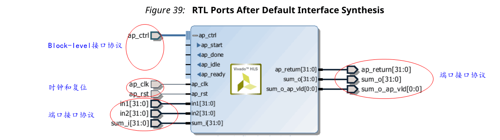

Vivado HLS在RTL设计上创建三种类型的端口：
- 时钟和复位端口：ap_clk和ap_rst。
- 块级接口协议。这些在前面的图中显示为扩展：ap_start，ap_done，ap_ready和ap_idle。
- 端口级接口协议。它们是为顶层函数和返回函数（如果函数返回值）中的每个参数创建的。在此示例中，这些端口是：in1，in2，sum_i，sum_o，sum_o_ap_vld和ap_return。

##### Clock and Reset Ports
如果设计需要超过1个周期才能完成操作。

可以使用Solution→Solution Settings→General和`config_interface`配置，将芯片使能的端口添加到整个模块。

复位的操作由`config_rtl`配置控制。

##### Block-Level Interface Protocol
默认情况下，将块级接口协议添加到设计中。这些信号独立于任何端口级I/O协议控制模块。这些端口控制块何时可以开始处理数据（ap_start），何时准备接受新输入（ap_ready）以及表明设计是空闲的（ap_idle）还是已完成的操作（ap_done）。

##### Port-Level Interface Protocol
最后一组信号是数据端口。创建的I/O协议取决于C参数的类型和默认值。在使用块级协议开始操作该块之后，使用端口级IO协议对进出该块的数据排序。

默认情况下，输入**传值参数和指针**被实现为简单的wire端口，没有相关的握手信号。因此，在上面的示例中，输入端口的实现没有I/O协议，只有数据端口。如果端口没有I/O协议（默认或设计），则**输入数据必须保持稳定，直到被读取**。

默认情况下，**输出指针与关联的输出有效信号一起实现**，以指示输出数据何时有效。在上面的示例中，输出端口通过关联的输出有效端口（sum_o_ap_vld）来实现，该端口指示何时该端口上的数据有效并且可以读取。如果没有与输出端口关联的I/O协议，则很难知道何时读取数据。**在输出上使用I/O协议总是一个好主意**。

既**可读取又可写入的函数参数**将分为**单独的输入和输出端**口。在上面的示例中，sum被实现为具有关联I/O协议端口sum_o_ap_vld的输入端口sum_i和输出端口sum_o。

如果**函数具有返回值**，则实现**输出端口ap_return**来提供返回值。当设计完成一个事务时-等效于C函数的一个执行-块级协议表明该函数已通过ap_done信号完成。这也表明端口ap_return上的数据有效并且可以读取。

> 注意：返回顶层函数的值不能是指针。(个人注:翻译为顶层函数的返回值不能是指针?)

对于下面显示的示例代码，时序行为如下图所示（假设目标技术和时钟频率允许在每个时钟周期内执行一个加法操作）。

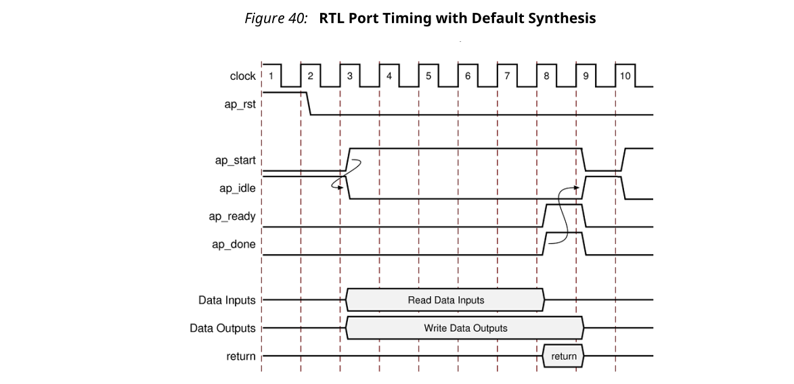

- 当ap_start设置为高电平时，设计开始。
- ap_idle信号被置为低电平以指示设计正在运行。
- 在第一个周期后的任何时钟读取输入数据。Vivado HLS调度什么时候读取。读取所有输入后，将ap_ready信号置为高电平。（个人注：输入须保持稳定，直到被读取）
- 当计算输出总和后，关联的输出握手（sum_o_ap_vld）表示数据有效。
- 函数完成后，将断言ap_done。这也表明ap_return上的数据有效。
- 端口ap_idle被置为高电平，表示正在等待重新启动设计。

#### Interface Synthesis I/O Protocols
通过接口综合创建的接口类型取决于C参数的类型、默认接口模式和INTERFACE优化指令。下图显示了可以在每种C参数类型上指定的接口协议模式。该数字使用以下缩写：

- D：每种类型的默认接口模式。
注意：如果您指定了非法接口，Vivado HLS会发出一条消息并实现默认接口模式。
- I：输入参数，只能读取。
- O：输出参数，仅写入。
- I/O：输入/输出参数，可读和写。

接口综合参考中包含有关接口协议的完整详细信息，包括波形图。以下概述了每种接口模式。

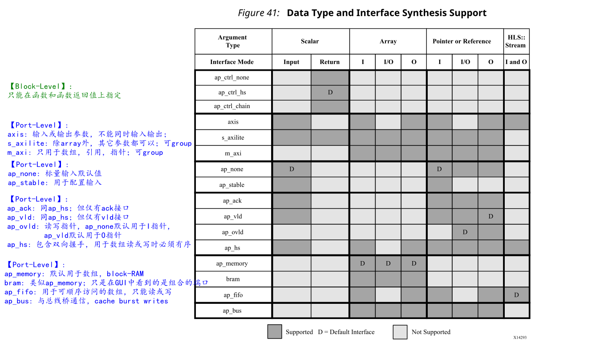

##### Block-Level Interface Protocols
块级接口协议是`ap_ctrl_none`，`ap_ctrl_hs`和`ap_ctrl_chain`。这些只能指定在函数和函数的返回值上。在GUI中指定该指令时，它将这些协议应用于该函数返回值。即使函数不使用返回值，也可以在函数返回中指定块级协议。

上一个示例中描述的`ap_ctrl_hs`模式是默认协议。`ap_ctrl_chain`协议类似于`ap_ctrl_hs`，但具有附加的输入端口`ap_continue`，该端口提供来自消耗该块数据的块的反向控制。如果在函数完成时`ap_continue`端口为逻辑0，则该块将暂停操作，并且下一个事务将不会继续。仅当将`ap_continue`断言为逻辑1时，才进行下一个事务。

`ap_ctrl_none`模式无需任何块级I/O协议即可实现设计。

如果函数返回也被指定为AXI4-Lite接口（s_axilite），则块级接口中的所有端口都被组合到AXI4-Lite接口中。**当使用另一个设备（例如CPU）来配置和控制该块的启动和停止操作时，这是一种常见的做法**。

##### Port-Level Interface Protocols: AXI4 Interfaces
Vivado HLS支持的AXI4接口包括AXI4-Stream（axis），AXI4-Lite（s_axilite）和AXI4 master（m_axi），您可以按以下方式指定：
- AXI4-Stream接口：在输入参数或输出参数上指定，不同时用于输入/输出参数。
- AXI4-Lite接口：在除数组之外的任何类型的参数上指定。您可以将多个参数组合到同一个AXI4-Lite接口中。
- AXI4 master接口：仅在数组和指针（以及C++中的引用）上指定。您可以将多个参数组合到同一个AXI4接口中。
##### Port-Level Interface Protocols: No I/O Protocol
`ap_none`和`ap_stable`模式指定不向端口添加任何I/O协议。当指定了这些模式时，参数将被实现为没有其他相关信号的数据端口。`ap_none`模式是标量输入的默认模式。`ap_stable`模式用于配置输入，该配置输入仅当设备处于复位模式时才变化。

##### Port-Level Interface Protocols: Wire Handshakes
接口模式`ap_hs`包含一个与数据端口的双向握手信号。握手是一种valid且acknowledge握手的行业标准。模式`ap_vld`相同，但仅具有valid端口，而`ap_ack`仅具有acknowledge端口。

`ap_ovld`模式与in-out参数一起使用。当in-out分成单独的输入和输出端口时，模式`ap_none`应用于输入端口，模式`ap_vld`应用于输出端口。这是同时读写的指针参数的默认值。

`ap_hs`模式可以应用于**按顺序读取或写入**的数组。如果Vivado HLS可以确定读取或写入访问不是顺序的，则它将暂停综合并出现错误。如果无法确定访问顺序，Vivado HLS将发出警告。
##### Port-Level Interface Protocols: Memory Interfaces
数组参数默认实现为`ap_memory`接口。这是具有数据，地址，芯片使能和写使能端口的标准Block RAM接口。

`ap_memory`接口可以实现为一个单端口或者双端口接口。如果Vivado HLS可以确定使用双端口接口会缩短initial interval，则它将自动实现双端口接口。`RESOURCE`指令用于指定内存资源，如果此指令是在具有单端口Block RAM的阵列上指定的，则将实现单端口接口。相反，如果使用`RESOURCE`指令指定了双端口接口，并且Vivado HLS确定该接口没有任何好处，它将自动实现单端口接口。

`bram`接口模式与`ap_memory`接口相同。**唯一的区别是在Vivado IP Integrator中使用设计时如何实现端口**：
- `ap_memory`接口显示为多个单独的端口。
- `bram`接口显示为单个组合的端口，可以使用单个点对点连接将其连接到Xilinx Block RAM。

如果以顺序方式访问数组，则可以使用`ap_fifo`接口。与`ap_hs`接口一样，如果Vivado HLS确定数据访问不是顺序的，则将停止，如果无法确定顺序访问，则警告，或者如果确定顺序访问，则不发出消息。**`ap_fifo`接口只能用于读取或写入，不能同时用于两者**。

`ap_bus`接口可以与总线桥进行通信。该接口不遵循任何特定的总线标准，但具有足够的通用性，可与总线桥一起使用，该总线桥又与系统总线进行仲裁。总线桥必须能够缓存所有突发写入。

#### Interface Synthesis and Structs
接口上的结构体默认分解为它的成员元素，并且为每个成员元素分别实现端口。在没有任何`INTERFACE`指令的情况下，将实现该结构的每个成员元素。

结构体数组实现为多个数组，每个结构成员都有一个单独的数组。(个人注：这里的意思是每个成员都成为一个数组吗？)

`DATA_PACK`优化指令用于将结构体的所有元素打包到单个宽向量中。这允许结构的所有成员被同时读取和写入。结构体的成员元素按照它们在C代码中出现的顺序放入向量中：结构的第一个元素在向量的LSB上对齐，结构的最后一个元素与向量的MSB对齐。结构中的任何数组都被分成单个数组元素，并按从低到高的顺序放置在向量中。

> :star: 注意：`DATA PACK`优化不支持packing包含其他结构体的结构体（不支持结构体嵌套）。

在具有大数组的结构上使用`DATA_PACK`优化时应格外小心。如果数组具有4096个`int`类型的元素，则将导致宽度为$4096 * 32 = 131072$位的向量（和端口）。Vivado HLS可以创建此RTL设计，但是在FPGA实现期间逻辑综合不太可能进行布局布线。

通过使用`DATA_PACK`指令创建的单个宽矢量允许在一个时钟周期内访问更多数据。当结构体包含数组时就是这种情况。当可以在一个时钟周期内访问数据时，Vivado HLS会自动展开使用该数据的任何循环，如果这样做会提高吞吐量的话。可以完全或部分展开循环，以创建足够的硬件以在单个时钟周期内使用额外的数据。使用`config_unroll`命令和`tripcount_threshold`选项来控制此功能。在以下示例中，任何循环如果tripcount计数小于16，则将自动将其展开，如果能提高吞吐量的话。

```
config_unroll -tripcount_threshold 16
```
:star: 注意：如果结构体使用`DATA_PACK`优化packing，则结构体仅支持AXIM接口。

如果要通过AXI4接口实现使用`DATA_PACK`的结构体端口，则您可能希望考虑使用`DATA_PACK -byte_pad`优化。`-byte_pad`选项用于自动将成员元素对齐到8位边界。Xilinx IP需要这种对齐方式。如果要实现使用`DATA_PACK`的AXI4端口，请参考与Xilinx IP相连的文档，并确定是否需要字节对齐。

对于以下示例代码，以下结构图显示了用于实现结构端口的优化。
```c
typedef struct{  
 int12 A;  
 int18 B[4];  
 int6 C;
} my_data;
void foo(my_data *a ) 
```

- 默认情况下，成员被实现为单独的端口。数组具有多个端口（数据，地址等）
- 使用`DATA_PACK`会产生单个宽端口。
- `DATA_PACK`结合`struct_level`会进行字节填充，可将整个结构与下一个8位边界对齐。
- `DATA_PACK`结合`field_level`会进行字节填充，将每个struct成员与下一个8位边界对齐。
- 通过数据打包创建的任何端口或总线的最大位宽为8192位。

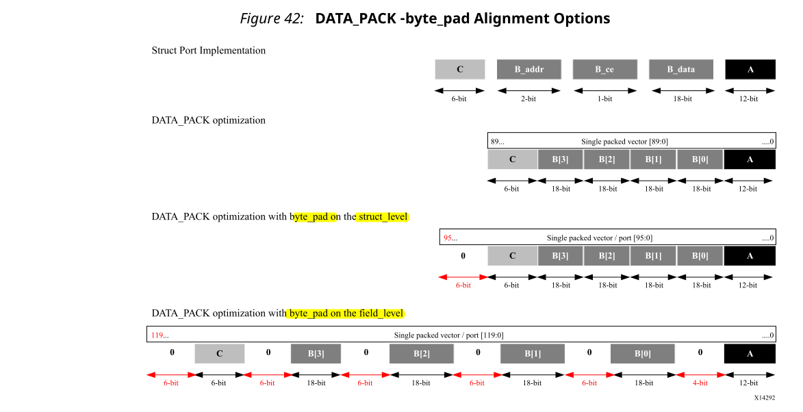

如果结构包含数组，则可以使用`ARRAY_PARTITION`指令对数组进行分区或将`ARRAY_RESHAPE`指令对数组进行分区，然后将分区的元素重组为更宽的数组，以优化这些数组。`DATA_PACK`指令执行与`ARRAY_RESHAPE`类似的操作，并将重构数组与结构体中的其他元素组合在一起。

使用`DATA_PACK`优化结构，然后对其进行分区或reshape是不可行的。DATA_PACK，ARRAY_PARTITION和ARRAY_RESHAPE指令是互斥的。
#### Interface Synthesis and Multi-Access Pointers
使用可以多次访问的指针可能会在综合后引入意外行为。在下面的示例中，指针d_i被读取了四次，而指针d_o被写入了两次：指针执行多个访问。
```c
#include "pointer_stream_bad.h"
void pointer_stream_bad ( dout_t *d_o,  din_t *d_i) {
 din_t acc = 0;
 acc += *d_i;
 acc += *d_i;
 *d_o = acc;
 acc += *d_i;
 acc += *d_i;
 *d_o = acc;
} 
```

在此代码的综合之后，将生成一个RTL设计，该设计读取输入端口一次，写入输出端口一次。与任何标准C编译器一样，Vivado HLS将优化掉多余的指针访问。要使用“预期的” 4次读取d_i和2次写入d_o来实现上述代码，必须将指针指定为`volatile`，如下例所示。
```c
#include "pointer_stream_better.h"
void pointer_stream_better ( volatile dout_t *d_o,  volatile din_t *d_i) {
 din_t acc = 0;
 acc += *d_i;
 acc += *d_i;
 *d_o = acc;
 acc += *d_i;
 acc += *d_i;
 *d_o = acc;
}
```
即使这个C代码也是有问题的。确实，使用测试台，除了最终写入之外，没有任何方法可以为d_i提供任何值，也不能验证任何对d_o的写入。尽管支持多访问指针，但强烈建议使用`hls::stream`类实现所需的行为。`hls::stream`类的详细信息位于HLS Stream Library。
#### Specifying Interfaces
接口综合由`INTERFACE`指令控制或通过配置设置控制。要在端口上指定接口模式，请在GUI Directives选项卡中选择端口，然后右键单击鼠标以打开Vivado HLS Directive Editor，如下图所示。

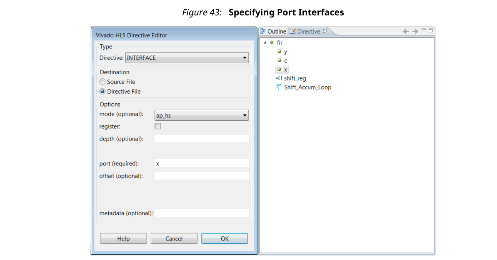

在Vivado HLS Directives Editor中，设置以下选项：
- mode

  从下拉菜单中选择`INTERFACE`模式。
- register
  
  如果选择此选项，则在第一个操作周期中将执行所有pass-by-value读取。对于输出端口，寄存器opti on保证输出被registered。您可以将寄存器优化应用于设计中的任何功能。对于Memory，FIFO和AXI4接口，register选项无效。
- depth
  
  这样可以优化测试台向设计**提供多少个样本**，以及测试台必须存储多少个输出值。使用任何较大的数字。(个人注：类似buffer？)

  :star:注意：对于在单个事务中多次读取或写入一个指针的情况，C/RTL协同仿真需要depth选项。使用数组或hls::stream构造时不需要depth选项。仅在接口上使用指针时才需要。

  如果深度优化设置得太小，则C/RTL协同仿真可能会死锁，如下所示：
  1. 输入读取可能会等待测试台无法提供的数据。
  2. 尝试写入数据时，输出写入可能会停顿，因为存储空间已满。
- port
  此选项是必需的。默认情况下，Vivado HLS不注册端口。

  :star: 注意：要指定Block I/O协议，请在Vivado HLS GUI中选择顶层函数，然后将端口指定为function return。

- offset

  此选项用于AXI4接口。

要设置Interface配置，选择Solution → Solution Settings → General → config_interface。您可以使用配置设置来：
- 在RTL设计中添加全局时钟使能。
- 删除悬挂端口，例如由结构体的元素创建，而未在设计使用的悬挂端口。
- 为任何全局变量创建RTL端口。

任何C函数都可以使用全局变量：这些变量在任何函数的范围之外定义。默认情况下，全局变量不会导致RTL端口的创建：Vivado HLS假定全局变量在最终设计之内。`config_interface`配置设置`expose_global`指示Vivado HLS为全局变量创建端口。
#### Interface Synthesis for SystemC

#### Specifying Manual Interface
您可以使用Vivado HLS识别定义特定I/O协议的代码块。这使您可以使用指令而不是使用Interface Synthesis或SystemC来指定I/O协议。

:star:注意：您还可以在SystemC设计中指定I/O协议，以提供更好的I/O控制。

以下示例显示了手动界面指定的要求和优点。在第一个代码示例中，发生以下情况：
1. Input response[0] is read.
2. Output request is written.
3. Input response[1] is read.

```c
void test (
  int   *z1,
  int   a,
  int   b,
  int   *mode,
  volatile int  *request,
  volatile int  response[2],
  int   *z2
  ) {
  int   read1, read2;
  int   opcode;
  int   i;
  P1: {
    read1       = response[0];
    opcode      = 5;
    *request    = opcode;
    read2       = response[1];
  }
  C1: {
          *z1   = a + b;
          *z2   = read1 + read2;
  }
}
```
当Vivado HLS实现此代码时，**不需要在两次读取response之间发生写入request的操作**。代码使用此I/O行为，但是代码中没有依赖项来强制执行I/O行为。Vivado HLS可以使用与C代码**相同的访问方式来调度I/O访问，或者使用不同的访问方式**。

如果有外部要求必须按顺序进行I/O访问，则可以使用协议块来强制执行特定的I/O协议行为。由于访问发生在块P1定义的范围内，因此可以按以下方式应用I/O协议：
- 包括定义`applet()`的`ap_utils.h`头文件。
- 将`ap_wait()`语句放在要写入request的后面，但在读取`response[1]`之前。
  
`ap_wait()`语句不会更改C模拟的行为。它指示Vivado HLS在综合期间在I/O访问之间插入时钟。

修改后的代码现在包含头文件和`ap_wait()`语句：
```c
#include "ap_utils.h" // Added include file
void test (
  int   *z1,
  int   a,
  int   b,
  int   *mode,
  volatile int  *request,
  volatile int  response[2],
  int   *z2
  ) {
  int   read1, read2;
  int   opcode;
  int   i;
  P1: {
    read1       = response[0];
    opcode      = 5;
    ap_wait(); // Added ap_wait statement
    *request    = opcode;
    read2       = response[1];
  }
  C1: {
          *z1   = a + b;
          *z2   = read1 + read2;
  }
}
```
使用`PROTOCOL`指令指定块P1是协议区域：
```
set_directive_protocol test P1 -mode floating
```
这指示Vivado HLS按按顺序调度该区域内的代码。I/O或`ap_wait()`语句没有重新排序。

这导致在代码中指定了以下确切的I/O行为：
1. Input response[0] is read.
2. Output request is written.
3. Input response[1] is read.

如果数据相关性允许，则`-mode floating`选项允许其他代码与此块并行执行。而`-fixed`模式可防止这种情况。

手动指定I/O协议时，请遵循以下准则： 
- 请勿在手动接口中使用的端口上使用I/O协议。将所有端口显式设置为I/O协议`ap_none`，以确保接口综合不会添加任何附加协议信号。
- 您必须使用volatile类型限定符在C代码中指定手动指定接口中使用的所有控制信号。这些信号通常会在函数内更改多次（例如，通常设置为0，然后设置为1，然后再设置为零）。由于没有volatile限定符，Vivado HLS遵循标准的C语言，并优化了所有中间操作，仅保留了第一次读取和最后写入。
- 使用volatile限定符来指定会更新多次的数据信号。
- 如果需要多个时钟，请使`ap_wait_n(<value>)`指定多个周期。不要使用多个`ap_wait()`语句。
- 使用Latency指令将需要在同一时钟周期内更改的信号分组。例如： 
  
  ```c
  {
    #pragma HLS PROTOCOL fixed
    // A protocol block may span multiple clock cycles
    // To ensure both these signals are scheduled in the exact same clock 
    cycle.
    // create a region { } with a latency = 0 
    {
    #pragma HLS LATENCY max=0 min=0
    *data = 0xFF;
    *data_vld = 1;
    }
    ap_wait_n(2);
  }
  ```
### Using AXI4 Interfaces

#### AXI4-Stream Interfaces
AXI4-Stream接口可以**应用于任何输入参数以及任何数组或指针输出参数**。由于AXI4-Stream接口以顺序流传输方式传输数据，因此它**不能用于读写参数**。AXI4-Stream接口始终被**符号扩展**到下一个字节。例如，将12位数据值符号扩展为16位。

AXI4-Stream接口始终被实现为registered接口，以确保将具有AXI-Stream接口的多个HLS IP模块集成到更大的设计中时，不会创建任何组合反馈路径。对于AXI-Stream接口，提供了四种类型的寄存器模式，以控制AXI-Stream接口寄存器的实现方式。
- Forward：仅注册TDATA和TVALID信号。
- Reverse：仅注册TREADY信号。
- Both：所有信号（TDATA，TREADY和TVALID）注册。这是默认值。
- Off：未注册任何端口信号。

**AXI-Stream side-channal信号被认为是 _数据信号_，并且只要注册了TDATA便被注册**。
***
:white_check_mark: 推荐：当将HLS生成的IP块与AXI4-Stream接口连接时，至少应将一个接口实现为注册接口，或者应通过AXI4-Stream Register Slice连接这些块。
***
在设计中使用AXI4-Stream有两种基本方法。
- Use an AXI4-Stream without side-channels.
- Use an AXI4-Stream with side-channels.

第二种使用模型提供了附加的功能，允许作为AXI4-Stream标准一部分的可选side-channels直接在C代码中使用。

##### AXI4-Stream Interfaces without Side-Channels
当函数参数不包含任何AXI4 side-channel元素时，将使用无side-channel的AXI4-Stream。以下示例显示了一种设计，其中数据类型为标准C int类型。在这个例子中，两个接口都是使用AXI4-Stream实现的。
```c
void example(int A[50], int B[50]) {
//Set the HLS native interface types
#pragma HLS INTERFACE axis port=A
#pragma HLS INTERFACE axis port=B
 int i;
 for(i = 0; i < 50; i++){
  B[i] = A[i] + 5;
 }
}
```
在综合之后，两个参数都通过数据端口以及标准的AXI4-Stream TVALID和TREADY协议端口实现，如下图所示。


可以使用结构体和DATA_PACK指令将多个变量组合到同一AXI4-Stream接口中。如果顶层函数的参数是一个结构体，则默认情况下，Vivado HLS将该结构分成单独的元素，并将该结构的每个成员实现为单独的端口。但是，可以使用DATA_PACK指令将结构体的元素打包到单个宽向量中，从而允许在同一AXI4-Stream接口中实现该结构体的所有元素。

##### AXI4-Stream Interfaces with Side-Channels
Side-channels是可选信号，是AXI4-Stream标准的一部分。可以使用结构体在C代码中**直接引用和控制Side-channels信号**，前提是该结构体的成员必须与AXI4-Stream Side-channels信号的**名称匹配**。AXI-Stream Side-channels被视为数据信号，并且每当注册TDATA时就被注册。Vivado HLS提供了一个示例。Vivado HLS Inlucde目录包含文件`ap_axi_sdata.h`。该头文件包含以下结构体：
```c
#include "ap_int.h"
#include “ap_axi_sdata,h”
template<int D,int U,int TI,int TD>
struct ap_axis{
 ap_int<D>    data;
 ap_uint<D/8> keep;
 ap_uint<D/8> strb;
 ap_uint<U>   user;
 ap_uint<1>   last;
 ap_uint<TI>  id;
 ap_uint<TD>  dest;
};
template<int D,int U,int TI,int TD>
struct ap_axiu{
 ap_uint<D>   data;
 ap_uint<D/8> keep;
 ap_uint<D/8> strb;
 ap_uint<U>   user;
 ap_uint<1>   last;
 ap_uint<TI>  id;
 ap_uint<TD>  dest;
};
```
这两个结构体都包含名称与最佳AXI4-Stream Side--channel名称匹配的变量作为顶层成员。**如果结构体包含具有这些名称的元素，则无需使用提供的头文件**。您可以创建自己定义的结构体。由于上面显示的结构体使用`ap_int`类型和模板，因此此头文件仅用于C++设计。

:star: 注意：valid和ready信号是AXI4-Stream中的强制信号，将始终由Vivado HLS实施。这些不能使用结构体来控制。

以下示例显示了如何在C代码中直接使用side-channels并在接口上实现这些side-channels。在此示例中，使用了带符号的32位数据类型。

```c
#include "ap_axi_sdata.h"
void example(ap_axis<32,2,5,6> A[50], ap_axis<32,2,5,6> B[50]){
//Map ports to Vivado HLS interfaces
#pragma HLS INTERFACE axis port=A
#pragma HLS INTERFACE axis port=B
 int i;
 for(i = 0; i < 50; i++){
  B[i].data = A[i].data.to_int() + 5;
  B[i].keep = A[i].keep;
  B[i].strb = A[i].strb;
  B[i].user = A[i].user;
  B[i].last = A[i].last;
  B[i].id = A[i].id;
  B[i].dest = A[i].dest;
 }
}
```
在综合之后，两个参数都通过数据端口，标准的AXI4-Stream TVALID和TREADY协议端口以及结构体中描述的所有最佳端口来实现。

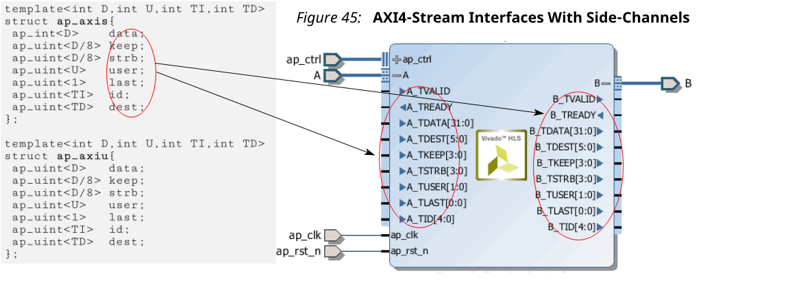

##### Packing Structs into AXI4-Stream Interfaces
当将结构体与AXI4-Stream接口一起使用时，默认综合行为有所不同。接口的默认综合行为在“Interface Synthesis and Structs”中进行了描述。

当使用**不带side-channels的AXI4-Stream接口并且函数参数是一个结构体**时：
- Vivado HLS自动应用DATA_PACK指令，并将结构体中的所有元素组合为单个宽数据向量。该接口被实现为具有关联的TVALID和TREADY信号的单个宽数据向量。
- 如果将DATA_PACK指令手动应用于该结构体，则该结构体的所有元素都将合并为一个宽数据向量，并且可以对DATA_PACK指令**应用AXI对齐选项**。该接口被实现为具有关联的TVALID和TREADY信号的单个宽数据向量。

当将**AXI4-Stream接口与side-channels一起使用时**，函数参数本身就是一个结构体（AXI-Stream结构体）。它可以包含本身是一个带有side-channels的结构体（数据结构体）的数据：
- Vivado HLS自动将DATA_PACK指令应用于数据结构体，并将该数据结构体的**所有元素组合为单个宽数据向量**。该接口被实现为具有关联**side-channels，TVALID和TREADY信号的单个宽数据向量**。
- 如果将DATA_PACK指令手动应用于数据结构体，则将数据结构体的**所有元素组合为单个宽数据向量**，并且可以对DATA_PACK指令应用AXI对齐方式。该接口被实现为具有**关联side-channel，TVALID和TREADY信号的单个宽数据向量**。
- 如果将DATA_PACK指令应用于AXI-Stream结构，则将**函数参数，数据结构体和side-channels信号组合为单个宽矢量**。该接口被实现为具有**TVALID和TREADY信号的单个宽数据向量**。
#### AXI4-Lite Interface
您可以使用AXI4-Lite接口来允许设计**由CPU或微控制器来控制**。使用Vivado HLS AXI4-Lite接口，您可以：
- 将多个端口组合到同一AXI4-Lite接口中。
- 输出C驱动程序文件，供处理器上运行的代码使用。
  
  :star: 注意：这提供了一组C应用程序接口（API）函数，使您可以轻松地从软件控制硬件。将设计导出到IP目录时，此功能很有用。

以下示例显示了Vivado HLS如何将多个参数（包括function return）实现为AXI4-Lite接口。因为每个指令对bundle选项使用相同的名称，所以每个端口都被分组到相同的AXI4-Lite接口中。
```c
void example(char *a, char *b, char *c)
{
#pragma HLS INTERFACE s_axilite port=return bundle=BUS_A
#pragma HLS INTERFACE s_axilite port=a      bundle=BUS_A
#pragma HLS INTERFACE s_axilite port=b      bundle=BUS_A
#pragma HLS INTERFACE s_axilite port=c      bundle=BUS_A offset=0x0400
#pragma HLS INTERFACE ap_vld port=b 
  *c += *a + *b;
}
```
:star: 注意：如果不使用bundle选项，Vivado HLS将所有使用AXI4-Lite接口指定的参数分组到同一默认bundle选项中，并自动命名端口。

您还可以为分组为AXI4-Lite接口的端口分配I/O协议。在上面的示例中，Vivado HLS将端口b实现为ap_vld接口，并将端口b分组为AXI4-Lite接口。结果，AXI4-Lite接口包含用于端口b数据的一个寄存器，一个寄存器用于输出来确认已读取端口b，一个寄存器用于端口b输入有效信号。

读取每个端口b时，Vivado HLS自动清除输入valid寄存器并将该寄存器复位为逻辑0。如果输入valid寄存器未设置为逻辑1，则b数据寄存器中的数据被视为无效，并且设计停顿并等待valid寄存器置位。

:white_check_mark: 推荐：为便于在设计过程中使用，Xilinx建议您不要在分组为AXI4-Lite接口的端口中包括其他I/O协议。但是，Xilinx**建议您在AXI4-Lite接口中包括与return端口关联的Block-level I/O协议**。

您**不能**使用`bram`接口将数组分配给AXI4-Lite接口。您只能使用默认的`ap_memory`接口将数组分配给AXI4-Lite接口。您也**不能**将`ap_stable` I/O协议指定的任何参数分配给AXI4-Lite接口。

由于分组为AXI-Lite接口的变量是函数参数，因此无法在C代码中为其分配默认值，因此AXI-Lite接口中的任何寄存器均不得分配默认值。可以使用`config_rtl`命令通过reset来实现寄存器，但不能为它们分配任何其他默认值。

默认情况下，Vivado HLS自动为分组到AXI4-Lite接口的每个端口分配地址。Vivado HLS在C驱动程序文件中提供分配的地址。有关更多信息，请参见C驱动程序文件。要明确定义地址，可以使用offset选项，如上例中的参数c所示。
***
:star: 重要！在AXI4-Lite接口中，Vivado HLS为Block-level I/O协议信号和中断控制保留地址0x0000至0x000C。
***

在综合之后，Vivado HLS在AXI4-Lite端口中实现端口，如下图所示。Vivado HLS通过在AXI4-Lite接口中包含**function return来创建中断**端口。您可以通过AXI4-Lite接口对中断进行编程。您还可以通过以下**block-level协议来驱动中断**：
- ap_done：指示该函数何时**完成所有操作**。
- ap_ready:：表示函数何时**准备好用于新的输入数据**。

您可以使用C 驱动文件编程接口。

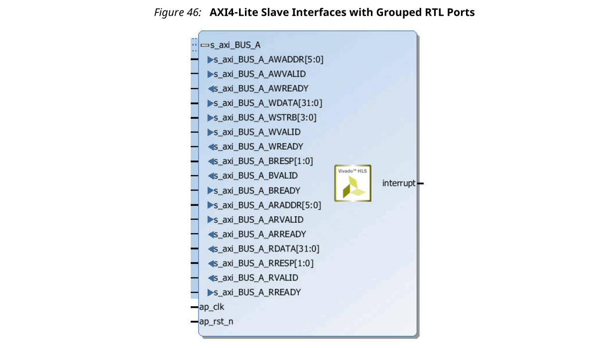

##### Control Clock and Reset in AXI4-Lite Interfaces
默认情况下，Vivado HLS对AXI4-Lite接口和综合设计使用相同的时钟。Vivado HLS将AXI4-Lite接口中的所有寄存器连接到用于综合逻辑时钟(ap_clk)。

可选地，您可以使用`INTERFACE`指令和clock选项为每个AXI4-Lite端口指定一个单独的时钟。将时钟连接到AXI4-Lite接口时，必须使用以下协议：(个人注：类似用过的CAN IP，can_clk单独连出来)
- AXI4-Lite接口时钟必须与用于综合逻辑（ap_clk）的时钟同步。也就是说，两个时钟必须来自相同的主发生器时钟。
- AXI4-Lite接口时钟频率必须等于或小于用于综合逻辑（ap_clk）的时钟频率。

如果您将clock选项与INTERFACE指令一起使用，则只需在每个bundle中的一个函数参数上指定clock选项。Vivado HLS对bundle中的其它函数参数使用相同的clock和reset。Vivado HLS用前缀`ap_rst_`后跟时钟名称命名生成的reset信号，。所产生的复位信号为低电平有效，与`config_rtl`命令无关。

以下示例显示了Vivado HLS如何将函数参数a和b分组到具有名为AXI_clk1的时钟和关联的复位端口的AXI4-Lite端口中。
```c
// Default AXI-Lite interface implemented with independent clock called 
AXI_clk1
#pragma HLS interface s_axilite port=a clock=AXI_clk1
#pragma HLS interface s_axilite port=b 
```

在下面的示例中，Vivado HLS将函数参数c和d分组到AXI4-Lite端口CTRL1中，该端口具有一个称为AXI_clk2的单独时钟和一个关联的reset端口。
```c
// CTRL1 AXI-Lite bundle implemented with a separate clock (called AXI_clk2)
#pragma HLS interface s_axilite port=c bundle=CTRL1 clock=AXI_clk2
#pragma HLS interface s_axilite port=d bundle=CTRL1
```
##### C Driver Files
当实现AXI4-Lite从接口时，将自动创建一组C驱动程序文件。这些C驱动程序文件提供了一组API，这些API可以集成到CPU上运行的任何软件中，并可以通过AXI4-Lite从接口与设备进行通信。

当将设计在IP Catalog中打包为IP时，将创建C驱动程序文件。

驱动程序文件是为Standalone和Linux模式创建的。在Standalone模式下，驱动程序的使用方式与任何其他Xilinx Standalone驱动程序相同。在Linux模式下，将所有C文件（.c）和标头文件（.h）文件复制到软件项目中。

驱动程序文件和API函数从用于综合的顶层函数中获得其名称。在上面的示例中，顶层功能称为“example”。如果在以下描述中将顶层函数命名为“ DUT”，则将“example”替换为“DUT”。驱动程序文件在打包的IP中创建（位于解决方案内部的impl目录中）。

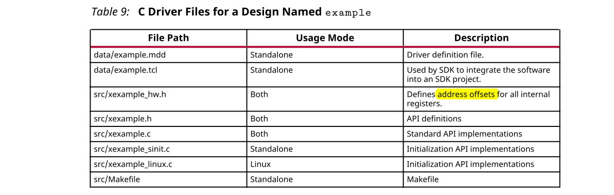

在文件`xexample.h`中，定义了两个结构体。
- XExample_Config：用于保存IP实例的配置信息（每个AXI4-Lite从接口的基地址）。
- XExample：用于保存IP实例指针。大多数API都将此实例指针作为第一个参数。

在`xexample.c`，`xexample_sinit.c`，`xexample_linux.c`文件中提供了标准API实现，并提供了执行以下操作的函数。
- 初始化设备
- 控制设备并查询其状态
- 读/写寄存器
- 设置，监视和控制中断

下表列出了每个C驱动文件提供的API函数。

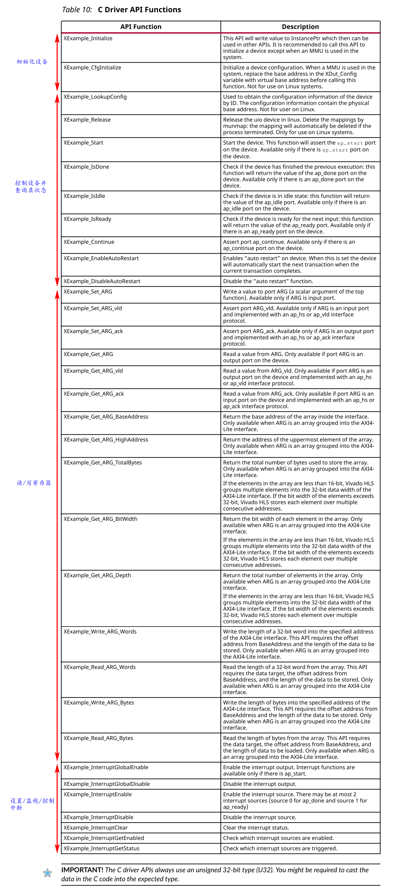

##### C Driver Files and Float Types
C驱动程序文件始终使用32位无符号整数（U32）进行数据传输。在以下示例中，函数使用浮动类型参数`a`和`r1`。它设置`a`的值并返回`r1`的值：
```c
float caculate(float a, float *r1)
{
//个人注：默认情况下，输出指针与关联的输出有效信号一起实现，以指示输出数据何时有效
#pragma HLS INTERFACE ap_vld register port=r1
#pragma HLS INTERFACE s_axilite port=a 
#pragma HLS INTERFACE s_axilite port=r1 
#pragma HLS INTERFACE s_axilite port=return 
 *r1 = 0.5f*a;
 return (a>0);
}
```
在综合之后，Vivado HLS将所有端口组合为默认的AXI4-Lite接口，并创建C驱动程序文件。但是，如以下示例所示，驱动程序文件使用类型U32：
```c
// API to set the value of A
void XCaculate_SetA(XCaculate *InstancePtr, u32 Data) {
    Xil_AssertVoid(InstancePtr != NULL);
    Xil_AssertVoid(InstancePtr->IsReady == XIL_COMPONENT_IS_READY);
    XCaculate_WriteReg(InstancePtr->Hls_periph_bus_BaseAddress, 
XCACULATE_HLS_PERIPH_BUS_ADDR_A_DATA, Data);
}
// API to get the value of R1
u32 XCaculate_GetR1(XCaculate *InstancePtr) {
    u32 Data;
    Xil_AssertNonvoid(InstancePtr != NULL);
    Xil_AssertNonvoid(InstancePtr->IsReady == XIL_COMPONENT_IS_READY);
    Data = XCaculate_ReadReg(InstancePtr->Hls_periph_bus_BaseAddress, 
XCACULATE_HLS_PERIPH_BUS_ADDR_R1_DATA);
    return Data;
}
```
如果这些函数直接适用于浮点类型，则写入和读取值与预期的浮点类型不一致。在软件中使用这些函数时，可以在代码中使用以下强制转换：
```c
float a=3.0f,r1;
u32 ua,ur1;
// cast float “a” to type U32
XCaculate_SetA(&calculate,*((u32*)&a)); // 这里使用了call-back调用之前的calculate，但是该函数计算float，但HLS函数参数都是U32类型，所以需要使用强制类型转换
ur1=XCaculate_GetR1(&caculate);
// cast return type U32 to float type for “r1”
r1=*((float*)&ur1);
```
##### Controlling Hardware
硬件头文件`xexample_hw.h`（在此示例中）为组合到AXI4-Lite从接口的端口提供了内存映射位置的完整列表。
```
// 0x00 : Control signals
//        bit 0  - ap_start (Read/Write/SC)
//        bit 1  - ap_done (Read/COR)
//        bit 2  - ap_idle (Read)
//        bit 3  - ap_ready (Read)
//        bit 7  - auto_restart (Read/Write)
//        others - reserved
// 0x04 : Global Interrupt Enable Register
//        bit 0  - Global Interrupt Enable (Read/Write)
//        others - reserved
// 0x08 : IP Interrupt Enable Register (Read/Write)
//        bit 0  - Channel 0 (ap_done)
//        bit 1  - Channel 1 (ap_ready)
// 0x0c : IP Interrupt Status Register (Read/TOW)
//        bit 0  - Channel 0 (ap_done)
//        others - reserved
// 0x10 : Data signal of a
//        bit 7~0 - a[7:0] (Read/Write)
//        others  - reserved
// 0x14 : reserved
// 0x18 : Data signal of b
//        bit 7~0 - b[7:0] (Read/Write)
//        others  - reserved
// 0x1c : reserved
// 0x20 : Data signal of c_i
//        bit 7~0 - c_i[7:0] (Read/Write)
//        others  - reserved
// 0x24 : reserved
// 0x28 : Data signal of c_o
//        bit 7~0 - c_o[7:0] (Read)
//        others  - reserved
// 0x2c : Control signal of c_o
//        bit 0  - c_o_ap_vld (Read/COR)
//        others - reserved
// (SC = Self Clear, COR = Clear on Read, TOW = Toggle on Write, COH = 
Clear on 
Handshake)
```

为了正确地编程AXI4-Lite从接口中的寄存器，需要了解一些硬件端口的工作方式。模块将使用接口综合中描述的相同端口协议进行操作。

例如，要启动块操作，必须将ap_start寄存器上设置为1。然后，设备将继续运行，并从接口中的寄存器读取来自组合到AXI4-Lite从接口的所有输入。当该块操作完成时，将通过硬件输出端口设置ap_done，ap_idle和ap_ready寄存器，并将组合到AXI4-Lite从接口的任何输出端口的结果从相应的寄存器中读取。

上例中`void example(char *a, char *b, char *c)`参数c的函数实现也突出了一定程度了解硬件端口如何工作的重要性。参数c的函数既被读取又被写入，因此被实现为单独的输入和输出端口c_i和c_o，如接口综合中所述。

对AXI4-Lite从接口进行编程的第一个推荐流程是针对函数的一次执行的理解：
- 使用中断函数来确定希望中断如何运行。
- 加载块输入端口的寄存器值。在上面的示例中，这是使用API​​函数`XExample_Set_a`，`XExample_Set_b`和`XExample_Set_c_i`执行的。
- 使用`XExample_Start`将`ap_start`位设置为1，以开始执行功能。如上面头文件中所述，该寄存器是自清除的。进行一次事务处理后，块将暂停操作。
- 允许函数执行。处理产生的任何中断。
- 读取输出寄存器。在上面的示例中，这是使用API​​函数`XExample_Get_c_o_vld`执行的，以确认数据有效，并使用`XExample_Get_c_o`。

  :star: 注意：AXI4-Lite从接口中的寄存器遵循与端口相同的I/O协议。在这种情况下，将输出有效设置为逻辑1，以指示数据是否有效。
- 重复进行下一个事务。

第二个推荐的流程是连续执行该块。在这种模式下，AXI4-Lite从接口中包含的输入端口只能是进行配置的端口。该块通常必须比CPU更快地运行。如果该块必须等待输入，则该块将花费大部分时间： 
- 使用中断函数来确定希望中断如何运行。
- 加载块输入端口的寄存器值。在上面的示例中，这是使用API​​函数`XExample_Set_a`，`XExample_Set_a`和`XExample_Set_c_i`执行的。
- 使用API​​ `XExample_EnableAutoRestart`设置自动启动功能。
- 允许函数执行。各个端口I/O协议将通过块同步正在处理的数据。
- 解决产生的所有中断。在此操作期间可以访问输出寄存器，但数据可能会更改。
- 使用API `XExample_DisableAutoRestart`防止执行更多操作。
- 读取输出寄存器。在上面的示例中，这是使用API​​函数`XExample_Get_c_o`和`XExample_Set_c_o_vld`执行的。

##### Controlling Software
可以在CPU上运行的软件中使用API​​函数来控制硬件模块。该过程简要概述为：
- 创建硬件实体的实例
- 查找设备配置
- 初始化设备
- 设置HLS块的输入参数
- 启动设备并读取结果

下面显示了此过程的抽象版本。Zynq-7000 SoC教程中提供了软件控制的完整示例。
```c
#include "xexample.h"    // Device driver for HLS HW block
#include "xparameters.h" 
// HLS HW instance
XExample HlsExample; // IP实例指针
XExample_Config *ExamplePtr // 保存IP实例的配置信息
int main() {
 int res_hw;
// Look Up the device configuration 
 ExamplePtr = XExample_LookupConfig(XPAR_XEXAMPLE_0_DEVICE_ID);
 if (!ExamplePtr) {
 print("ERROR: Lookup of accelerator configuration failed.\n\r");
 return XST_FAILURE;
 }
// Initialize the Device
 status = XExample_CfgInitialize(&HlsExample, ExamplePtr);
 if (status != XST_SUCCESS) {
 print("ERROR: Could not initialize accelerator.\n\r");
 exit(-1);
 }
//Set the input parameters of the HLS block
 XExample_Set_a(&HlsExample, 42);
 XExample_Set_b(&HlsExample, 12);
 XExample_Set_c_i(&HlsExample, 1);
// Start the device and read the results
 XExample_Start(&HlsExample);
 do {
 res_hw = XExample_Get_c_o(&HlsExample);
 } while (XExample_Get_c_o(&HlsExample) == 0); // wait for valid data output
 print("Detected HLS peripheral complete. Result received.\n\r");
}
```

##### Customizing AXI4-Lite Slave Interfaces in IP Integrator
当使用AXI4-Lite从接口的HLS RTL设计并入Vivado IP Integrator中的设计时，您可以定制模块。从IP Integrator中的框图中，选择HLS Block，单击鼠标右键，然后选择Customize Block。

默认情况下，地址宽度配置为所需的最小大小。修改它以连接到地址大小小于32位的块。

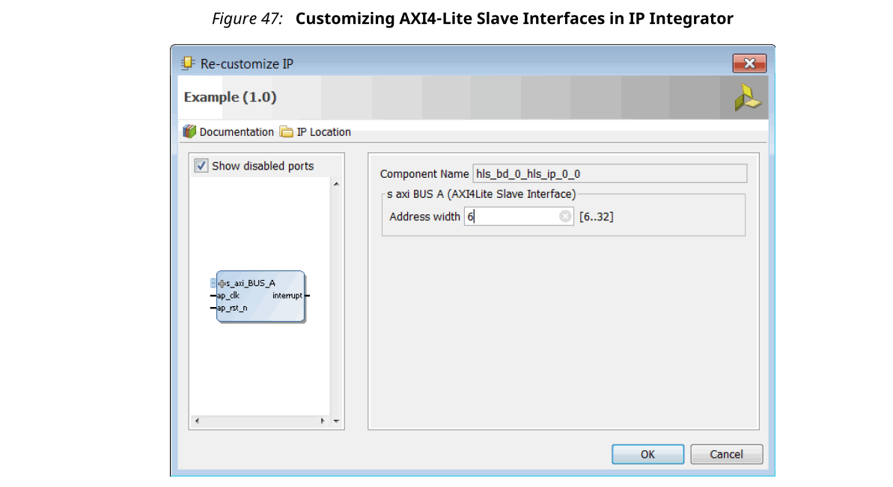
#### AXI4 Master Interface
您可以在**数组或指针/引用**参数上使用AXI4主接口，Vivado HLS通过以下方式之一实现该接口：
- Individual data transfers
- Burst mode data transfers

通过单独的数据传输，Vivado HLS为每个地址读取或写入单个数据元素。以下示例显示了一次读取和一次写入操作。在此示例中，Vivado HLS在AXI接口上生成一个地址以读取单个数据值，并生成一个地址以写入单个数据值。接口每个地址传送一个数据值。
```c
void bus (int *d) {
 static int acc = 0;
 acc += *d;
 *d  = acc;
}
```
通过突发模式传输，Vivado HLS使用单个基址和随后的多个顺序数据样本读取或写入数据，这使该模式能够实现更高的数据吞吐量。当您使用C `memcpy`函数或流水线式for循环时，可能会使用突发操作模式。

:star: 注意：memcpy函数可综合的条件为，通过AXI4 Master接口指定的顶层函数参数传输数据。

以下示例显示了使用`memcpy`函数的突发模式。顶层函数参数`a`被指定为AXI4 Master接口。
```c
void example(volatile int *a){
#pragma HLS INTERFACE m_axi depth=50 port=a
#pragma HLS INTERFACE s_axilite port=return
//Port a is assigned to an AXI4 master interface
 int i;
 int buff[50];
//memcpy creates a burst access to memory
 memcpy(buff,(const int*)a,50*sizeof(int));
 for(i=0; i < 50; i++){
 buff[i] = buff[i] + 100;
 }
 memcpy((int *)a,buff,50*sizeof(int));
}
```
综合此示例后，将产生以下图所示的界面。

注意：在此图中，AXI4接口已折叠。


下面的示例显示与前面的示例相同的代码，但是使用for循环复制数据：
```c
void example(volatile int *a){
#pragma HLS INTERFACE m_axi depth=50 port=a
#pragma HLS INTERFACE s_axilite port=return
//Port a is assigned to an AXI4 master interface
 int i;
 int buff[50];
//memcpy creates a burst access to memory
 memcpy(buff,(const int*)a,50*sizeof(int));
 for(i=0; i < 50; i++){
 buff[i] = buff[i] + 100;
 }
 for(i=0; i < 50; i++){
#pragma HLS PIPELINE
 a[i] = buff[i];
 }
}
```
使用for循环实现突发读取或写入时，请遵循以下要求：
- 流水线化循环
- 以**递增顺序**访问地址
- 请勿将访问放置在条件语句中
- 对于嵌套循环，请勿flatten循环，因为这会抑制循环突发操作

:star: 注意：在for循环中仅允许一次读取和一次写入，除非这些端口捆绑在不同的AXI端口中。以下示例说明如何使用不同的AXI接口以突发模式执行两次读取。

在以下示例中，Vivado HLS将端口读取实现为突发传输。没有使用`bundle`选项指定了端口`a`，因此在默认的AXI接口中实现。端口`b`是使用命名`bundle`指定的，在名为d2_port的单独AXI接口中实现。
```c
void example(volatile int *a, int *b){
#pragma HLS INTERFACE s_axilite port=return 
#pragma HLS INTERFACE m_axi depth=50 port=a
#pragma HLS INTERFACE m_axi depth=50 port=b bundle=d2_port
 int i;
 int buff[50];
//copy data in
 for(i=0; i < 50; i++){
#pragma HLS PIPELINE
 buff[i] = a[i] + b[i];
 }
...
 }
```
:star: 注意：如果使用DATA_PACK优化打包结构体，则结构体仅被AXIM接口支持。

##### Controlling AXI4 Burst Behavior
最佳的AXI4接口是这样的接口，在该接口中，设计在等待访问总线时永不停顿，并且在授权总线访问后，在等待设计读取/写入时，总线永不停顿。为了创建最佳的AXI4接口，在`INTERFACE`指令中提供了以下优化选项，以指定突发的行为并优化AXI4接口的效率。

其中一些优化使用内部存储来缓冲数据，并且可能对Area和Resource产生影响：
- latency: 指定AXI4接口的预期等待时间，从而允许设计在预期读取或写入之前启动总线请求多个周期（等待时间）。如果该数字太低，则设计将过早准备就绪，可能停顿以等待总线。如果该数字过高，则可能获得总线访问权限后，但是总线可能会停顿以等待设计开始访问。
- max_read_burst_length: 指定在突发传输期间读取的最大数据值数。
- num_read_outstanding: 指定在设计停滞之前可以不用响应地向AXI4总线发出多少读取请求。这意味着设计中的**内部存储是FIFO**，其大小为：num_read_outstanding * max_read_burst_length * word_size。
- max_write_burst_length: 指定在突发传输期间写入的最大数据值数。
- num_write_outstanding: 指定在设计停顿之前可以无响应地向AXI4总线发出多少个写请求。这**意味着设计中的内部存储，其FIFO的大小**为：num_read_outstanding * max_read_burst_length * word_size

以下示例可用于帮助解释这些选项：
```c
 #pragma HLS interface m_axi port=input offset=slave bundle=gmem0 
depth=1024*1024*16/(512/8) 
 latency=100 
 num_read_outstanding=32 
 num_write_outstanding=32 
 max_read_burst_length=16
 max_write_burst_length=16 
```
该接口被指定为具有100的Latency。Vivado HLS试图在设计准备好访问AXI4总线之前将突发访问请求调度100个时钟周期。为了进一步提高总线效率，`num_write_outstanding`和`num_read_outstanding`选项确保设计包含足够的缓冲以存储多达32个读写访问。这使设计可以继续处理，直到为总线请求提供服务为止。最后，选项`max_read_burst_length`和`max_write_burst_length`确保最大突发大小为16，并且AXI4接口保持总线的时间不超过此时间。

这些选项允许针对将要运行的系统对AXI4接口的行为进行优化。操作的效率确实取决于这些值的设置精度。
##### Creating an AXI4 Interface with 64-bit Address Capability
默认情况下，Vivado HLS使用32位地址总线实现AXI4端口。可选地，您可以使用`m_axi_addr64`接口配置选项来实现64位地址总线的AXI4接口，如下所示：
1. Select Solution > Solution Settings.
2. In the Solution Settings dialog box, click the General category, and click Add.
3. In the Add Command dialog box, select config_interface, and enable m_axi_addr64.

:star: 重要！选择`m_axi_addr64`优化后，Vivado HLS将使用64位地址总线实现设计中的所有AXI4接口。

##### Controlling the Address Offset in an AXI4 Interface
默认情况下，AXI4 Master接口从地址0x00000000开始所有读取和写入操作。例如，给定以下代码，设计从地址0x00000000到0x000000c7（50个32位字，给出200个字节）读取数据，该数据表示50个地址值。然后，设计将数据写回到相同的地址。
```c
void example(volatile int *a){
#pragma HLS INTERFACE m_axi depth=50 port=a 
#pragma HLS INTERFACE s_axilite port=return bundle=AXILiteS
 int i;
 int buff[50];
 memcpy(buff,(const int*)a,50*sizeof(int));
 for(i=0; i < 50; i++){
 buff[i] = buff[i] + 100;
 }
 memcpy((int *)a,buff,50*sizeof(int));
}
```
要应用地址偏移量，请在INTERFACE指令中使用-offset选项，并指定以下选项之一：
- off: 不应用偏移地址。这是默认值。
- direct: 在设计中添加一个32位端口，以应用地址偏移量。
- slave：在AXI4-Lite接口内添加一个32位寄存器，以应用地址偏移量。

在最终的RTL中，Vivado HLS将地址偏移量直接应用于AXI4 Master接口生成的任何读取或写入地址。这允许设计访问系统中的任何地址。

如果在AXI接口中使用slave选项，则必须在设计接口上使用AXI4-Lite端口。Xilinx建议您使用以下pragma来实现AXI4-Lite接口：
```c
#pragma HLS INTERFACE s_axilite port=return
```
此外，如果您使用slave选项并且使用了多个AXI4-Lite接口，则必须确保将AXI master端口偏移寄存器绑定到正确的AXI4-Lite接口中。在以下示例中，端口`a`被实现为具有offset的AXI Master接口，和称为AXI_Lite_1和AXI_Lite_2的AXI4-Lite接口：
```c
#pragma HLS INTERFACE m_axi port=a depth=50 offset=slave 
#pragma HLS INTERFACE s_axilite port=return bundle=AXI_Lite_1
#pragma HLS INTERFACE s_axilite port=b bundle=AXI_Lite_2
```
需要以下`INTERFACE`指令，以确保端口`a`的offset寄存器绑定到名为AXI_Lite_1的AXI4-Lite接口中：
```c
#pragma HLS INTERFACE s_axilite port=a bundle=AXI_Lite_1
```

##### Customizing AXI4 Master Interfaces in IP Integrator
在Vivado IP Integrator中将使用AXI4 Master接口的HLS RTL设计合并到设计中时，可以自定义模块。在IP Integrator中的框图中，选择HLS块，单击鼠标右键，然后选择“自定义块”以自定义所提供的任何设置。Vivado Design Suite：AXI参考指南（UG1037）中的此链接提供了有关AXI4参数的完整描述。

下图显示了如下所示设计的“重新自定义IP”对话框。该设计包括一个AXI4-Lite端口。

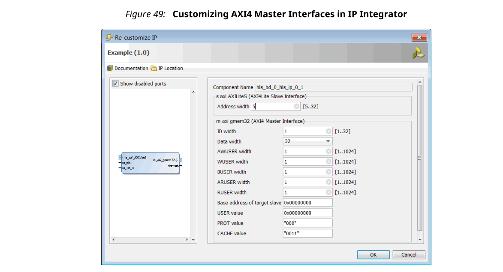

#### Managing Interfaces with SSI Technology Devices
某些Xilinx器件使用堆叠式硅互连（SSI）技术。在这些设备中，总的可用资源分配在多个超级逻辑区域（SLR）中。SLR之间的连接使用超长线（SSL）路由。SSL路由产生的延迟成本通常大于标准FPGA路由。为确保设计以最佳性能运行，请遵循以下准则：
- 寄存所有跨接在SLRs之间的信号，包括SLR输出和SLR输入。
- 如果信号通过I/O缓冲程序进入或退出SLR，则无需寄存信号。
- 确保由Vivado HLS创建的逻辑处于单个SLR内。
  
:star: 注意：当您选择SSI技术设备作为目标技术时，实用程序报告将包括有关SLR使用情况和设备使用总量的详细信息。

如果逻辑包含在单个SLR设备中，则Vivado HLS为`config_interface`命令提供`register_io`选项。此选项提供了一种自动注册所有块输入，输出或两者的方法。仅标量需要此选项。所有数组端口均已自动注册。

register_io选项的设置为：
- off: None of the input or outputs are registered.
- scalar_in: All inputs are registered.
- scalar_out: All outputs are registered.
- scalar_all: All input and outputs are registered.

:star: 注意：将register_io选项与RTL的Block-level布局配合使用，可确保以SSI技术设备为目标的逻辑以最大时钟速率执行。

