## 1.7 Optimizing the Design
本部分概述了可用于指导Vivado HLS生成满足要求的性能和区域目标的微体系结构的各种优化方法和技术。

下表列出了Vivado HLS提供的优化指令。

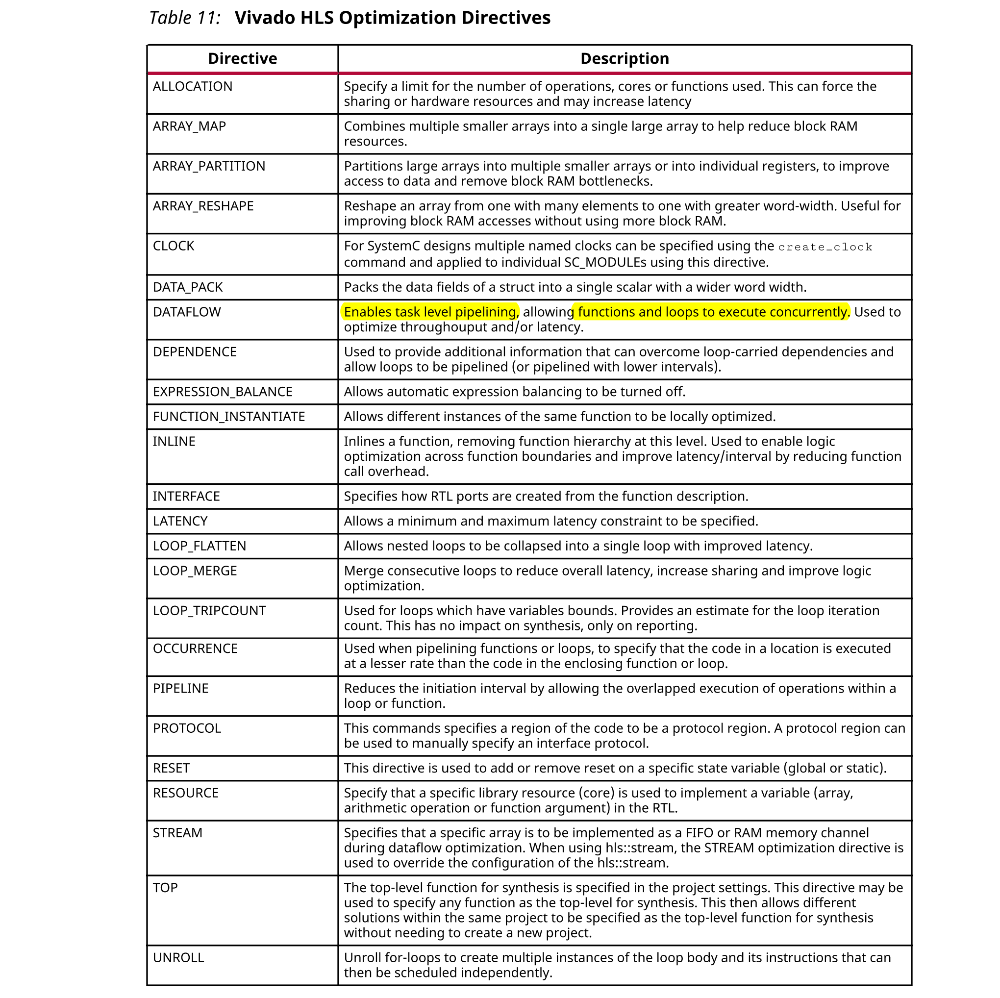

除优化指令外，Vivado HLS还提供了许多配置设置。配置设置用于更改综合的默认行为。下表显示了配置设置。

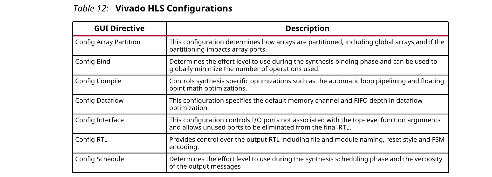

应用优化指南中提供了有关如何应用优化和配置的详细信息。可使用Solution → Solution Settings  → General访问配置，然后使用Add按钮来选择配置。

优化通过怎样将其应用于设计的上下文来介绍。

时钟，复位和RTL输出一起讨论。时钟频率与目标器件一起是驱动优化的主要约束。Vivado HLS试图在每个时钟周期内放置来自目标设备的尽可能多的操作。最终的RTL中使用的reset样式可以通过使用config_rtl配置来控制，例如协同FSM编码样式。

以通俗易懂的方式一起介绍了用于**优化吞吐量**的主要优化方法：
- 流水化任务以提高性能
- 改善任务之间的数据流
- 以及优化结构以改善可能限制性能的地址问题。

优化**延迟**使用了**延迟约束**和**消除循环过渡的技术**，以减少完成所需的时钟周期数。

专注于如何实现操作-控制操作数以及如何在硬件中实现这些操作-是改善面积的主要技术。

除了实用pragmas和directives之外，Vivado HLS还提供了一种将现有的优化RTL集成到HLS设计流程中的方法。有关更多信息，请参见RTL Blackbox。

### Clock, Reset, and RTL Output
#### Specifying the Clock Frequency
对于C和C++设计，**仅支持单个时钟**。同一时钟应用于设计中的所有函数。

对于SystemC设计，可以为每个SC_MODULE指定不同的时钟。要在SystemC设计中指定多个时钟，请使用`create_clock`命令的`-name`选项创建多个命名时钟，并使用`CLOCK`指令或pragma指定哪个函数包含要与指定时钟合成的`SC_MODULE`。每个`SC_MODULE`只能使用单个时钟进行综合：时钟可以通过函数分配，例如当多个时钟从顶层端口连接到各个模块时，但是每个`SC_MODULE`只能对单个时钟敏感。

时钟周期（ns）在“Solutions > Solutions Setting”中设置。Vivado HLS使用时钟不确定性的概念来提供用户定义的定时余量。通过使用Vivado HLS的时钟频率和器件目标信息，可以估算设计中的操作时间，但无法知道最终的元件放置和网络布线：这些操作是通过输出RTL的逻辑综合来执行的。因此，Vivado HLS无法知道确切的延迟。

为了计算用于综合的时钟周期，**Vivado HLS从时钟周期中减去时钟不确定性**，如下图所示。


这提供了用户指定的余量，以确保下游过程（如逻辑综合和布局布线）具有足够的时间余量来完成其操作。如果FPGA器件资源被大量使用，那么单元布局和连接单元的网络布线可能不产生理想的选择，并且可能导致设计延迟超过预期。对于这种情况，**增加的时序余量可确保Vivado HLS不会在每个时钟周期内创建太多逻辑的设计**，并**允许RTL综合在不理想布局和最佳布线的情况下满足要求**。

默认情况下，时钟不确定度为周期的12.5％。该值可以在时钟周期旁边明确指定。

Vivado HLS旨在满足所有约束条件：时序，吞吐量，延迟。不过，即使无法满足约束条件，Vivado HLS也始终输出RTL设计。

如果无法满足时钟周期推断的时序限制，则Vivado HLS会发出消息`SCHED-644`，如下所示，并创建具有最佳可实现性能的设计。
```
@W [SCHED-644] Max operation delay (<operation_name> 2.39ns) exceeds the 
effective 
cycle time
```
即使Vivado HLS无法满足特定路径的时间要求，也可以在所有其他路径上实现时间要求。通过此行为，您可以评估更高的优化级别或下游逻辑综合对那些失败路径的特殊处理是否可以接通并最终满足该要求。
***
:star: 重要！重要的是，在综合之后查看约束报告，以确定是否满足所有约束：Vivado HLS生成输出设计这一事实不能保证设计满足所有性能约束。查看设计报告中的“性能估算”。
***

`config_schedule`命令的`relax_ii_for_timing`选项可用于更改默认的时序行为。指定此选项后，Vivado HLS在检测到路径无法满足时钟周期时会自动放宽任何流水线指令的II。此选项仅适用于指定的`PIPELINE`指令不带II值（且隐含II = 1）的情况。如果在`PIPELINE`指令中明确指定了II值，则`relax_ii_for_timing`选项无效。

综合完成后，将为层次结构中的每个函数生成一个设计报告，并且可以在报告文件夹中的解决方案中查看该报告。**报告的整个设计中最差情况的时序是报告中每个函数的最坏情况**。无需检查层次结构中的每个报告。

如果时序违规行为过于严重而无法由下游流程进一步优化和纠正，则在考虑使用更快的目标技术之前，请审查用于指定准确的延迟和实现核心的技术。
#### Specifying the Reset
通常，RTL配置最重要的方面是选择reset行为。在讨论reset行为时，**重要的是要了解Initialization和reset之间的区别**。

##### Initialization Behavior
在C语言中，默认情况下，static限定符定义的变量和在全局范围内定义的变量初始化为零。可选地，可以为这些变量分配特定的初始值。对于这些类型的变量，C代码中的初始值是在编译时（默认为零）分配的，之后不再分配。**在这两种情况下，RTL中都实现了相同的初始值**。
- 在RTL仿真期间，将使用与C代码相同的值来初始化变量。
- 在用于对FPGA进行编程的位流中会初始化相同的变量。设备加电时，变量将以其初始化状态开始。

**变量的初始状态与C代码相同**。但是，**没有办法强制返回到此初始状态**。要使变量返回其初始状态，必须通过reset来实现。
***
:star: 重要！顶层函数参数可以在AXI4-Lite接口中实现。由于无法在C/C++中为函数参数提供初始值，因此无法在RTL中初始化这些变量，因为这样做会创建与C/C++代码具有不同函数行为的RTL设计，在C/RTL协同仿真期间将无法验证。
***
##### Controlling the Reset Behavior
Reset端口在FPGA中用于将连接到复位信号的寄存器和Block RAM 返回到初始值。使用以下图所示的`config_rtl`配置控制RTL reset端口的存在和行为。要访问此配置，选择Solution → Solution Settings  → General →  Add  →  config_rtl。

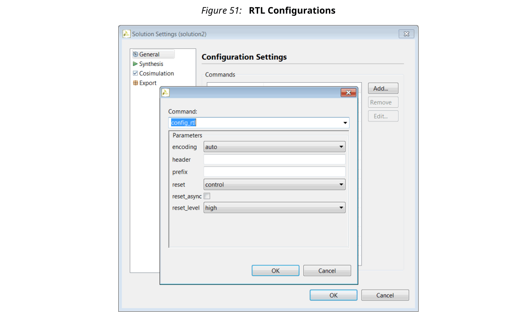

Reset设置包括设置reset极性以及reset是同步还是异步，但更重要的是，它通过reset选项控制在应用复位信号时复位哪些寄存器。

***
:star: 重要！在设计上使用AXI4接口时，无论`config_rtl`配置中的设置如何，复位极性都会自动更改为低电平。这是AXI4标准所必需的。
***

reset选项具有四个设置：
- none：不将reset添加到设计中。
- control：这是默认设置，可确保**重置所有控制寄存器**。控制寄存器是在状态机中使用的寄存器，用于生成I/O协议信号。此设置确保设计可以立即开始其操作状态。
- state：此选项将对**控制寄存器**（如在控制设置中）以及从**C代码中的静态和全局变量生成的任何寄存器或存储器添加复位**。此设置可确保在应用复位后，将C代码中初始化的静态变量和全局变量重置为初始值。
- all：这将重置设计中的**所有寄存器和存储器**。

通过`RESET`指令可以对复位进行更精细的控制。如果变量是静态变量或全局变量，则可以使用`RESET`指令显式添加一个重置，也可以使用`RESET`指令的`off`选项将变量从要重置的变量中删除。当设计中存在静态或全局数组时，这尤其有用。
***
:star: 重要！当使用复位`state`或`all`选项来考虑对数组的影响时，这一点很重要。
***
##### Initializing and Resetting Arrays
**通常将数组定义为静态变量，这意味着将所有元素初始化为零**，并且通常将数组实现为Block RAM。当使用复位选项`state`或`all`时，它会强制所有实现为Block RAM的数组在复位后返回到其初始化状态。这可能会在RTL设计中**导致两个非常不利的条件**： 
- 与上电初始化不同，显式复位要求RTL设计遍历Block RAM中的每个地址来设置该值：如果N很大且需要更多的区域资源来实现，则这可能需要很多时钟周期。
- reset被添加到设计中的每个数组。

**为避免将reset逻辑放置在每个此类Block RAM上**，并导致复位RAM中的所有元素的时钟周期开销，请执行以下操作：
- 使用默认的`control`重置模式，并使用`RESET`指令指定要重置的单个静态或全局变量。
- 或者，使用`state`模式，并使用`RESET`指令的关闭选项从特定的静态或全局变量中除去复位。

#### RTL Output
Vivado HLS输出的RTL的各种特性可以使用上图所示的`config_rtl`配置进行控制。
- 指定RTL状态机中使用的FSM编码的类型。
- 使用`-header`选项将任意注释字符串（例如版权声明）添加到所有RTL文件。
- 使用`prefix`选项指定唯一名称，该名称将添加到所有RTL输出文件名称中。
- 强制RTL端口使用小写名称。

默认的FSM编码风格为`onehot`。其他可能的选项是`auto`、`binary`、`gray`。如果选择`auto`，Vivado HLS将使用`onehot`默认设置来实现编码样式，但是Vivado Design Suite可能会在逻辑综合过程中提取并重新实现FSM风格。如果您选择任何其他编码样式（binary，onehot，gray），则Xilinx逻辑综合工具无法重新优化该编码样式。

RTL输出文件的名称来自用于综合的顶层函数的名称。如果从相同的顶层函数创建了不同的RTL块，则RTL文件将具有相同的名称，并且不能在同一RTL项目中组合。`prefix`选项允许从同一顶层函数（默认情况下与顶层函数具有相同名称）生成的RTL文件轻松组合到同一目录中。`lower_case_name`选项确保在输出RTL中仅使用小写名称。此选项确保由Vivado HLS创建的IO协议端口（例如AXI接口的端口）在最终RTL中指定为`s_axis_<port>_tdata`，而不是默认端口名称`s_axis_<port>_TDATA`。
### Optimizing for Throughput
使用以下优化来**提高吞吐量**或**缩短启动间隔**(initi ation  interval)。
#### Function and Loop Pipelining
**流水线操作允许操作同时发生**：每个执行步骤不必在开始下一个操作之前就完成所有操作。**流水线应用于函数和循环**。下图显示了函数流水线​使**吞吐量提高**。

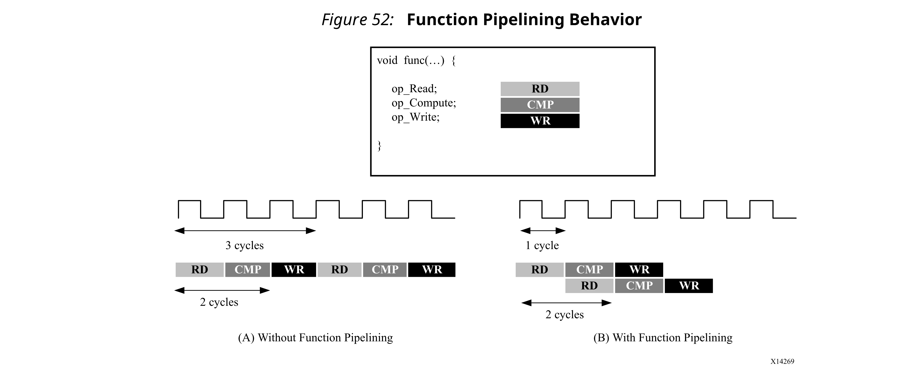

如果没有流水线，则上面示例中的函数每3个时钟周期读取一次输入，然后2个时钟周期后输出一个值。函数的启动间隔（II）为3，延迟时间为3。对于流水线而言，在此示例中，每个周期（II = 1）都会读取一个新输入，而输出延迟时间没有变化。

循环流水线允许循环中的操作以重叠的方式实现。在下面的图中，（A）显示了默认的顺序操作，其中每个输入读取之间有3个时钟周期（II = 3），并且在执行最后一个输出写入之前需要8个时钟周期。

在（B）中所示的循环的流水线版本中，每个周期（II = 1）都会读取一个新的输入样本，并且最终的输出仅在4个时钟周期之后被写入：显着改善了II和延迟，同时使用相同的硬件资源。


**函数或循环使用`PIPELINE`指令进行流水线处理**。**该指令在构成函数或循环体的区域中指定**。如果未指定启动间隔，则启动间隔默认为1，但可以明确指定。

**流水线仅应用于指定的区域**，而不应用于下面的层次结构。但是，层次结构下面的**所有循环都是自动展开的**。层次结构下指定的任何子函数都**必须单独进行流水线处理**。如果对子函数进行了流水线处理，则其上方的流水线函数可以利用流水线性能。相反，顶层函数下方的未流水线化的任何子函数可能是流水线性能的限制因素。

流水线化的函数和循环的行为方式有所不同。
- 对于函数，流水线永远运行，永无止境。
- 在循环的情况下，**流水线将执行直到循环的所有迭代完成为止**。

下图总结了这种行为差异。

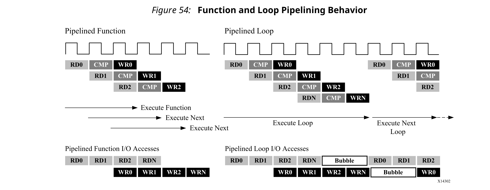

行为上的差异会影响管道输入和输出的处理方式。如上图所示，流水线函数将连续读取新输入并写入新输出。相比之下，由于循环必须在开始下一个循环之前首先完成循环中的所有操作，因此流水线循环会导致数据流中出现“气泡”。就是说，存在两个点有气泡，第一点发生循环完成最终迭代时，没有新的输入被读取；另一个点是在循环开始新的循环迭代时，没有新的输出被写入。

##### Rewinding Pipelined Loops for Performance
为避免上图中出现的问题，`PIPELINE`编译指示具有可选的命令`rewind`。当此循环是顶层函数或数据流过程的最外层构造（并且数据流区域称为多个字段）时，此命令将使后续调用rewind loop的迭代重叠。

下图显示了**对循环进行流水处理时使用`rewind`选项的操作**。在循环迭代结束时，循环开始重新执行。虽然通常立即重新执行，但可能会出现延迟，并且会在GUI中显示和描述。

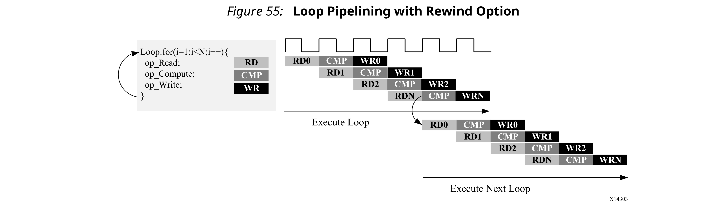

:star: 注意：如果在`DATAFLOW`区域周围使用循环，则Vivado HLS自动实现该循环以允许连续的迭代重叠。有关更多信息，请参见Exploiting Task Level Parallelism: Dataflow Optimization。

##### Flushing Pipelines
只要流水线输入处有可用数据，流水线就会继续执行。如果没有可处理的数据，流水线将停顿。如下图所示，其中输入数据有效信号变为低电平表示没有更多数据。一旦有新数据可供处理，流水线将继续操作。


在某些情况下，希望有一个可以“emptied”或“flushed”的流水线。`flush`选项支持执行此操作。当流水线被“flushed”时，如果没有可用的输入数据（由流水线开始处的数据有效信号确定），流水线将停止读取新的输入，但会继续处理，关闭每个后续流水线阶段，直到最后一次输入已经由流水线处理到输出阶段。

##### Automatic Loop Pipelining
`config_compile`配置使循环可以基于迭代次数自动流水线化。可通过菜单【Solution  > Solution  Settings  > General > Add > config_compile】来访问此配置。

`pipeline_loops`选项设置了迭代限制。迭代次数低于此限制的所有循环都将自动流水线化。默认值为0：不执行自动循环流水线。

给出以下示例代码：
```c
for (y = 0; y < 480; y++) {
  for (x = 0; x < 640; x++) {
    for (i = 0; i < 5; i++) {
      // do something 5 times
      ...
    }
  }
}
```
如果`pipeline_loops`选项设置为6，则上述代码段中最里面的`for`循环将自动进行流水线处理。这等效于以下代码片段：
```c
for (y = 0; y < 480; y++) {
  for (x = 0; x < 640; x++) {
    for (i = 0; i < 5; i++) {
#pragma HLS PIPELINE II=1
      // do something 5 times
     ...
    }
  }
}
```
如果设计中不想使用自动流水化循环，在该循环上应用`PIPELINE`指令并使用`off`选项。`off`选项禁止自动循环流水线化。
***
:star: 重要！Vivado HLS在执行所有用户指定的指令之后会应用`config_compile pipeline_loops`优化。例如，如果Vivado HLS将用户指定的`UNROLL`指令应用于循环，则将首先展开该循环，并且无法应用自动流水化循环。
***
##### Addressing Failure to Pipeline
对函数进行流水线处理时，将自动展开以下层次结构中的所有循环。这是进行流水线处理的要求。**如果循环具有可变范围，则无法展开**。这将阻止函数流水线化。
##### Static Variables
静态变量用于保存循环迭代之间的数据，在最终实现中将**生成寄存器**。如果在流水线函数中遇到此问题，vivado_hls可能无法充分优化设计，这将导致启动间隔长于所需时间。

以下是这种情况的典型示例：(个人注：store和load可能同时发生，综合时会考虑最坏情况。))
```c
function_foo()
{
    static bool change = 0
    if (condition_xyz){ 
        change = x; // store 
    }
    y = change; // load
}
```
如果vivado_hls无法优化此代码，则store操作需要一个周期，而load操作则需要一个附加周期。如果此函数是流水线的一部分，则该流水线必须以最小启动间隔`2`来实现，因为**静态更改变量会创建loop-carried的依赖项**。（个人注:如果不是静态，而是自动变量呢？）

用户可以避免这种情况的一种方法是重写代码，如以下示例所示。它**确保在循环的每个迭代中仅存在读或写操作**，这使设计能够以`II = 1`进行调度。
```c
function_readstream()
{
    static bool change = 0
    bool change_temp = 0;
    if (condition_xyz)
    { 
        change = x; // store 
        change_temp = x; 
    }
    else
    { 
    change_temp = change; // load 
    }
    y = change_temp;
}
```
#### Partitioning Arrays to Improve Pipelining
流水化函数时的常见问题是以下消息：
```
// 个人注：这里描述mem_load/mem_load_1操作成功了，它们占用了两个读端口，但是执行mem_load_2时，没有端口可用了
INFO: [SCHED 204-61] Pipelining loop 'SUM_LOOP'.
WARNING: [SCHED 204-69] Unable to schedule 'load' operation ('mem_load_2', 
bottleneck.c:62) on array 'mem' due to limited memory ports.
WARNING: [SCHED 204-69] The resource limit of core:RAM:mem:p0 is 1, current 
assignments: 
WARNING: [SCHED 204-69]     'load' operation ('mem_load', bottleneck.c:62) 
on array 
'mem',
WARNING: [SCHED 204-69] The resource limit of core:RAM:mem:p1 is 1, current 
assignments: 
WARNING: [SCHED 204-69]     'load' operation ('mem_load_1', 
bottleneck.c:62) on array 
'mem',
INFO: [SCHED 204-61] Pipelining result: Target II: 1, Final II: 2, Depth: 3.
```
在此示例中，Vivado HLS声明它无法达到指定的启动间隔（II）1，因为内存端口有限，它无法将（mem_load_2）的load（read）操作调度到内存上。上面的消息指出，“core：RAM：mem：p0为1”的资源限制由操作在行62上的mem_load使用。Block RAM的第二个端口也只有1个资源，由mem_load_1操作使用。由于内存端口的竞争，Vivado HLS报告的最终II为2，而不是期望的1。

此问题通常是由数组引起的。数组实现为最多只有两个数据端口的Block RAM。这会限制读/写（或加载/存储）密集型算法的吞吐量。通过将数组（一个block_RAM资源）分成多个较小的数组（多个block_RAMs），可以有效地增加端口数量，从而提高带宽。

使用`ARRAY_PARTITION`指令对数组进行分区。Vivado HLS提供了三种类型的数组分区，如下图所示。三种分区样式是：
- block：将原始数组拆分为大小相等的块，这些块是原始数组的连续元素块。
- cyclic：将原始数组拆分为大小相等的块，这些块是原始数组的元素的相互交织。
- complete：默认操作是将数组拆分为单个元素。这对应于将存储器分解为寄存器。

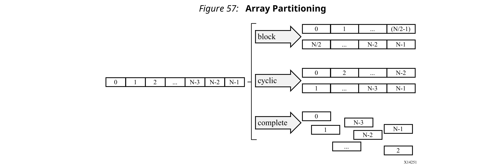

对于`block`和`cyclic`分区，`factor`选项指定所创建的数组数。在前面的图中，使用的`facotr`为2，即，将数组分为两个较小的数组。如果数组中的元素数不是该`factor`的整数倍，则最后一个数组中的元素比较少。

对多维数组进行分区时，`dimension`选项用于指定对哪个维度进行分区。下图显示了如何使用`dimension`选项来对以下示例代码分区：

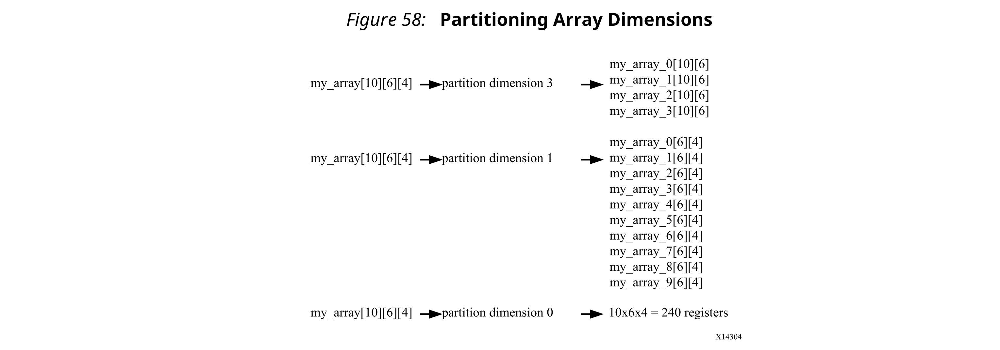

##### Automatic Array Partitioning
`config_array_partition`配置确定基于元素数量数组是如何自动分区的。可通过Solution →  Solution Settings  →  General  →  Add → config_array_partition来访问此配置。

可以调整阈值，并且可以通过`throughput_driven`的选项使分区完全自动化。选择`throughput_driven`选项后，Vivado HLS自动分区数组以达到指定的吞吐量。
#### Dependencies with Vivado HLS
Vivado HLS构造一个与C源代码相对应的硬件数据路径。

当没有流水线指令时，执行是顺序执行的，因此没有要考虑的依赖项。但是，当设计流水线化后，该工具需要处理与Vivado HLS生成的硬件的处理器体系结构中相同的依赖性。

数据相关性或内存相关性的**典型情况是在读取或写入之后又发生读取或写入**。

- `read-after-write`（RAW）也称为真依赖，是指**一条指令（及其读取/使用的数据）取决于上一个操作的结果**。
  - I1: t = a * b;
  - I2: c = t + 1;

  读入语句I2取决于语句I1中t的写入。如果对指令重新排序，则使用先前的t值。
- write-after-read（WAR），也称为反向依赖，是指一条指令在前一条指令读取数据之前无法更新寄存器或存储器（通过写操作）的情况。
  - I1: b = t + a;
  - I2: t = 3;

  写入语句I2不能在语句I1之前执行，否则b的结果无效。
- write-after-write（WAW）是一种依赖关系，必须以特定顺序写寄存器或存储器时，否则其他指令可能会损坏。
  - I1: t = a * b;
  - I2: c = t + 1;
  - I3: t = 1;

  写入语句I3必须在写入语句I1之后发生。否则，语句I2结果不正确。
- read-after-read没有依赖性，因为如果未将变量声明为volatile，则可以自由地对指令进行重新排序。反之，则必须保持指令的顺序。

例如，当生成流水线时，该工具需要注意，在以后阶段读取的寄存器或存储器未被先前的写入修改。这是一个真依赖，或者是（RAW）依赖关系。一个具体的例子是：
```c
int top(int a, int b) {
 int t,c;
I1: t = a * b;
I2: c = t + 1;
 return c;
}
```
由于对变量t有依赖性，因此无法在语句I1完成之前对语句I2进行求值。在硬件中，如果乘法需要3个时钟周期，则I2会延迟这么长时间。如果上述函数已流水线化，则VHLS会将其检测为真依赖，并相应地调度操作。它**使用数据转发优化来消除RAW依赖性**，因此该函数可以在II = 1下运行。

该示例不仅适用于变量时，还适用于数组。
```c
int top(int a) {
 int r=1,rnext,m,i,out;
 static int mem[256];
L1: for(i=0;i<=254;i++) {
#pragma HLS PIPELINE II=1
I1:     m = r * a; mem[i+1] = m;    // line 7
I2:     rnext = mem[i]; r = rnext; // line 8
 }
 return r;
}
```
在上面的示例中，循环L1的调度导致调度警告消息：
```c
WARNING: [SCHED 204-68] Unable to enforce a carried dependency constraint 
(II = 1, 
distance = 1)
 between 'store' operation (top.cpp:7) of variable 'm', top.cpp:7 on array 
'mem' and 
'load' operation ('rnext', top.cpp:8) on array 'mem'.
INFO: [SCHED 204-61] Pipelining result: Target II: 1, Final II: 2, Depth: 3.
```
当写一个索引然后读取另一个索引时，循环中的同一迭代没有问题。这两个指令可以同时执行。但是，请注意多次迭代过程的读写操作：
```
// Iteration for i=0
I1:     m = r * a; mem[1] = m;      // line 7
I2:     rnext = mem[0]; r = rnext; // line 8
// Iteration for i=1
I1:     m = r * a; mem[2] = m;      // line 7
I2:     rnext = mem[1]; r = rnext; // line 8
// Iteration for i=2
I1:     m = r * a; mem[3] = m;      // line 7
I2:     rnext = mem[2]; r = rnext; // line 8
```
当考虑两个连续的迭代时，语句I1的乘法结果m（延迟= 2）被写到一个位置，该位置由循环中下一个迭代的语句I2读取到rnext中。在这种情况下，存在RAW依赖性，因为下一个循环迭代无法在上一次计算的写操作完成之前开始读取mem [i]。(个人注：比如i=0时，I1中mem[1]=m，与 i=1时 rnext=mem[1]相互真依赖)

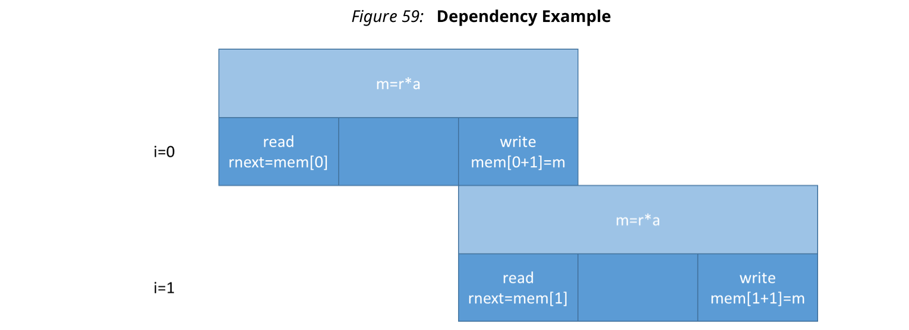

请注意，如果时钟频率增加，则乘法器需要更多的流水线阶段并增加延迟。这将迫使II也增加。

考虑下面的代码，其中的操作已被交换，从而改变了功能。
```c
int top(int a) {
 int r,m,i;
 static int mem[256];
L1: for(i=0;i<=254;i++) {
#pragma HLS PIPELINE II=1
I1:     r = mem[i];             // line 7
I2:     m = r * a , mem[i+1]=m; // line 8
 }
 return r;
}
```
调度警告为：
```
INFO: [SCHED 204-61] Pipelining loop 'L1'.
WARNING: [SCHED 204-68] Unable to enforce a carried dependency constraint 
(II = 1, 
distance = 1)
 between 'store' operation (top.cpp:8) of variable 'm', top.cpp:8 on array 
'mem' 
and 'load' operation ('r', top.cpp:7) on array 'mem'.
WARNING: [SCHED 204-68] Unable to enforce a carried dependency constraint 
(II = 2, 
distance = 1)
 between 'store' operation (top.cpp:8) of variable 'm', top.cpp:8 on array 
'mem' 
and 'load' operation ('r', top.cpp:7) on array 'mem'.
WARNING: [SCHED 204-68] Unable to enforce a carried dependency constraint 
(II = 3, 
distance = 1)
 between 'store' operation (top.cpp:8) of variable 'm', top.cpp:8 on array 
'mem' 
and 'load' operation ('r', top.cpp:7) on array 'mem'.
INFO: [SCHED 204-61] Pipelining result: Target II: 1, Final II: 4, Depth: 4.
```
在几个迭代过程中观察连续的读写操作：
```
Iteration with i=0
I1:     r = mem[0];           // line 7
I2:     m = r * a , mem[1]=m; // line 8
Iteration with i=1
I1:     r = mem[1];           // line 7
I2:     m = r * a , mem[2]=m; // line 8
Iteration with i=2
I1:     r = mem[2];           // line 7
I2:     m = r * a , mem[3]=m; // line 8
```
需要更长的II，因为通过从mem[i]读取r，执行乘法运算并写到mem[i + 1]形成RAW依赖。
#### Removing False Dependencies to Improve Loop Pipelining
假依赖是当编译器过于保守时出现的依赖关系。这些依赖关系在实际代码中不存在，但不能由编译器确定。这些依赖性可能会阻止循环流水化。

以下示例说明了假依赖。在此示例中，读和写是对同一循环迭代中的两个不同地址的访问。这两个地址均依赖于输入数据，并且可以指向`hist`数组的任何单个元素。因此，Vivado HLS假定这两个访问都可以访问相同的位置。结果，它以交替的周期调度对数组的读写操作，从而导致循环II为2。但是，代码显示`hist[old]`和`hist[val]`永远无法访问同一位置，因为它们位于条件`if(old == val)`的`else`分支中。

```c
void histogram(int in[INPUT SIZE], int hist[VALUE SIZE]) f
  int acc = 0;
  int i, val;
  int old = in[0];
  for(i = 0; i < INPUT SIZE; i++) 
  {
    #pragma HLS PIPELINE II=1
    val = in[i];
    if(old == val) 
    {
        acc = acc + 1;
    } 
    else 
    {
        hist[old] = acc;
        acc = hist[val] + 1;
    }
    old = val;
  }
   
  hist[old] = acc;
```
要克服此缺陷，可以使用`DEPENDENCE`指令为Vivado HLS提供有关依赖项的其他信息。
```c
void histogram(int in[INPUT SIZE], int hist[VALUE SIZE]) {
  int acc = 0;
  int i, val;
  int old = in[0];
  #pragma HLS DEPENDENCE variable=hist intra RAW false
  for(i = 0; i < INPUT SIZE; i++) 
  {
    #pragma HLS PIPELINE II=1
    val = in[i];
    if(old == val) 
    {
        acc = acc + 1;
    } 
    else 
    {
        hist[old] = acc;
        acc = hist[val] + 1;
    }
    
    old = val;
  }
   
  hist[old] = acc;
```
:star: 注意：如果指定的是`FALSE`依赖关系，而实际上不是`FALSE`，则可能会导致硬件错误。在指定依赖项之前，请确保它们是正确的（TRUE或FALSE）。

指定依赖项时，有两种主要类型：
- Inter：指定依赖在**同一循环**的**不同迭代之间**。

  如果将其指定为`FALSE`，则在流水线化、全部展开、部分展开时允许Vivado HLS并行执行操作，并在指定为`TRUE`时阻止此类并发操作。
- Intra：在同一循环的同一迭代中指定依赖关系，例如，在同一迭代的开始和结束处访问数组。

  当内部依赖关系指定为`FALSE`时，Vivado HLS可以在循环内自由移动操作，从而增加其移动性并有可能改善性能或面积。当相关性指定为`TRUE`时，必须按指定的顺序执行操作。

#### Scalar Dependencies
一些标量依赖关系很难解析，并且常常需要更改源代码。标量数据依赖关系可能如下所示：
```c
while (a != b) {
   if (a > b) a -= b;
   else b -= a;  
 }
```
直到当前的迭代计算出更新后的a和b的值后，该循环的下一个迭代才能开始，如下图所示。


如果必须先获得上一个循环迭代的结果，然后才能开始当前的迭代，则无法进行循环流水线处理。如果Vivado HLS无法以指定的启动间隔进行流水线处理，则会增加启动间隔。如上例所示，如果它根本无法进行流水线处理，则它将停止流水线处理并继续输出非流水线设计。
#### Optimal Loop Unrolling to Improve Pipelining
默认情况下，循环在Vivado HLS中保持rolled状态。这些rolled循环生成硬件资源，循环的每个迭代都使用该硬件资源。尽管这创建了资源有效的块，但它可能会成为性能瓶颈。

Vivado HLS提供使用UNROLL指令展开或部分展开for循环的功能。

下面的图显示了循环展开的优点以及展开循环时必须考虑的隐含意义。此示例假定数组a[i]，b[i]和c[i]映射到Block RAM。这个例子展示了通过简单的循环展开来创建许多不同的实现是多么容易。

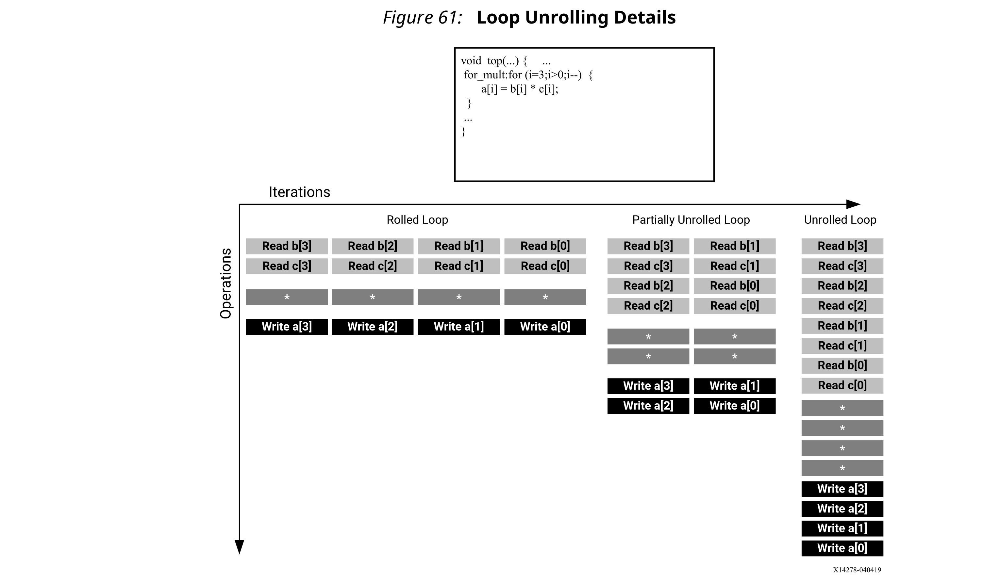

- Rolled Loop: 当循环是rolled时，每次迭代都在单独的时钟周期中执行。此实现需要四个时钟周期，只需要一个乘法器，每个Block RAM可以是一个单端口Block RAM。
- Partially Unrolled Loop：在此示例中，循环部分展开系数为2。此实现需要两个乘法器和两个双端口RAM，以支持在同一时钟周期内对每个RAM进行两次读取或写入。但是，此实现只需要2个时钟周期即可完成：是rolled循环版本启动间隔和延迟的一半。
- Unrolled loop：在完全展开的版本中，所有循环操作都可以在单个时钟周期内执行。但是，此实现需要四个乘法器。更重要的是，这种实现要求能够在同一时钟周期内执行4次读取和4次写入操作。由于Block RAM最多只有两个端口，因此此实现要求将数组分区。

要执行循环展开，可以将`UNROLL`指令应用于设计中的独立循环。另外，您可以将UNROLL指令应用于某个函数，这将展开该函数范围内的所有loop。

如果完全展开了循环，则在数据相关性和资源允许的情况下，所有操作将并行执行。如果循环的一个迭代中的操作需要上一个迭代的结果，则它们不能并行执行，但只要有数据就将立即执行。完全展开和完全优化的循环通常会在循环主体中包含多个逻辑副本。

下面的示例代码演示了如何使用循环展开来创建优化的设计。在此示例中，数据作为交错通道存储在数组中。如果循环流水化以及II = 1，则每个通道每隔8个时钟周期读取和写入一次。
```c
// Array Order :  0  1  2  3  4  5  6  7  8     9     10    etc. 16       
etc...
// Sample Order:  A0 B0 C0 D0 E0 F0 G0 H0 A1    B1    C2    etc. A2       
etc...
// Output Order:  A0 B0 C0 D0 E0 F0 G0 H0 A0+A1 B0+B1 C0+C2 etc. A0+A1+A2 
etc...
#define CHANNELS 8
#define SAMPLES  400
#define N CHANNELS * SAMPLES
void foo (dout_t d_out[N], din_t d_in[N]) {
 int i, rem;
  // Store accumulated data
 static dacc_t acc[CHANNELS];
 // Accumulate each channel
 For_Loop: for (i=0;i<N;i++) {
  rem=i%CHANNELS;
  acc[rem] = acc[rem] + d_in[i];
  d_out[i] = acc[rem];
 }
}
```
将循环部分展开系数设为8，将允许并行处理每个通道（每8个样本）（如果输入和输出数组也以cyclic方式进行分区，以允许每个时钟周期进行多次访问）。如果还通过 `rewind`选项对循环进行流水线处理，则该设计将以流水线方式（即在顶部或数据流区域内）连续并行处理所有8个通道。
```c
void foo (dout_t d_out[N], din_t d_in[N]) {
#pragma HLS ARRAY_PARTITION variable=d_i cyclic factor=8 dim=1 partition
#pragma HLS ARRAY_PARTITION variable=d_o cyclic factor=8 dim=1 partition
 int i, rem;
  // Store accumulated data
 static dacc_t acc[CHANNELS];
 // Accumulate each channel
 For_Loop: for (i=0;i<N;i++) {
#pragma HLS PIPELINE rewind
#pragma HLS UNROLL factor=8
  rem=i%CHANNELS;
  acc[rem] = acc[rem] + d_in[i];
  d_out[i] = acc[rem];
 }
}
```
部分循环展开不需要展开因子是最大迭代次数的整数倍。Vivado HLS添加了退出检查，以确保部分展开的循环在功能上与原始循环完全相同。例如，给出以下代码：
```c
for(int i = 0; i < N; i++) {
  a[i] = b[i] + c[i];
}
```
循环展开系数为2，可以有效地将代码转换为以下示例，其中使用break构造以确保功能保持不变
```c
for(int i = 0; i < N; i += 2) {
  a[i] = b[i] + c[i];
  if (i+1 >= N) break;
  a[i+1] = b[i+1] + c[i+1];
}
```
由于N是变量，因此Vivado HLS可能无法确定其最大值（可以从输入端口驱动）。如果展开因子（在这种情况下为2）是最大迭代次数N的整数因子，则`skip_exit_check`选项将删除退出检查和相关的逻辑。展开效果现在可以表示为：
```c
for(int i = 0; i < N; i += 2) {
  a[i] = b[i] + c[i];
  a[i+1] = b[i+1] + c[i+1];
}
```
这有助于最小化面积并简化控制逻辑。

#### Exploiting Task Level Parallelism: Dataflow Optimization
数据流优化对一系列顺序任务（例如，函数和/或循环）很有用，如下图所示。

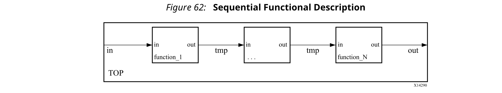

上面的图显示了一个由三个任务组成的任务链的特定情况，但是通信结构可能比所示的更为复杂。

使用这一系列顺序任务，数据流优化将创建并发流程的体系结构，如下所示。数据流优化是一种提高设计吞吐量和延迟的强大方法。


下图显示了数据流优化如何使任务的执行重叠，从而提高了设计的整体吞吐量并减少了延迟。

在下面的图和示例中，（A）表示没有数据流优化的情况。在func_A可以处理新输入之前，实现需要8个周期；并且输出由func_C写出之前需要8个周期。

对于同一示例，（B）表示应用数据流优化的情况。现在，func_A可以每3个时钟周期（较低的启动间隔）开始处理一个新的输入，另外只需要5个时钟即可输出一个最终值（较短的等待时间）。

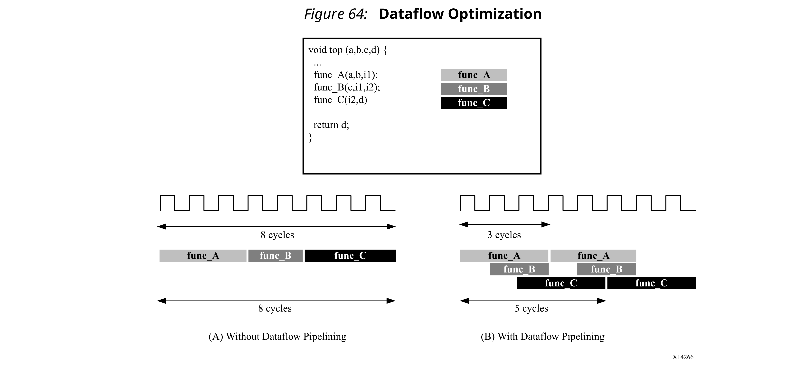

如果不增加硬件开销，就无法实现这种并行性。当特定区域（例如函数体或循环体）被识别为要应用数据流优化的区域时，Vivado HLS会分析函数体或循环体，并创建对数据流进行建模的单个通道将每个任务的结果存储在数据流区域中。这些通道可以是**用于标量变量的简单FIFO**，也可以是用于数组等非标量变量的**乒乓（PIPO）缓冲**。这些通道中的每个通道还包含用于指示FIFO或乒乓缓冲何时已满或为空的信号。这些信号表示完全由数据驱动的握手接口。通过具有单独的FIFO和/或乒乓缓冲，Vivado HLS释放了每个任务以其自己的步调执行，并且吞吐量仅受输入和输出缓冲的可用性限制。与普通的流水线实现相比，这可以更好地执行任务交互，但这样做的**代价是为乒乓缓冲区增加了额外的FIFO或Block RAM寄存器**。上图说明了在下图中针对同一示例的数据流区域实现的结构。


与静态流水线解决方案相比，数据流优化可以有效地提高性能。它使用FIFO和/或乒乓缓冲，以更加灵活和分布式的握手体系结构代替了严格的、容易停顿的集中控制流水线。数据流优化不限于一系列过程，而是可以在任何DAG结构上使用。它可以产生两种不同的重叠形式：在迭代过程中过程通过FIFO连接在一起，以及使用PIPO和FIFO跨越不同的迭代过程。

##### Canonical Forms
Vivado HLS变换区域以应用DATAFLOW优化。赛灵思建议使用规范形式在该区域（称为规范区域）中编写代码。数据流优化有两种主要的规范形式： 
1. 未内联函数的函数的规范形式。
  ```c
  void dataflow(Input0, Input1, Output0, Output1) 
  {
  #pragma HLS dataflow
  UserDataType C0, C1, C2;
  func1(read Input0, read Input1, write C0, write C1);
  func2(read C0, read C1, write C2);
  func3(read C2, write Output0, write Output1);
  }
  ```
2. 循环体内的数据流。
   
   对于for循环（其中没有内联任何函数），完整的循环变量应具有： 
   - 在循环标题中声明的初始值，并将其设置为0。
   - 循环条件是一个正const或const函数参数。
   - 递增1。
   - `Dataflow`编译指示必须位于循环内部。
  
    ```c
    void dataflow(Input0, Input1, Output0, Output1) 
    {
      for (int i = 0; i < N; i++) 
      {
      #pragma HLS dataflow
        UserDataType C0, C1, C2;
        func1(read Input0, read Input1, write C0, write C1);
        func2(read C0, read C0, read C1, write C2);
        func3(read C2, write Output0, write Output1);
      }
    }
    ```
##### Canonical Body
在规范区域内，规范实体应遵循以下准则：
1. 使用局部非静态标量或数组/指针变量，或局部静态流变量。在函数体内部（对于函数中的数据流）或循环体（对于循环内部的数据流）声明局部变量。
2. 在以下条件下，将数据在函数序列上向前传递（无反馈），从一个函数传递到一个晚些的调用：
   - 变量（标量除外）只能具有一个读取过程和一个写入过程。
   - 如果您正在使用局部变量，则使用先写后读（生产者先于消费者），这些局部变量之后成为通道。
   - 如果你在使用函数参数，先读后写（消费者先于生产者）。设计必须保留任何intra-body Anti-依赖。
   - 返回类型的函数必须为void。
   - 不同进程之间没有通过变量产生的loop-carried依赖关系。

##### Dataflow Checking
Vivado HLS具有数据流检查器，启用该功能后，将检查代码以查看其是否为建议的规范形式。否则，它将向用户发出错误/警告消息。默认情况下，此检查器设置为`warning`。您可以通过在`config_dataflow` TCL命令的`strict`模式下选择`off`来禁用它，或将检查器设置为`error`：
```
config_dataflow -strict_mode  (off | error | warning)
```
##### Dataflow Optimization Limitations
`DATAFLOW`优化可优化任务（功能和循环）之间的数据流，理想情况下可流水线化函数和循环以实现最佳性能。不需要将这些任务一个接一个地链接在一起，但是在数据传输方式上存在一些限制。

以下行为可能阻止或限制Vivado® HLS使用`DATAFLOW`优化为执行的重叠：
- Single-producer-consumer violations
- Bypassing tasks
- Feedback between tasks
- Conditional execution of tasks
- Loops with multiple exit conditions
***
:star: 重要！如果存在任何这些编码样式，则Vivado HLS会发出一条消息，描述情况。
***

:star: 注意：当应用`DATAFLOW`指令时，可以使用“分析”视图中的数据流查看器来查看结构。

**Single-producer-consumer Violations**

为了使Vivado HLS执行`DATAFLOW`优化，在任务之间传递的所有元素必须遵循`Single-producer-consumer`模型。每个变量必须从单个任务驱动，并且只能由单个任务使用。在下面的代码示例中，`temp1`扇出并被`Loop2`和`Loop3`占用。这违反了`Single-producer-consumer`模型。
```c
void foo(int data_in[N], int scale, int data_out1[N], int data_out2[N]) {
  int temp1[N]; 
  Loop1: for(int i = 0; i < N; i++) {
    temp1[i] = data_in[i] * scale;
  }
  Loop2: for(int j = 0; j < N; j++) {
    data_out1[j] = temp1[j] * 123;
  }
  Loop3: for(int k = 0; k < N; k++) {
    data_out2[k] = temp1[k] * 456;
  }
}
```
此代码的修改版本使用`Split`来创建`Single-producer-consumer`设计。在这种情况下，数据从`Loop1`流向函数`Split`，然后流向`Loop2`和`Loop3`。现在，数据在所有四个任务之间流动，并且Vivado HLS可以执行`DATAFLOW`优化。
```c
void Split (in[N], out1[N], out2[N]) {
// Duplicated data
 L1:for(int i=1;i<N;i++) { //这里难道不是从i=0开始吗？
  out1[i] = in[i];  // 同样也是一个生产者，两个消费者啊？不明白。难道是以任务分块说明的吗？
  out2[i] = in[i];     
 }
}
void foo(int data_in[N], int scale, int data_out1[N], int data_out2[N]) {
 int temp1[N], temp2[N]. temp3[N]; 
 Loop1: for(int i = 0; i < N; i++) {
  temp1[i] = data_in[i] * scale;
 }
 Split(temp1, temp2, temp3);
 Loop2: for(int j = 0; j < N; j++) {
  data_out1[j] = temp2[j] * 123;
 }
 Loop3: for(int k = 0; k < N; k++) {
  data_out2[k] = temp3[k] * 456;
 }
}
```

**Bypassing Tasks**

此外，数据通常应从一项任务流向另一项任务。如果绕过任务，这会降低`DATAFLOW`优化的性能。在以下示例中，`Loop1`生成`temp1`和`temp2`的值。但是，下一个任务`Loop2`仅使用`temp1`的值。直到`Loop2`之后才使用`temp2`的值。因此，`temp2`将绕过序列中的下一个任务，这可能会限制`DATAFLOW`优化的性能。

```c
void foo(int data_in[N], int scale, int data_out1[N], int data_out2[N]) {
 int temp1[N], temp2[N]. temp3[N]; 
 Loop1: for(int i = 0; i < N; i++) {
  temp1[i] = data_in[i] * scale;
  temp2[i] = data_in[i] >> scale;
 }
 Loop2: for(int j = 0; j < N; j++) {
  temp3[j] = temp1[j] + 123;
 }
 Loop3: for(int k = 0; k < N; k++) {
  data_out[k] = temp2[k] + temp3[k];
 }
}
```

因为此示例中的循环迭代限制都相同，所以可以修改代码，以使`Loop2`消耗`temp2`并生成`temp4`，如下所示。这样可以确保数据从一个任务流向下一个任务。

```c
void foo(int data_in[N], int scale, int data_out1[N], int data_out2[N]) {
 int temp1[N], temp2[N]. temp3[N], temp4[N]; 
 Loop1: for(int i = 0; i < N; i++) {
  temp1[i] = data_in[i] * scale;
  temp2[i] = data_in[i] >> scale;
 }
 Loop2: for(int j = 0; j < N; j++) {
  temp3[j] = temp1[j] + 123;
  temp4[j] = temp2[j];
 }
 Loop3: for(int k = 0; k < N; k++) {
  data_out[k] = temp4[k] + temp3[k];
 }
}
```

**Feedback Between Tasks**

当任务的输出被`DATAFLOW`区域中的先前任务占用时，就会发生反馈(Feedback)。在`DATAFLOW`区域中不允许任务之间的反馈。当Vivado HLS检测到反馈时，它会根据情况发出警告，并且可能不会执行`DATAFLOW`优化。

**Conditional Execution of Tasks**

`DATAFLOW`优化不优化有条件执行的任务。下面的示例突出了这一限制。在此示例中，`Loop1`和`Loop2`的有条件执行阻止了Vivado HLS优化这些循环之间的数据流，因为数据没有从一个循环流到下一个循环。
```c
void foo(int data_in1[N], int data_out[N], int sel) {
 int temp1[N], temp2[N];
 if (sel) {
 Loop1: for(int i = 0; i < N; i++) {
  temp1[i] = data_in[i] * 123;
  temp2[i] = data_in[i];
 }
 } else {
 Loop2: for(int j = 0; j < N; j++) {
  temp1[j] = data_in[j] * 321;
  temp2[j] = data_in[j];
 }
 }
 Loop3: for(int k = 0; k < N; k++) {
  data_out[k] = temp1[k] * temp2[k];
 }
}
```
为了确保在所有情况下都执行每个循环，您必须转换代码，如以下示例所示。在此示例中，条件语句被移入第一个循环。这两个循环始终执行，并且数据始终从一个循环流向下一个循环。
```c
void foo(int data_in[N], int data_out[N], int sel) {
 int temp1[N], temp2[N];
 Loop1: for(int i = 0; i < N; i++) {
  if (sel) {
    temp1[i] = data_in[i] * 123;
  } else {
    temp1[i] = data_in[i] * 321;
  }
  }
  Loop2: for(int j = 0; j < N; j++) {
    temp2[j] = data_in[j];
  }
  Loop3: for(int k = 0; k < N; k++) {
    data_out[k] = temp1[k] * temp2[k];
  }
}
```

**Loops with Multiple Exit Conditions**

具有多个出口点的循环不能在`DATAFLOW`区域中使用。在以下示例中，Loop2具有三个退出条件：
- An exit defined by the value of N; the loop will exit when k>=N.
- An exit defined by the break statement.
- An exit defined by the continue statement.

  ```c
  #include "ap_cint.h"
  #define N 16
  typedef int8 din_t;
  typedef int15 dout_t;
  typedef uint8 dsc_t;
  typedef uint1 dsel_t;
  void multi_exit(din_t data_in[N], dsc_t scale, dsel_t select, dout_t 
  data_out[N]) {
  dout_t temp1[N], temp2[N];
  int i,k;
  Loop1: for(i = 0; i < N; i++) {
    temp1[i] = data_in[i] * scale;
    temp2[i] = data_in[i] >> scale;
  }
  Loop2: for(k = 0; k < N; k++) {
    switch(select) {
      case  0: data_out[k] = temp1[k] + temp2[k];
      case  1: continue;
      default: break;
    }
  }
  }
  ```
  因为在数据流区域使用上总是通过循环边界定义，利用`break`或者`continue`语句将阻止该循环在`DATAFLOW`区域内使用。

  最后，`DATAFLOW`优化没有分层实现。如果子函数或循环包含可能受益于`DATAFLOW`优化的附加任务，则必须将`DATAFLOW`优化应用于循环，子函数或内联该子函数。

:star: 注意：`std::complex`不能在`DATAFLOW`区域内直接使用。应将它们定义为自然数据类型并在producer内部进行类型转换。
```c
#dataflow 
float A[N][2]; 
prod(A, in); 
cons(out,A); 
Producer(std::complex &) 
{ 
}
```

##### Configuring Dataflow Memory Channels
Vivado HLS根据数据生产者和使用者的访问方式，以乒乓或FIFO缓冲方式在任务之间实现通道：
- 对于标量，指针和引用参数，Vivado HLS将通道实现为FIFO。
- 如果参数（生产者或消费者）是数组，则Vivado HLS将该通道实现为乒乓缓冲或FIFO，如下所示：
  - 如果Vivado HLS确定**按顺序访问数据**，则Vivado HLS将存储通道实现为**深度为2的FIFO通道**。
  - 如果Vivado HLS无法确定按顺序访问数据或确定以任意方式访问数据，则Vivado HLS将存储通道实现为乒乓缓冲，即每个块有两个Block RAM。由使用者或生产者数组的最大大小确定。

  :star: 注意：乒乓缓冲可确保通道始终具有容纳所有样本的能力而不会造成丢失。但是，在某些情况下，这可能是一种过于保守的方法。

要明确指定任务之间使用的默认通道，请使用`config_dataflow`配置。此配置为设计中的所有通道设置默认通道。为了减小通道中使用的内存大小并允许迭代内重叠，可以使用`FIFO`。要在`FIFO`中显式设置深度（即元素数），请使用`-fifo_depth`选项。

指定`FIFO`通道的大小将覆盖默认方法。如果设计中的任何任务可以以大于`FIFO`指定大小的速率产生或消耗样本，则`FIFO`可能会变空（或已满）。在这种情况下，设计由于无法读取（或写入）而停止操作。这可导致一个停滞的死锁状态。

:star: 注意：如果创建了死锁情况，则只有在执行C/RTL协同仿真或在整个系统中使用该块时，您才会看到此情况。

设置`FIFO`的深度时，Xilinx建议首先将深度设置为所传输的最大数据值（例如，任务之间传递的数组的大小），确认设计通过C/RTL协同仿真，然后减小`FIFO`的大小，并确认C/RTL协同仿真可以毫无问题地完成。如果RTL协同仿真失败，则`FIFO`的大小可能太小而无法阻止停顿或死锁情况。
##### Specifying Arrays as Ping-Pong Buffers or FIFOs
默认情况下，所有数组都实现为乒乓缓冲以使能随机访问。如果需要，还可以调整这些缓冲层的大小。例如，在某些情况下，例如绕过任务时，性能可能会下降。为了减轻对性能的影响，可以通过使用以下`STREAM`指令来增加这些缓冲器的尺寸，从而为生产者和消费者提供更多的余地。
```c
void top ( ... ) {
#pragma HLS dataflow
  int A[1024];
#pragma HLS stream off variable=A depth=3
 
  producer(A, B, …);  // producer writes A and B
  middle(B, C, ...);  // middle reads B and writes C
  consumer(A, C, …);  // consumer reads A and C   
```
在接口中，如果顶层函数接口上的数组设置为`ap_fifo`，`axis`或`ap_hs`接口类型，则将**数组自动指定为streaming**。

在设计内部，如果需要实现`FIFO`，则必须使用`STREAM`指令将所有数组指定为streaming传输。

:star: 注意：将`STREAM`指令应用于数组时，**在硬件中实现的`FIFO`包含与数组一样多的元素**。`-depth`选项可用于指定`FIFO`的大小。

`STREAM`指令还**用于更改`config_dataflow`配置**所指定的默认实现的`DATAFLOW`区域中的任何数组。

- 如果将`config_dataflow default_channel`设置为乒乓缓冲，则可以通过将`STREAM`指令应用于数组将数组实现为FIFO。

  :star: 注意：要使用FIFO实现，必须以streaming方式访问数组。
- 如果将`config_dataflow default_channel`设置为`FIFO`或Vivado HLS已自动确定以streaming方式访问`DATAFLOW`区域中的数据，则可以通过将`STREAM`指令和`-off`选项应用于数组将其实现为乒乓。 
  
:star: 重要！为了保留访问，可能有必要通过使用`volatile`限定符来防止编译器优化（特别是消除死代码）。

当将`DATAFLOW`区域中的数组指定为streaming并实现为`FIFO`时，通常不需要`FIFO`保留与原始数组相同数量的元素。`DATAFLOW`区域中的任务会在每个数据样本可用时立即消耗它们。具有`-fifo_depth`选项的`config_dataflow`命令或具有`-depth`的`STREAM`指令可用于将`FIFO`的大小设置为所需的最小元素数，以确保数据流永不停止。如果选择了`-off`选项，则`-off`选项设置乒乓的深度（块数）。深度至少应为2。

##### Specifying Compiler-FIFO Depth

**Start Propagation**

编译器可能会自动创建一个`stard FIFO`，以将`start token`传播到内部进程。此类`FIFOs`可能会成为性能的瓶颈，在这种情况下，您可以使用以下命令来增加默认大小（固定为2）：
```
config_dataflow -start_fifo_depth <value>
```

如果需要在生产者和消费者之间的留有余地，并且内部流程可以由其输入或输出（FIFO或PIPO）驱动以永久、完整、安全地运行，则对于给定的数据流使用pragma，可以从本地删除这些`start FIFO`，风险由用户承担：
```
#pragma HLS DATAFLOW disable_start_propagation
```
**Scalar Propagation**

编译器通过进程之间的`scalar FIFO`自动传播C/C++代码中的某些标量。此类FIFO有时可能会降低性能，或导致死锁，在这种情况下，您可以使用以下命令设置大小（默认值设置为`-fifo_depth`）：
```
config_dataflow -scalar_fifo_depth <value>
```
##### Stable Arrays

`stable pragma`指示可用于标记数据流区域的输入或输出变量。假设用户保证此删除确实是正确的，则其效果是**删除其相应的同步**。
```c
void dataflow_region(int A[...], ...
#pragma HLS stable variable=A
#pragma HLS dataflow
    proc1(...);
    proc2(A, ...);
```
如果没有`stable pragma`指示，并且假定`proc2`读取了`A`，则`proc2`将成为其所在数据流区域的初始同步（通过ap_start）的一部分。这意味着`proc1`在`proc2`也准备好再次启动之前不会重新启动，这将防止数据流迭代重叠并可能导致性能损失。`stable pragma`指示该同步对于保持正确性不是必需的。

在前面的示例中，如果没有`stable pragma`指示，并且假定`proc2`绕过任务时读取了`A`，则将导致性能下降。

使用`stable pragma`指示，编译器假定：
- 如果`proc2`读取了`A`，则在执行`dataflow_region`时，任何其他进程或调用上下文都不会覆盖读取的内存位置。
- 如果`A`被`proc2`写入，则在执行`dataflow_region`时，在任何其他进程或调用上下文定义它们之前，不会读取存储位置的写入。

典型的情况是，仅当数据流区域尚未启动或已完成执行时，调用方才更新或读取这些变量。

##### Using ap_ctrl_none Inside the Dataflow
`ap_ctrl_none`块级I/O协议避免了`ap_ctrl_hs`和`ap_ctrl_chain`协议所隐含的严格同步方案。这些协议要求该区域中的所有进程都执行完全相同的次数，以便更好地匹配C行为。

但是，在某些情况下，例如，**其目的是要有一个更快的流程，该流程执行得更频繁，以将工作分配给几个较慢的流程**。

对于任何数据流区域（“dataflow-in-loop”除外），可以指定
```
#pragma HLS interface ap_ctrl_none port=return
```
只要满足以下所有条件：
- 区域及其包含的所有进程仅通过FIFOs（hls::stream，流式数组，AXIS）进行通信；也就是说，不包括memory。
- 该区域的所有父级，直到顶层设计，都必须满足以下要求：
  - 它们必须是数据流区域（“dataflow-in-loop”除外）。
  - 它们都必须指定ap_ctrl_none。

这意味着层次结构中具有ap_ctrl_none的数据流区域的父级不能为：
- A sequential or pipelined FSM
- A dataflow region inside a for loop ("dataflow-in-loop")

这种pragma的结果是`ap_ctrl_chain`不用于同步该区域内的任何进程。根据输入`FIFO`中数据的可用性和输出`FIFO`中的空间来执行或暂停它们。例如：
```c
void region(...) {
#pragma HLS dataflow
#pragma HLS interface ap_ctrl_none port=return
    hls::stream<int> outStream1, outStream2;
    demux(inStream, outStream1, outStream2);
    worker1(outStream1, ...);
    worker2(outStream2, ....);
```
在此示例中，执行`demux`的频率是`worker1`和`worker2`的两倍。例如，它可以具有II = 1，而`worker1`和`worker2`可以具有II = 2，并且可以实现全局II = 1行为。

:star: 注意：
- 在不经常执行的进程中可能需要非常仔细地使用非阻塞读，以确保C仿真工作。
- pragma应用于region，而不应用于region中的各个过程。
- 必须在协同仿真中禁用死锁检测。这可以通过cosim_design中的`-disable_deadlock_detection`选项启用。

### Optimizing for Latency
#### Using Latency Constraints
Vivado HLS支持在任何作用域上使用延迟约束。延迟约束是使用`LATENCY`指令指定的。

当将最大和/或最小延迟约束置于作用域上时，Vivado HLS会尝试确保函数中的所有操作在指定的时钟周期范围内完成。

应用于循环的延迟指令指定了循环的单个迭代所需的延迟时间：它指定了循环主体的延迟时间，如以下示例所示：
```c
Loop_A: for (i=0; i<N; i++) { 
#pragma HLS latency max=10
  ..Loop Body...  
}
```
如果要限制所有循环迭代的总延迟，则应将延迟指令应用于包含整个循环的作用域，如本例所示：
```c
Region_All_Loop_A: {
#pragma HLS latency max=10
Loop_A: for (i=0; i<N; i++) 
  { 
  ..Loop Body... 
  }
}
```
在这种情况下，即使展开循环，延迟指令也会在所有循环操作上设置最大限制。

如果Vivado HLS不能满足最大延迟约束，它会放宽延迟约束，并试图获得最好的结果。

如果设置了最小延迟限制，并且Vivado HLS可以以比所需的最小延迟低的延迟生成设计，则它将插入dummy时钟周期以满足最小延迟。

#### Merging Sequential Loops to Reduce Latency
所有rolled循环都暗示并在设计FSM中创建至少一个状态。当存在多个顺序循环时，它可能会创建其他不必要的时钟周期，并阻止进一步的优化。

下面的图显示了一个简单的示例，其中看似直观的编码样式对RTL设计的性能产生了负面影响。

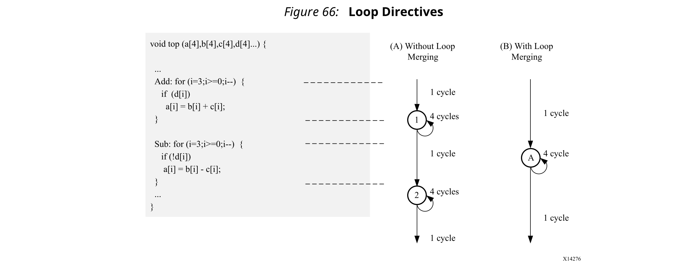

在上图中，（A）显示了默认情况下设计中的每个rolled循环如何在FSM中创建至少一个状态。在这些状态之间移动需要花费时钟周期：假设每个循环迭代需要一个时钟周期，则执行两个循环总共需要11个周期：
- 1 clock cycle to enter the ADD loop.
- 4 clock cycles to execute the add loop.
- 1 clock cycle to exit ADD and enter SUB.
- 4 clock cycles to execute the SUB loop.
- 1 clock cycle to exit the SUB loop.
- For a total of 11 clock cycles.

在这个简单的示例中，很明显，在ADD循环中的else分支也可以解决该问题，但是在更复杂的示例中，它可能不那么明显，而更直观的编码样式可能具有更大的优势。

`LOOP_MERGE`优化指令用于自动执行合并循环。`LOOP_MERGE`指令将寻求合并在所放置范围内的所有循环。在上面的示例中，合并循环将创建一个与之前图中（B）所示类似的控制结构，只需6个时钟即可完成。

合并循环允许一起优化循环内的逻辑。在上面的示例中，使用双端口Block RAM允许并行执行操作的加法和减法。

当前，Vivado HLS中的循环合并具有以下限制： 
- 如果循环边界都是变量，则它们必须具有相同的值。
- 如果循环边界是常数，则将最大常数用作合并循环的边界。
- 不能合并具有变量边界和常数边界的循环。
- 要合并的循环之间的代码不能有副作用：此代码的多次执行应产生相同的结果（允许a = b，不允许a = a + 1）。
- 当循环包含FIFO访问时，不能将其合并：合并将改变对FIFO的读写顺序：这些循环必须始终按顺序进行。

#### Flattening Nested Loops to Improve Latency
与前面讨论的连续循环相似，它需要额外的时钟周期才能在rolled嵌套循环之间移动。从一个外部循环到一个内部循环​​，从一个内部循环到一个外部循环，各需要一个时钟周期。

在此处显示的小示例中，这意味着需要执行200个额外的时钟周期才能执行循环`Outer`。
```c
void foo_top { a, b, c, d} {
 ...
 Outer: while(j<100)
  Inner: while(i<6) // 1 cycle to enter inner
  ...
  LOOP_BODY
  ...
  } // 1 cycle to exit inner
 }
 ...
}
```
Vivado HLS提供了`set_directive_loop_flatten`命令，可以对标记的perface和semiperfect嵌套循环进行展开，从而无需重新编码以实现最佳硬件性能，并减少了执行循环操作所需的周期数。
- perfect循环嵌套：只有最内部的循环才具有循环主体内容，在循环语句之间没有指定逻辑，并且所有循环边界都是常数。
- semi-perfect循环嵌套：仅最内部的循环具有循环主体内容，在循环语句之间没有指定逻辑，但是最外部的循环边界是变量。

对于imperfect循环嵌套，其中内部循环具有变量范围，或者循环主体不仅仅位于内部循环内部，设计人员应尝试重组代码，或在循环主体中展开循环以创建perfect循环嵌套。

将指令应用于一组嵌套循环时，应将其应用于包含循环主体的最内部循环。
```c
set_directive_loop_flatten top/Inner
```
也可以使用GUI中的“directive”选项卡来执行循环展开，方法是将其应用于各个循环，或者将其应用于函数中的所有循环，方法是将指令应用于函数级。
### Optimizing for Area
#### Data Types and Bit-Widths
C函数中变量的位宽直接影响RTL实现中使用的存储元素和运算符的大小。如果变量仅需要12位，但被指定为整数类型（32位），则将导致使用更大，更慢的32位运算符，从而减少了可在一个时钟周期内执行的操作数，并且可能会增加启动间隔和延迟时间。
- 对数据类型使用适当的精度。
- 确定要实现为RAM或寄存器的任何数组的大小。任何超大元素的面积影响都会浪费硬件资源。
- 要特别注意乘法，除法，模或其他复杂的算术运算。如果这些变量大于所需的变量，则它们会对面积和性能产生负面影响。
#### Function Inlining
内联函数将删除函数层级。可使用`INLINE`指令内联函数。通过允许与调用函数中的逻辑更好地共享或优化函数中的组件，内联函数可以改善面积。Vivado HLS也可以自动执行这种内联函数。小函数自动内联。

内联允许更好地控制函数共享。要共享函数，必须在同一层次结构中使用它们。在此代码示例中，foo_top调用两次foo和foo_sub。
```c
foo_sub (p, q) {
 int q1 = q + 10;
 foo(p1,q); // foo_3
 ...
}
void foo_top { a, b, c, d} {
 ...
 foo(a,b); //foo_1
 foo(a,c); //foo_2
 foo_sub(a,d);
 ...
}
```
内联函数foo_sub和使用`ALLOCATION`指令指定foo仅有1个实例，导致设计在foo上仅具有一个实例：上面示例面积的三分之一。
```c
foo_sub (p, q) {
#pragma HLS INLINE
 int q1 = q + 10;
 foo(p1,q); // foo_3
 ...
}
void foo_top { a, b, c, d} {
#pragma HLS ALLOCATION instances=foo limit=1 function
 ...
 foo(a,b); //foo_1
 foo(a,c); //foo_2
 foo_sub(a,d);
 ...
}
```
`INLINE`指令允许通过使用`recursive`选项来递归内联指定函数以下的所有函数。如果在顶层函数上使用了`recursive`选项，则将删除设计中所有函数层级。

可以将`INLINE` `off` 选项应用到函数，以防止它们被内联。此选项可用于防止Vivado HLS自动内联函数。

`INLINE`指令是一种在不实际对源代码进行任何修改的情况下，实质上修改代码结构的强大方法，并且为架构探索提供了一种非常强大的方法。
#### Mapping Many Arrays into One Large Array
当C代码中有许多小数组时，将它们映射到一个较大的数组通常会减少所需的Block RAM数量。

当设备支持时，每个数组都映射到一个Block RAM或UltraRAM。FPGA中提供的基本Block RAM单元为18K。如果许多小型数组未使用完整的18K，则一个更好地利用Block RAM资源的方法时将许多小型数组映射为较大的数组。如果Block RAM大于18K，则会自动将其映射为多个18K单元。在综合报告中，查看Utilization Report > Details > Memory，以全面了解设计中的Block RAM。

`ARRAY_MAP`指令支持两种方式将小数组映射为大数组：
- 水平映射：这对应于通过连接原始数组来创建新数组。从物理上讲，这被实现为具有更多元素的单个数组。
- 垂直映射：这对应于通过连接数组中的原始word来创建新数组。从物理上讲，这是通过具有较大位宽的单个数组实现的。

##### Horizontal Array Mapping
下面的代码示例包含两个数组，这将导致两个RAM组件。
```c
void foo (...) {
 int8  array1[M];
 int12 array2[N];
 ...   
loop_1: for(i=0;i<M;i++) {
 array1[i] = ...;
 array2[i] = ...;
 ...
}
...
}
```
数组`array1`和`array2`可以组合为一个数组，在以下示例中指定为`array3`：
```c
void foo (...) {
 int8  array1[M];
 int12 array2[N];
#pragma HLS ARRAY_MAP variable=array1 instance=array3 horizontal
#pragma HLS ARRAY_MAP variable=array2 instance=array3 horizontal
 ...   
loop_1: for(i=0;i<M;i++) {
 array1[i] = ...;
 array2[i] = ...;
 ...
}
...
}
```
在此示例中，`ARRAY_MAP`指令将转换数组，如下图所示。


使用水平映射时，较小的数组将映射到较大的数组。映射从较大数组中的0开始，并按照指定命令的顺序进行。在Vivado HLS GUI中，这基于使用菜单命令指定阵列的顺序。在Tcl环境中，这基于命令的发布顺序。

当使用以下图所示的水平映射时，在Block RAM中的实现如下图所示。

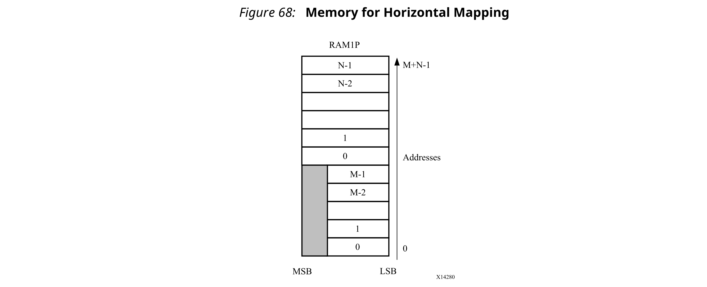

使用`ARRAY_MAP`指令的`offset`选项用于指定使用`horizontal`选项时在后续数组上添加的位置。重复前面的示例，但是颠倒命令的顺序（先指定array2然后再指定array1）并添加一个`offset`，如下所示：
```c
void foo (...) {
 int8  array1[M];
 int12 array2[N];
#pragma HLS ARRAY_MAP variable=array2 instance=array3 horizontal
#pragma HLS ARRAY_MAP variable=array1 instance=array3 horizontal offset=2
  ...   
  loop_1: for(i=0;i<M;i++) {
    array1[i] = ...;
    array2[i] = ...;
    ...
  }
  ...
}
```
这导致以下图所示的转换。

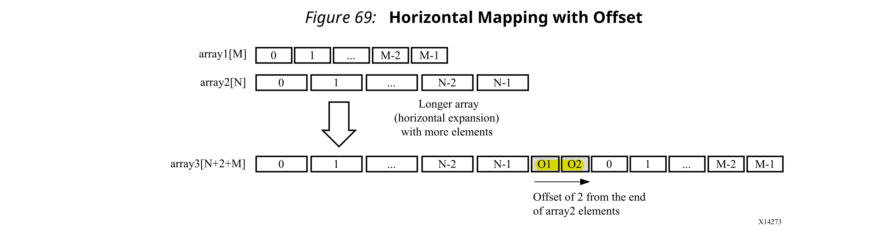
通过将`RESOURCE`指令应用于映射到新实例中的任何变量，在映射后，上述示例中新形成的数组array3，可以被定向到特定的Block RAM或UltraRAM中。

尽管水平映射可以使用更少的Block RAM组件，从而改善面积，但确实对吞吐量和性能产生了影响，因为现在的Block RAM端口很少。为了克服这一限制，Vivado HLS还提供了垂直映射。
##### Mapping Vertical Arrays
在垂直映射中，将数组连接起来以生成具有更高位宽的数组。垂直映射是使用`vertical`选项应用于INLINE指令。下图显示了在应用垂直映射模式时如何转换之前相同的示例。
```c
void foo (...) {
 int8  array1[M];
 int12 array2[N];
#pragma HLS ARRAY_MAP variable=array2 instance=array3 vertical
#pragma HLS ARRAY_MAP variable=array1 instance=array3 vertical
 ...   
loop_1: for(i=0;i<M;i++) {
 array1[i] = ...;
 array2[i] = ...;
 ...
}
...
}
```

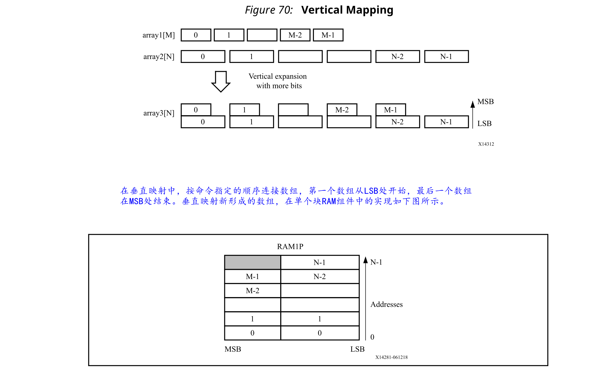

#### Array Mapping and Special Considerations
:star: 重要！数组转换的对象必须在应用任何其他指令之前先存在于源代码中。

要将分区数组中的元素映射到具有水平映射的单个数组中，必须在ARRAY_MAP指令中指定要分区的数组的各个元素。例如，以下Tcl命令分区数组`accum`并将结果元素映射到一起。
```c
// 先分区
#pragma HLS array_partition variable=m_accum cyclic factor=2 dim=1
#pragma HLS array_partition variable=v_accum cyclic factor=2 dim=1
// 再映射到一起， m_accum[1] v_accum[1]映射到了一起
#pragma HLS array_map variable=m_accum[0] instance=_accum horizontal 
#pragma HLS array_map variable=v_accum[0] instance=mv_accum horizontal 
#pragma HLS array_map variable=m_accum[1] instance=mv_accum_1 horizontal 
#pragma HLS array_map variable=v_accum[1] instance=mv_accum_1 horizontal
```
可以映射全局数组。但是，结果数组实例是全局的，并且映射到同一数组实例的任何本地数组都将变为全局的。当不同函数的本地数组映射到同一目标数组时，目标数组实例将变为全局实例。仅当函数的数组参数是同一函数的参数时，才可以映射它们。
#### Array Reshaping
`ARRAY_RESHAPE`指令将`ARRAY_PARTITIONING`与`ARRAY_MAP`的垂直模式相结合，并用于减少Block RAM的数量，同时还可以进行分区的有益效果：并行访问数据。

给出以下示例代码：
```c
void foo (...) {
int  array1[N];
int  array2[N];
int  array3[N];
#pragma HLS ARRAY_RESHAPE variable=array1 block factor=2 dim=1
#pragma HLS ARRAY_RESHAPE variable=array2 cycle factor=2 dim=1
#pragma HLS ARRAY_RESHAPE variable=array3 complete dim=1
...   
}
```
ARRAY_RESHAPE指令将数组转换为以下图所示的形式。

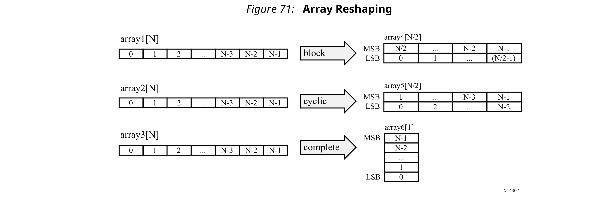

`ARRAY_RESHAPE`指令允许在单个时钟周期内访问更多数据。如果可以在一个时钟周期内访问更多数据，则Vivado HLS可能会自动展开使用该数据的任何循环，如果这样做会提高吞吐量的话。可以完全或部分展开循环，以创建足够的硬件以在单个时钟周期内使用附加数据。使用`config_unroll`命令和`tripcount_threshold`选项来控制此功能。在以下示例中，如果tripcount计数小于16的任何循环可以提高吞吐量，则将自动将其展开。
```
config_unroll -tripcount_threshold 16
```
#### Function Instantiation
函数实例化是一种优化技术，具有在维护函数层次结构方面的区域优势，但提供了另一个强大的选项：对函数的特定实例执行有针对性的局部优化。这可以简化函数调用周围的控制逻辑，并有可能改善等待时间和吞吐量。

FUNCTION_INSTANTIATE指令利用了以下事实：**调用函数时，函数的某些输入可能是常量值，并使用该值简化周围的控制结构并生成更小的，更优化的功能块**。最好通过示例来解释。

给出以下代码：
```c++
void foo_sub(bool mode){
#pragma HLS FUNCTION_INSTANTIATE variable=mode
if (mode) {
     // code segment 1 
  } else {
     // code segment 2
  }
}
void foo(){  
#pragma HLS FUNCTION_INSTANTIATE variable=select
  foo_sub(true);
  foo_sub(false);
}
```

很明显，已将函数foo_sub编写为执行多个但互斥的操作（取决于mode是否为true）。函数foo_sub的每个实例都以相同的方式实现：这对于函数重用和区域优化非常有用，但是意味着函数内部的控制逻辑必须更复杂。

FUNCTION_INSTANTIATE优化允许对每个实例进行独立优化，从而减少了功能和面积。经过FUNCTION_INSTANTIATE优化后，上面的代码可以有效地转换为具有两个独立的函数，每个函数针对不同的可能模式值进行了优化，如下所示：

```c++
void foo_sub1() {
  // code segment 1
}
void foo_sub1() {
  // code segment 2
}
void A(){
  B1();
  B2();
}
```
如果在不同的层次结构级别上使用该函数，那么如果不进行大量的内联或代码修改就很难实现函数共享，则函数实例化可以提供最佳的改进区域的方法：**许多局部优化的小型副本比许多无法共享的大型副本要好**。

#### Controlling Hardware Resources
综合期间，Vivado HLS执行以下基本任务：
- 首先，将C，C++或SystemC源代码**详细描述到包含运算符的内部数据库中**。

  运算符表示C代码中的操作，例如加法，乘法，数组读取和写入。
- 然后，将**运算符映射到实现硬件操作的内核**上。

  内核是用于创建设计的特定硬件组件（例如加法器，乘法器，流水线乘法器和Block RAM）。

提供了对每个步骤的控制，使您可以以精细的粒度控制硬件实施。
##### Limiting the Number of Operators
在某些情况下，可能需要明确限制操作员的数量以减小面积：Vivado HLS的默认操作是首先使性能最大化。限制设计中运算符的数量是减小面积的有用技术：它通过强制共享操作来帮助减小面积。

`ALLOCATION`指令允许您限制设计中使用了多少个运算符，内核或函数。例如，如果一个名为foo的设计具有317个乘法器，而FPGA仅具有256个乘法器资源（DSP48s）。如下所示的`ALLOCATION`指令指示Vivado HLS创建最多具有256个乘法（mul）运算符的设计： 
```c++
dout_t array_arith (dio_t d[317]) {
 static int acc;
 int i;
#pragma HLS ALLOCATION instances=mul limit=256 operation
 for (i=0;i<317;i++) {
#pragma HLS UNROLL
 acc += acc * d[i];
 }
 rerun acc;
}
```
:star: 注意：如果您指定的`ALLOCATION`限制大于所需的限制，则Vivado HLS会尝试使用该限制指定的资源数量或所需的最大数量，这会减少共享量。

您可以使用`type`选项来指定`ALLOCATION`指令是否限制操作，内核或功能。下表列出了可以使用`ALLOCATION`指令控制的所有操作。

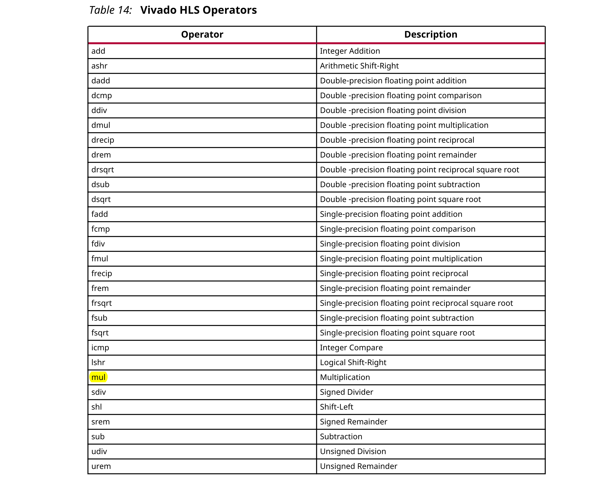

##### Globally Minimizing Operators
像所有指令一样，`ALLOCATION`指令在一个范围内指定：函数，循环或区域。config_bind配置允许在整个设计中将运算符最小化。

通过使用config_bind配置中的min_op选项，可以使设计中的运算符最小化。可以使用这种方式来限制上表中列出的任何运算符。

应用配置后，它适用于解决方案中执行的所有综合操作：如果关闭并重新打开解决方案，则指定的配置仍适用于所有新的综合操作。

可以使用reset选项或通过使用open_solution -reset打开解决方案来删除与config_bind配置一起应用的所有配置。

##### Controlling the Hardware Cores
进行综合时，Vivado HLS使用时钟指定的时序约束，目标设备指定的延迟以及您指定的任何指令来确定使用哪个内核来实现运算符。例如，要实现乘法器操作，Vivado HLS可以使用组合乘法器内核，也可以使用流水线乘法器内核。

可以以与运算符相同的方式来限制在综合期间映射到运算符的内核。您可以选择限制组合乘法器内核的数量，而不是限制乘法运算的总数，从而强制使用流水线乘法器执行所有剩余的乘法运算（反之亦然）。这是通过将`ALLOCATION`指令类型选项指定为核心来执行的。

`RESOURCE`指令用于显式指定用于特定操作的内核。在以下示例中，指定了**2级流水线乘法器来实现变量的乘法**。以下命令通知Vivado HLS对变量`c`使用2级流水线乘法器。留给Vivado HLS决定变量`d`使用哪个内核。
```c++
int foo (int a, int b) {
 int c, d;
#pragma HLS RESOURCE variable=c latency=2
 c = a*b;
 d = a*c;
 return d;
}
```

在下面的示例中，`RESOURCE`指令指定对变量`temp`的加操作，并使用`AddSub_DSP`内核实现。这样可确保在最终设计中使用DSP48原语实现该操作-默认情况下，使用LUT实现加法操作。

```c++
void apint_arith(dinA_t  inA, dinB_t  inB,
          dout1_t *out1
  ) {
 dout2_t temp;
#pragma HLS RESOURCE variable=temp core=AddSub_DSP
 temp = inB + inA;
 *out1 = temp;
}
```
`list_core`命令用于获取库中可用内核的详细信息。`list_core`仅可在Tcl命令界面中使用，并且必须使用`set_part`命令指定设备。如果尚未选择设备，则该命令无效。

`list_core`命令的`-operation`选项列出了可通过指定操作实现的库中的所有内核。下表列出了**用于实现标准RTL逻辑操作（如加，乘和比较）的内核**。


除标准核心外，当操作**使用浮点类型**时，还将使用以下浮点核心。请参阅每个设备的文档，以确定设备是否支持浮点内核。

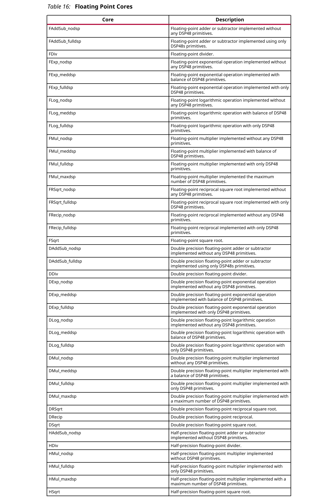

下表列出了用于实现存储元素（如寄存器或存储器）的内核。

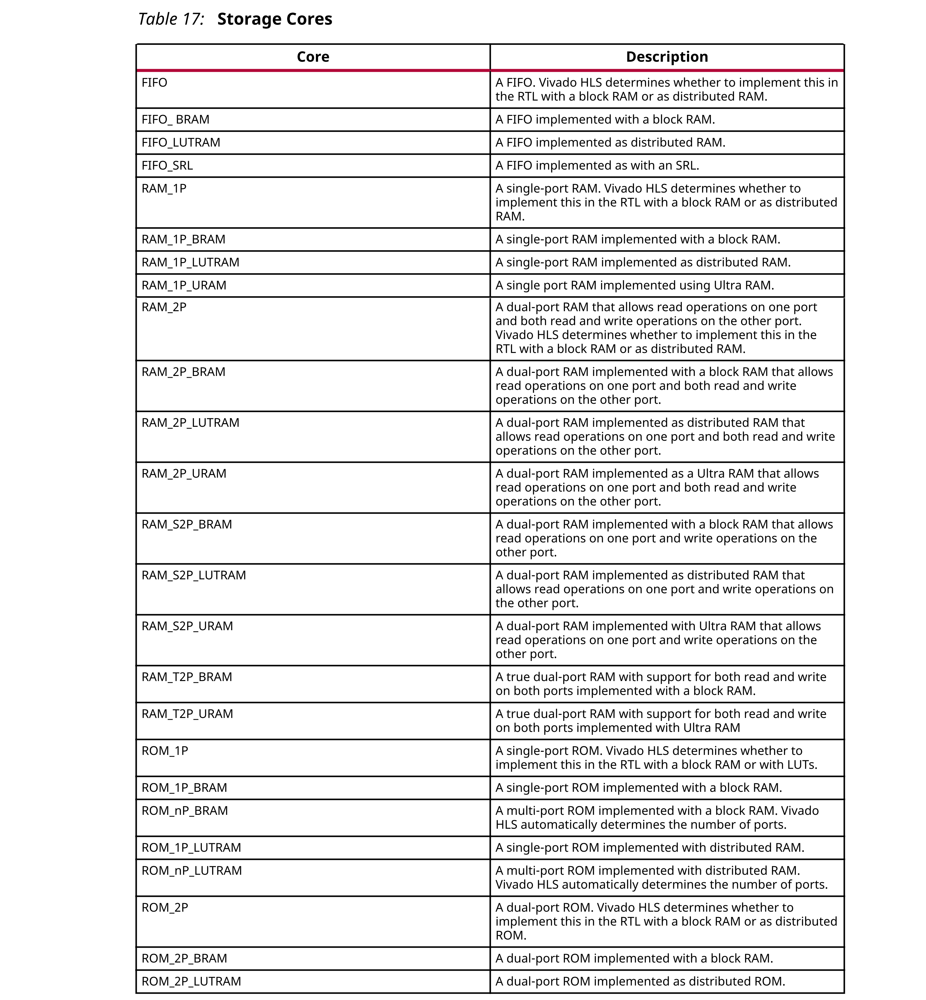

资源指令将分配的变量用作资源的目标。给定代码，`RESOURCE`指令指定out1的乘法是通过3级流水线乘法器实现的。
```c++
void foo(...) {
#pragma HLS RESOURCE variable=out1 latency=3
 // Basic arithmetic operations
 *out1 = inA * inB;
 *out2 = inB + inA;
 *out3 = inC / inA;
 *out4 = inD % inA;
} 
```
如果分配指定多个相同的运算符，则**必须修改代码以确保每个要控制的运算符都有一个变量**。例如，如果仅使用流水线乘法器实现此示例中的第一个乘法（inA * inB）：

应使用在Result_tmp变量上指定的指令将代码更改为以下内容：
```c++
#pragma HLS RESOURCE variable=Result_tmp latency=3
 Result_tmp = inA * inB;
 *out1 = Result_tmp * inC;
```
##### Globally Optimizing Hardware Cores
config_bind配置提供对绑定过程的控制。通过此配置，您可以控制将核心绑定到运算符时花费了多少精力。默认情况下，Vivado HLS选择在时序和面积之间达到最佳平衡的内核。config_bind影响使用哪些运算符。
```
config_bind -effort [low | medium | high] -min_op <list>
```

config_bind命令只能在活动解决方案中发出。绑定操作的默认运行策略为medium。

- Low Effort：减少时间共享，运行时间更快，但最终的RTL可能更大。当设计人员知道几乎没有共享的可能性或不希望共享并且不希望浪费CPU周期探索可能性时，该选项很有用。
- Medium Effort：默认设置，Vivado HLS尝试共享操作，但尽力在合理的时间内完成。
- High Effort：尝试最大程度地共享并且不限制运行时间。Vivado HLS会继续尝试，直到探索所有可能的共享组合为止。

### Optimizing Logic
#### Controlling Operator Pipelining
Vivado HLS自动确定内部操作使用的流水线级别。您可以将`RESOURCE`指令与`-latency`选项一起使用以显式指定流水线级数，并覆盖由Vivado HLS确定的级数。

RTL综合可以使用附加的流水线寄存器来帮助改善可能会在后续布局和布线之后引起的时序问题。添加到**操作输出的寄存器**通常有助于改善输出数据路径中的时序。添加到**操作输入的寄存器**通常有助于改善FSM的输入数据路径和控制逻辑的时序。

添加这些附加流水线阶段的规则是：
- 如果将延迟指定为比Vivado HLS决定的延迟多1个周期，则Vivado HLS将新的输出寄存器**添加到操作的输出**。
- 如果将延迟指定为比Vivado HLS决定的延迟多2个周期，则Vivado HLS将寄存器**添加到操作的输出和操作的输入端**。
- 如果将延迟指定为比Vivado HLS决定的延迟3个周期或更多的周期，则Vivado HLS将寄存器**添加到操作的输出和操作的输入端**。Vivado HLS**自动确定任何其他寄存器的位置**。

您可以使用`config core`配置来流水化设计中使用的具有相同流水线深度的特定内核的所有实例。要设置此配置，请执行以下操作：
1. 选择Solutions →  Solution Settings。
2. 在“Solution Settings”对话框中，选择“General”类别，然后单击“Add”。
3. 在“Add Command”对话框中，选择config_core命令，然后指定参数。

  例如，以下配置指定所有以DSP48内核实现的操作都以4的延迟进行流水线传输，这是该内核允许的最大延迟：
  ```
  config_core DSP48 -latency 4
  ```
  以下配置指定使用RAM_1P_BRAM内核实现的所有Block RAM的流水线延迟为3：
  ```
  config_core RAM_1P_BRAM -latency 3
  ```
:star: 重要！Vivado HLS仅将内核配置应用于具有明确RESOURCE指令的Block RAM，该指令指定用于实现数组的内核。如果使用默认内核实现数组，则内核配置不会影响Block RAM。
#### Optimizing Logic Expressions
在综合过程中，进行了几种优化，例如复杂运算简化和位宽最小化。自动平衡列表中包括**表达式平衡**。

表达式平衡重新排列了运算符，以构建平衡的树并减少延迟。
- 对于**整数运算**，表达式平衡默认情况下处于**启用状态**，但可能已禁用。
- 对于**浮动操作**，表达式平衡默认情况下处于**关闭状态**，但可以启用。

在以下示例中，使用赋值运算符（例如+ =和* =）完全按顺序执行的代码：
```c
data_t foo_top (data_t a, data_t b, data_t c, data_t d)
{
 data_t sum;
 sum = 0;
 sum += a;
 sum += b;
 sum += c;
 sum += d;
 return sum;
}
```
如果没有表达式平衡，并且假设每个加法运算都需要一个时钟周期，则完整的sum计算需要四个时钟周期，如下图所示。


但是，可以并行执行加法`a+b`和`c+d`，从而可以减少延迟时间。平衡计算后，将在两个时钟周期内完成，如下图所示。表达式平衡会禁止共享，并导致面积增加。


对于整数，可以使用`EXPRESSION_BALANCE`优化指令和`off`选项来禁用表达式平衡。默认情况下，Vivado HLS不会对`float`或`double`类型的操作执行`EXPRESSION_BALANCE`优化。在综合`float`和`double`类型时，Vivado HLS保持在C代码中执行的操作顺序，以确保结果与C仿真相同。例如，在下面的代码示例中，所有变量的类型均为`float`或`double`。尽管`O1`和`O2`的值似乎执行相同的基本计算，但它们并不相同。
```c
A=B*C; A=B*F;
D=E*F; D=E*C;
O1=A*D O2=A*D;
```
使用`float`或`double`类型进行操作时，此行为是C标准的饱和和四舍五入的功能。因此，当存在`float`或`double`类型的变量时，Vivado HLS始终保持确切的操作顺序，并且默认情况下不执行表达式平衡。

您可以使用配置`config compile`选项启用浮点和双精度类型的表达式平衡，如下所示：
1. Select Solution  > Solution Settings.
2. In the Solution Settings dialog box, click the `General` category, and click `Add`.
3. In the Add Command dialog box, select `config_compile`, and enable `unsafe_math_operations`.

启用此设置，Vivado HLS可能会改变操作顺序，以产生更优化的设计。但是，C/RTL协同仿真的结果可能与C仿真有所不同。

`unsafe_math_operations`功能还启用`no_signed_zeros`优化。`no_signed_zeros`优化可确保以下与`float`和`double`类型一起使用的表达式是相同的： 
```c
x - 0.0 = x; 
x + 0.0 = x; 
0.0 - x = -x; 
x - x = 0.0; 
x*0.0 = 0.0;
```
如果没有`no_signed_zeros`优化，则由于舍入，上述表达式将不等效。通过在`config_compile`配置中选择此优化，可以在没有表达式平衡的情况下，使用该选项优化。

:star: 提示：当使用`unsafe_math_operatis`和`no_signed_zero`优化时，RTL实现的结果将与C模拟的结果不同。测试台应该能够忽略结果中的微小差异：检查范围，不进行精确比较。

