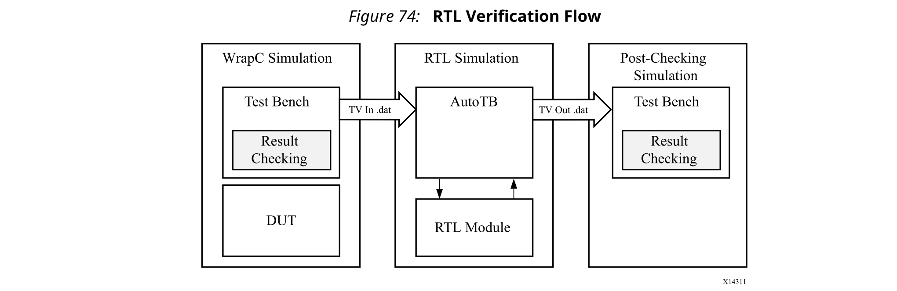
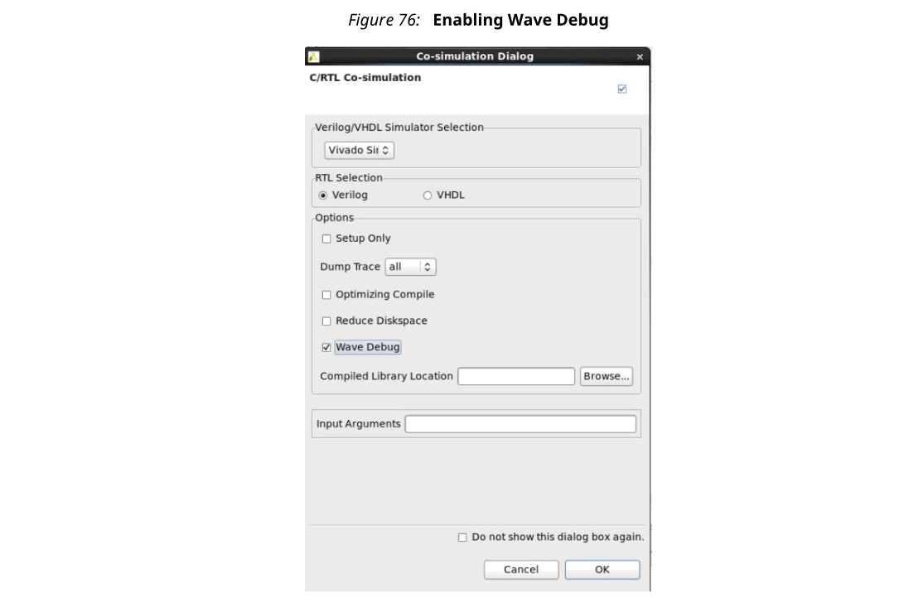
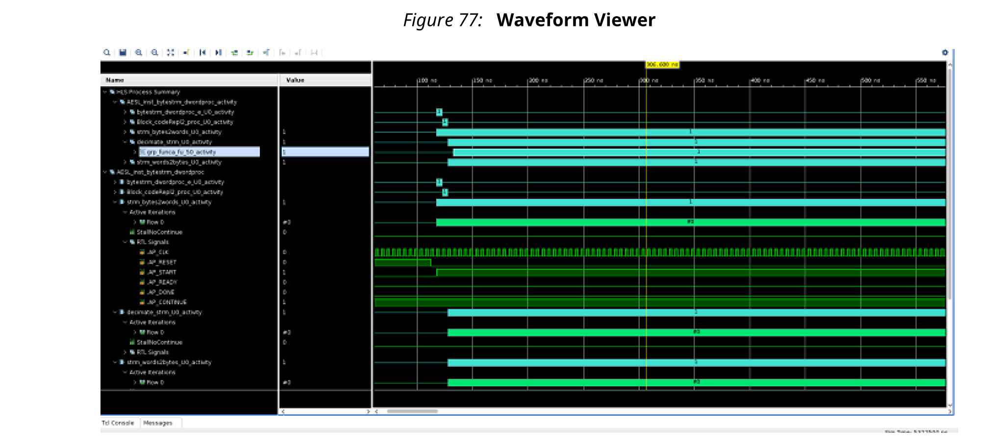
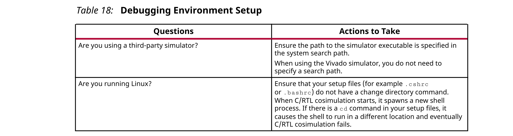
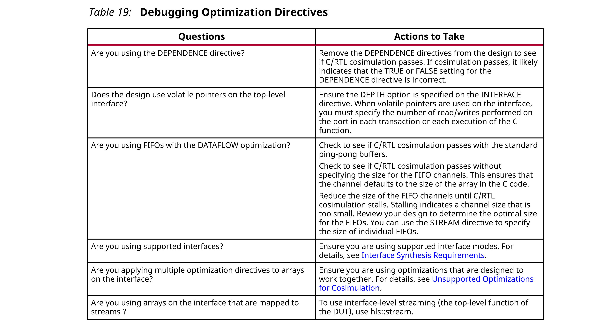
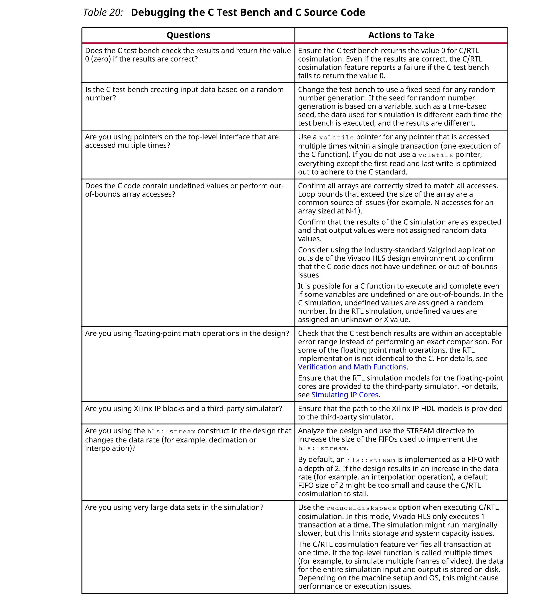

## 1.8 Verifying the RTL
综合后验证通过C/RTL协同仿真功能实现自动化，该功能可重复使用综合前C Test bench对输出RTL进行验证。

### Automatically Verifying the RTL
C/RTL协同仿真使用C测试台自动验证RTL设计。验证过程包括三个阶段，如下图所示。
- 执行C模拟，并且将顶层函数的输入或Device-UnderTest（DUT）保存为“输入向量”。
- 在使用由Vivado HLS创建的RTL的RTL Simulation中使用“输入向量”。RTL的输出另存为“输出向量”。
- 将RTL仿真中的“输出向量”应用于函数后的C测试台，以进行综合，以验证结果是否正确。C测试台执行结果验证。
  
Vivado HLS输出以下消息，以显示验证进度。

C模拟： 
```
[SIM-14] Instrumenting C test bench (wrapc)
[SIM-302] Generating test vectors(wrapc)
```
在此阶段，由于执行了C仿真，因此C测试平台编写的所有消息都将在控制台窗口或日志文件中输出。

RTL模拟：
```
[SIM-333] Generating C post check test bench 
[SIM-12] Generating RTL test bench 
[SIM-323] Starting Verilog simulation (Issued when Verilog is the RTL 
verified)
[SIM-322] Starting VHDL simulation (Issued when VHDL is the RTL verified)
```
在此阶段，来自RTL模拟的任何消息都将在控制台窗口或日志文件中输出。

C测试台结果检查： 
```
[SIM-316] Starting C post checking
[SIM-1000] C/RTL co-simulation finished: PASS (If test bench returns a 0)
[SIM-4] C/RTL co-simulation finished: FAIL (If the test bench returns non-
zero)
```
下面讨论了C测试台在C/RTL协同仿真中的重要性。



要成功使用C/RTL协同模拟功能，必须满足以下条件：
- 测试台必须进行自我检查，如果测试通过，则返回0值；如果测试失败，则返回非零值。
- 必须选择正确的接口综合选项。
- 搜索路径中必须有任何第三方模拟器。
- 设计上的任何数组或结构都不能使用“协同模拟不支持的优化”中列出的优化指令或优化指令的组合。

#### Test Bench Requirements

为了验证RTL设计产生的结果与原始C代码相同，请使用自检测试台执行验证。下面的代码示例显示了自检测试平台的重要功能：

```c
int main () { 
  int ret=0;
  
  // Execute (DUT) Function
  
    // Write the output results to a file
  
  // Check the results
  ret = system("diff --brief  -w output.dat output.golden.dat");
  
  if (ret != 0) {
        printf("Test failed  !!!\n"); 
        ret=1;
  } else {
        printf("Test passed !\n"); 
  }  
  return ret;
}    
```

该自检测试台将结果与`output.golden.dat`文件中的已知良好结果进行比较。

有很多方法可以执行此检查。这只是一个例子。

在Vivado HLS设计流中，main（）的返回值指示以下内容：
- 零：结果正确。
- 非零值：结果不正确。

:star: 注意：测试平台可以返回任何非零值。复杂的测试台可以根据不同的类型或故障返回不同的值。如果测试台在C或C/RTL协同仿真之后返回非零值，则Vivado HLS报告错误，并且仿真失败。

:white_check_mark: 推荐：因为系统环境（例如Linux，Windows或Tcl）会解释main（）函数的返回值，所以建议您将返回值限制在8位范围内，以实现可移植性和安全性。

:warning: 警告！您有责任确保测试台检查结果。如果测试台未检查结果但返回零，则Vivado HLS表示即使未实际检查结果，模拟测试也已通过。即使输出数据正确且有效，如果测试台没有将main（）返回零，Vivado HLS也会报告模拟失败。

#### Interface Synthesis Requirements

要使用C/RTL协同模拟功能来验证RTL设计，至少必须满足以下条件之一：
- 顶层函数必须使用`ap_ctrl_hs`或`ap_ctrl_chain`块级接口进行综合。
- 设计必须是纯粹的组合。
- 顶层函数的启动间隔必须为1。
- 接口必须是所有正在流式传输并以ap_hs或axis接口模式实现的数组。

  注意：hls::stream变量自动实现为ap_fifo接口。

如果这些条件中的至少一个不满足，则C/RTL协同模拟会停止，并输出以下消息：
```
@E [SIM-345] Cosim only supports the following 'ap_ctrl_none' designs: (1) 
combinational designs; (2) pipelined design with task interval of 1; (3) 
designs with 
array streaming or hls_stream ports.
@E [SIM-4] *** C/RTL co-simulation finished: FAIL ***
```
:star: 重要！如果设计被指定使用块级IO协议ap_ctrl_none并且设计包含任何采用非阻塞行为的hls::stream变量，则不能保证C/RTL协同仿真完成。

如果将任何顶层函数用作AXI-Lite接口，则返回函数也必须指定为AXI-Lite接口。

#### RTL Simulator Support
在确保满足上述要求之后，您可以使用C/RTL协同仿真通过Verilog或VHDL验证RTL设计。默认的模拟语言是Verilog。但是，您也可以指定VHDL。当默认模拟器为Vivado Simulator（XSim）时，您可以使用以下任何模拟器来运行C/RTL协同仿真： 
- Vivado Simulator (XSim)
- ModelSim simulator
- VCS simulator
- NC-Sim simulator
- Riviera simulator
- Xcelium

:star: 重要！要使用第三方仿真器（例如ModelSim，VCS，Riviera）验证RTL设计，您必须在系统搜索路径中包括仿真器的可执行文件，并且相应的许可证必须可用。有关配置这些模拟器的详细信息，请参见第三方供应商文档。

:star: 重要！验证SystemC设计时，必须选择ModelSim仿真器，并确保它包括具有适当许可的C编译器功能。

#### Unsupported Optimizations for Cosimulation
自动RTL验证不支持对接口上的结构体中的一个或多个数组执行多转换的情况。

为了执行自动验证，函数接口上的数组或函数接口上的结构体内部的数组可以使用以下任何一种优化方法，但不能使用两个或更多个：
- Vertical mapping on arrays of the same size
- Reshape
- Partition
- Data Pack on structs

当在接口的顶层函数使用以下优化时，将无法通过C/RTL协同仿真进行验证：
- Horizontal Mapping
- Vertical Mapping of arrays of different sizes
- Data Pack on structs containing other structs as members
- Conditional access on the AXIS with register slice enabled is not supported
- Mapping arrays to streams.

#### Simulating IP Cores
当使用浮点核实现设计时，必须为RTL仿真器提供浮点核的位精确模型。如果使用Xilinx Vivado Simulator使用Verilog和VHDL执行RTL仿真，则可以自动完成此操作。

对于受支持的HDL第三方模拟器，必须预先编译Xilinx浮点库并将其添加到模拟器库中。以下示例步骤演示了如何在Verilog中编译浮点库以与VCS模拟器一起使用： 
1. 打开Vivado（不是Vivado HLS），然后在Tcl控制台窗口中发出以下命令：
   ```
   compile_simlib -simulator vcs_mx -family all -language verilog
   ```
2. 该命令在当前目录中创建浮动点库。
3. 请参阅Vivado控制台窗口中的目录名称，例如./rev3_1

然后可以从Vivado HLS中引用该库：
```
cosim_design -trace_level all -tool vcs -compiled_library_dir/ 
<path_to_compile_library>/rev3_1
```
### Using C/RTL Co-Simulation
要从GUI执行C/RTL协同仿真，请单击工具栏上的C/RTL协同仿真。这将打开向导窗口中的模拟，如下图所示。


选择模拟的RTL（Verilog或VHDL）。下拉菜单允许选择模拟器。

以下是选项：
- Setup Only：这将创建运行模拟器但不执行模拟器所需的所有文件（包装器，适配器和脚本）。可以在命令shell中的<soluti on_name>/sim/<RTL>文件夹中的相应RTL模拟中运行模拟。
- Dump Trace：这将为每个函数生成跟踪文件，并将其保存到<solution>/sim/<RTL>文件夹中。下拉菜单允许您选择将哪些信号保存到跟踪文件。您可以选择跟踪设计中的所有信号，仅跟踪顶层端口或不跟踪任何信号。有关使用跟踪文件的详细信息，请参见所选RTL仿真器的文档。
- Optimizing  Compile：这可以确保对C测试平台进行高级优化。使用此优化可增加编译时间，但模拟执行速度更快。
- Reduce Disk Space：执行以下RTL仿真之前，上面显示的流程图将保存所有事务的结果。在某些情况下，这可能会导致大数据文件。reduce_diskspace选项可用于一次执行一个事务，并减少文件所需的磁盘空间量。如果在C测试台中执行了该功能，则reduce_diskspace优化将确保执行N个单独的RTL仿真。
这会导致模拟运行变慢。
- Compiled Library Location：这指定了第三方RTL模拟器的编译库的位置。

如果您正在使用第三方RTL仿真器进行仿真并且设计使用IP，则在执行RTL仿真之前，必须对IP使用RTL仿真模型。要创建或获得RTL仿真模型，请联系您的IP提供商。
- Input Arguments：这允许指定测试平台所需的任何参数。

#### Executing RTL Simulation
Vivado HLS在项目子目录：<SOLUTION>/sim/<RTL>中执行RTL模拟，其中
- SOLUTION是解决方案的名称。
- RTL是为模拟选择的RTL类型。

协同仿真过程中C测试台产生的任何文件以及模拟器生成的任何跟踪文件都被写入此目录。例如，如果C测试台保存了输出结果以进行比较，请在此目录中查看输出文件并将其与预期结果进行比较。
#### Verification of Directives
C/RTL协同仿真自动验证`DEPENDENCE`和`DATAFLOW`指令的各个方面。

如果将`DATAFLOW`指令用于流水线任务，**它将在任务之间插入通道以促进任务之间的数据流**。通常使用FIFO实现通道，并使用STREAM指令或config_dataflow命令指定FIFO深度。如果FIFO深度的大小太小，则RTL仿真可能会停顿。例如，如果指定FIFO的深度为2，但生产者任务在使用者任务读取任何数据值之前**写入了三个值**，则FIFO会阻塞生产者。在某些情况下，这可能会导致整个设计停滞。

C/RTL协同仿真会发出一条消息，如下所示，表明`DATAFLOW`区域中的通道导致RTL仿真停止。
```
/////////////////////////////////////////////////////////////////////////////
/
// ERROR!!! DEADLOCK DETECTED at 1292000 ns! SIMULATION WILL BE STOPPED! //
/////////////////////////////////////////////////////////////////////////////
/
/////////////////////////
// Dependence cycle 1:
// (1): Process: hls_fft_1kxburst.fft_rank_rad2_nr_man_9_U0
//      Channel: hls_fft_1kxburst.stage_chan_in1_0_V_s_U, FULL
//      Channel: hls_fft_1kxburst.stage_chan_in1_1_V_s_U, FULL
//      Channel: hls_fft_1kxburst.stage_chan_in1_0_V_1_U, FULL
//      Channel: hls_fft_1kxburst.stage_chan_in1_1_V_1_U, FULL
// (2): Process: hls_fft_1kxburst.fft_rank_rad2_nr_man_6_U0
//      Channel: hls_fft_1kxburst.stage_chan_in1_2_V_s_U, EMPTY
//      Channel: hls_fft_1kxburst.stage_chan_in1_2_V_1_U, EMPTY
/////////////////////////////////
// Totally 1 cycles detected!
/////////////////////////////////////////////////////////////
```

在这种情况下，请检查任务之间通道的实现，并**确保任何FIFO大到足以容纳正在生成的数据**。

以类似的方式，RTL测试平台也被配置为使用`DEPENDENCE`指令自动确定的虚假依赖关系。这表明依赖性不是假的，必须删除该依赖性才能实现功能上有效的设计。

#### Analyzing RTL Simulations
C/RTL协同仿真完成后，将打开仿真报告，并显示测得的Latency和II。这些结果可能与HLS综合后报告的值有所不同，后者是基于通过设计的绝对最短和最长路径得出的。C/RTL协同仿真后提供的结果显示了给定仿真数据集的Latency和II的实际值（如果使用不同的输入刺激，则可能会改变）。

在**非流水线设计**中，C/RTL协同**测量`ap_start`和`ap_done`信号之间的延迟**。`II`比延迟多1，因为在所有操作完成后，该设计以1个周期读取新的输入。该设计仅在当前事务完成后才开始下一个事务。

在**流水线设计**中，设计**可能在第一个事务完成之前读取新的输入**，并且在事务完成之前可能会有多个`ap_start`和`ap_ready`信号。在这种情况下，C/RTL协同仿真将**Latency测量为数据输入值和数据输出值之间的周期数**。`II`是`ap_ready`信号之间的周期数，设计用于请求新的输入。

:star: 注意：对于流水线设计，仅当设计针对多个事务进行仿真时，C/RTL协同仿真的II值才有效。

可选地，您可以使用“Open Wave Viewer”工具栏按钮通过C/RTL协同仿真查看波形。要查看RTL波形，必须在执行C/RTL协同仿真之前选择以下选项：
- Verilog/VHDL Simulator Selection：选择Vivado Simulator。对于Xilinx 7系列及更高版本的设备，您可以可选地选择`Auto`。
- Dump Trace：选择`all`或`port`。

完成C/RTL协同仿真后，`Open Wave Viewer`工具栏按钮将在Vivado IDE中打开RTL波形。

:star: 注意：使用这种方法打开Vivado IDE时，只能使用波形分析功能，例如缩放，平移和波形基数。

#### Waveform Viewer
波形查看器可将设计中的所有过程可视化。该可视化分为两个部分：
- HLS流程摘要：包含所有流程的活动报告的层次表示。例如，在生成的RTL中包含数据流和顺序过程。
- 数据流分析：提供有关数据流区域内任务的详细活动信息。

可视化HLS设计中的活动过程，可以对顶层模块的每次激活内的过程活动和长度进行详细的分析。这些可视化有助于分析单个流程的性能以及独立流程的整体并发执行。

如果可以减少进程执行时间，则控制总体执行的进程具有提高性能的最大潜力。在Vivado模拟器的协同仿真期间，可以使用此可视化效果。通过在“Cosimulation Dialog”窗口中选择“Wave Debug”选项来启用它。



Viewer分为以下几个部分：
- HLS Process summary
  - DUT name: <name>
  - Function: <function  name>
- Dataflow Analysis
  - DUT name: <name>
  - Function: <function  name>
  - Dataflow/Pipeline Activity: 这显示了实现为数据流过程时函数并行执行的次数。
  - Active Iterations: 这显示了数据流的当前活动迭代。行数会动态增加，以适应任何并发执行的可视化。
  - StallNoContinue: 这是一个停顿信号，用于告知数据流过程是否经历了任何输出停顿（功能已完成，但尚未从相邻数据流过程中收到继续信号）。
  - RTL Signals: 底层RTL控制信号可根据数据流过程解释事务
  


### Debugging C/RTL Cosimulation
当C/RTL协同仿真完成时，Vivado HLS通常表示仿真已通过且RTL设计的功能与初始C代码匹配。当C/RTL协同失败时，Vivado HLS发出以下消息：
```
@E [SIM-4] *** C/RTL co-simulation finished: FAIL ***
```
以下是导致C/RTL协同仿真失败的主要原因：
- 错误的环境设置
- 不支持或错误应用的优化指令
- C测试平台或C源代码存在问题

要调试C/RTL协同故障，请运行以下部分所述的检查。如果您无法解决C/RTL协同故障，请参见Xilinx支持以获取支持资源，例如answers，文档，下载和论坛。

#### Setting up the Environment
如下表所示检查环境设置。



#### Optimization Directives

如下表所示检查优化指令。



#### C Test Bench and C Source Code

如下表所示，检查C测试台和C源代码。

