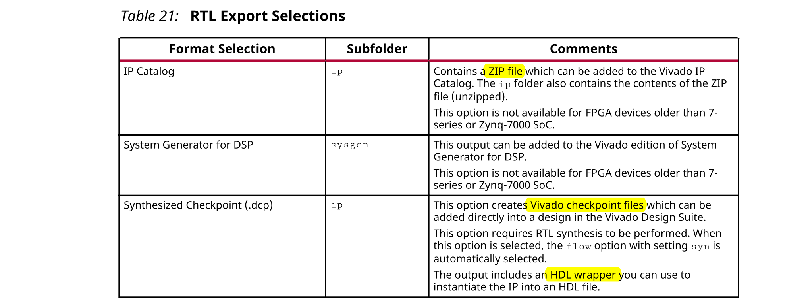
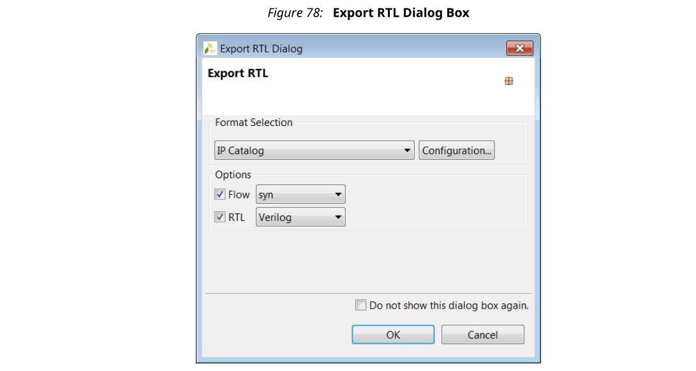
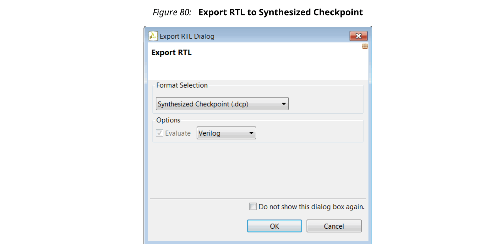

## 1.9 Exporting the RTL Design
Vivado HLS流的最后一步是将RTL设计作为知识产权（IP）的一部分导出，并可以被Xilinx设计流中的其他工具使用。可以将RTL设计打包为以下输出格式：
- 用于Vivado Design Suite的IP Catalog格式的IP
- 用于DSP的System Generator用于DSP的Vivado System Generator
- 综合检查点（.dcp）

下表显示了您可以导出的格式以及每种格式的详细信息。

除了打包输出格式外，RTL文件还可以作为独立文件（不是打包格式的一部分）在位于目录 `<project_name>/<solution_name>/impl` 的实现内的verilog和vhdl目录中使用。

除了RTL文件外，这些目录还包含Vivado Design Suite的项目文件。打开文件project.xpr会使设计（Verilog或VHDL）在可以分析设计的Vivado项目中打开。如果在Vivado HLS项目中执行了C/RTL 协同仿真，则在Vivado项目中可以使用C/RTL 协同仿真文件。

### Synthesizing the RTL
当Vivado HLS报告综合结果时，它可以估算RTL综合后的预期结果：预期的时钟频率，预期的寄存器，LUT和Block RAM数量。这些结果是合理的，因为Vivado HLS无法知道RTL综合执行的确切的优化或实际的路由延迟是什么，因此无法知道最终的面积和时序值。

在导出设计之前，您**有机会执行逻辑综合并确认估计的准确性**。下图所示的流程选项调用了具有`syn`选项的RTL综合或具有`impl`选项的RTL综合和实现。在导出过程中，将RTL设计综合到门级或布局和布线实现。

提供了RTL综合优化以确认所报告的估计。**在大多数情况下，这些RTL结果不包含在打包的IP中**。

对于大多数导出格式，RTL综合是在verilog或vhdl目录中执行的，无论使用前面图中的下拉菜单为HDL选择了哪个HDL进行RTL综合，RTL综合的结果均未包含在打包的IP中。

:star: 注意：设计检查点综合检查点（.dcp）始终作为综合RTL导出。flow选项可用于评估综合或实现的结果，但导出的软件包始终包含综合网表。
### Packaging IP Catalog Format
完成综合和RTL验证后，单击上的Export RTL工具栏按钮，打开Export RTL对话框。

在“Format Selection”中选择IP Catalog格式。

Configuration选项允许将以下标识标签嵌入到导出的程序包中。这些字段可用于帮助识别Vivado IP目录中已打包的RTL。

当将设计加载到IP目录中时，可使用配置信息在同一设计的多个实例之间进行区分。例如，如果为IP目录打包了一个实现，然后创建了一个新解决方案并将其打包为IP，则默认情况下，该新解决方案具有相同的名称和配置信息。如果新的解决方案也添加到IP目录中，则IP目录会将其标识为同一IP的更新版本，并且将使用添加到IP目录中的最新版本。

另一种方法是在config_rtl配置中使用prefix选项来重命名输出设计和具有唯一前缀的文件。

如果配置设置中未提供任何值，那么将使用以下值： 
- Vendor: xilinx.com
- Library: hls
- Version: 1.0
- Description: An IP generated by Vivado HLS
- Display Name: This field is left blank by default
- Taxonomy: This field is left blank by default

在打包过程完成之后，目录`<project_name>/<solution_name>/impl/ip`中的.zip文件归档可以导入到Vivado IP目录中，并可以在任何Vivado设计（RTL或IP Integrator）中使用。

#### Software Driver Files
对于**包含AXI4-Lite从接口的设计，在导出过程中会创建一组软件驱动程序文件**。这些C驱动程序文件可以包含在SDK C项目中，并用于访问AXI4-Lite从端口。

软件驱动程序文件被写入目录`<project_name>/<solution_name>/impl/ip/drivers，并**包含在.zip压缩包**中。有关C驱动程序文件的详细信息，请参见AXI4-Lite接口。

### Exporting IP to System Generator

### Exporting a Synthesized Checkpoint
完成综合和RTL验证后，单击上的Export RTL工具栏按钮，打开Export RTL对话框。

当将设计打包为设计检查点IP时，在打包之前首先将其综合。

选择OK将生成设计检查点包。该软件包已写入<project_name>/<solution_name>/impl/ip目录。可以与其他任何设计检查点相同的方式在Vivado Design Suite项目中使用设计检查点文件。
