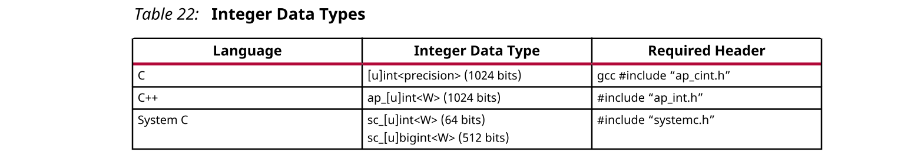
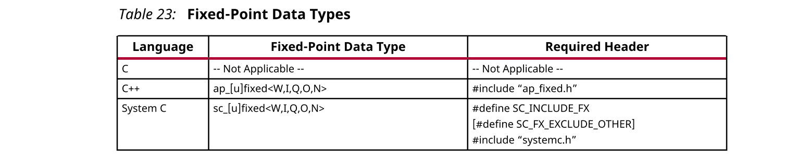
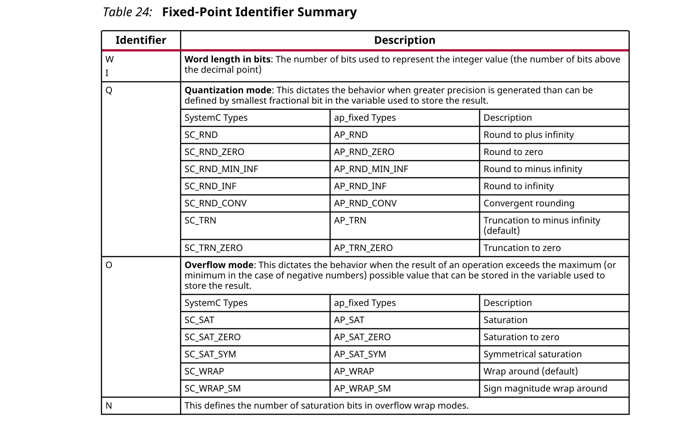
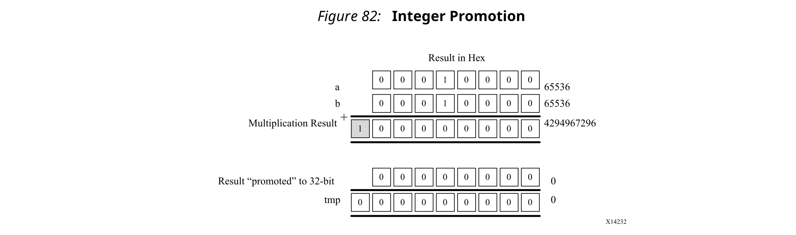
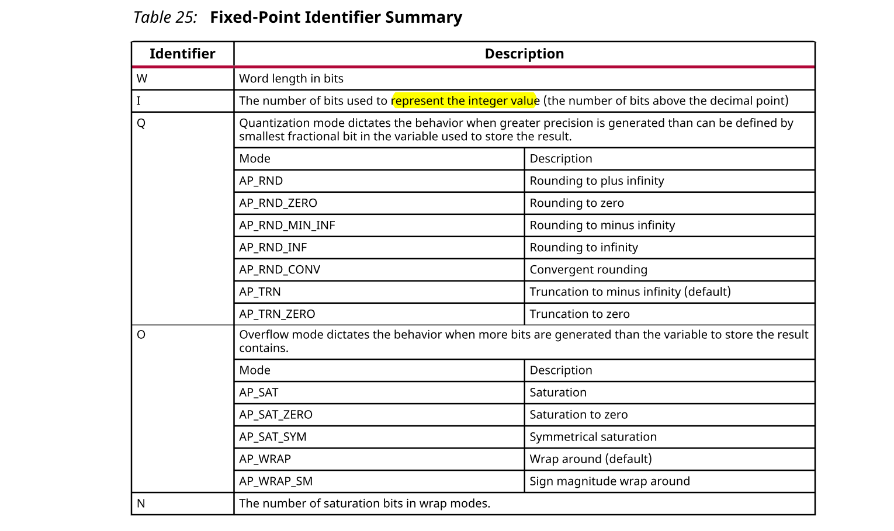

## 2.1 Arbitrary Precision Data Types Library
基于C的原始数据类型位于8位边界（8、16、32、64位）上。
RTL总线（对应于硬件）支持任意长度。HLS需要一种机制，该机制允许指定任意精度的位宽，并且不依赖于天然C数据类型的人工边界：如果需要17位乘法器，则不应强迫您使用32位乘法器。

Vivado® HLS为C，C ++提供了整数和定点的任意精度数据类型，并支持SystemC的任意精度数据类型。

任意精度数据类型的优点在于，它们允许更新C代码以使用具有较小位宽的变量，然后重新执行C仿真以验证功能是否相同或可接受。

### Using Arbitrary Precision Data Types
Vivado® HLS提供了任意精度的整数数据类型，这些类型可管理指定宽度范围内的整数值，如下表所示。



Vivado HLS还提供了定义任意精度类型的头文件，它们是独立的软件包，并有权在您自己的源代码中使用它们。软件包`xilinx_hls_lib_<release_number>.tgz`在Vivado HLS安装区域的include目录中提供。

#### Arbitrary Integer Precision Types with C
对于C语言，头文件`ap_cint.h`定义任意精度整数数据类型`[u]int`。

注意：软件包`xilinx_hls_lib_<release_number>.tgz`不包含`ap_cint.h`中定义的C任意精度类型。这些类型不能与标准C编译器一起使用，只能与Vivado HLS cpcc编译器一起使用。

要在C函数中使用任意精度的整数数据类型，请执行以下操作：
- 将头文件`ap_cint.h`添加到源代码中。
- 对于有符号类型，将位类型更改为`intN`；对于无符号类型，将位类型更改为`uintN`，其中N是从1到1024的位大小。

下面的示例说明如何添加头文件以及实现两个变量以使用9位整数和10位无符号整数类型：
```c
#include "ap_cint.h"
void foo_top () {
  
 int9  var1;           // 9-bit
 uint10  var2;         // 10-bit unsigned
```
#### Arbitrary Integer Precision Types with C++
头文件`ap_int.h`为C++ ap_[u]int数据类型定义任意精度整数数据类型。要在C ++函数中使用任意精度的整数数据类型，请执行以下操作：
- 将头文件ap_int.h添加到源代码中。
- 对于有符号类型，将位类型更改为`ap_int<N>`；对于无符号类型，将位类型更改为`ap_uint<N>`，其中N为从1到1024的位大小。
下面的示例说明如何添加头文件以及实现两个变量以使用9位整数和10位无符号整数类型：
```c
#include "ap_int.h"
void foo_top () {
  
 ap_int<9>  var1;           // 9-bit
 ap_uint<10>  var2;         // 10-bit unsigned
```
#### Arbitrary Precision Integer Types with SystemC
SystemC使用的任意精度类型在`systemc.h`头文件中定义，该文件必须包含在所有SystemC设计中。头文件包括SystemC sc_int<>，sc_uint<>，sc_bigint<>和sc_biguint<>类型。

#### Arbitrary Precision Fixed-Point Data Types
在Vivado HLS中，使用定点数据类型很重要，因为使用定点数据类型执行的C++/SystemC仿真的行为与综合创建的结果硬件的行为匹配。这使您可以通过快速的C级仿真来分析位精度，量化和溢出的效果。

Vivado HLS提供了与C++和SystemC函数一起使用的任意精度定点数据类型，如下表所示。



这些数据类型在指定的总宽度和整数宽度的边界内管理实数（非整数）的值，如下图所示。


##### Fixed-Point Identifier Summary
下表简要概述了定点类型支持的操作。



##### Example Using ap_fixed
在此示例中，Vivado HLS `ap_fixed`类型用于定义18位变量，其中6位代表小数点以上的数字，而12位代表小数点以下的值。变量指定为带符号，量化模式设置为四舍五入，默认wrap-around模式用于溢出。
```c
#include <ap_fixed.h>
...
ap_fixed<18,6,AP_RND > my_type;
...
```

##### Example Using sc_fixed
在此sc_fixed示例中，显示了一个22位变量，其中21位代表十进制点以上的数字：仅启用0.5的最小精度。使用四舍五入到零，这样任何小于0.5的结果四舍五入到0，并指定饱和。
```c
#define  SC_INCLUDE_FX
#define SC_FX_EXCLUDE_OTHER
#include <systemc.h>
...
sc_fixed<22,21,SC_RND_ZERO,SC_SAT> my_type;
...
```
### C Arbitrary Precision Integer Data Types
C中的原始数据类型位于8位边界（8、16、32和64位）上。RTL信号和操作支持任意位长度。Vivado HLS为C提供了任意精度的数据类型，以允许用任意位宽指定C代码中的变量和操作：例如6位，17位和234位，最高1024位。

Vivado HLS还提供C++中的任意精度数据类型，并支持SystemC中包含的任意精度数据类型。这些类型将在相应的C++和SystemC编码中讨论。
#### Advantages of C Arbitrary Precision Data Types
任意精度数据类型的主要优点是：
- Better quality hardware

  例如，如果需要一个17位乘法器，则可以使用任意精度类型来精确计算17位。

  如果没有任意精度的数据类型，则必须使用32位整数数据类型来实现诸如17位的乘法。这导致使用多个DSP48组件实现乘法。
- Accurate C simulation and analysis

  C代码中的任意精度数据类型都允许使用精确的位宽执行C仿真，并且C仿真可以在合成之前验证算法的功能（和准确性）。

对于C语言，头文件`ap_cint.h`定义任意精度整数数据类型`[u]int＃W`。例如：
- int8表示8位带符号整数数据类型。
- uint234表示234位无符号整数类型。

ap_cint.h文件位于目录`$HLS_ROOT/include`中，其中`$HLS_ROOT`是Vivado HLS安装目录。

以下示例中显示的代码是“标准类型”中显示的“基本算术”代码示例。在这两个示例中，将在顶层函数中合成的数据类型指定为dinA_t，dinB_t等。
```c
#include "apint_arith.h"
void apint_arith(din_A_t inA, din_B_t inB, din_C_t inC, din_D_t inD, 
dout_1_t *out1, dout_2_t *out2, dout_3_t *out3, dout_4_t *out4) {
 // Basic arithmetic operations
 *out1 = inA * inB;
 *out2 = inB + inA;
 *out3 = inC / inA;
 *out4 = inD % inA;
}
```
这两个示例之间的真正区别在于如何定义数据类型。要在C函数中使用任意精度的整数数据类型，你要：
- 将头文件ap_cint.h添加到源代码中。
- 将原始C类型更改为任意精度类型：intN或uintN，其中N是从1到1024的位大小。

数据类型在头文件`apint_arith.h`中定义。与标准类型中的基本算术示例相比，请参见以下示例：
- 输入数据类型已减少，以代表实际输入数据的最大大小。例如，将8位输入inA减少为6位输入。
- 输出类型已经过修正，更加准确。例如，out2（inA和inB之和）仅需要13位，而不是32位。
```c
#include <stdio.h>
#include ap_cint.h
// Previous data types
//typedef char dinA_t;
//typedef short dinB_t;
//typedef int dinC_t;
//typedef long long dinD_t;
//typedef int dout1_t;
//typedef unsigned int dout2_t;
//typedef int32_t dout3_t;
//typedef int64_t dout4_t;
typedef int6 dinA_t;
typedef int12 dinB_t;
typedef int22 dinC_t;
typedef int33 dinD_t;
typedef int18 dout1_t;
typedef uint13 dout2_t;
typedef int22 dout3_t;
typedef int6 dout4_t;
void apint_arith(dinA_t inA,dinB_t inB,dinC_t inC,dinD_t inD, 
dout1_t *out1,dout2_t *out2,dout3_t *out3,dout4_t *out4);
```

综合前面的示例，得出的设计与“标准类型”中显示的“基本算术”示例完全相同（给出的数据在前面的示例指定的范围内）。最终的RTL设计面积更小，时钟速度更快，这是因为较小的位宽会导致逻辑减少。

在综合之前，必须对函数进行编译和验证。

##### Validating Arbitrary Precision Types in C
要创建任意精度类型，请在文件`ap_cint.h`中添加规则以定义位大小。

标准C编译器（例如gcc）会编译头文件中使用的属性，但他们不知道属性是什么意思。这导致计算结果无法反映代码的位精确行为。例如，gcc（或任何其他第三方C编译器）将二进制表示为100的3位整数值视为十进制值4而不是-4。

:star: 注意：**仅在使用C任意精度类型时才会出现此问题**。C++或SystemC任意精度类型不存在此类问题。

当Vivado HLS识别出正在使用任意精度的C类型时，它会使用其自己的内置C编译器`apcc`自动解决此问题。该编译器是`gcc`兼容的，但是可以正确解释任意精度类型和算术类型。通过将`gcc`替换为`apcc`，可以在命令提示符下调用`apcc`编译器。
```c
$ apcc -o foo_top foo_top.c tb_foo_top.c
$ ./foo_top
```
在C中使用任意精度类型时，将无法再使用Vivado HLS C调试器来分析设计。如果需要调试设计，Xilinx建议使用以下方法之一：

- 使用`printf`或`fprintf`函数输出数据值以进行分析。
- 将任意精度类型替换为自然C类型（int，char，short等）。这种方法有助于调试算法本身的操作，但是在必须分析算法的位精确结果时则无济于事。
- 将C函数更改为C++，并使用没有调试器限制的C++任意精度类型。
##### Integer Promotion
当任意精度运算的**结果越过**自然的8、16、32和64位边界时，请当心。在以下示例中，目的是将两个18位值相乘并将结果存储在36位数字中：
```c
#include "ap_cint.h"
int18  a,b;
int36  tmp;
tmp = a * b;
```
使用此方法时会发生整数提升。结果可能与预期不符。在整数提升中，C编译器：
- 将乘法输入提升为自然整数大小（32位）。
- 执行乘法运算，生成32位结果。
- 将结果赋值给36位变量tmp。

这将导致以下图所示的行为和不正确的结果。



因为Vivado HLS产生与C仿真相同的结果，所以Vivado HLS创建了将**32位乘法器结果符号扩展为36位结果的硬件**。（个人注：18-bit自动提升到了32bit，计算的结果再截取到32bit，结果导致最高位丢失，如果再符号扩展到36bit，结果可能会出现问题）

要克服出现的整数提升，**请将运算符输入强制转换为输出大小**。下面的示例显示乘法器的输入在乘法之前转换为36位值的位置。这样可以在C仿真期间得到正确的（预期）结果，并在RTL中实现预期的36位乘法。

以下示例说明了避免整数提升的方法。
```c
#include "ap_cint.h"
typedef int18 din_t;
typedef int36 dout_t;
dout_t apint_promotion(din_t a,din_t b) {
   dout_t  tmp;
   tmp = (dout_t)a * (dout_t)b;
   return tmp;
}
```
仅当运算**结果大于下一个自然边界**（8、16、32或64）时，**才需要强制避免整数提升**。对于乘法器，此行为比对操作进行加法和减法更典型。

使用C ++或SystemC任意精度类型时，没有关于整数的问题。
#### C Arbitrary Precision Integer Types: Reference Information
C任意精度类型提供以下信息：
- 将常数和初始化值分配给任意精度整数（包括大于64位的值）的技术。
- Vivado HLS辅助功能的描述，例如打印，连接，位切片和范围选择。
- 操作码行为的描述，包括移位操作的描述(负的移位值会导致在相反方向上的偏移)。

### C++ Arbitrary Precision Integer Types
C++中的原始数据类型位于8位边界（8、16、32和64位）上。RTL信号和操作支持任意位长度。

Vivado HLS为C++提供了任意精度的数据类型，以允许C++代码中的变量和操作指定为任意位宽：6位，17位，234位，最多1024位。

:bulb: 提示：允许的默认最大宽度为1024位。您可以通过在包含ap_int.h头文件之前为正整数值定义小于或等于32768的宏AP_INT_MAX_W来覆盖此默认值。

C++支持使用SystemC标准中定义的任意精度类型。包括SystemC头文件`systemc.h`，并使用SystemC数据类型。

相对于自然C++类型，任意精度数据类型有两个主要优点：
- 更高质量的硬件：例如，如果需要一个17位乘法器，则任意精度类型可以指定在计算中精确使用17位。
如果没有任意精度的数据类型，则必须使用32位整数数据类型来实现这种乘法（17位），并导致使用多个DSP48组件来实现乘法。
- 精确的C++仿真/分析：C++代码中的任意精度数据类型均允许使用准确的位宽执行C++仿真，并且在综合之前C++仿真可以验证算法的功能（和准确性）。

C++中的任意精度类型没有C语言中的缺点：
- C++任意类型可以使用标准C++编译器进行编译（没有apcc的C++等效项）。
- C++任意精度类型没有整数提升问题。

用户将文件扩展名从.c更改为.cpp并不罕见，因此可以将文件编译为C++，而这两个问题均不存在。

对于C++语言，头文件ap_int.h定义任意精度整数数据类型ap_(u)int<W>。例如，ap_int<8>表示8位有符号整数数据类型，而ap_uint<234>表示234位无符号整数类型。

ap_int.h文件位于目录$HLS_ROOT/include中，其中$HLS_ROOT是Vivado HLS安装目录。

以下示例中显示的代码是“标准类型”中“基本算术”示例中显示的代码。在此示例中，要综合的顶层函数中的数据类型指定为dinA_t，dinB_t ...
```c++
#include "cpp_ap_int_arith.h"
void cpp_ap_int_arith(din_A  inA, din_B  inB, din_C  inC, din_D  inD,
 dout_1 *out1, dout_2 *out2, dout_3 *out3, dout_4 *out4
) {
 // Basic arithmetic operations
 *out1 = inA * inB;
 *out2 = inB + inA;
 *out3 = inC / inA;
 *out4 = inD % inA;
}
```
在此示例的最新更新中，使用了C++任意精度类型：
- 将头文件ap_int.h添加到源代码中。
- 将自然C++类型更改为任意精度类型ap_int<N>或ap_uint<N>，其中N是从1到1024的位大小（如上所述，如果需要，可以扩展到32K位）。

数据类型在头文件`cpp_ap_int_arith.h`中定义。

与标准类型中的基本算术示例相比，仅将输入数据类型简化为代表实际输入数据的最大大小（例如，将8位输入inA减少为6位输入）。已将输出类型定义为更准确的类型，例如，out2（inA和inB之和）仅需要13位，而无需32位。

以下示例显示使用C++任意精度类型的基本算术。
```
#ifndef _CPP_AP_INT_ARITH_H_
#define _CPP_AP_INT_ARITH_H_
#include <stdio.h>
#include "ap_int.h"
#define N 9
// Old data types
//typedef char dinA_t;
//typedef short dinB_t;
//typedef int dinC_t;
//typedef long long dinD_t;
//typedef int dout1_t;
//typedef unsigned int dout2_t;
//typedef int32_t dout3_t;
//typedef int64_t dout4_t;
typedef ap_int<6> dinA_t;
typedef ap_int<12> dinB_t;
typedef ap_int<22> dinC_t;
typedef ap_int<33> dinD_t;
typedef ap_int<18> dout1_t;
typedef ap_uint<13> dout2_t;
typedef ap_int<22> dout3_t;
typedef ap_int<6> dout4_t;
void cpp_ap_int_arith(dinA_t inA,dinB_t inB,dinC_t inC,dinD_t inD,dout1_t 
*out1,dout2_t *out2,dout3_t *out3,dout4_t *out4);
#endif
```
如果综合了C++任意精度整数类型，则其设计使C任意精度数据类型的优点与标准类型功能完全相同。它使测试平台尽可能类似于C任意精度数据类型的优点，不是使用C++ cout运算符将结果输出到文件，而是使用内置的ap_int方法.to_int（）来转换ap_int结果为标准fprintf函数使用的整数类型。
```c
fprintf(fp, %d*%d=%d; %d+%d=%d; %d/%d=%d; %d mod %d=%d;\n, 
 inA.to_int(), inB.to_int(), out1.to_int(), 
 inB.to_int(), inA.to_int(), out2.to_int(), 
 inC.to_int(), inA.to_int(), out3.to_int(), 
 inD.to_int(), inA.to_int(), out4.to_int());
```
#### C++ Arbitrary Precision Integer Types: Reference Information
为深入理解这些方法，综合行为以及使用ap_(u)int <N>任意精度数据类型的所有方面的全面信息，请参见C++任意精度类型。本节包括：
- 将常数和初始化值分配给任意精度整数（包括大于1024位的值）的技术。
- Vivado HLS辅助方法的说明，例如打印，连接，位切片和范围选择功能。
- 对操作码的描述，包括对移位操作的描述（负移位值会导致向相反方向的移位）。
### C++ Arbitrary Precision Fixed-Point Types
C++函数可以利用Vivado HLS的任意精度定点类型。下图总结了这些定点类型的基本功能：
- word可以是带符号（ap_fixed）或无符号（ap_ufixed）。
- 可以定义任意大小W的word。
- 小数点I以上的位数，也定义了word W-I（在下面的图中由B表示）的小数位数。
- 可以选择舍入或量化（Q）的类型。
- 可以选择溢出行为（O和N）。


:bulb: 提示：当代码中包含头文件`ap_fixed.h`时，可以使用任意精度的定点类型。

任意精度定点类型在C仿真过程中使用更多的内存。如果使用`ap_[u]fixed`类型的非常大的数组，请参阅Arrays中有关C语言模拟的讨论。

使用定点类型的优点是：
- 它们使小数易于表示。
- 当变量的整数位数和小数位数不同时，将处理小数点的对齐方式。
- 有很多选项可以处理应如何进行舍入：小数太少而无法表示结果的精度时。
- 有很多选项来处理变量如何溢出：当结果大于整数位数可以表示的数量时。

通过查看以下示例中的代码，可以总结这些属性。首先，包含头文件ap_fixed.h。然后使用typedef语句定义ap_fixed类型：
- 10位输入：8位整数值，带2个小数位。
- 6位输入：3位整数值，带3个小数位。
- 累加值的22位变量：具有5位小数的17位整数值。
- 结果值的36位变量：30位整数值，带6个小数位。

该函数不包含用于在执行操作后管理小数点对齐的代码。对齐自动完成。

以下代码示例显示ap_fixed类型。
```c
#include "ap_fixed.h"
typedef ap_ufixed<10,8, AP_RND, AP_SAT> din1_t;
typedef ap_fixed<6,3, AP_RND, AP_WRAP> din2_t;
typedef ap_fixed<22,17, AP_TRN, AP_SAT> dint_t;
typedef ap_fixed<36,30> dout_t;
dout_t cpp_ap_fixed(din1_t d_in1, din2_t d_in2) {
 static dint_t sum;
 sum += d_in1; 
 return sum * d_in2;
}
```

使用ap_(u)fixed类型，C++仿真有点精确。快速仿真可以验证算法及其准确性。在综合之后，RTL表现出相同的位精确行为。

可以在代码中自由分配任意精度定点类型的字面值。这在上面的示例所用的测试平台（请参见下面的示例）中进行了显示，其中声明了in1和in2的值并为其分配了常数。

在分配涉及运算符的字面值时，必须首先将文字值转换为ap_(u)fixed类型。否则，C编译器和Vivado HLS会将字面值解释为整数或浮点/双精度类型，并且可能无法找到合适的运算符。如下例所示，在in1 = in1 + din1_t（0.25）的赋值中，文字0.25被强制转换为ap_fixed类型。

```c++
#include <cmath>
#include <fstream>
#include <iostream>
#include <iomanip>
#include <cstdlib>
using namespace std;
#include "ap_fixed.h"
typedef ap_ufixed<10,8, AP_RND, AP_SAT> din1_t;
typedef ap_fixed<6,3, AP_RND, AP_WRAP> din2_t;
typedef ap_fixed<22,17, AP_TRN, AP_SAT> dint_t;
typedef ap_fixed<36,30> dout_t;
dout_t cpp_ap_fixed(din1_t d_in1, din2_t d_in2);
int main()
{
 ofstream result;
 din1_t in1 = 0.25; // 可以直接赋值，自动确定类型
 din2_t in2 = 2.125;
 dout_t output;
 int retval=0;
 result.open(result.dat);
 // Persistent manipulators
 result << right << fixed << setbase(10) << setprecision(15);
 for (int i = 0; i <= 250; i++)
 {
  output = cpp_ap_fixed(in1,in2);
  result << setw(10) << i;
  result << setw(20) << in1;
  result << setw(20) << in2;
  result << setw(20) << output;
  result << endl;
  in1 = in1 + din1_t(0.25); // 这里显式类型转换
  in2 = in2 - din2_t(0.125);
 }
 result.close();
 // Compare the results file with the golden results
 retval = system(diff --brief -w result.dat result.golden.dat);
 if (retval != 0) {
  printf(Test failed  !!!\n); 
  retval=1;
 } else {
  printf(Test passed !\n);
 }
 // Return 0 if the test passes
 return retval;
}
```
#### Fixed-Point Identifier Summary
下表显示了量化和溢出模式。

:bulb: 提示：量化和溢出模式的作用远远超出标准硬件算术的默认行为（自动换行和截断），从而使操作码拥有更多关联的硬件。实施更高级的模式（如舍入到负无穷大或对称饱和）会花费逻辑（LUT）。



#### C++ Arbitrary Precision Fixed-Point Types: Reference Information

有关方法，综合行为以及使用ap_(u)fixed<N>任意精度定点数据类型的所有方面的全面信息，请参见C ++任意精度定点类型。本节包括：
- 将常数和初始化值分配给任意精度整数（包括大于1024位的值）的技术。
- 溢出和饱和度模式的详细说明。
- Vivado HLS辅助方法的描述，例如打印，连接，位切片和范围选择。
- 操作码行为的描述，包括移位操作的描述（负数的移位操作会导致相反方向的移位）。

:star: 重要！为了编译器处理，您必须使用适合该语言的头文件。