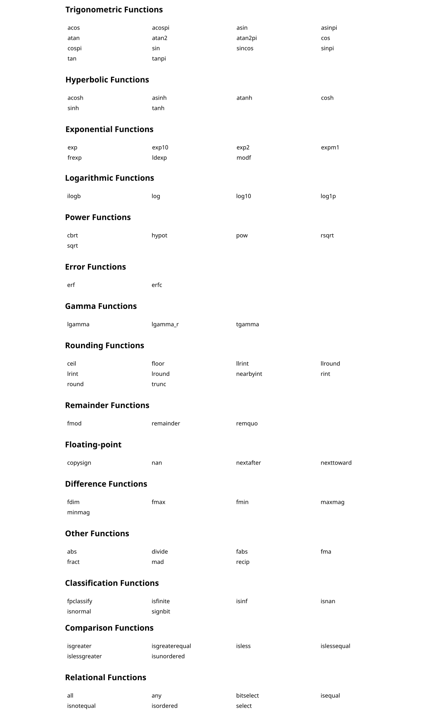
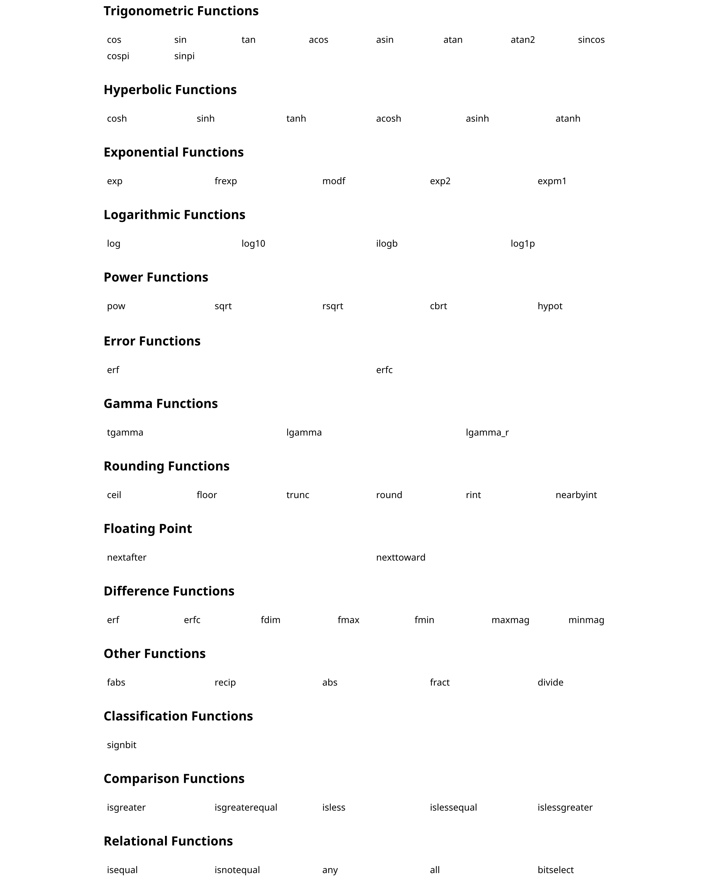
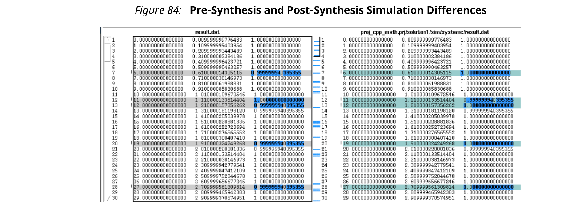

## 2.3 HLS Math Library
Vivado HLS数学库（'hls_math.h'）为标准C（'math.h'）和C++（'cmath.h'）库的综合提供支持，并且自动用于指定综合过程中的数学运算。该支持包括针对所有函数的浮点（单精度，双精度和半精度）以及针对某些函数的定点支持。

'hls_math.h'库可以代替标准C++数学库（'cmath.h'）可选地用于C++源代码，但不能用于C源代码。Vivado HLS将使用适当的实现方式，以避免C仿真与C/RTL协同仿真之间的精度差异。
### HLS Math Library Accuracy
HLS数学函数是通过`hls_math.h`库中的可综合位近似函数实现的。**位近似HLS数学库函数无法提供与标准C函数相同的精度**。为了获得期望的结果，**位近似实现可能会使用与标准C数学库版本不同的底层算法**。函数的精度以ULP（最低精度单位）指定。精度上的差异对C仿真和C / RTL协同仿真都有影响。

ULP差异通常在1-4 ULP范围内。
- 如果在C源代码中使用标准C数学库，则由于某些函数与标准C数学库存在ULP差异的事实，**C仿真与C/RTL协同仿真之间可能会有差异**。
- 如果在C源代码中使用了HLS数学库，则C仿真和C/RTL协同仿真之间不会有差异。但是，使用HLS数学库的C仿真可能与使用标准C数学库的C仿真有所不同。

此外，以下七个函数可能会显示一些差异，具体取决于用于编译和运行C仿真的C标准：
- copysign
- fpclassify
- isinf
- isfinite
- isnan
- isnormal
- signbit

**C90 mode**

通常，系统头文件仅提供`isinf`，`isnan`和`copysign`，它们以`double`形式进行操作。特别地，`copysign`总是返回双精度结果。如果必须将其返回float，则可能在综合之后产生意外的结果，因为将double-to-float转换模块引入了硬件。

**C99 mode (-std=c99)**

通常在期望系统头文件会将它们重定向到__isnan（double）和__isnan（float）的情况下，提供所有七个函数。普通的GCC头文件不会重定向isnormal，而是根据fpclassify实现它。

**C++ Using math.h**

所有这七个都由系统头文件提供，并且它们以双精度方式操作。

copysign始终返回双精度结果。如果必须将其返回到float中，则可能在综合后产生意外结果，因为double-to-fat转换模块已引入到硬件中。

**C++ Using cmath**

与C99模式（-std = c99）相似，不同之处在于：
- 系统头文件通常是不同的。
- 正确地对以下函数进行了重载：
  - float(), snan(double)
  - isinf(double)

即使在使用namespace std;时，copysign和copysignf也作为内置函数处理。

**C++ Using cmath and namespace std**

没有问题。Xilinx建议使用以下命令以获得最佳结果：
- 用于C的，-std = c99
- 用于C和C++的, -fno-builtin

注：要指定C编译选项，例如`-std=c99`，请使用带有`-cflag`的Tcl命令`add_files`选项。或者，使用Project Settings对话框中的“EDIT CFLAG”按钮。

### The HLS Math Library
**HLS数学库中提供了以下功能**。每个函数都支持半精度（type half），单精度（type float）和双精度（type double）。

:star: 重要！对于下面列出的每个函数`func`，库中还提供了一个关联的半精度函数命名为`half_func`和单精度函数命名为`funcf`。

当半精度，单精度和双精度数据类型混合使用时，请检查常见的综合错误，以防止在最终的FPGA实现中引入类型转换硬件。



### Fixed-Point Math Functions
**还为以下数学函数提供定点实现**。

所有定点数学函数均支持ap_[f]fixed和ap_[u]int数据类型，并指定以下位宽， 
```
1. ap_fixed<W,I> where I<=33 and W-I<=32
2. ap_ufixed<W,I> where I<=32 and W-I<=32
3. ap_int <I> where I <= 33
4. ap_uint<I> where I <= 32
```


定点类型提供的函数值精确度稍差一些，但实现的RTL较小且更快。

使用定点数据类型实现数学函数的方法是：
1. 确定是否支持定点实现。
2. 更新数学函数以使用`ap_fixed`类型。
3. 进行C仿真，以验证设计策略是否以所需的精度运行。使用与RTL实现相同的位精度类型来执行C仿真。
4. 综合设计。

例如，函数sin的定点实现是通过将定点类型与数学函数一起使用来指定的，如下所示：
```c++
#include "hls_math.h"
#include "ap_fixed.h"
ap_fixed<32,2> my_input, my_output;
my_input = 24.675;
my_output = sin(my_input);
```
使用定点数学函数时，结果类型必须具有与输入相同的宽度和整数位。

### Verification and Math Functions

如果在C源代码中使用标准C数学库，则C仿真结果和C/RTL协同仿真结果可能会有所不同：**如果源代码中的任何数学函数与标准C数学库相比具有ULP差异，在仿真RTL时可能会导致差异**。

如果在C源代码中使用`hls_math.h`库，则**C仿真和C/RTL协同仿真结果一致**。但是，使用hls_math.h进行C仿真的结果与使用标准C库得到的结果不同。hls_math.h库仅确保C仿真与C/RTL协同仿真结果相匹配。在这两种情况下，都会创建相同的RTL实现。以下说明使用数学函数时用于执行验证的每个可能的选项。

#### Verification Option 1: Standard Math Library and Verify Differences
在这种选项中，标准C数学库在源代码中使用。如果综合的任何函数确实具有确切的精度，则**C/RTL协同仿真与C仿真不同**。下面的示例重点介绍了这种方法。
```c++
#include <cmath>
#include <fstream>
#include <iostream>
#include <iomanip>
#include <cstdlib>
using namespace std;
typedef float data_t;
data_t cpp_math(data_t angle) {
     data_t s = sinf(angle);
     data_t c = cosf(angle);
     return sqrtf(s*s+c*c);
}
```

在这种情况下，C仿真和C/RTL协同仿真之间的结果是不同的。在比较模拟输出时，请记住，将测试台上写入的所有结果写入到执行仿真的工作目录中：
- C simulation: Folder `<project>/<solution>/csim/build`
- C/RTL co-simulation: Folder `<project>/<solution>/sim/<RTL>`

其中，`<project>`是项目文件夹，`<solution>`是文件夹中的解决方案的名称，而`<RTL>`是已验证的RTL的类型（verilog或vhdl）。下图显示了左侧的pre-synthesis结果文件和右侧的post-synthesis RTL结果的典型比较。输出显示在第三列中。



pre-synthesis simulation和post-synthesis simulation的结果以小数为单位。您必须确定这些小数数量在最终的RTL实现中是否可接受。

推荐的处理这些差异的流程是使用测试台，检查结果以确保结果在可接受的误差范围内。这可以通过创建同一函数的两个版本来完成，一个用于综合，另一个作为参考版本。在此示例中，仅综合了`cpp_math`函数。
```c++
#include <cmath>
#include <fstream>
#include <iostream>
#include <iomanip>
#include <cstdlib>
using namespace std;
typedef float data_t;
data_t cpp_math(data_t angle) {
 data_t s = sinf(angle);
 data_t c = cosf(angle);
 return sqrtf(s*s+c*c);
}
data_t cpp_math_sw(data_t angle) {
 data_t s = sinf(angle);
 data_t c = cosf(angle);
 return sqrtf(s*s+c*c);
}
```
在下面的示例中，使用变量diff将两个函数的输出进行比较的测试台来验证设计，以确定差异。在仿真过程中，两个函数均产生相同的输出。对cpp_math的函数进行C/RTL协同仿真会产生不同的结果，并检查结果的差异。
```c++
int main() {
 data_t angle = 0.01;
 data_t output, exp_output, diff;
 int retval=0;
 for (data_t i = 0; i <= 250; i++) {
  output = cpp_math(angle);
  exp_output = cpp_math_sw(angle);
  // Check for differences
  diff = ( (exp_output > output) ? exp_output - output : output - exp_output);
  if (diff > 0.0000005) {
  printf("Difference %.10f exceeds tolerance at angle %.10f \n", diff, angle);
  retval=1;
  }
  angle = angle + .1;
 }
 if (retval != 0) {
  printf("Test failed  !!!\n"); 
  retval=1;
 } else {
  printf("Test passed !\n");
 }
 // Return 0 if the test passes
  return retval;
}
```
如果差异容限降低至0.00000005，则此测试平台将突出显示C/RTL协同仿真期间的误差容限：
```
Difference 0.0000000596 at angle 1.1100001335
Difference 0.0000000596 at angle 1.2100001574
Difference 0.0000000596 at angle 1.5100002289
Difference 0.0000000596 at angle 1.6100002527
etc..
```
当使用标准C数学库（math.h和cmath.h）时，创建一个“智能”测试平台以验证可接受的精度差异。

#### Verification Option 2: HLS Math Library and Validate Differences
另一种验证方式是将源代码转换为使用HLS数学库。启用此选项后，C仿真和C/RTL协同仿真的结果之间没有区别。以下示例显示如何修改以上代码以使用hls_math.h库。

:star: 注意：此选项仅在C++中可用。

- 包括hls_math.h头文件。
- 将数学函数替换为等效的hls::函数。

```c++
#include <cmath>
#include "hls_math.h"
#include <fstream>
#include <iostream>
#include <iomanip>
#include <cstdlib>
using namespace std;
typedef float data_t;
data_t cpp_math(data_t angle) {
 data_t s = hls::sinf(angle);
 data_t c = hls::cosf(angle);
 return hls::sqrtf(s*s+c*c);
}
```
#### Verification Option 3: HLS Math Library File and Validate Differences
将HLS数学库文件lib_hlsm.cpp包括在内作为设计文件，可确保Vivado HLS使用HLS数学库进行C模拟。此opetion与option2相同，但是它不需要修改C代码。

HLS数学库文件位于Vivado HLS安装区域中的src目录中。只需将文件复制到本地文件夹，然后将文件添加为标准设计文件即可。

:star: 注意：此选项仅在C++中可用。

与option2一样，使用此option后，对于使用HLS数学库文件的C仿真结果与先前未添加此文件的结果之间也存在差异。这些差异应使用类似于option1的“智能”测试平台通过C仿真来验证。

### Common Synthesis Errors
以下是综合数学函数时的常见使用错误。这些通常是（但不是唯一）由将C函数转换为C++来利用数学函数的综合功能引起的。

**C++ cmath.h**

如果使用C++ `cmath.h`头文件，则可以使用float函数（例如sinf和cosf）。这些导致硬件中的32位操作。cmath.h头文件还会重载标准函数（例如，sin和cos），因此它们可用于float和double类型。

**C math.h**

如果使用C `math.h`库，则需要单精度函数（例如sinf和cosf）来综合32位浮点运算。所有标准函数调用（例如sin和cos）都将导致double和64-bit double运算被综合。

**Cautions**

将C函数转换为C++以利用对math.h的支持时，在与Vivado HLS综合之前，请确保新的C++代码正确编译。例如，如果在带有`math.h`的代码中使用sqrtf()，则需要在C++代码中添加以下代码extern以支持它：

```c++
#include <math.h>
extern “C” float sqrtf(float);
```

为避免类型转换引起不必要的硬件，请遵循有关浮点和双精度中讨论的将双精度和浮点类型混合在一起的警告。