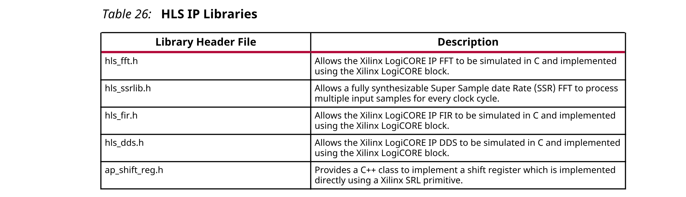

## 2.5 HLS IP Libraries
Vivado HLS提供C++库来实现许多Xilinx IP模块。C库允许直接从C++源代码推断以下Xilinx IP块，从而确保在FPGA中高质量的实现。

### FFT IP Library

### SSR FFT IP Library

### FIR Filter IP Library

### DDS IP Library

### SRL IP Library