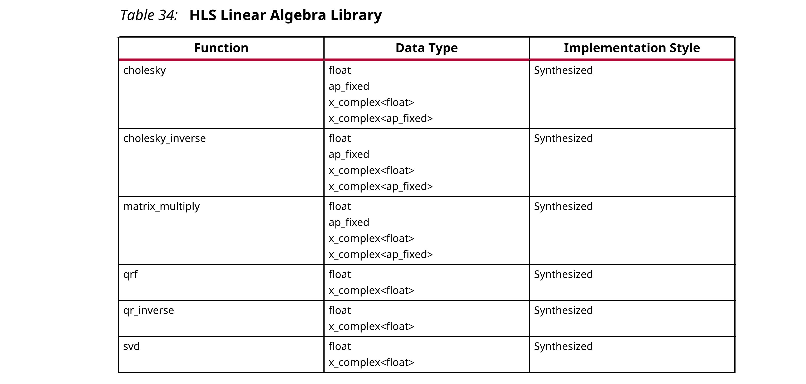
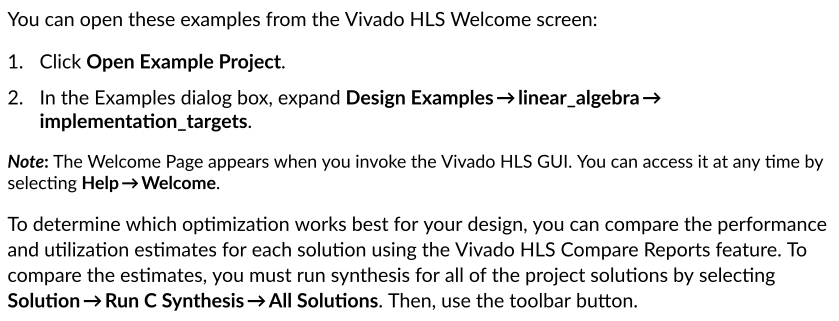

## 2.6 HLS Linear Algebra Library
HLS线性代数库提供了许多常用的C++线性代数函数。HLS线性代数库中的函数均使用二维数组来表示矩阵，并在下表中列出。



线性代数函数都使用二维数组来表示矩阵。所有函数都支持float（单精度）输入，用于实数和复数数据。函数的子集支持用于实数和复数数据的ap_fixed（fixed-point）输入。如果需要，可以由用户定义ap_fixed类型的精度和舍入行为。

### Using the Linear Algebra Library
您可以使用以下方法之一来引用HLS线性代数函数：
- Using scoped naming:
  ```c++
  #include "hls_linear_algebra.h"
  hls::cholesky(In_Array,Out_Array);
  ```
- Using the hls namespace:
  ```c++
  #include "hls_linear_algebra.h"
  using namespace hls; // Namespace specified after the header files
  cholesky(In_Array,Out_Array);
  ```

### Optimizing the Linear Algebra Functions
使用线性代数函数时，必须确定RTL实现的优化级别。优化的级别和类型取决于如何编写C代码以及如何将Vivado HLS指令应用于C代码。

为了简化优化过程，Vivado HLS提供了线性代数库函数，其中包括几种C代码架构和嵌入式优化指令。使用C++配置类，您可以选择要使用的C代码和要应用的优化指令。

尽管确切的优化效果因函数而异，但配置类通常允许您为RTL实现指定优化级别，如下所示：
- Small：资源和吞吐量较低
- Balanced：资源和吞吐量之间的折衷
- Fast：较高的吞吐量，不过以较高的资源为代价

Vivado HLS提供了示例项目，这些项目展示了如何为线性代数库中的每个函数使用配置类。您可以将这些示例用作模板，以了解如何针对特定实现目标为每个函数配置Vivado HLS。每个示例都提供了一个c++源文件，该文件具有多个作为不同c++函数的C代码体系结构。

:star: 注意：要标识顶层C++函数，请在指令.tcl文件或Vivado HLS GUI指令选项卡中查找TOP指令。



#### Cholesky

#### Cholesky Inverse and QR Inverse

#### Matrix Multiply

#### QRF

#### SVD