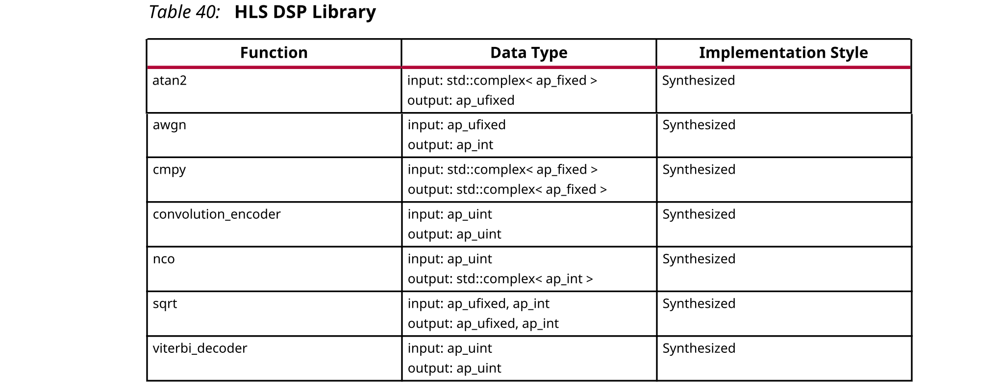

## 2.7 HLS DSP Library
HLS DSP库包含用于C++ DSP系统建模的构建模块函数，重点是SDR应用程序中使用的函数。下表显示了HLS DSP库中的函数。



函数使用Vivado HLS固定精度类型ap_[u]int和ap_[u]fixed来描述所需的输入和输出数据。该函数具有最小的可行接口类型，以最大程度地提高灵活性。例如，具有简单吞吐量模型的函数（例如，一个样本输入一个样本）使用指针接口。执行速率更改的函数（例如viterbi_decoder）在接口上使用hls::stream类型。

您可以复制现有的库并使接口更复杂，例如为指针接口创建hls::streams，为任何函数创建AXI4-Stream接口。但是，复杂的接口需要更多的资源。

Vivado HLS将大多数库元素作为模板化的C++类提供，在头文件(hls_dsp.h)中对其进行了完整说明，其中包含构造函数，析构函数和操作符访问函数。

### Using the DSP Library
您可以使用以下方法之一来引用DSP函数：
- Using scoped naming:
  ```c
  #include <hls_dsp.h>
  static hls::awgn<output_width> my_awgn(seed);
  my_awgn(snr, noise);
  ```
- Using the hls namespace:
  ```c
  #include <hls_dsp.h>
  using namespace hls;
  static awgn<output_width> my_awgn(seed);
  my_awgn(snr, noise);
  ```

DSP库中的函数在源代码中包含了作为prgmas指令的综合指令，这些指令指导Vivado HLS综合函数以满足典型要求。该函数已针对最大吞吐量进行了优化，这是最常见的用例。例如，可以完全分割数组以确保实现初始间隔为1，而不考虑模板参数配置。

您可以按以下步骤删除现有的优化或应用其他优化：
- 要在DSP功能上应用优化，请在Vivado HLS GUI中打开标题文件hls_dsp.h，然后执行以下操作之一 ：
  - 按Ctrl键并单击#include “hls_dsp.h”。
  - 使用Explorer Pane，导航到使用该include文件夹的文件。
- 要添加或删除优化指令，请在Information pane中打开头文件，然后使用“Directives”选项卡。

  :star: 注意：如果将优化添加为编译指示，则Vivado HLS会将优化放置在库中，并在每次将头文件添加到设计时都应用该优化。可能需要文件写入权限才能将优化添加为pragma。

:bulb: 提示：如果要修改函数以修改其RTL实现，请在库源代码中查找带有前缀TIP的注释，该注释指示放置Pragma或应用directive的位置。