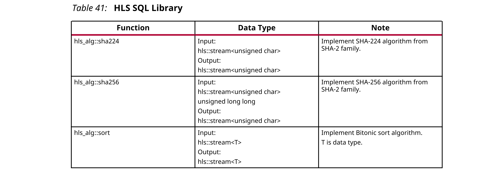

## 2.8 HLS SQL Library
SQL库包含C++中的SQL标准部件函数。下表显示了HLS SQL库中的函数。



Vivado HLS在`hls_db`名称空间中将这些库元素作为模板化的C ++函数提供。有关所有SQL功能的完整描述，请参见第4章中的HLS SQL库功能。
### Using the SQL Library
您可以使用以下方法引用SQL函数：
```c++
#include <hls_alg.h>
hls_alg::sha256(in_stream, in_stream_depth, out_stream);
```
SQL库中的函数在源代码中包含了作为pragmas指令的综合指令，这些指令指导Vivado HLS综合函数以满足典型要求。