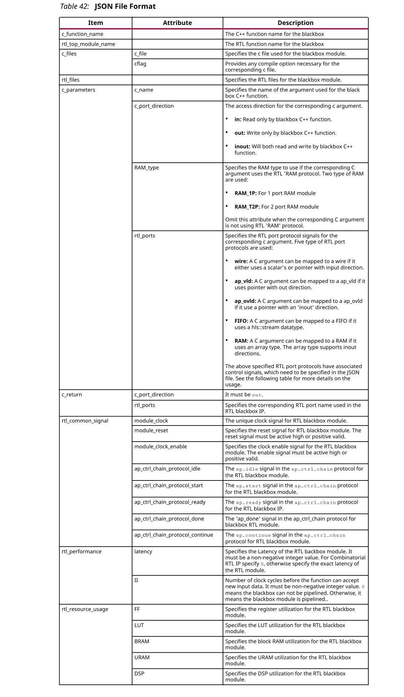
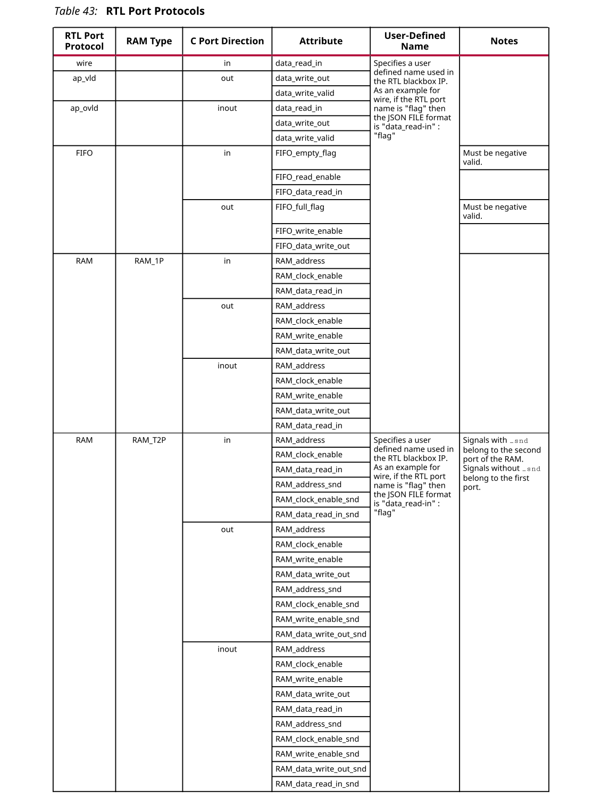

## 3.4 RTL Blackbox
而可以在HLS设计流程中运行设计。RTL IP可以在顺序，流水线或数据流区域中使用。将RTL IP集成到HLS中需要以下文件：
1. Blackbox描述文件
2. RTL IP文件
3. RTL的C实现

要将RTL IP集成到HLS设计中：
1. 创建RTL IP的C实现函数。
2. 在HLS设计内部调用C函数。
3. 创建一个具有必要字段的JSON文件。RTL Blackbox JSON文件中提供了一个示例JSON文件和有关格式的信息。
4. 使用add_files选项将JSON文件添加到script.tcl文件。

  ```
  add_files –blackbox my_file.json
  ```
5. 运行HLS设计流程；即Csim，综合和cosim。

**Requirements and Limitations**

- 在HLS内部，RTL Blackbox 支持仅限于C++。
- 在HLS内部，RTL Blackbox 无法连接到顶层接口I/O信号。
- 在HLS内部，RTL Blackbox 不能直接用作DUT。
- 在HLS内部，RTL Blackbox 不支持结构体或类类型的接口。
- 在HLS内部，RTL Blackbox 支持以下接口协议： 
  - hls::stream：RTL Blackbox IP支持hls::stream接口。在C中使用此特定数据类型时，请在RTL Blackbox IP中为此参数使用FIFO接口。
  - Array：RTL Blackbox IP支持RAM（Arrays）接口。在C中使用此构造时，请将以下RAM接口之一用于RTL Blackbox IP中的相应参数：
    - 单端口RAM – RAM_1P
    - 双端口RAM – RAM_T2P
  - C标量和输入指针：RTL Blackbox IP支持C标量 并且仅在顺序和流水线区域（数据流区域不支持）中输入指针。在C中使用此构造时，请在RTL IP中使用wire。
  - Inout和Out指针：RTL Blackbox IP仅在顺序和流水线区域（数据流区域不支持）支持Inout和Out指针。在C语言中使用此构造时，RTL IP应该将ap_vld用于输出，将ap_ovld用于inout指针。
- 提供给HLS的RTL IP文件应位于Verilog（.v）中。
- RTL IP模块必须具有唯一的时钟信号和唯一的复位信号，该信号为高电平。
- RTL IP模块必须具有用于启用或停止RTL IP的CE信号。
- RTL IP必须使用ap_ctrl_chain协议。有关更多信息，请参见块级I/O协议。

JSON文件限制：
- 名称字段中的c_function name必须与模型的C函数一致。
- rtl_top_module_name必须与c_function_name一致。
- 应该从模板中删除未使用的c_parameters字段。
- 每个c_parameter字段都应与rtl_port字段关联。

:star: 注意：使用RTL Blackbox 时，所有其他HLS设计限制都适用。

**JSON File Format**

下表描述了JSON文件格式：





:star: 注意：RTL Blackbox 的行为C函数必须还遵循建议的HLS编码样式。