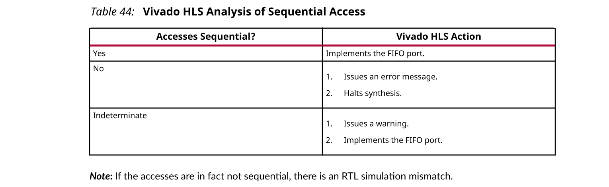

## 3.6 Arrays
在讨论编码风格如何影响综合后的数组实现之前，值得讨论一种情况，在这种情况下，即使在执行综合之前，例如在C仿真期间，数组也会引入问题。

如果指定非常大的数组，则可能导致C仿真用完内存并失败，如以下示例所示： 
```c++
#include "ap_cint.h"
  
  int i, acc; 
  // Use an arbitrary precision type
  int32  la0[10000000], la1[10000000]; 
  
  for (i=0 ; i < 10000000; i++) { 
      acc = acc + la0[i] + la1[i]; 
  } 
```
仿真可能由于内存不足而失败，因为该数组放置在内存中存在的栈中，而不是由OS管理的堆中，并且可以使用本地磁盘空间进行增长。

这可能意味着设计在运行时内存不足，并且某些问题可能使该问题更有可能发生：
- 在PC上，可用内存通常少于大型Linux boxes，并且可用内存可能更少。
- 如上所示，使用任意精度类型会使此问题变得更糟，因为它们比标准C类型需要更多的内存。
- 使用C++和SystemC中更复杂的定点任意精度类型可能会导致问题的发生，因为它们需要更多的内存。

在C/C ++代码开发中改善内存资源的标准方法是使用链接器选项，例如以下用于显式设置堆栈大小`-Wl，-stack，10485760`的选项）来增加堆栈的大小。这可以在Vivado® HLS中应用，方法是转到`Porject Settings → Simulation → Linker flags`，也可以将其作为Tcl命令的选项提供：
```
csim_design -ldflags {-Wl,--stack,10485760} 
cosim_design -ldflags {-Wl,--stack,10485760} 
```
在某些情况下，计算机可能没有足够的可用内存，并且增加堆栈大小无济于事。

解决方法是使用动态内存分配进行仿真，但使用固定大小的数组进行综合，如下面的示例所示。这意味着为此所需的内存在堆上分配，由操作系统管理，并且可以使用本地磁盘空间来增长。

对代码进行这样的更改并不理想，因为现在仿真的代码和综合的代码是不同的，但这可能是使设计过程前进的唯一方法。如果这样做，请确保C测试台涵盖了访问数组的所有方面。由`cosim_design`执行的RTL仿真将验证内存访问是否正确。
```c++
#include "ap_cint.h"
  
  int i, acc; 
#ifdef __SYNTHESIS__
  // Use an arbitrary precision type & array for synthesis
  int32  la0[10000000], la1[10000000]; 
#else 
  // Use an arbitrary precision type & dynamic memory for simulation
  int32 *la0 = malloc(10000000  * sizeof(int32));
  int32 *la1 = malloc(10000000  * sizeof(int32));
#endif
  for (i=0 ; i < 10000000; i++) { 
    acc = acc + la0[i] + la1[i]; 
  } 
```
:star: 注意：仅在要综合的代码中使用`__SYNTHESIS__`宏。不要在测试台使用这个宏，因为它不被C仿真或C RTL系统仿真支持。

数组通常在综合后实现为存储器（RAM，ROM或FIFO）。顶层函数接口上的数组被综合为访问外部存储器的RTL端口。在设计内部，大小小于1024的数组将合成为SRL。大小大于1024的数组将根据优化设置综合为Block RAM，LUTRAM，UltraRAM。

像循环一样，数组是一种直观的编码结构，因此经常在C程序中找到它们。与循环一样，Vivado HLS包含优化和指令，可用于优化其在RTL中的实现，而无需修改代码。

数组可能在RTL中造成问题的情况包括：
- 数组访问经常造成性能瓶颈。当实现为内存时，**内存端口的数量将限制对数据的访问**。如果不仔细执行数组初始化操作，则可能导致RTL中的重置和初始化时间过长。
- 必须小心确保将仅需要**读取访问权限**的数组实现为RTL中的**ROM**。

Vivado HLS支持指针数组。每个指针只能指向一个标量或一个标量数组。

:star: 注意：必须调整数组大小。例如，支持大小确定的数组，例如：Array [10];。但是，不支持大小不确定的数组，例如：Array [];。

### Array Accesses and Performance
以下代码示例显示了一种访问数组可能会限制最终RTL设计性能的情况。在此示例中，对数组mem[N]进行了三次访问以创建求和结果。
```c
#include "array_mem_bottleneck.h"
 
dout_t array_mem_bottleneck(din_t mem[N]) {  
 dout_t sum=0;
 int i;
 SUM_LOOP:for(i=2;i<N;++i)
   sum += mem[i] + mem[i-1] + mem[i-2];
    
 return sum;
}
```
在综合期间，该数组被实现为RAM。如果将RAM指定为单端口RAM，则**不可能**在每个时钟周期上对循环`SUM_LOOP`进行流水线处理以处理新的循环迭代。

尝试以1的启动间隔对SUM LOOP进行流水线处理会导致以下消息（之后未能达到1的吞吐量，Vivado® HLS会放宽约束）：
```
INFO: [SCHED 61] Pipelining loop 'SUM_LOOP'.
WARNING: [SCHED 69] Unable to schedule 'load' operation ('mem_load_2', 
bottleneck.c:62) on array 'mem' due to limited memory ports.
INFO: [SCHED 61] Pipelining result: Target II: 1, Final II: 2, Depth: 3.
```
这里的问题是单端口RAM只有一个数据端口：**每个时钟周期只能执行一次读取（和一次写入）**。
- SUM_LOOP Cycle1: read mem[i];
- SUM_LOOP Cycle2: read mem[i-1], sum values;
- SUM_LOOP Cycle3: read mem[i-2], sum values;

可以使用双端口RAM，但是每个时钟周期仅允许两次访问。需要三次读取才能计算总和的值，因此每个时钟周期需要进行三次访问，以在每个时钟周期上通过新的迭代来流水化循环。

:warning: 警告！**实现为内存或内存端口的数组常常会成为性能的瓶颈**。

可以重新编写上面示例中的代码，如下面的代码示例所示，以允许以1的吞吐量对代码进行流水线处理。在下面的代码示例中，通过执行预读和手动对数据访问进行流水线处理，在循环的每个迭代中仅指定了一个数组。这样可确保仅需要一个单端口RAM即可达到所需的性能。
```c
#include "array_mem_perform.h"
 
dout_t array_mem_perform(din_t mem[N]) {  
 din_t tmp0, tmp1, tmp2;
 dout_t sum=0;
 int i;
 tmp0 = mem[0];
 tmp1 = mem[1];
 SUM_LOOP:for (i = 2; i < N; i++) { 
  tmp2 = mem[i];
  sum += tmp2 + tmp1 + tmp0;
  tmp0 = tmp1;
  tmp1 = tmp2;
 } 
    
 return sum;
}
```
Vivado HLS包括优化指令，用于更改如何实现和访问数组的。通常可以使用指令，而无需更改代码。数组可以分为块或单个元素。在某些情况下，Vivado HLS将数组划分为单个元素。这是可以控制的，通过使用用于自动分区的配置设置。

当一个数组被分成多个块时，**单个数组被实现为多个RTL RAM块**。当分成元素时，**每个元素在RTL中实现为寄存器**。在这两种情况下，分区都允许并行访问更多元素，并有助于提高性能。设计在性能和​​实现此目标所需的RAM或寄存器数量之间权衡。

#### FIFO Accesses
将数组实现为FIFO时，需要特别注意数组访问。通常在使用数据流优化的情况下。

对FIFO的访问必须以从零开始的顺序开始。此外，如果要在多个位置读取数组，则代码**必须严格执行FIFO访问的顺序**。在没有附加代码来强制执行访问顺序的情况下，通常**无法将具有多个扇出的数组实现为FIF**O。

### Arrays on the Interface
Vivado® HLS默认情况下将数组综合到Memory元素中。当您使用数组作为顶层函数的参数时，Vivado HLS假定以下内容：
- Memory is off-chip. Vivado HLS综合接口端口以访问内存。
- Memory is standard block RAM with a latency of 1. 提供地址一个时钟周期后，数据准备就绪。

要配置Vivado HLS如何创建这些端口，请执行以下操作：
- 使用INTERFACE指令将接口指定为**RAM或FIFO接口**。
- 使用RESOURCE指令将**RAM指定为单端口或双端口RAM**。
- 使用RESOURCE指令指定**RAM延迟**。
- 使用数组优化指令（Array_Partition，Array_Map或Array_Reshape）重新配置数组的结构，从而重新配置I/O端口的数量。

:bulb: 提示：由于通过存储器（RAM或FIFO）端口限制了对数据的访问，因此接口上的数组会产生性能瓶颈。通常，您可以使用指令克服这些瓶颈。

在可综合代码中使用数组时，必须确定数组的大小。例如，如果将数组接口中d_i[4]的声明更改为d_i[]，则Vivado HLS发出一条消息，指出无法综合设计：
```
@E [SYNCHK-61] array_RAM.c:52: unsupported memory access on variable 'd_i' 
which is (or contains) an array with unknown size at compile time.
```
#### Array Interfaces
resource 指令可以显式指定使用哪种类型的RAM，并因此指定创建哪些RAM端口（单端口或双端口）。如果未指定resource，则Vivado® HLS使用：
- 默认情况下为单端口RAM。
- 双端口RAM，如果它可以缩短启动间隔或减少延迟。

partition，map和reshape指令可以在接口上重新配置数组。数组可以划分为多个较小的数组，每个数组都有自己的接口。这包括将数组的每个元素划分为自己的标量元素的能力。在函数接口上，这将为数组中的每个元素提供唯一的端口。这提供了最大的并行访问权限，但创建了更多端口，并且可能在上述层次结构中引入布线问题。

同样，较小的数组可以组合为单个较大的数组，从而形成单个接口。尽管这可能会更好地映射到片外Block RAM，但也可能会导致性能下降。可以使用Vivado HLS优化指令进行这些折衷，并且不影响编码。

默认情况下，以下代码示例中显示的函数中的数组参数将综合到单端口RAM接口中。
```c
#include "array_RAM.h"
void array_RAM (dout_t d_o[4], din_t d_i[4], didx_t idx[4]) {
 int i;
 For_Loop: for (i=0;i<4;i++) {
 d_o[i] = d_i[idx[i]];
 }
}
```
使用单端口RAM接口是因为for循环确保每个时钟周期只能读取和写入一个元素。使用双端口RAM接口没有任何优势。

如果展开for-loop，则Vivado HLS使用双端口。这样做允许在同一时间读取多个元素，并缩短了启动间隔。RAM接口的类型可以通过应用resource指令来明确设置。

与接口上的数组有关的问题通常与吞吐量有关。可以使用优化指令来处理它们。例如，如果上面示例中的数组被划分为单个元素，并且展开了for循环，则每个数组中的所有四个元素都将同时访问。

您还可以使用RESOURCE指令来指定RAM的延迟。这使Vivado HLS可以在接口上对延迟大于1的外部SRAM进行建模。

#### FIFO Interfaces
Vivado®HLS允许将数组参数实现为RTL中的FIFO端口。如果要使用FIFO端口，请确保顺序访问数组。Vivado HLS确定访问是否按顺序。



以下代码示例显示了Vivado HLS无法确定访问是否顺序的情况。在此示例中，d_i和d_o被指定为在综合期间通过FIFO接口实现。
```c
#include "array_FIFO.h"
void array_FIFO (dout_t d_o[4], din_t d_i[4], didx_t idx[4]) {
 int i;
#pragma HLS INTERFACE ap_fifo port=d_i
#pragma HLS INTERFACE ap_fifo port=d_o
 // Breaks FIFO interface d_o[3] = d_i[2];
 For_Loop: for (i=0;i<4;i++) {
  d_o[i] = d_i[idx[i]];
 }
}
```
在这种情况下，变量idx的行为决定了是否可以成功创建FIFO接口。
- 如果idx顺序增加，则可以创建FIFO接口。
- 如果将随机值用于idx，则在RTL中实现时，FIFO接口将失败。

由于此接口可能不起作用，因此Vivado HLS在综合过程中发出一条消息并创建一个FIFO接口。
```
@W [XFORM-124] Array 'd_i': may have improper streaming access(es).
```
如果删除了上面示例中的// Breaks FIFO接口注释，则Vivado HLS可以确定对阵列的访问不是顺序的，并且如果指定了FIFO接口，则会中止并显示一条错误消息。
:star: 注意：FIFO端口无法为读取和写入的数组进行综合。必须创建单独的输入和输出数组（如上例所示）。

以下一般规则适用于使用**流接口**（而不是FIFO接口）实现的数组：
- 必须仅在一个循环或函数中写入和读取数组。可以将其转换为与FIFO链接的特征相匹配的点对点连接。
- 数组读取的顺序必须与数组写入的顺序相同。因为FIFO通道不支持随机访问，所以必须按照先进先出的语义在程序中使用该数组。
- 必须在编译时分析用于从FIFO读取和写入的索引。无法对基于运行时计算的数组寻址进行FIFO语义分析，并阻止该工具将数组转换为FIFO。

通常不需要更改代码即可实现或优化顶层接口中的数组。接口上唯一需要更改编码的数组是当数组是结构体的一部分时。
### Array Initialization
:white_check_mark: 建议：尽管不是必需的，但是Xilinx建议指定要使用static限定符实现为内存的数组。这不仅可以确保Vivado®HLS在RTL中使用内存来实现数组，它还允许使用静态类型的初始化行为。

在下面的代码中，使用一组值初始化一个数组。每执行一次函数，就会为数组coeff分配这些值。在综合之后，设计在每次执行时都会将这些值加载到实现coeff的RAM中。对于单端口RAM，这将需要八个时钟周期。对于1024个数组，当然要花费1024个时钟周期，在此期间不会发生任何依赖于coeff的操作。
```c
int coeff[8] = {-2, 8, -4, 10, 14, 10, -4, 8, -2};
```
以下代码使用static限定符定义数组coeff。在执行开始时使用指定的值初始化该数组。每次执行函数时，数组coeff都会使用以前的执行中记住的值。静态数组在C代码中的行为与内存在RTL中的行为相同。
```c
static int coeff[8] = {-2, 8, -4, 10, 14, 10, -4, 8, -2};
```
此外，如果变量具有static限定符，则Vivado HLS会在RTL设计和FPGA位流中初始化变量。这样就无需多个时钟周期来初始化存储器，并确保了初始化大存储器不会产生操作开销。

RTL配置命令可以指定在应用复位后静态变量是否返回到其初始状态（不是默认值）。如果要在执行复位操作后将存储器返回到其初始状态，则会有操作开销，并且需要多个周期来复位值。每个值必须写到每个内存地址中。
#### Implementing ROMs
Vivado®HLS不需要指定带有static限定符的数组来综合存储器，也不需要常数限定符来推断该存储器应该是ROM。Vivado HLS分析设计并尝试创建最佳的硬件。

Xilinx强烈建议对打算用作存储器的数组使用static限定符。正如Array Initialize中提到的那样，static类型的行为几乎与RTL中的内存相同。

仅读取数组时，也建议使用`const`限定符，因为Vivado HLS不能总是推断出在设计分析中应该使用ROM。**ROM自动推断的一般规则是在读取之前将本地静态（非全局）数组写入其中**。代码中的以下实践可以帮助推断ROM：
- 尽早在使用该数组的函数中初始化该数组。
- 一起写。
- 请勿将数组（ROM）初始化写入与非初始化代码交错。
- 请勿将不同的值存储到同一数组元素（将所有写入组合在代码中）。
- 除初始化循环计数器变量外，元素值的计算不得依赖于任何非常数（在编译时）设计变量。

如果使用复杂的赋值来初始化ROM（例如，来自math.h库的函数），则将数组初始化放置在单独的函数中，从而可以推断出ROM。在下面的示例中，将数组sin_table[256]推断为内存，并在RTL综合后实现为ROM。
```cc
#include "array_ROM_math_init.h"
#include <math.h>
void init_sin_table(din1_t sin_table[256])
{
 int i;
 for (i = 0; i < 256; i++) {
 dint_t real_val = sin(M_PI * (dint_t)(i - 128) / 256.0);
 sin_table[i] = (din1_t)(32768.0 * real_val);
 }
}
dout_t array_ROM_math_init(din1_t inval, din2_t idx)
{
 short sin_table[256];
 init_sin_table(sin_table);
 return (int)inval * (int)sin_table[idx];
}
```

:bulb: 提示：因为sin()函数的结果为常数，所以RTL设计中不需要内核即可实现sin()函数。