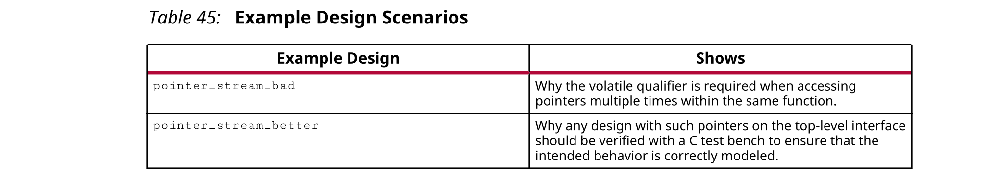
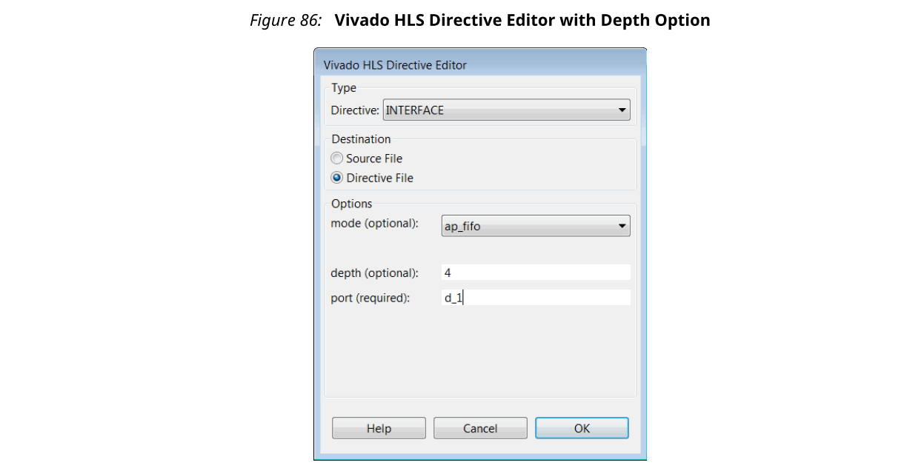

## 3.7 Data Types
C函数中使用的数据类型在编译为可执行文件后会影响结果的准确性和内存要求，并可能影响性能。
- 32位整数int数据类型可以容纳更多数据，因此比8位char类型具有更高的精度，但是需要更多的存储空间。
- 如果在32位系统上使用64位long long类型，则运行时间会受到影响，因为它通常需要多次访问才能读取和写入这些值。

类似地，当将C函数综合到RTL实现中时，**类型会影响RTL设计的精度，面积和性能**。用于变量的数据类型决定了**所需运算符的大小**，因此决定了RTL的面积和性能。

Vivado HLS支持所有标准C类型的综合，包括精确宽度整数类型。
- (unsigned) char, (unsigned) short, (unsigned) int
- (unsigned) long, (unsigned) long long
- (unsigned) intN_t (where N is 8, 16, 32 and 64, as defined in stdint.h)
- float, double

精确宽度整数类型可用于确保设计可在所有类型的系统中移植。

C标准指示整数类型(unsigned)long在64位操作系统上实现为64位，在32位操作系统上实现为32位。综合与该行为相匹配，并产生不同大小的运算符，因此，根据运行Vivado HLS的操作系统的类型，可以使用不同的RTL设计。在Windows操作系统上，无论使用什么操作系统，Microsoft定义类型long都必须为32位。
- Use data type (unsigned)int or (unsigned)int32_t instead of type (unsigned)long for **32-bit**.
- Use data type (unsigned)long long or (unsigned)int64_t instead of type (unsigned)long for **64-bit**.

:star: 注意：`-m32`上的C/C++编译优化可用于指定代码是为C仿真而编译的，并被综合为32位体系结构的规范。这样可确保将long数据类型实现为32位值。此选项使用`-CFLAGS`选项应用于`add_files`命令。

Xilinx强烈建议在公共头文件中定义所有变量的数据类型，该文件可以包含在所有源文件中。
- 在典型的Vivado HLS项目过程中，可能会修正某些数据类型，例如，以减小其大小并允许更有效地实施硬件。
- 进行更高抽象级别工作的好处之一是能够快速创建新的设计实现。**通常在以后的项目中使用相同的文件，但可能使用不同的（较小或较大或更准确的）数据类型**。

当可以一个位置更改数据类型时，这两项任务都更容易实现：另一种方式是编辑多个文件。

:star: 重要！在头文件中使用宏时，请始终使用唯一的名称。例如，如果在头文件中定义了名为`_TYPES_H`的宏，则可能在其他系统文件中定义了这样的通用名称，并且它可能启用或禁用了一些其他代码，从而导致无法预料的副作用。等等。

### Standard Types
以下代码示例显示了正在执行的一些基本算术运算。
```c
#include "types_standard.h"
void types_standard(din_A  inA, din_B  inB, din_C  inC, din_D  inD,
 dout_1 *out1, dout_2 *out2, dout_3 *out3, dout_4 *out4
) {
 // Basic arithmetic operations
 *out1 = inA * inB;
 *out2 = inB + inA;
 *out3 = inC / inA;
 *out4 = inD % inA;
}  
```
上面示例中的数据类型在以下代码示例中显示的头文件`files_standard.h`中定义。它们显示了如何使用以下类型：
- 标准带符号类型
- 无符号类型
- 精确宽度整数类型（包含头文件`stdint.h`）

```c
#include <stdio.h>
#include <stdint.h>
#define N 9
typedef char din_A;
typedef short din_B;
typedef int din_C;
typedef long long din_D;
typedef int dout_1;
typedef unsigned char dout_2;
typedef int32_t dout_3;
typedef int64_t dout_4;
void types_standard(din_A inA,din_B inB,din_C inC,din_D inD,dout_1 *out1,dout_2 *out2,dout_3 *out3,dout_4 *out4);
```
这些不同的类型在综合之后会导致以下运算符和端口大小：
- 用于计算结果out1的乘法器是24位乘法器。8位char类型乘以16位short类型需要一个24位乘法器。结果将符号扩展为32位以匹配输出端口宽度。
- 用于out2的加法器是8位的。由于输出是8位无符号字符类型，因此仅将inB的8位低位（16位短）加到8位char类型inA中。
- 对于输出out3（32位精确宽度类型），将8位char类型inA符号扩展为32位值，并使用32位（int类型）inC输入执行32位除法运算。
- 使用64位long long类型的inD和8位char类型的inA符号扩展到64位来执行64位模运算，以创建64位输出结果out4。

如out1的结果所示，Vivado HLS使用了它能使用的最小运算符，并扩展了结果以匹配所需的输出位宽。对于结果out2，即使输入之一是16位，也可以使用8位加法器，因为仅需要8位输出。如out3和out4的结果所示，如果需要所有位，则将综合成一个完整大小的运算符。
#### Floats and Doubles
Vivado HLS支持float和double类型综合。两种数据类型均符合IEEE-754标准。
- Single-precision 32 bit
  - 24-bit fracti on
  - 8-bit exponent
- Double-precision 64 bit
  - 53-bit fracti on
  - 11-bit exponent

:white_check_mark: 推荐：当使用浮动点数据类型时，Xilinx强烈建议您查看Floating-Point Design with Vivado HLS（XAPP599）。

除了对标准算术运算（例如+，-，*）使用浮点数和双精度数外，math.h（对于C++也使用cmath.h）通常使用浮点数和双精度数。本节讨论对标准运算符的支持。

下面的代码示例显示与标准类型一起使用的头文件，这些头文件已更新为将数据类型定义为double和float类型。
```c
#include <stdio.h>
#include <stdint.h>
#include <math.h>
#define N 9
typedef double din_A;
typedef double din_B;
typedef double din_C;
typedef float din_D;
typedef double dout_1;
typedef double dout_2;
typedef double dout_3;
typedef float dout_4;
void types_float_double(din_A inA,din_B inB,din_C inC,din_D inD,dout_1 
*out1,dout_2 *out2,dout_3 *out3,dout_4 *out4);
```
此更新的头文件与以下代码示例一起使用，其中使用了sqrtf()函数。
```c
#include "types_float_double.h"
void types_float_double(
 din_A  inA,
 din_B  inB,
 din_C  inC,
 din_D  inD,
 dout_1 *out1,
 dout_2 *out2,
 dout_3 *out3,
 dout_4 *out4
 ) {
 // Basic arithmetic & math.h sqrtf() 
 *out1 = inA * inB;
 *out2 = inB + inA;
 *out3 = inC / inA;
 *out4 = sqrtf(inD);
}
```
上面的示例综合后，它会产生64位双精度乘法器，加法器和除法运算符。这些运算符由适当的float-point Xilinx® IP Catalog核心实现。

使用的sqrtf（）的平方根函数是使用32位单精度浮点核实现的。

如果使用了双精度平方根函数sq​​rt()，则将导致在inD和out4中使用的32位单精度浮点类型之间进行强制转换：sqrt()是双精度（double）函数，而sqrtf()是单精度（float）函数。

在C函数中，将float和double类型混合时要小心，因为在硬件中推断出float-to-double和double-to-float转换单元。
```c
float foo_f    = 3.1459;
float var_f = sqrt(foo_f); 
```
上面的代码产生以下硬件：
```
wire(foo_t)
-> Float-to-Double Converter unit
-> Double-Precision Square Root unit
-> Double-to-Float Converter unit
-> wire(var_f)
```

使用sqrtf（）函数：
- 无需在硬件中使用类型转换器。
- 节省面积。
- 改善时间。

当综合浮点数和双精度类型时，Vivado HLS保持在C代码中执行的操作顺序，以确保结果与C仿真相同。**由于饱和和截断**，不能保证以下内容在单精度和双精度操作中相同：
```c
       A=B*C; A=B*F;
       D=E*F; D=E*C;
       O1=A*D O2=A*D;
```
对于浮点和双精度类型，不能保证O1和O2相同。

:bulb: 提示：在某些情况下（取决于设计），诸如展开或部分展开循环之类的优化可能无法充分利用并行计算的优势，**因为Vivado HLS在综合float和double时会严格遵守操作顺序**。

对于C++设计，Vivado HLS提供了最常用的数学函数的近似实现。

**Arbitrary Precision Data Types**

Vivado HLS提供了浮点数和双精度数中所述的任意精度数据类型。

### Composite Data Types
Vivado HLS支持用于综合的复合数据类型：
- struct
- enum
- union
#### Structs
当将结构体用作顶层函数的参数时，通过综合创建的端口是结构成员的直接反映。标量成员被实现为标准标量端口，而数组默认被实现为内存端口。

在此设计示例中，在以下代码示例中所示的头文件中定义了struct data_t。该结构体具有两个数据成员： 
- An unsigned vector A of type short (16-bit).
- An **array** B of four unsigned char types (8-bit).
  
  ```c
  typedef struct {
    unsigned short A;
    unsigned char B[4];
    } data_t;
  data_t struct_port(data_t i_val, data_t *i_pt, data_t *o_pt);
  ```
- 在下面的代码示例中，该结构体既用作值传递参数（从i_val到o_val的返回值），又用作指针（从*i_pt到*o_pt）。

  ```c
  #include "struct_port.h"
  data_t struct_port(
    data_t  i_val,
    data_t  *i_pt,
    data_t  *o_pt
    ) {
    data_t  o_val;
    int i;
    // Transfer pass-by-value structs
    o_val.A = i_val.A+2;
    for (i=0;i<4;i++) {
      o_val.B[i] = i_val.B[i]+2;
    }
    // Transfer pointer structs
    o_pt->A = i_pt->A+3;
    for (i=0;i<4;i++) {
      o_pt->B[i] = i_pt->B[i]+3;
    }
    return o_val;
  }
  ```
  所有函数参数和返回值都被综合为端口，如下所示：
- Struct element A results in a 16-bit port.
- Struct element B results in a RAM port, accessing 4 elements.

Vivado HLS可以综合的结构体的大小或复杂性没有限制。根据需要，结构体可以有尽可能多的数组维度和成员。当将数组实现为流式传输（例如FIFO接口）时，结构体实现的唯一限制发生。在这种情况下，请遵循适用于接口（FIFO接口）上的数组的相同常规规则。

可以通过data packing优化将结构体上的元素打包到单个向量中。有关更多信息，请参阅`set_directive_data_pack`命令以执行此优化。另外，可以通过`config_interface`命令的`-trim_dangling_ports`选项从接口中删除结构体的未使用元素。

#### Enumerated Types
以下代码示例中的头文件定义了一些enum类型，并在结构体中使用它们。该结构体又在另一个结构体中使用。这允许使用复杂类型的直观描述。

下面的代码示例演示如何指定和综合复杂定义（MAD_NSBSAMPLES）语句。
```c
#include <stdio.h>
enum mad_layer {
 MAD_LAYER_I   = 1,
 MAD_LAYER_II  = 2,
 MAD_LAYER_III = 3
};
enum mad_mode {
 MAD_MODE_SINGLE_CHANNEL = 0,
 MAD_MODE_DUAL_CHANNEL = 1,
 MAD_MODE_JOINT_STEREO = 2,
 MAD_MODE_STEREO = 3
};
enum mad_emphasis {
 MAD_EMPHASIS_NONE = 0,
 MAD_EMPHASIS_50_15_US = 1,
 MAD_EMPHASIS_CCITT_J_17 = 3
};
typedef   signed int mad_fixed_t;
typedef struct mad_header {
 enum mad_layer layer;
       enum mad_mode mode;
 int mode_extension;
 enum mad_emphasis emphasis;
 unsigned long long bitrate;
 unsigned int samplerate;
 unsigned short crc_check;
 unsigned short crc_target;
 int flags;
 int private_bits;
} header_t;
typedef struct mad_frame {
 header_t header;
 int options;
 mad_fixed_t sbsample[2][36][32];
} frame_t;
# define MAD_NSBSAMPLES(header)  \
 ((header)->layer == MAD_LAYER_I ? 12 :  \
 (((header)->layer == MAD_LAYER_III &&  \
 ((header)->flags & 17)) ? 18 : 36))
void types_composite(frame_t *frame);
```
在下面的示例中使用在上一个示例中定义的struct和enum类型。如果枚举在顶层函数的参数中使用，它将被综合为32位值，以符合标准C编译行为。如果枚举类型在设计内部，则Vivado HLS会将其优化到仅所需的位数。

以下代码示例显示在综合期间如何忽略printf语句。
```c
#include "types_composite.h"
void types_composite(frame_t *frame)
{
 if (frame->header.mode != MAD_MODE_SINGLE_CHANNEL) {
   unsigned int ns, s, sb;
   mad_fixed_t left, right;
   ns = MAD_NSBSAMPLES(&frame->header);
   printf("Samples from header %d \n", ns);
   for (s = 0; s < ns; ++s) {
   for (sb = 0; sb < 32; ++sb) {
    left  = frame->sbsample[0][s][sb];
    right = frame->sbsample[1][s][sb];
    frame->sbsample[0][s][sb] = (left + right) / 2;
   }
  }
  frame->header.mode = MAD_MODE_SINGLE_CHANNEL;
 }
}
```
#### Unions
在下面的代码示例中，使用双精度和结构体创建union。与C编译不同，**综合不能保证对union中的所有字段使用相同的内存**（(in the case of synthesis, registers）。Vivado HLS执行优化，以提供最佳的硬件。
```c
#include "types_union.h"
dout_t types_union(din_t N, dinfp_t F)
{
 union {
    struct {int a; int b; } intval;
    double fpval;
 } intfp;
 unsigned long long one, exp;
 // Set a floating-point value in union intfp
 intfp.fpval = F;
 // Slice out lower bits and add to shifted input
 one = intfp.intval.a;
 exp = (N & 0x7FF);
 return ((exp << 52) + one) & (0x7fffffffffffffffLL);
} 
```
Vivado HLS不支持以下各项：
- 顶层函数接口上的union。
- 指针重新解释以进行综合。因此，联合不能保存指向不同类型或不同类型数组的指针。
- 通过另一个变量访问union。使用与上一个示例相同的union，不支持以下操作： 
  ```c
  for (int i = 0; i < 6; ++i) {
    if (i<3) 
      A[i] = intfp.intval.a + B[i];
    else
      A[i] = intfp.intval.b + B[i];
  }
  ```
- 但是，可以将其显式重新编码为：
  ```c
  A[0] = intfp.intval.a + B[0];
  A[1] = intfp.intval.a + B[1];
  A[2] = intfp.intval.a + B[2];
  A[3] = intfp.intval.b + B[3];
  A[4] = intfp.intval.b + B[4];
  A[5] = intfp.intval.b + B[5];
  ```
union的综合不支持在自然C类型和用户定义类型之间进行强制转换。

在VHLS设计中，union通常用于将原始位从一种数据类型转换为另一种数据类型。通常，在顶级端口接口上使用浮点值时，需要进行原始位转换。例如，请参见以下内容： 
```c
typedef float T;
unsigned int value; // the "input" of the conversion
T myhalfvalue; // the "output" of the conversion
union
{
  unsigned int as_uint32;
  T as_floatingpoint;
} my_converter;
my_converter.as_uint32 = value;
myhalfvalue = my_converter. as_floatingpoint;
```
这种类型的代码适用于C型数据类型，并且经过修改后也适用于double数据类型。但是，将typedef和int更改为short不适用于half数据类型，因为half是类，不能在联合中使用。而是，可以使用以下代码：
```cc
typedef half T;
short value;
T myhalfvalue = static_cast<T>(value);
```
同样，转换的另一种方法是使用`value = static_cast <ap_uint<16>>(myhalfvalue)`或`static_cast <unsigned short>(myhalfvalue)`。
```cc
ap_fixed<16,4> afix = 1.5;
ap_fixed<20,6> bfix = 1.25;
half ahlf = afix.to_half();
half bhlf = bfix.to_half();
```
另一种方法是使用辅助类`fp_struct<half>`通过`data()`或`to_int()`方法进行转换。使用头文件`hls/utils/x_hls_utils.h`。
#### Type Qualifiers
类型限定符可以直接影响由高级综合创建的硬件。通常，限定符以可预测的方式影响综合结果，如下所述。Vivado HLS仅受制于对限定符的解释，因为它影响函数行为，并且可以执行优化以创建更优化的硬件设计。在每个限定符的概述之后显示了这些示例。
#### Volatile
当在函数接口上多次访问指针时，volatile限定符会影响RTL中执行多少次读取或写入操作。尽管volatile限定符会影响层次结构中所有函数的行为，但volatile限定符的影响主要在顶层接口部分中进行讨论。

任意精度类型不支持用于算术运算的volatile限定符。在使用算术表达式之前，必须将使用volatile限定符的任何任意精度数据类型赋值给non-volatile数据类型。

Related Information

Understanding Volatile  Data


#### Statics
函数中的static类型在函数调用之间保留其值。硬件设计中的等效行为是**寄存器变量**（触发器或存储器）。如果要使C函数正确执行则要求变量是static类型，则它肯定是最终RTL设计中的寄存器。该值必须在函数和设计的调用之间维护。

**仅static类型会导致综合后是寄存器不完全正确**。Vivado HLS确定在RTL设计中需要将哪些变量实现为寄存器。例如，**如果必须在多个周期中保存变量赋值**，即使C函数中的原始变量不是static类型，Vivado HLS也会创建一个寄存器来保存该值。

Vivado HLS遵循static的初始化行为，并在初始化过程中将该值分配为零（或任何明确初始化的值）给寄存器。这意味着将在RTL代码和FPGA位流中初始化静态变量。这并不意味着每次复位信号都会重新初始化变量。

请参阅RTL配置（config_rtl命令）以确定有关系统重置的静态初始化值的实现方式。

#### Const
const类型指定该变量的值永远不会更新。该变量被读取但从未写入，因此必须初始化。对于大多数const变量，这通常意味着在RTL设计中将它们简化为常量。**Vivado HLS执行常量的传播并删除任何不必要的硬件**。

对于**数组**，在最终RTL设计中（在Vivado HLS对小型数组不执行任何自动分区的情况下），**将const变量实现为ROM**。用const限定符指定的数组（如静态变量）在RTL和FPGA位流中初始化。无需重置它们，因为它们从未被写入。

##### Vivado HLS Optimizations
以下代码示例显示了Vivado HLS实现ROM的情况，即使未使用static或const限定符指定数组也是如此。这突出显示了Vivado HLS如何分析设计并确定最佳实施方案。使用限定符或不使用，会影响但不决定最终的RTL。
```c
#include "array_ROM.h"
dout_t array_ROM(din1_t inval, din2_t idx)
{
 din1_t lookup_table[256];
 dint_t i;
 for (i = 0; i < 256; i++) {
 lookup_table[i] = 256 * (i - 128);
 }
 return (dout_t)inval * (dout_t)lookup_table[idx];
}
```
在前面的示例中，Vivado HLS能够通过将变量lookup_table作为最终RTL中的memory元素来确定最佳实现。
### Global Variables
全局变量可以在代码中自由使用，并且可以完全综合。默认情况下，全局变量不作为RTL接口上的端口公开。

以下代码示例显示了全局变量的默认综合行为。它使用三个全局变量。尽管此示例使用数组，但Vivado HLS支持所有类型的全局变量。
- 从数组Ain读取值。
- 数组Aint用于将值从Ain转换并传递到Aout。
- 输出被写到数组Aout。
```c
din_t Ain[N];
din_t Aint[N];
dout_t Aout[N/2];
void types_global(din1_t idx) {
 int i,lidx;
  // Move elements in the input array
 for (i=0; i<N; ++i) { 
 lidx=i;
 if(lidx+idx>N-1)
 lidx=i-N;
 Aint[lidx] = Ain[lidx+idx] + Ain[lidx];
 }
 // Sum to half the elements
 for (i=0; i<(N/2); i++) { 
 Aout[i] = (Aint[i] + Aint[i+1])/2;
 }
}
```
默认情况下，在综合之后，RTL设计上的唯一端口是端口idx。默认情况下，全局变量不公开为RTL端口。在默认情况下：
- Array Ain is an **internal RAM** that is read from.
- Array Aout is an **internal RAM** that is writt en to.
#### Exposing Global Variables as I/O Ports
尽管默认情况下全局变量未公开为I/O端口，但可以使用选项expose_global将其公开为I/O端口。接口配置中的expose_global选项可以将所有全局变量公开为RTL接口上的端口。接口配置可以通过以下方式设置：
- Solution Settings → General, or
- The `config_interface` Tcl command

使用接口配置公开全局变量时，设计中的所有全局变量都作为I/O端口公开，包括那些仅在设计内部访问的变量。

最后，如果使用静态限定符指定了任何全局变量，则无法将其综合到I/O端口。

总而言之，尽管Vivado HLS支持全局变量进行综合，但Xilinx不建议广泛使用全局变量的编码风格。

### Pointers
指针在C代码中得到广泛使用，并且得到综合支持。使用指针时，在以下情况下要小心：
- 在同一函数中多次访问（读或写）指针时。
- 使用指针数组时，每个指针都必须指向标量或标量数组（而不是另一个指针）。
- 仅在标准C类型之间才支持指针转换，如图所示。

以下代码示例显示对指向多个对象的指针的综合支持。
```c
#include "pointer_multi.h"
dout_t pointer_multi (sel_t sel, din_t pos) {
 static const dout_t a[8] = {1, 2, 3, 4, 5, 6, 7, 8};
 static const dout_t b[8] = {8, 7, 6, 5, 4, 3, 2, 1};
 dout_t* ptr;
 if (sel) 
  ptr = a; 
 else 
  ptr = b;
 return ptr[pos];
} 
```
**Vivado HLS支持综合指针的指针**，但在**顶级接口上不支持它们**，即作为顶层函数的参数。如果您在多个函数中使用指针的指针，则Vivado HLS会**内联所有使用该指针的指针函数**。内联多个函数可以增加运行时间。
```c
#include "pointer_double.h"
data_t sub(data_t ptr[10], data_t size, data_t**flagPtr)
{
 data_t x, i;
 x = 0;
 // Sum x if AND of local index and pointer to pointer index is true
 for(i=0; i<size; ++i)
   if (**flagPtr & i)
        x += *(ptr+i);
 return x;
}
data_t pointer_double(data_t pos, data_t x, data_t* flag)
{
 data_t array[10] = {1, 2, 3, 4, 5, 6, 7, 8, 9, 10};
 data_t* ptrFlag;
 data_t i;
 ptrFlag = flag;
 // Write x into index position pos
 if (pos >=0 & pos < 10) 
 *(array+pos) = x;
 // Pass same index (as pos) as pointer to another function
 return sub(array, 10, &ptrFlag);
}
```
指针数组也可以综合。请参见下面的代码示例，其中使用一个指针数组来存储全局数组第二维的起始位置。指针数组中的指针只能指向标量或标量数组。他们不能指向其他指针。
```c
#include "pointer_array.h"
data_t A[N][10];
data_t pointer_array(data_t B[N*10]) {
 data_t i,j;
 data_t sum1;
 // Array of pointers
 data_t* PtrA[N];
 // Store global array locations in temp pointer array
 for (i=0; i<N; ++i) 
    PtrA[i] = &(A[i][0]);
 // Copy input array using pointers
 for(i=0; i<N; ++i) 
    for(j=0; j<10; ++j) 
       *(PtrA[i]+j) = B[i*10 + j];
  // Sum input array
 sum1 = 0;
 for(i=0; i<N; ++i)
    for(j=0; j<10; ++j) 
       sum1 += *(PtrA[i] + j);
 return sum1;
} 
```
如果使用native C类型，则支持将指针强制转换用于综合。在下面的代码示例中，将int类型转换为char类型。
```c
#define N 1024
typedef int data_t;
typedef char dint_t;
data_t pointer_cast_native (data_t index, data_t A[N]) {
 dint_t* ptr;
 data_t i =0, result = 0;
 ptr = (dint_t*)(&A[index]);
 // Sum from the indexed value as a different type
 for (i = 0; i < 4*(N/10); ++i) {
   result += *ptr;
   ptr+=1;
 }
 return result;
} 
```
Vivado HLS不支持常规类型之间的指针转换。例如，如果创建了（结构）复合类型的带符号值，则不能将指针强制转换为无符号值。
```c
struct { 
 short first;  
 short second;  
} pair;
// Not supported for synthesis
*(unsigned*)(&pair) = -1U;
```
在这种情况下，必须使用Native类型来赋值。
```c
struct { 
 short first;  
 short second;  
} pair;
// Assigned value
pair.first = -1U; 
pair.second = -1U; 
```
#### Pointers on the Interface
**指针可以用作顶层函数的参数**。重要的是要了解在综合过程中如何实现指针，因为指针可能会在综合后实现所需的RTL接口和设计时引起问题。
##### Basic Pointers
如上代码示例所示，在顶层接口上具有基本指针的函数不会对Vivado HLS产生任何影响。可以将指针综合成为简单的wire接口或使用握手的接口协议。

:bulb: 提示：要将指针综合成为FIFO接口，指针必须为只读或只写。

```c
#include "pointer_basic.h"
void pointer_basic (dio_t *d) {
 static dio_t acc = 0;
 acc += *d;
 *d  = acc;
}
```
每次函数调用仅读取或写入接口上的指针一次。下面的代码示例中显示了测试平台。
```c
#include "pointer_basic.h"
int main () {
 dio_t d;
 int i, retval=0;
 FILE *fp;
 // Save the results to a file
 fp=fopen(result.dat,w);
 printf( Din Dout\n, i, d);
 // Create input data
 // Call the function to operate on the data
 for (i=0;i<4;i++) {
    d = i;
    pointer_basic(&d);
    fprintf(fp, %d \n, d);
    printf(  %d   %d\n, i, d);
 }
 fclose(fp);
 // Compare the results file with the golden results
 retval = system(diff --brief -w result.dat result.golden.dat);
 if (retval != 0) {
    printf(Test failed!!!\n); 
    retval=1;
 } else {
    printf(Test passed!\n);
 }
 // Return 0 if the test
 return retval;
}
```
C和RTL仿真通过以下简单数据集验证了正确的操作（尽管不是所有可能的情况）：
```
Din Dout
  0   0
  1   1
  2   3
  3   6
Test passed!
```

##### Pointer Arithmetic
指针运算的引入限制了可以在RTL中综合的可能的接口。以下代码示例显示了相同的代码，但是在这种情况下，使用简单的指针运算来累加数据值（从第二个值开始）。
```c
#include "pointer_arith.h"
void pointer_arith (dio_t *d) {
 static int acc = 0;
 int i;
 for (i=0;i<4;i++) {
   acc += *(d+i+1);
   *(d+i) = acc;
 }
}
```
以下代码示例显示了支持该示例的测试平台。由于执行累加的循环现在位于pointer_arith的函数内，因此测试台将使用适当的值填充数组d[5]指定的地址空间。
```c
#include "pointer_arith.h"
 
int main () {
 dio_t d[5], ref[5];
 int i, retval=0;
 FILE        *fp;
 // Create input data
 for (i=0;i<5;i++) {
    d[i] = i;
    ref[i] = i;
 }
 // Call the function to operate on the data
 pointer_arith(d);
 // Save the results to a file
 fp=fopen(result.dat,w);
 printf( Din Dout\n, i, d);
 for (i=0;i<4;i++) {
    fprintf(fp, %d \n, d[i]);
    printf(  %d   %d\n, ref[i], d[i]);
 }
 fclose(fp);
 // Compare the results file with the golden results
 retval = system(diff --brief -w result.dat result.golden.dat);
 if (retval != 0) {
    printf(Test failed!!!\n); 
    retval=1;
 } else {
    printf(Test passed!\n);
 }
 // Return 0 if the test
 return retval;
}
```
仿真时，将产生以下输出：
```
Din Dout
  0   1
  1   3
  2   6
  3   10
Test passed!
```
指针运算不会按顺序访问指针数据。wire，握手或FIFO接口无法无序访问数据：
- wire接口在设计准备好使用数据时读取数据，或在数据准备好后写入数据。
- 当控制信号允许进行操作时，握手和FIFO接口进行读写。

在这两种情况下，数据都**必须从元素零**开始按顺序到达（并被写入）。在与指针运算接口的示例中，代码指出**从索引1读取**的第一个数据值（i从0、0 + 1 = 1开始）。这是测试台中数组d[5]中的第二个元素。

当这在硬件中实现时，需要某种形式的数据索引。Vivado HLS不支持wire，握手或FIFO接口。只能使用ap_bus接口才能综合“使用指针运算接口”示例中的代码。该接口提供一个地址，在访问（读或写）数据时可使用该地址为数据建立索引。

或者，必须使用接口上的数组而不是指针来修改代码，如以下示例所示。这可以通过RAM（ap_memory）接口综合实现。该接口可以使用地址为数据建立索引，并且可以执行无序访问或非顺序访问。

wire，握手或FIFO接口只能用于流数据。它不能与指针运算结合使用（除非它将索引从零开始的数据索引，然后依次进行）。
```c
#include "array_arith.h"
//这里使用数组代替了指针
void array_arith (dio_t d[5]) {
 static int acc = 0;
 int i;
 for (i=0;i<4;i++) {
    acc += d[i+1];
    d[i] = acc;
 }
}
```
##### Multi-Access Pointer Interfaces: Streaming Data
当使用指针执行多次访问时，在顶层函数的参数列表中使用指针的设计需要特别注意。当在同一函数中从多次读取或写入指针时，就会发生多次访问。
- 您必须在多次访问的任何函数参数上使用volatile限定符。
- 在顶层函数上，如果要在Vivado HLS中使用协同仿真来验证RTL，则任何这样的参数都必须在端口接口上指定访问次数。
- 确保在综合之前验证C代码，以确认意图和C模型正确。

如果对设计进行建模需要**对函数参数进行多次访问**，那么Xilinx建议您使用stream对设计进行建模。使用流确保您不会遇到本节中讨论的问题。下表中的设计使用编码示例。



在以下代码示例中，四次读取输入指针d_i，两次写入输出d_o，目的是通过FIFO接口实现访问（将数据流传输到最终RTL实现中和从中输出）。
```c
#include "pointer_stream_bad.h"
void pointer_stream_bad ( dout_t *d_o,  din_t *d_i) {
 din_t acc = 0;
 acc += *d_i;
 acc += *d_i;
 *d_o = acc;
 acc += *d_i;
 acc += *d_i;
 *d_o = acc;
}
```
以下代码示例显示了用于验证该设计的测试平台。
```c
#include "pointer_stream_bad.h"
 
int main () {
 din_t d_i;
 dout_t d_o;
 int retval=0;
 FILE *fp;
 // Open a file for the output results
 fp=fopen(result.dat,w);
 // Call the function to operate on the data
 for (d_i=0;d_i<4;d_i++) {
    pointer_stream_bad(&d_o,&d_i);
    fprintf(fp, %d %d\n, d_i, d_o);
 }
 fclose(fp);
 // Compare the results file with the golden results
 retval = system(diff --brief -w result.dat result.golden.dat);
 if (retval != 0) {
    printf(Test failed  !!!\n); 
    retval=1;
 } else {
    printf(Test passed !\n);
 }
 // Return 0 if the test
 return retval;
}
```
##### Understanding Volatile Data
编写多访问指针接口示例中的代码的目的是在RTL中将输入指针d_i和输出指针d_o实现为FIFO（或握手）接口，以确保：
- 每次在RTL端口d_i上执行读取时，上游生产者块都会提供新数据。
- 每当对RTL端口d_o进行写操作时，下游使用者块将接受新数据。

当标准C编译器编译此代码时，对**每个指针的多次访问将减少为一次访问**。就编译器而言，没有迹象表明在函数执行期间d_i上的数据会发生变化，只有对d_o的最终写入才有意义。该函数完成后，其他写操作将被该操作覆盖。

Vivado HLS与gcc编译器的行为相匹配，并优化了这些读取和写入操作，从而实现了单个读取操作和单个写入操作。检查RTL时，每个端口上只有一个读写操作。

此设计的根本问题是测试平台和设计不能充分模拟您期望RTL端口如何实现：
- 您希望RTL端口在事务期间可以读写多次（并且可以将数据流进出）。
- 测试台仅提供单个输入值，并且仅返回单个输出值。多访问指针接口的C仿真：流数据显示以下结果，这表明每个输入都被累加了四次。相同的值将被读取一次，并且每次都会累加。这**不是四个单独的读取**。
  ```
  // d_i从0到4
  Din Dout
  0   0
  1   4
  2   8
  3   12
  ```
- 为了使该设计能够多次读写RTL端口，请使用volatile限定符。请参见以下代码示例。

  volatile限定符告诉C编译器（和Vivado HLS）不对指针访问进行任何假设。也就是说，数据是volatile的并且可能会更改。

  :bulb: 提示：不要优化指针访问。

  ```c
  #include "pointer_stream_better.h"
  void pointer_stream_better ( volatile dout_t *d_o,  volatile din_t *d_i) {
    din_t acc = 0;
    acc += *d_i;
    acc += *d_i;
    *d_o = acc;
    acc += *d_i;
    acc += *d_i;
    *d_o = acc;
  }
  ```

  上面的示例与`Multi-Access Pointer Interfaces: Streaming Data`相同，但添加了volatile限定符

- 防止指针访问优化。
- 导致RTL设计对输入端口d_i执行预期的四次读取，并对输出端口d_o执行两次写入。

即使使用了volatile关键字，这种编码方式（访问多个指针）也存在一个问题，即函数和测试平台不能充分地模拟多个读写。

在这种情况下，将执行四次读取，但是相同的数据将被读取四次。有两个单独的写操作，每个写操作都有正确的数据，但是测试台仅捕获最终写操作的数据。

:star: 注意：要查看中间访问，请启用cosim_design在RTL仿真期间创建跟踪文件，并在适当的查看器中查看跟踪文件。

上面的多访问volatile指针接口示例可以通过wire接口实现。如果指定了FIFO接口，则Vivado HLS将创建一个RTL测试平台，以在每次读取时流式传输新数据。由于测试台没有可用的新数据，因此RTL无法验证。测试平台无法正确模拟读写。
##### Modeling Streaming Data Interfaces
与软件不同，硬件系统的并发特性使它们能够利用流数据。数据连续提供给设计，并且设计连续输出数据。RTL设计可以在设计完成对现有数据的处理之前接受新数据。

正如`Understanding Volatile Data`所示，在**软件中对流数据进行建模并非易事**，尤其是在编写软件以对现有硬件实现进行建模时（其中并发/流性质已经存在并且需要建模）。

有几种可能的方法：
- 添加**volatile**限定符，如“多访问挥发性指针接口”示例中所示。测试台无法对唯一的读写进行建模，使用原始C测试台进行RTL模拟可能会失败，但是查看跟踪文件**波形**可表明正在执行正确的读写。
- 修改代码以对**显式唯一读写**进行建模。请参见以下示例。
- 修改代码以使用**流数据**类型。流数据类型允许对使用流数据的硬件进行精确建模。

下面的代码示例已更新，以确保它从测试平台读取四个唯一值并写入两个唯一值。因为指针访问是顺序的，并且从零开始，所以在综合期间可以使用流接口类型。
```c
#include "pointer_stream_good.h"
void pointer_stream_good ( volatile dout_t *d_o,  volatile din_t *d_i) {
 din_t acc = 0;
 acc += *d_i;
 acc += *(d_i+1);
 *d_o = acc;
 acc += *(d_i+2);
 acc += *(d_i+3);
 *(d_o+1) = acc;
} 
```
测试台已更新，以模拟函数读取每个事务中的四个唯一值的事实。这个新的测试平台仅对单个事务进行建模。要对多个事务进行建模，必须增加输入数据集，并调用多个函数。
```c
#include "pointer_stream_good.h"
 
int main () {
 din_t d_i[4];
 dout_t d_o[4];
     int i, retval=0;
     FILE        *fp;
 // Create input data
 for (i=0;i<4;i++) {
     d_i[i] = i;
 }
 // Call the function to operate on the data
 pointer_stream_good(d_o,d_i);
 // Save the results to a file
 fp=fopen(result.dat,w);
 for (i=0;i<4;i++) {
     if (i<2)
 fprintf(fp, %d %d\n, d_i[i], d_o[i]);
     else
 fprintf(fp, %d \n, d_i[i]);
 }
 fclose(fp);
 // Compare the results file with the golden results
 retval = system(diff --brief -w result.dat result.golden.dat);
 if (retval != 0) {
     printf(Test failed  !!!\n); 
     retval=1;
 } else {
     printf(Test passed !\n);
 }
 // Return 0 if the test
 return retval;
}
```
测试台通过以下结果验证了该算法，结果表明：
- 单个事务有两个输出。
- 输出是前两个输入读数的累加，加上后两个输入读数和前一个累加的累加。
  
  ```
  Din Dout
  0   1
  1   6
  2 
  3 
  ```
- 要在函数接口上的多处访问指针的最后一个问题是RTL仿真。
##### Multi-Access Pointers and RTL Simulation
当多次访问接口上的指针以进行读取或写入时，Vivado HLS无法从函数接口确定执行了多少次读取或写入。函数接口中的任何一个参数都不会通知Vivado HLS读取或写入了多少个值。
```c
void pointer_stream_good (volatile dout_t *d_o, volatile din_t *d_i) 
```
除非该接口告知Vivado HLS需要多少个值（例如，数组的最大大小），**否则Vivado HLS会采用单个值并仅针对单个输入和单个输出创建C/RTL协同仿真**。

**如果RTL端口实际上正在读取或写入多个值，则RTL协同仿真将停止**。RTL协同仿真为连接到RTL设计的生产者和使用者块建模。如果需要多个值，则RTL设计在尝试读取或写入多个值时会停顿（因为当前没有要读取的值或没有写入空间）。

当在接口上使用多路访问指针时，必须通知Vivado HLS接口上的最大读取或写入次数。指定接口时，**请使用INTERFACE指令上的depth选项**，如下图所示。



在上面的示例中，参数或端口d_i设置为具有深度为4的FIFO接口。这样可以确保RTL协同仿真提供足够的值来正确验证RTL。

