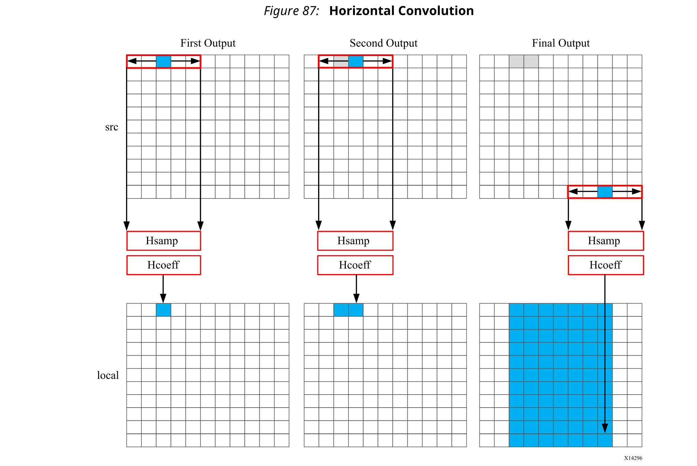
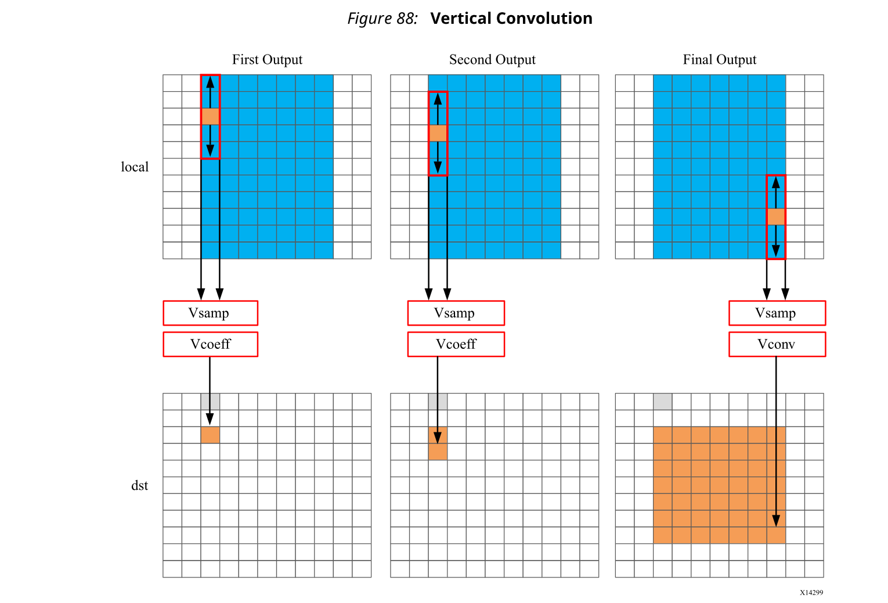
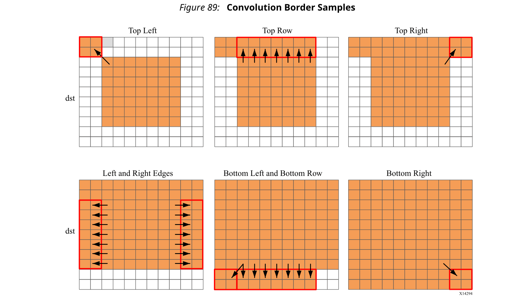
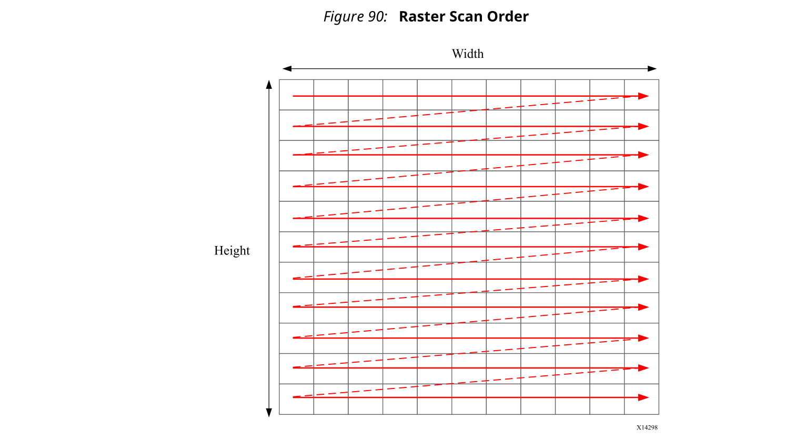
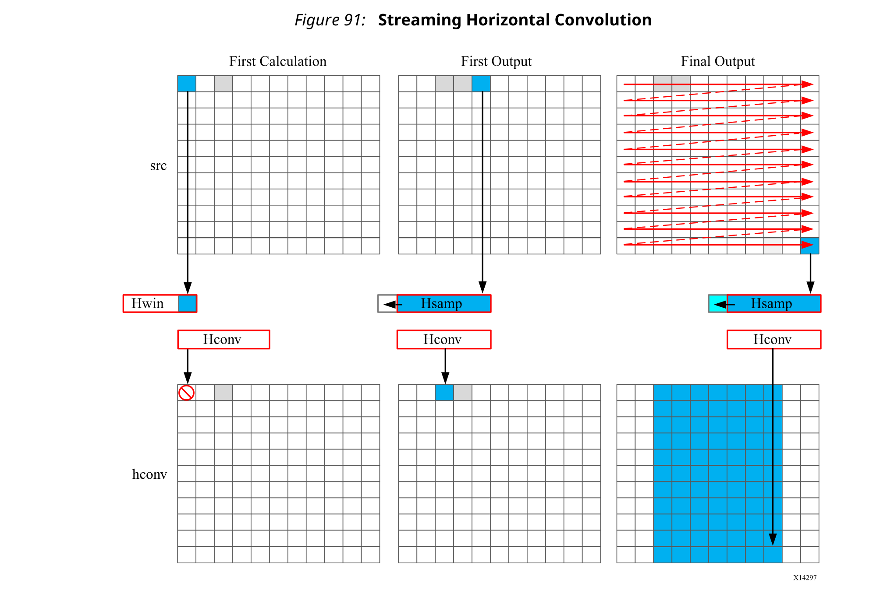
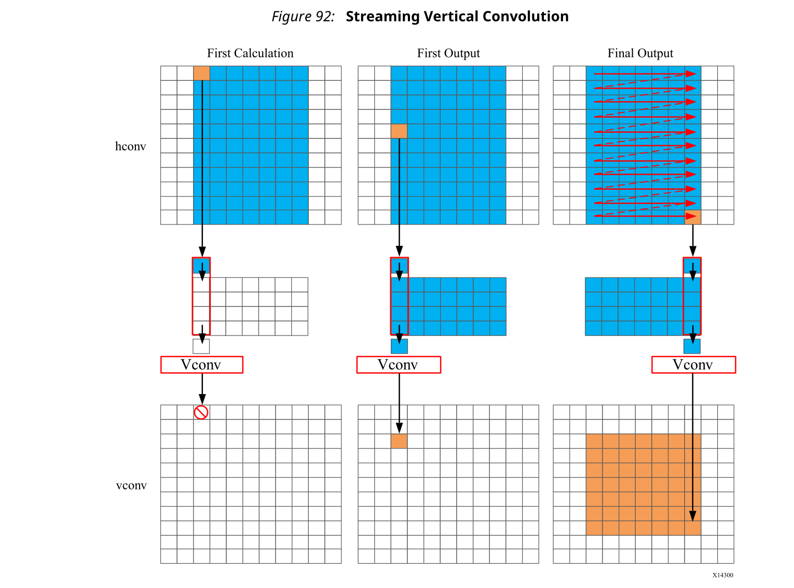
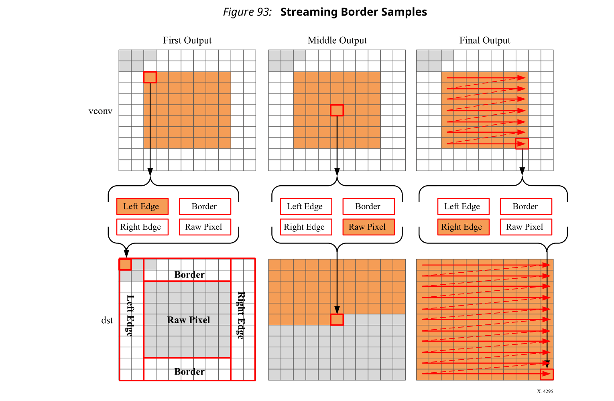

## 3.9 Hardware Efficient C Code
当为CPU编译C代码时，编译器将C代码转换并优化为一组CPU机器指令。在许多情况下，开发人员的工作是在此阶段完成的。但是，如果需要性能，则开发人员将尝试执行以下一些或全部操作：
- 了解编译器是否可以执行任何其他优化。
- 寻求更好地理解处理器体系结构，并修改代码以利用任何特定于体系结构的行为（例如，减少条件分支以改善指令流水线）
- 修改C代码以使用特定于CPU的intrinsics并行执行关键操作。（例如Arm NEON intrinsics）

相同的方法适用于为DSP或GPU编写的代码，并且在使用FPGA时：FPGA器件只是另一个目标。

Vivado HLS合成的C代码将在FPGA上执行，并提供与C仿真相同的功能。在某些情况下，开发人员的工作是在此阶段完成。

但是，通常由于FPGA器件的卓越性能而选择了FPGA来实现C代码-FPGA的大规模并行体系结构使其执行操作的速度比处理器固有的顺序操作快得多-用户通常希望 利用这种性能。

这里的重点是理解C代码对可以实现的结果的影响，以及如何使用对C代码的修改来从列表的前三项中获得最大的好处。
### Typical C Code for a Convolution Function
这里使用了应用于图像的标准卷积函数来演示C代码如何消极影响FPGA可能带来的性能。在此示例中，对数据执行水平然后垂直卷积。由于图像边缘的数据位于卷积窗口之外，因此最后一步是解决边界周围的数据。

算法结构可以总结如下： 
```c++
template<typename T, int K>
static void convolution_orig(
 int width, 
 int height,
 const T *src, 
 T *dst,
 const T *hcoeff, 
 const T *vcoeff) {
  T local[MAX_IMG_ROWS*MAX_IMG_COLS];
  // Horizontal convolution 
  HconvH:for(int col = 0; col < height; col++){
    HconvW::for(int row = border_width; row < width - border_width; row++){
      Hconv:for(int i = - border_width; i <= border_width; i++){
      }
    }
  }
  // Vertical convolution 
  VconvH:for(int col = border_width; col < height - border_width; col++){
    VconvW:for(int row = 0; row < width; row++){
      Vconv:for(int i = - border_width; i <= border_width; i++){
      }
    }
  }
  // Border pixels
  Top_Border:for(int col = 0; col < border_width; col++){
  }
  Side_Border:for(int col = border_width; col < height - border_width; col++){
  }
  Bottom_Border:for(int col = height - border_width; col < height; col++){
  }
}
```
#### Horizontal Convolution
第一步是在水平方向上进行卷积，如下图所示。



使用K个数据样本和K个卷积系数执行卷积。在上图中，K显示为5，但是K的值在代码中定义。为了进行卷积，至少需要K个数据样本。卷积窗口不能从第一个像素开始，因为该窗口将需要包含图像外部的像素。

通过执行对称卷积，可以将来自输入src的前K个数据样本与水平系数进行卷积，并计算出第一输出。为了计算第二个输出，使用了下一组K个数据样本。此计算沿每一行进行，直到写入最终输出。

最终结果是一个较小的图像，上面以蓝色显示。沿垂直边界的像素将在以后寻址。

执行此操作的C代码如下所示。
```c++
const int conv_size = K;
const int border_width = int(conv_size / 2);
#ifndef __SYNTHESIS__
    T * const local = new T[MAX_IMG_ROWS*MAX_IMG_COLS];
#else // Static storage allocation for HLS, dynamic otherwise
    T local[MAX_IMG_ROWS*MAX_IMG_COLS];
#endif
Clear_Local:for(int i = 0; i < height * width; i++){
 local[i]=0;
}
// Horizontal convolution 
HconvH:for(int col = 0; col < height; col++){
 HconvWfor(int row = border_width; row < width - border_width; row++){
   int pixel = col * width + row;
   Hconv:for(int i = - border_width; i <= border_width; i++){
     local[pixel] += src[pixel + i] * hcoeff[i + border_width];
   }
 }
}
```

:star: 注意：仅在要综合的代码中使用`__SYNTHESIS__`宏。不要在测试台使用这个宏，因为它不遵守C仿真和C RTL协同仿真。

该代码是直观的。但是，此C代码存在一些问题，而其中三个问题将对硬件结果的质量产生负面影响。

**第一个问题**是需要两个单独的存储需求。结果存储在内部local数组中。这需要一个HEIGHT * WIDTH数组，对于1920 * 1080的标准视频图像，它将容纳2,073,600 vales。在某些Windows系统上，如此大量的本地存储会引起问题。local数组的数据放置在堆栈上，而不是由OS管理的堆上。

**避免此类问题的一种有用方法**是使用`__SYNTHESIS__`宏。执行综合时会自动定义此宏。上面显示的代码将在C仿真期间使用动态内存分配，以避免任何编译问题，而仅在综合期间使用静态存储。使用此宏的缺点是，通过C仿真验证的代码与综合的代码不同。但是，在这种情况下，代码并不复杂，并且行为将相同。

FPGA实现质量的第一个问题是local数组。由于这是一个数组，因此将使用内部FPGA Block RAM来实现。这是要在FPGA内部实现非常大的存储器。它可能需要更大，更昂贵的FPGA器件。通过使用DATAFLOW优化并通过小的高效FIFO传输数据，可以最大程度地减少Block RAM的使用，但这将要求数据以流方式使用。

**下一个问题是数组local的初始化**。循环`Clear_Local`用于将local数组中的值设置为零。即使流水化了此循环，此操作也将需要大约2百万个时钟周期（HEIGHT * WIDTH）来实现。相同的数据初始化也被执行，在循环`HConv`内，在写入之前，使用临时变量初始化累积值。

最后，数据的吞吐量受到数据访问方式的限制。
- 对于第一个输出，从输入中读取第一个K值。
- 要计算第二个输出，通过数据输入端口重新读取相同的K-1值。
- 对于整个映像，将重复执行此重新读取数据的过程。

**高性能FPGA的关键之一是最大程度地减少对顶层函数参数的访问**。顶层函数参数将成为RTL块上的数据端口。使用上面显示的代码，由于需要一次又一次地重新读取数据，因此无法使用DMA操作直接从处理器流式传输数据。重新读取输入也限制了FPGA处理样本的速率。
#### Vertical Convolution
下一步是执行垂直卷积，如下图所示。



垂直卷积的过程类似于水平卷积。需要一组K个数据样本才能与卷积系数Vcoeff进行卷积。使用垂直方向上的前K个样本创建第一个输出后，接下来的K个设置值将用于创建第二个输出。该过程一直向下遍历每一列，直到创建最终输出。

在垂直卷积之后，由于水平和垂直边界影响，图像现在比源图像src小。

执行这些操作的代码是： （个人注：下面的代码，并不是如图所示，行是从0开始的，而不是橙色部分开始）
```c
Clear_Dst:for(int i = 0; i < height * width; i++){
 dst[i]=0;
}
// Vertical convolution 
VconvH:for(int col = border_width; col < height - border_width; col++){
   VconvW:for(int row = 0; row < width; row++){
   int pixel = col * width + row;
   Vconv:for(int i = - border_width; i <= border_width; i++){
     int offset = i * width;
     dst[pixel] += local[pixel + offset] * vcoeff[i + border_width];
   }
  }
}
```
该代码突出显示了与水平卷积代码已经讨论的类似问题。
- 花了许多时钟周期将输出图像dst中的值设置为0。在这种情况下，对于1920 * 1080的图像大小，大约还要再进行200万次循环。
- 每个像素有多个访问以重新读取存储在local数组中的数据。
- 每个像素对输出数组/端口dst进行多次写入。

上面代码的另一个问题是对本地数组的访问模式。该算法要求行K上的数据可用于执行第一次计算。在进行到下一个列之前沿着行处理数据，这需要将整个图像本地存储。此外，由于数据不是从local数组中stream出来的，因此FIFO无法用于实现由DATAFLOW优化创建的存储通道。如果在该设计中使用了DATAFLOW优化，则该存储通道需要一个乒乓缓冲区：这将实现的存储需求增加了一倍，达到了大约400万个数据样本，所有数据样本均存储在FPGA上。
#### Border Pixels
执行卷积的最后一步是围绕边界创建数据。这些像素可以通过简单地在卷积输出中重新使用最近的像素来创建。下图显示了如何实现此目的。



边界区域将填充最近的有效值。以下代码执行图中所示的操作。
```c++
int border_width_offset = border_width * width;
int border_height_offset = (height - border_width - 1) * width;
// Border pixels
Top_Border:for(int col = 0; col < border_width; col++){
 int offset = col * width;
 for(int row = 0; row < border_width; row++){
    int pixel = offset + row;
    dst[pixel] = dst[border_width_offset + border_width];
 }
 for(int row = border_width; row < width - border_width; row++){
    int pixel = offset + row;
    dst[pixel] = dst[border_width_offset + row];
 }
 for(int row = width - border_width; row < width; row++){
    int pixel = offset + row;
    dst[pixel] = dst[border_width_offset + width - border_width - 1];
 }
}
Side_Border:for(int col = border_width; col < height - border_width; col++){
 int offset = col * width;
 for(int row = 0; row < border_width; row++){
    int pixel = offset + row;
    dst[pixel] = dst[offset + border_width];
 }
 for(int row = width - border_width; row < width; row++){
    int pixel = offset + row;
    dst[pixel] = dst[offset + width - border_width - 1];
 }
}
Bottom_Border:for(int col = height - border_width; col < height; col++){
 int offset = col * width;
 for(int row = 0; row < border_width; row++){
    int pixel = offset + row;
    dst[pixel] = dst[border_height_offset + border_width];
 }
 for(int row = border_width; row < width - border_width; row++){
    int pixel = offset + row;
    dst[pixel] = dst[border_height_offset + row];
 }
 for(int row = width - border_width; row < width; row++){
    int pixel = offset + row;
    dst[pixel] = dst[border_height_offset + width - border_width - 1];
 }
}
```

该代码遭受相同的数据重复访问。现在，必须多次读取输入数据才能读取存储在FPGA外部dst阵列中的数据。即使在第一个循环中，也会**多次读取**dst [border_width_offset + border_width]，但border_width_offset和border_width的值不会改变。

这种编码风格对FPGA实现的性能和质量产生负面影响的最后一个方面是如何解决不同条件的结构。for循环处理每种条件的操作：左上，顶行等。此处的优化选择是：

在这种情况下，无法对顶层循环（Top_Border，Side_Border，Bottom_Border）进行流水线处理，因为某些子循环具有可变边界（基于输入width的值）。在这种情况下，您必须对子循环进行流水线处理并依次执行每组流水线循环。

是否流水化顶层循环并展开子循环还是单独流水化子循环的问题由循环限制以及FPGA器件上有多少可用资源决定。如果顶层循环限制很小，请展开循环以复制硬件并达到性能。如果顶层循环限制较大，则通过流水化较低级的循环，并在循环中依次执行它们（Top_Border，Side_Border，Bottom_Border）会降低性能。

如标准卷积算法的回顾所示，以下编码样式会对FPGA实现的性能和大小产生负面影响：
- 在数组中设置默认值会花费时钟周期和性能。
- 多次访问以读取然后重新读取数据会消耗时钟周期和性能。
- 以任意或随机访问方式访问数据要求将数据存储在本地数组中，并耗费资源。
### Ensuring the Continuous Flow of Data and Data Reuse
在上一节中将卷积示例实现为具有最少资源的高性能设计的关键是考虑如何在整个系统中使用FPGA实现。理想的行为是使数据样本不断流过FPGA。
- 最大化通过系统的数据流。**不要使用任何会限制数据流的编码技术或算法行为**。
- **最大限度地重用数据**。使用本地缓存来确保没有要求重新读取数据，并且传入的数据可以保持连续。

**第一步是确保执行进出FPGA的最佳I/O操作**。卷积算法在图像上执行。产生和使用图像中的数据时，将**以标准的光栅扫描方式进行传输**，如下图所示。



如果将数据从CPU或系统内存传输到FPGA，则通常会以这种流传输方式进行传输。从**FPGA传输回系统的数据也应以这种方式执行**。

#### Using HLS Streams for Streaming Data
可以对早期代码进行的**第一个增强功能之一是使用HLS stream构造**，通常称为hls::stream。hls::stream对象可用于存储数据样本，其方式与数组相同。**hls::stream中的数据只能顺序访问**。在C代码中，hls::stream的行为类似于无限深度的FIFO。

使用hls::streams编写的代码通常将在FPGA中创建具有高性能且使用资源很少的设计，因为hls::stream强制采用非常适合在FPGA中实现的编码样式。

不可能从hls::stream多次读取相同的数据。从hls::stream中读取数据后，它就不再存在于流中。这有助于消除这种编码习惯。

如果再次需要来自hls::stream的数据，则必须将其缓存。当编写要在FPGA上综合的代码时，这是另一种好习惯。

hls::stream强制以适合FPGA实现的方式开发C代码。

**综合hls::stream时**，它会自动实现为**1个元素深的FIFO通道**。这是连接流水线任务的理想硬件。

不需要使用hls::stream，并且可以使用C代码中的数组来执行相同的实现。hls::stream构造确实有助于实施良好的编码实践。

使用hls::stream构造，新的优化代码的概要如下： 
```c++
template<typename T, int K>
static void convolution_strm(
int width, 
int height,
hls::stream<T> &src, 
hls::stream<T> &dst,
const T *hcoeff, 
const T *vcoeff)
{
hls::stream<T> hconv("hconv");
hls::stream<T> vconv("vconv");
// These assertions let HLS know the upper bounds of loops
assert(height < MAX_IMG_ROWS);
assert(width < MAX_IMG_COLS);
assert(vconv_xlim < MAX_IMG_COLS - (K - 1));
// Horizontal convolution 
HConvH:for(int col = 0; col < height; col++) {
 HConvW:for(int row = 0; row < width; row++) {
   HConv:for(int i = 0; i < K; i++) {
 }
 }
}
// Vertical convolution 
VConvH:for(int col = 0; col < height; col++) {
 VConvW:for(int row = 0; row < vconv_xlim; row++) {
   VConv:for(int i = 0; i < K; i++) {
 }
}
Border:for (int i = 0; i < height; i++) {
 for (int j = 0; j < width; j++) {
 }
}
```
与以前的代码相比，一些明显的区别是：
- 现在，输入和输出数据建模为hls::streams。
- 有两个内部hls::streams用来保存水平和垂直卷积的输出，而不是单个大小为HEIGHT * WDITH的局部数组。

另外，一些assert语句用于指定循环边界的最大值。这是一种很好的编码风格，它允许HLS自动报告可变有界循环的延迟并优化循环边界。
#### Horizontal Convolution
为了以更有效的方式执行计算以实现FPGA，请如下图所示计算水平卷积。



使用hls::stream会强制执行良好的算法惯例，即迫使您首先读取第一个样本，而不是对数据进行随机访问。该算法必须使用先前的K个样本来计算卷积结果，因此必须将样本复制到临时缓存中。对于第一次计算，hwin中没有足够的值来计算结果，因此不会写入任何输出值。

该算法会不断读取输入样本，并将其缓存到hwin中。每次读取一个新样本时，它将不需要的样本从hwin中推出。第一次写入输出值是在读取第K个输入之后。现在可以写入输出值。

算法以这种方式沿着行进行，直到读取完最终样本为止。此时，只有最后的K个样本存储在hwin中：计算卷积所需的全部。

执行这些操作的代码如下所示。
```c
// Horizontal convolution 
HConvW:for(int row = 0; row < width; row++) {
 HconvW:for(int row = border_width; row < width - border_width; row++){
 T in_val = src.read();
 T out_val = 0;
 HConv:for(int i = 0; i < K; i++) {
    hwin[i] = i < K - 1 ? hwin[i + 1] : in_val;
    out_val += hwin[i] * hcoeff[i];
 }
 if (row >= K - 1)
    hconv << out_val;
 }
}
```
在上面的代码中需要注意的有趣一点是使用临时变量out_val进行卷积计算。如上例所示，在执行计算之前，将此变量设置为零，从而无需花费200万个时钟周期来重置值。

在整个过程中，以光栅流方式处理src输入中的样本。依次读取每个样本。任务的输出将被丢弃或使用，但任务会不断进行计算。这表示与编写要在CPU上执行的代码不同。

在CPU体系结构中，通常避免有条件或分支操作。当程序需要分支时，它将丢失存储在CPU取指流水线中的所有指令。在FPGA体系结构中，**每个条件分支的硬件中已经存在一条单独的路径，并且不会有与流水线任务内部的分支相关的性能下降**。这只是选择要使用哪个分支的一种情况。

输出存储在hls::stream hconv中，供垂直卷积循环使用。

#### Vertical Convolution
垂直卷积代表了FPGA首选的流数据模型的挑战。数据必须按列访问，但是您不希望存储整个图像。解决方案是使用行缓冲区，如下图所示。



再次以流方式读取样本，这一次是从hls::stream hconv中读取的。该算法在处理第一个样本之前至少需要K-1行数据。在此之前执行的所有计算都将被丢弃。

行缓冲器允许存储K-1行数据。每次读取新样本时，都会将另一个样本推出行缓冲区。这里要注意的有趣一点是，在计算中使用了最新的样本，然后将样本存储到行缓冲区中并弹出旧样本。这确保仅需要缓存K-1行，而不是K行。尽管行缓冲区确实需要在本地存储多行，但是卷积核大小K始终比完整视频图像中的1080行小得多。

当读取第K行上的第一个样本时，可以执行第一个计算。然后算法继续输出值，直到读取了最后一个像素。
```c++
// Vertical convolution 
VConvH:for(int col = 0; col < height; col++) {
 VConvW:for(int row = 0; row < vconv_xlim; row++) {
#pragma HLS DEPENDENCE variable=linebuf inter false
#pragma HLS PIPELINE
  T in_val = hconv.read();
  T out_val = 0;
  VConv:for(int i = 0; i < K; i++) {
     T vwin_val = i < K - 1 ? linebuf[i][row] : in_val;
     out_val += vwin_val * vcoeff[i];
     if (i > 0)
       linebuf[i - 1][row] = vwin_val;
  }
  if (col >= K - 1)
     vconv << out_val;
 }
}
```
上面的代码再次以流方式处理设计中的所有样本。该任务一直在运行。使用hls::stream构造会强制您在本地缓存数据。以FPGA为目标时，这是一种理想的策略。

#### Border Pixels
该算法的最后一步是将边缘像素复制到边界区域中。再次，为了确保恒定的流量或数据和数据的重用，该算法使用了hls::stream和缓存。

下图显示了如何将边界样本对齐到图像中。
- 从垂直卷积的vconv输出中读取每个样本。
- 然后将样本缓存为4种可能像素类型之一。
- 然后将样本写入输出流。



确定边界像素位置的代码为：
```c++
Border:for (int i = 0; i < height; i++) {
 for (int j = 0; j < width; j++) {
    T pix_in, l_edge_pix, r_edge_pix, pix_out;
  #pragma HLS PIPELINE
  if (i == 0 || (i > border_width && i < height - border_width)) {
    if (j < width - (K - 1)) {
      pix_in = vconv.read();
      borderbuf[j] = pix_in;
    }
    if (j == 0) {
      l_edge_pix = pix_in;
    }
    if (j == width - K) {
      r_edge_pix = pix_in;
    }
  }
  if (j <= border_width) {
    pix_out = l_edge_pix;
  } else if (j >= width - border_width - 1) {
      pix_out = r_edge_pix;
  } else {
      pix_out = borderbuf[j - border_width];
  }
  dst << pix_out;
 }
}   
```
此新代码的显着区别是在任务内部大量使用了条件。这使任务一旦被流水化，就可以连续处理数据，而条件的结果不会影响流水线的执行：结果将影响输出值，但只要输入样本可用，流水线就将继续处理。

该FPGA友好算法的最终代码具有以下优化指令。
```c++
template<typename T, int K>
static void convolution_strm(
int width, 
int height,
hls::stream<T> &src, 
hls::stream<T> &dst,
const T *hcoeff, 
const T *vcoeff)
{
#pragma HLS DATAFLOW
#pragma HLS ARRAY_PARTITION variable=linebuf dim=1 complete
hls::stream<T> hconv("hconv");
hls::stream<T> vconv("vconv");
// These assertions let HLS know the upper bounds of loops
assert(height < MAX_IMG_ROWS);
assert(width < MAX_IMG_COLS);
assert(vconv_xlim < MAX_IMG_COLS - (K - 1));
// Horizontal convolution 
HConvH:for(int col = 0; col < height; col++) {
 HConvW:for(int row = 0; row < width; row++) {
#pragma HLS PIPELINE
   HConv:for(int i = 0; i < K; i++) {
 }
 }
}
// Vertical convolution 
VConvH:for(int col = 0; col < height; col++) {
 VConvW:for(int row = 0; row < vconv_xlim; row++) {
#pragma HLS PIPELINE
#pragma HLS DEPENDENCE variable=linebuf inter false
   VConv:for(int i = 0; i < K; i++) {
 }
}
Border:for (int i = 0; i < height; i++) {
 for (int j = 0; j < width; j++) {
#pragma HLS PIPELINE
 }
}
```
每个任务都在样本级别进行流水线处理。行缓冲器被完全划分为寄存器，以确保没有由于块RAM端口不足而引起的读取或写入限制。行缓冲区还需要一个依赖指令。所有任务都在数据流区域中执行，这将确保任务同时运行。hls::streams自动实现为具有1个元素的FIFO。
#### Summary of C for Efficient Hardware
**最小化数据输入读取**。一旦将数据读入块中，它可以轻松地馈入许多并行路径，但输入端口可能成为性能瓶颈。读取数据一次，如果必须重复使用数据，请使用本地缓存。

**最小化对数组的访问**，尤其是大型数组。数组是在Block RAM中实现的，就像I/O端口一样，数组也只有有限数量的端口，并且可能成为性能瓶颈。可以将数组划分为较小的数组，甚至可以划分为单个寄存器，但是对较大的数组进行划分将导致使用许多寄存器。使用小型的本地缓存来保存诸如累加之类的结果，然后将最终结果写入数组。

寻求在流水线任务中执行条件分支，而不是有条件地执行任务，甚至是流水线任务。条件将在流水线中实现为单独的路径。允许数据带有条件地从一个任务的数据流入下一个任务将导致更高的执行系统。

出于与输入读取相同的原因，应**尽量减少输出写入**：端口是瓶颈。复制附加端口只是将问题进一步推入系统。

对于以流方式处理数据的C代码，请考虑使用hls::streams，因为它们将实施良好的编码习惯。**用C语言设计一种算法将产生高性能的FPGA实现，比调试为什么FPGA无法以所需的性能运行要高效得多**。