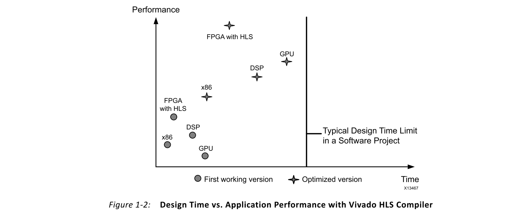

# Ch1 Introduction
## Overview
软件是所有应用程序的基础。无论是用于娱乐，游戏，通讯还是医学，当今人们使用的许多产品都是从软件模型或原型开始的。根据系统的性能和可编程性约束，软件工程师的任务是确定最佳的实施平台，以将项目推向市场。为了完成此任务，软件工程师将获得编程技术和各种硬件处理平台的帮助。

在编程方面，过去的几十年在面向对象的编程方面取得了进展，以实现代码重用和提高算法性能的并行计算范式。编程语言，框架和工具的进步使软件工程师能够快速原型化并测试解决特定问题的不同方法。快速建立解决方案原型的需求导致了两个有趣的问题。第一个问题，如何分析和量化一个算法相对于另一个算法的改进，在其他著作中进行了广泛讨论，而不是本指南的重点。第二个问题是在哪里执行算法，在本指南中提供有关现场可编程门阵列（FPGA）的解决方案。

关于在哪里运行算法，人们越来越关注并行化和并发性。尽管对并行和并行执行软件程序的兴趣不是新的，但处理器和专用集成电路（ASIC）设计的某些趋势有助于重新产生和增加兴趣。过去，软件工程师面临两种选择来从软件算法外获得更高的性能：定制集成电路或FPGA。

第一个也是最昂贵的选择是将算法交给硬件工程师进行定制电路实现。该选项的成本基于：
- 电路制造成本
- 将算法转换为硬件的时间

尽管制造工艺节点技术的进步已在功耗，计算吞吐量和逻辑密度方面取得了显着改善，但为应用制造定制集成电路或ASIC的成本仍然很高。在每个处理节点上，制造成本持续增加，以至于这种方法仅在经济上可行，对于运送上百万个单位的应用来说是可行的。

第二种选择是使用FPGA，它解决了ASIC制造固有的成本问题。FPGA使设计人员可以使用由基本可编程逻辑元件组成的现成组件来创建算法的定制电路实现。该平台节省了功耗，并具有较小制造节点的性能优势，而不会招致ASIC开发工作的成本和复杂性。与ASIC相似，在FPGA中实现的算法得益于定制电路的固有并行特性。

## Programming Model
硬件平台的编程模型是其采用的驱动因素之一。软件算法通常以C/C++或其他高级语言实现，从而抽象出计算平台的细节。这些语言允许快速迭代，增量改进和代码可移植性，这对于软件工程师而言至关重要。在过去的几十年中，以这些语言实现的算法的快速执行推动了处理器和软件编译器的发展。

最初，改善软件的运行时间是基于两个核心概念：提高处理器时钟频率和使用专用处理器。多年以来，通常的做法是等待一年的下一代处理器，以加快执行速度。在每个新的更高时钟频率下，软件程序都会运行得更快。尽管在某些情况下这是可以接受的，但对于大量的应用程序而言，通过处理器时钟频率提高速度并不足以将可行的产品推向市场。

对于此类应用程序，创建了专用处理器。尽管有许多专用处理器，例如数字信号处理器（DSP）和图形处理单元（GPU），但是所有这些处理器都能够执行以高级语言（例如C）编写的算法，并且具有功能特定的加速器，以改善其目标软件应用程序的执行。

随着最近标准和专用处理器设计的范式转变，两种类型的处理器都不再依赖时钟频率的增加来加快程序速度，并为每个芯片增加了更多的处理内核。多核处理器将程序并行化放在提高软件性能的技术的最前沿。现在，软件工程师必须以某种方式构造算法，以实现性能的高效并行化。算法设计所需的技术使用与FPGA设计相同的基本元素。FPGA和处理器之间的主要区别在于编程模型。

从历史上看，FPGA的编程模型集中于寄存器传输级别（RTL）描述而不是C/C++。尽管这种设计模型与ASIC设计完全兼容，但是它类似于软件工程中的汇编语言编程。图1-1显示了使用RTL作为设计方法的传统FPGA设计流程，它说明了编程模型的差异如何影响实现时间和不同计算平台可实现的性能。

如图1-1所示，在标准和专用处理器的项目设计周期中，相对较快地达到软件程序的初始工作版本。在初始工作版本之后，必须分配额外的开发工作以在任何实现平台上实现最大性能。

该图还显示了为FPGA平台开发相同软件应用程序所花费的时间。与标准处理器和专用处理器的相同阶段相比，应用程序的初始版本和优化版本均提供了显着的性能。RTL编码和FPGA优化的应用程序可实现最高性能。

但是，实现此实现所需的开发时间超出了典型软件开发工作的范围。因此，传统上仅将FPGA用于要求性能配置文件的应用程序，而这些性能配置文件是任何其他方式都无法实现的，例如具有多个处理器的设计。

Xilinx®的最新技术进步消除了处理器和FPGA之间编程模型的差异。正如从C语言和其他高级语言到不同处理器体系结构的编译器一样，Xilinx Vivado®高级综合（HLS）编译器为面向Xilinx FPGA的C/C++程序提供了相同的功能。图1-2将Vivado HLS编译器的结果与软件工程师可用的其他处理器解决方案进行了比较。

## Guide Organization
对于同一C/C++应用程序，FPGA和其他处理器的性能之间存在显着差异。本指南的以下各章描述了这种巨大性能差异的原因，并介绍了Vivado HLS编译器的工作方式。

### Chapter 2: What is an FPGA?
_第2章，什么是FPGA？_ 介绍了FPGA中可用的计算元素以及它们与处理器的比较方式。它涵盖了诸如FPGA存储器层次结构，逻辑元素以及这些元素如何相互关联等主题。

### Chapter 3: Basic Concepts of Hardware Design
处理器和FPGA的硬件之间的差异会影响每个目标的编译器的工作方式。*第3章，硬件设计的基本概念*涵盖了适用于FPGA和基于处理器的设计的基本硬件概念。了解这些概念有助于设计人员指导Vivado HLS编译器创建最佳处理架构。

### Chapter 4: Vivado High-Level Synthesis
_第4章，Vivado高级综合_ 介绍了Xilinx Vivado HLS编译器。本节使用前两章的概念，介绍如何为FPGA编译C/C++程序。本章重点介绍编译器如何提取并行性，组织存储器以及在FPGA中连接多个程序。

### Chapter 5: Computation-Centric Algorithms
尽管有大量有关算法分析的文献，但以计算为中心的算法与以控制为中心的算法的细微差别在很大程度上取决于实现平台。_第5章，以计算为中心的算法_，为FPGA定义了以计算为中心的算法，并提供了示例和最佳实践建议。

### Chapter 6: Control-Centric Algorithms
以控制为中心的算法可以在处理器和FPGA上实现。实现的选择取决于算法所需的反应时间。_第6章，以控制为中心的算法_ 提供了以控制为中心的算法实现选项的概述，并提供了用于用户数据报协议（UDP）数据包处理的网络示例。

### Chapter 7: Software Verification and Vivado HLS
与所有编译器一样，Vivado HLS编译器输出的质量和正确性取决于输入软件。_第7章，软件验证和Vivado HLS_ 回顾了适用于Vivado HLS编译器的推荐软件质量技术。它提供了典型编码错误的示例及其对Vivado HLS编译的影响，以及每种问题的可能解决方案。它还包括有关无法在C级别完全验证程序行为时的处理方法的部分。

### Chapter 8: Integration of Multiple Programs
正如大多数处理器运行多个程序来执行一个应用程序一样，FPGA也可以构建多个程序或模块来执行一个特定的应用程序。_第8章，集成多个程序_ 描述了如何在FPGA中连接多个模块以及如何使用处理器控制这些模块。它着重介绍了Xilinx Zynq®-7000片上系统（SoC），该系统将FPGA架构与Arm® Cortex™-A9处理器结合在一起。通过使用消费者和生产者示例，本章还演示了完整的系统开发，集成和设计权衡。

### Chapter 9: Verification of a Complete Application
借助FPGA，完整的应用程序可以创建硬件系统。该系统可以在FPGA架构中具有一个或多个模块，以及在处理器上执行的代码。_第9章，完整应用程序的验证_ 提供建议和最佳实践，以确保目标应用程序正确执行。

