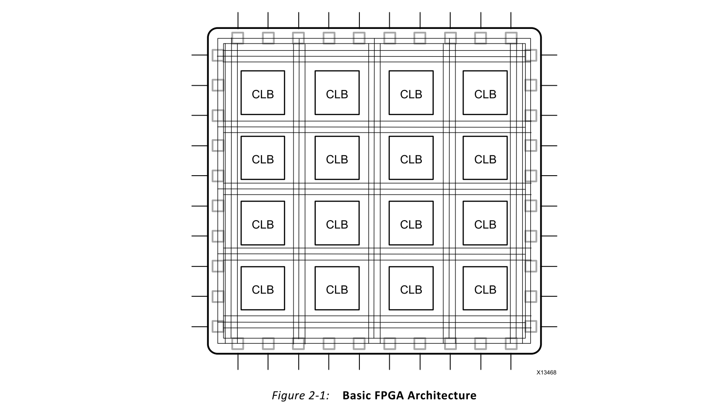
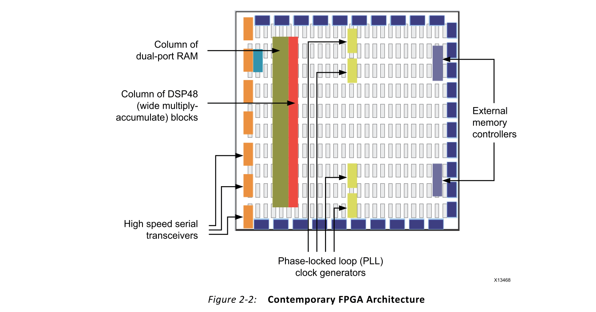
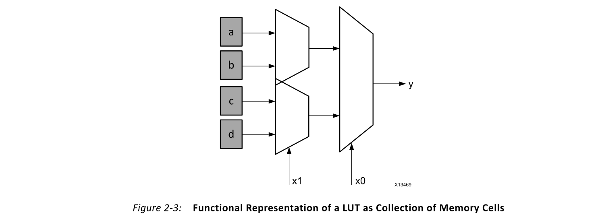
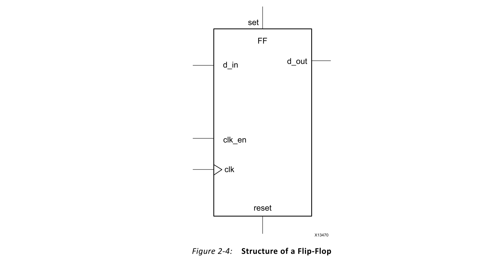
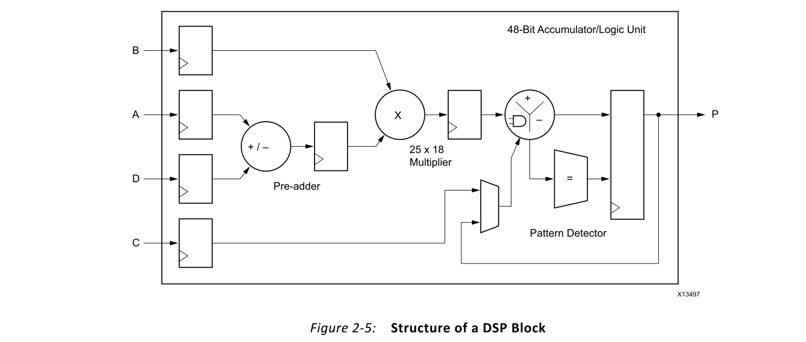
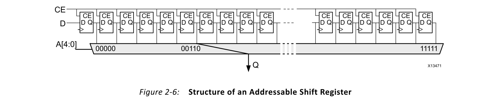
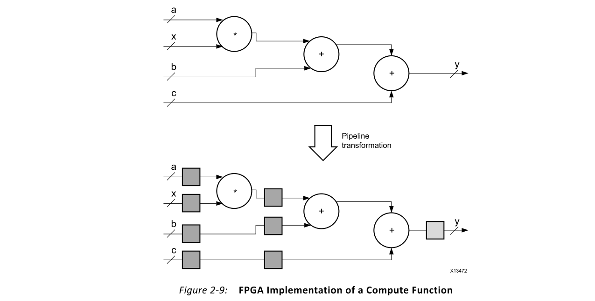
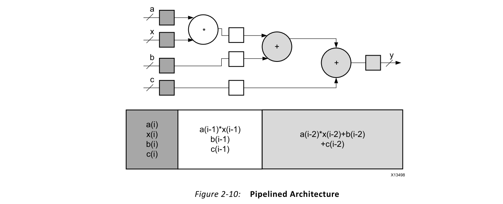

# Ch2 What is an FPGA?
## Overview
FPGA是一种集成电路（IC），可以在制造后针对不同的算法进行编程。现代FPGA器件包含多达200万个逻辑单元，可以配置这些逻辑单元以实现各种软件算法。尽管传统的FPGA设计流程比常规的IC更类似于处理器，但与IC的开发工作相比，FPGA具有明显的成本优势，并且在大多数情况下都具有相同的性能水平。与IC相比，FPGA的另一个优点是可以动态重新配置。该过程与在处理器中加载程序相同，可能会影响FPGA架构中可用的部分或全部资源。

使用Vivado®HLS编译器时，重要的是要对FPGA架构中的可用资源以及它们如何交互以执行目标应用程序有基本的了解。本章介绍了有关FPGA的基本信息，这是将Vivado HLS引导到任何算法的最佳计算架构所必需的。

## FPGA Architecture
FPGA的基本结构由以下元素组成：
- Look-up table (LUT): 该元素执行逻辑运算。
- Flip-Flop (FF): 该寄存器元素存储LUT的结果。
- Wires: 这些元素将元素相互连接。
- Input/Output (I/O) pads: 这些物理上可用的端口将数据传入和传出FPGA。

这些元素的组合产生了如图2-1所示的基本FPGA架构。尽管此结构足以实现任何算法，但最终实现的效率受到计算吞吐量，所需资源和可达到的时钟频率等方面的限制。

当代的FPGA体系结构将基本元素与其他计算和数据存储模块结合在一起，从而增加了设备的计算密度和效率。在以下各节中讨论的这些其他元素是：
- 嵌入式存储器用于分布式数据存储
- 锁相环（PLL），用于以不同的时钟速率驱动FPGA架构
- 高速串行收发器
- 片外存储器控制器
- 乘积块

这些元素的组合为FPGA提供了实现在处理器上运行的任何软件算法的灵活性，并产生了如图2-2所示的当代FPGA架构。

### LUT
LUT是FPGA的基本构建块，能够实现N个布尔变量的任何逻辑功能。本质上，此元素是真值表，其中输入的不同组合实现了不同的功能以产生输出值。真值表的大小限制为N，其中N代表LUT的输入数量。对于一般的N输入LUT，该表访问的存储器位置数为：

$$2^N \tag{Equation 2-1} $$

它允许该表实现以下功能：

$$2^{N^N} \tag{Equation 2-2} $$

> Note: A typical value for N in Xilinx FPGA devices is 6.

LUT的硬件实现可以认为是连接到一组多路复用器的存储单元的集合。LUT的输入充当多路复用器上的选择器位，以在给定的时间点选择结果。请务必牢记这种表示形式，因为LUT既可以用作函数计算引擎，也可以用作数据存储元素。图2-3显示了LUT的功能示意图。

### Flip-Flop
触发器是FPGA架构内的基本存储单元。该元素始终与LUT配对，以辅助逻辑流水线和数据存储。触发器的基本结构包括数据输入，时钟输入，时钟使能，复位和数据输出。在正常操作期间，数据输入端口上的任何值都会在时钟的每个脉冲上锁存并传递到输出。时钟使能引脚的目的是允许触发器为一个以上的时钟脉冲保持特定值。**仅当时钟和时钟使能都等于1时，才锁存新的数据输入并将其传递到数据输出端口**。图2-4显示了触发器的结构。

### DSP Block
Xilinx FPGA中可用的最复杂的计算模块是DSP模块，如图2-5所示。DSP模块是嵌入到FPGA架构中的算术逻辑单元（ALU），它由三个不同模块的链组成。DSP中的计算链由加/减单元组成，加/减单元连接到与最终加/减/累加引擎相连的乘法器。该链允许单个DSP单元实现以下形式的功能：

$$
p=a \times(b+d)+c \tag{Equation 2-3}
$$

或

$$
p+=a \times(b+d) \tag{Equation 2-4}
$$

### Storage Elements

FPGA器件包括嵌入式存储元件，可用作随机存取存储器（RAM），只读存储器（ROM）或移位寄存器。这些元素是Block RAM（BRAM），UltraRAM块（URAMS），LUT和移位寄存器（SRL）。

BRAM是一个双端口RAM模块，已实例化到FPGA架构中，以提供片上存储相对较大的数据集。设备中可用的两种BRAM存储器可以容纳18k或36k位。这些可用存储器的数量取决于设备。**这些存储器的双端口性质允许对不同位置进行并行，相同时钟周期的访问**。

就如何用C/C++代码表示数组而言，BRAM可以实现RAM或ROM。唯一的区别是何时将数据写入存储元素。在RAM配置中，可以在电路运行期间的任何时间读取和写入数据。相反，在ROM配置中，只能在电路运行期间读取数据。ROM的数据作为FPGA配置的一部分写入，不能以任何方式进行修改。

UltraRAM块是双端口，同步288 Kb RAM，具有4,096位深和72位宽的固定配置。它们可在UltraScale+设备上使用，并且提供的存储容量是BRAM的8倍。

如前所述，LUT是一个小型存储器，在设备配置期间会在其中写入真值表的内容。由于Xilinx FPGA中LUT结构的灵活性，这些模块可用作64位存储器，通常称为分布式存储器。这是FPGA器件上可用的最快的一种存储器，因为可以在架构的任何部分中实例化它，以提高实现电路的性能。

移位寄存器是相互连接的寄存器链。该结构的目的是提供沿计算路径（例如使用过滤器）的数据重用。例如，基本滤波器由一系列乘法器组成，这些乘法器将数据样本与一组系数相乘。通过使用移位寄存器存储输入数据，内置的数据传输结构在每个时钟周期将数据样本移至链中的下一个乘法器。图2-6给出了一个移位寄存器示例。

## FPGA Parallelism Versus Processor Architectures
与处理器架构相比，构成FPGA架构的结构在应用程序执行中实现了高度的并行性。Vivado HLS编译器为软件程序生成的自定义处理体系结构呈现了不同的执行范例，在决定将应用程序从处理器移植到FPGA时必须考虑到这一点。为了检验FPGA执行范例的好处，本节简要回顾了处理器程序的执行。

### Program Execution on a Processor
不管处理器的类型如何，处理器都将其作为指令序列执行程序，这些指令序列转化为对软件应用程序有用的计算。该指令序列由处理器编译器工具（例如GNU编译器集合（GCC））生成，该工具将C/C++中表示的算法转换为处理器固有的汇编语言构造。处理器编译器的工作是采用以下形式的C函数：

$$
Z=a+b \tag{Equation 2-5}
$$

并将其转换为汇编代码，如下所示：

图2-7中的汇编代码定义了加法运算，用于根据处理器的内部寄存器计算z的值。该代码指出，用于计算的输入值存储在寄存器R1和R2中，而计算的结果存储在寄存器R3中。该代码很简单，并且没有表达计算z值所需的所有指令。此代码仅在数据到达处理器后处理计算。因此，编译器必须创建其他汇编语言指令，以使用中央存储器中的数据加载处理器的寄存器，并将结果写回到存储器中。用于计算z值的完整汇编程序如下：

图2-8中的代码显示，即使是简单的操作（例如将两个值相加）也将导致多个汇编指令。每个指令的计算延迟在指令类型之间是不相等的。例如，根据a和b的位置，LD操作需要使用不同数量的时钟周期来完成。如果这些值在处理器缓存中，则这些加载操作将在几十个时钟周期内完成。如果这些值位于主双倍数据速率（DDR）内存中，则这些操作将花费数百至数千个时钟周期才能完成。如果这些值位于硬盘驱动器中，则加载操作将花费更长的时间才能完成。这就是为什么具有高速缓存命中跟踪的软件工程师花费大量时间来重组其算法，以增加内存中数据的空间局部性，从而提高高速缓存命中率并减少每条指令花费的处理器时间。

> 重要信息：当在FPGA中实现相同的操作时，不需要软件工程师在重组算法以更好地适应可用处理器高速缓存时所需的工作水平。

### Program Execution on an FPGA

FPGA是一种固有的并行处理结构，能够实现可以在处理器上运行的任何逻辑和算术功能。主要区别在于，用于将软件描述转换为RTL的Vivado HLS编译器不受高速缓存和统一内存空间的限制。

> 注意：通常，1个LUT等效于1位计算。

用于z的计算的LUT仅限于此操作。与处理器（所有计算共享相同的ALU）不同，FPGA实现为软件算法中的每个计算实例化独立的LUT集。

除了在每次计算中分配唯一的LUT资源外，FPGA在存储器架构和存储器访问成本方面均不同于处理器。在FPGA实现中，Vivado HLS编译器将存储器安排到尽可能靠近操作使用点的多个存储库中。这导致瞬时内存带宽，远远超出了处理器的能力。例如，Xilinx Kintex®-7410T器件共有1,590个18k-bit BRAM可用。在存储器带宽方面，该器件的存储器布局为软件工程师提供了寄存器级每秒0.5M位和BRAM级每秒23T位的容量。

关于计算吞吐量和内存带宽，Vivado HLS编译器通过调度，流水线和数据流等过程，发挥了FPGA架构的功能。尽管这些过程对用户透明，但它们是软件编译过程不可或缺的阶段，可提取软件应用程序的最佳电路级实现。

#### Scheduling
**调度是识别数据并控制不同操作之间的依赖关系以确定每个操作何时执行的过程**。在传统的FPGA设计中，这是一个手动过程，也称为**并行化**软件算法以用于硬件实现。

Vivado HLS分析相邻操作之间以及跨时间之间的依赖性。这使编译器可以对在同一时钟周期内执行的操作进行分组，并可以设置硬件以允许功能调用重叠。函数调用执行的重叠消除了处理器限制，该限制要求当前函数调用必须完全完成，然后才能开始对同一组操作的下一个函数调用。此过程称为流水线，在以下各节和其余各章中将详细介绍。

#### Pipelining
流水线技术是一种数字设计技术，使设计人员可以避免数据依赖并提高算法硬件实现中的并行度。原始软件实现中的数据相关性为了功能上的等效而保留，但是所需的电路分为一系列独立的阶段。链中的所有级均在同一时钟周期内并行运行。唯一的区别是每个阶段的数据源。在前一个时钟周期内，计算的每个阶段都从前一阶段计算的结果中接收其数据值。例如，为了计算以下功能，Vivado HLS编译器实例化一个乘法器和两个加法器块：

$$
y=(a \times x)+b+c \tag{Equation 2-6}
$$

图2-9显示了此计算结构以及流水线的影响。它显示了示例函数的两种实现。最重要的实现是无需流水线就可以计算结果y所需的数据路径。此实现的行为类似于相应的C/C++函数，因为在计算开始时必须知道所有输入值，并且一次只能计算一个结果y。底部的实现显示了同一电路的流水线版本。

图2-9中数据路径中的方框表示由FPGA架构中的触发器模块实现的寄存器。每个盒子可以算作一个时钟周期。因此，在流水线版本中，每个结果y的计算需要三个时钟周期。通过添加寄存器，可以将每个块及时隔离到单独的计算部分中。这意味着具有乘法器的部分和具有两个加法器的部分可以并行运行，并减少函数的总体计算延迟。通过并行运行数据路径的两个部分，该块实际上是在并行计算值y和y’，其中y’是下次执行公式2-6的结果。y的初始计算（也称为流水线填充时间）需要三个时钟周期。在此初始计算之后，每个时钟周期的输出处都会有一个新的y值，因为计算流水线包含当前和后续y计算的重叠数据集。

图2-10显示了流水线​​架构，其中原始数据（深灰色），半计算数据（白色）和最终数据（浅灰色）同时存在，并且每个阶段的结果都捕获在其自己的寄存器集中。因此，尽管这种计算的等待时间是多个周期，但是对于每个周期，都可以产生新的结果。

#### Dataflow

数据流是另一种数字设计技术，其概念与流水线相似。数据流的目标是在粗粒度级别上表达并行性。在软件执行方面，此转换适用于单个程序中功能的并行执行。

Vivado HLS通过基于程序的不同功能的输入和输出来评估程序不同功能之间的交互，从而提取出这种并行度。并行性最简单的情况是函数在不同的数据集上工作并且彼此不通讯。在这种情况下，Vivado HLS为每个功能分配FPGA逻辑资源，然后独立运行模块。在软件程序中，更复杂的情况是一种功能为另一种功能提供结果的情况。这种情况称为消费者生产者方案。

Vivado HLS在消费者-生产者方案中支持两种使用模型。在首次使用模型中，生产者在消费者可以开始其操作之前创建一个完整的数据集。并行化是通过实例化一对配置为存储体ping和pong的BRAM存储器来实现的。在函数调用期间，每个函数只能访问一个存储体（ping或pong）。当开始新的函数调用时，HLS生成的电路将切换生产者和使用者的内存连接。这种方法保证了功能的正确性，但将可实现的并行性级别限制为跨函数调用。

在第二种使用模型中，消费者可以开始使用生产者的部分结果，并且可以实现的并行度扩展到包括函数调用中的执行。Vivado HLS生成的用于这两种功能的模块通过使用先进先出（FIFO）存储电路进行连接。该存储电路在软件编程中充当队列，可在模块之间提供数据级同步。在函数调用期间的任何时候，两个硬件模块都在执行其编程。唯一的例外是，使用者模块在开始计算之前会等待生产者提供一些数据。在Vivado HLS术语中，使用者模块的等待时间称为interval或initiation interval (II)。

