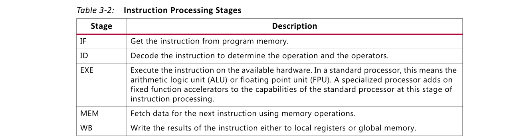
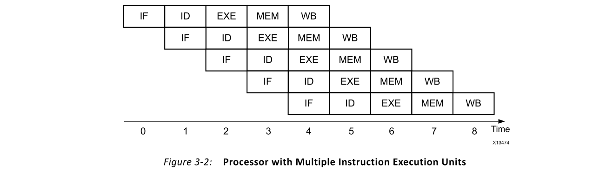
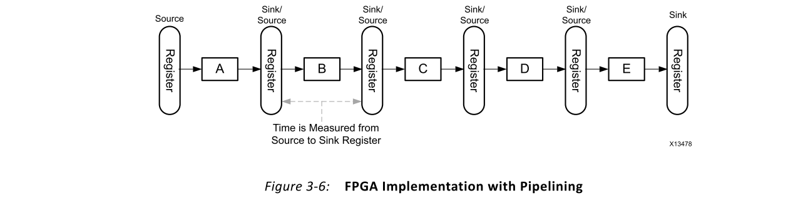
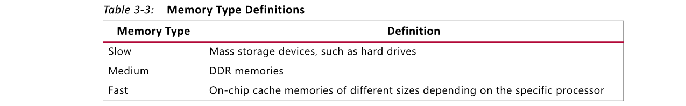

# Ch3 Basic Concepts of Hardware Design
## Overview
处理器和FPGA之间的主要区别之一是处理体系结构是否固定。这种差异直接影响每个目标的编译器的工作方式。对于处理器，计算架构是固定的，编译器的工作是确定如何使软件应用程序最适合可用的处理结构。性能是应用程序与处理器功能的映射程度以及正确执行所需的处理器指令数量的函数。

相反，FPGA类似于带有一盒构建块的空白面板。Vivado® HLS编译器的工作是从最适合软件程序的构建块框中创建处理体系结构。指导Vivado HLS编译器创建最佳处理体系结构的过程需要有关硬件设计概念的基础知识。

本章介绍了适用于FPGA和基于处理器的设计的一般设计概念，并说明了这些概念之间的关系。本章不涉及FPGA设计的详细方面。与处理器编译器一样，Vivado HLS编译器将算法实现的底层细节处理到FPGA逻辑结构中。

## Clock Frequency
处理器时钟频率是确定特定算法的执行平台时首先要考虑的项目之一。常用的准则是时钟频率越高，算法的性能执行率越高。尽管这可能是在处理器之间进行选择的很好的第一规则，但实际上会产生误导，并可能导致设计人员在处理器和FPGA之间进行选择时做出错误的选择。

该一般指导原则产生误导的原因与处理器和FPGA之间的时钟频率标称差异有关。例如，比较处理器和FPGA的时钟频率时，面对表3-1中所示的比较并不少见。

对表3-1中的值进行简单分析可能会误导设计人员，以为处理器的性能是FPGA的四倍。这种简单的分析错误地假设平台之间的唯一区别是时钟频率。但是，平台还有其他差异。

处理器和FPGA之间的**第一个主要区别**是软件程序的执行方式。处理器能够在通用硬件平台上执行任何程序。这个通用平台包括处理器的核心，并定义了必须安装所有软件的固定体系结构。具有对处理器体系结构的内在理解的编译器将用户软件编译为一组指令。结果指令集总是以相同的基本顺序执行，如图3-1所示。

无论处理器是标准处理器还是专用处理器，指令的执行总是相同的。用户应用程序的每条指令必须经历以下阶段：

1. Instruction fetch (IF)
2. Instruction decode (ID)
3. Execute (EXE)
4. Memory operations (MEM)
5. Write back (WB)

表3-2总结了每个阶段的目的。

大多数现代处理器都包括指令执行路径的多个副本，并且能够以某种程度的重叠来运行指令。由于处理器中的指令通常相互依赖，因此指令执行硬件的副本之间的重叠并不完美。在最好的情况下，只有使用处理器引入的开销阶段可以重叠。负责应用程序计算的EXE阶段按顺序执行。顺序执行的原因与EXE阶段中有限的资源以及指令之间的依赖性有关。

图3-2显示了具有以半并行顺序执行的多个指令的处理器。对于所有指令都尽快执行的处理器来说，这是最好的情况。即使在这种最佳情况下，每个时钟周期处理器也仅限于一个EXE stage。这意味着用户应用程序每个时钟周期向前移动一个操作。即使编译器确定所有五个EXE阶段都可以并行执行，但是该处理器的结构将阻止它。

FPGA不能在通用计算平台上执行所有软件。它一次在该程序的定制电路上执行一个程序。因此，更改用户应用程序将更改FPGA中的电路。与图3-1不同，在FPGA中进行处理时，EXE阶段如图3-3所示。MEM阶段的存在取决于应用程序。

有了这种灵活性，Vivado HLS编译器无需考虑平台中的开销阶段，而可以找到最大化指令并行性的方法。使用与图3-2相同的假设，图3-4显示了FPGA中相同软件的执行配置文件。

根据图3-2和图3-4的比较，FPGA与处理器相比具有9倍的标称性能优势。实际数字始终是特定于应用程序的，但是FPGA通常证明对于计算密集型应用程序，其性能至少是处理器的10倍。

仅关注时钟频率而隐藏的另一个问题是软件程序的功耗。功耗的近似值由下式给出：

$$
P=\frac{1}{2} c F V^{2} \tag{Equation 3-1}
$$

如公式3-1所示，经验数据支持功耗与时钟频率之间的关系，对于相同的计算工作量，该数据显示处理器中的功耗高于FPGA。通过为每个软件程序创建自定义电路，FPGA能够以较低的时钟频率运行，并且各操作之间具有最大的并行度，而不需要在处理器中看到的指令解释开销。

> 推荐：在处理器和FPGA之间进行选择时，**建议根据吞吐量和延迟时间而不是最大时钟频率来分析应用程序需求和计算工作量**。

## Latency and Pipelining
延迟是完成一条指令或一组指令以产生应用结果值所花费的时钟周期数。使用图3-1中所示的基本处理器体系结构，一条指令的等待时间为五个时钟周期。如果应用程序总共有5条指令，则此简单模型的总延迟为25个时钟周期。也就是说，直到25个时钟周期到期后，应用程序的结果才可用。

应用程序延迟是FPGA和处理器中的关键性能指标。在这两种情况下，都可以通过使用流水线解决延迟问题。在处理器中，流水线意味着下一条指令可以在当前指令完成之前启动执行。这允许指令集处理中所需的开销阶段重叠。图3-2显示了处理器流水线的最佳情况。通过重叠执行指令，处理器为五个指令应用程序实现了九个时钟周期的延迟。

在FPGA中，不存在与指令处理相关的开销周期。延迟是通过运行原始处理器指令的EXE阶段需要多少个时钟周期来衡量的。对于图3-3的情况，延迟为一个时钟周期。并行性在延迟中也起着重要作用。对于完整的五指令应用，FPGA延迟也是一个时钟周期，如图3-4所示。利用FPGA的一个时钟周期延迟，可能不清楚流水线为何具有优势。但是，在FPGA中进行流水线处理的原因与在处理器中进行流水处理的原因相同，即提高应用程序性能。

如前所述，FPGA是一片空白，带有构建模块，必须将其连接才能实现应用程序。Vivado HLS编译器可以直接或通过寄存器连接块。图3-5显示了使用5个构建块实现的图3-3中EXE阶段的实现。

FPGA中的操作时序是信号从源寄存器传输到宿寄存器所花费的时间长度。假设图3-5中的每个构建块需要2 ns的时间来执行，当前设计需要10 ns的时间来实现该功能。等待时间仍然是一个时钟周期，但是时钟频率限制为100 MHz。100 MHz的频率限制来自FPGA中时钟频率的定义。对于FPGA电路，时钟频率定义为源寄存器和宿寄存器之间的最长信号传播时间。

FPGA中的流水线是插入更多寄存器以将大型计算块分解为较小段的过程。计算的这种划分增加了绝对时钟周期数的等待时间，但是**通过允许定制电路以更高的时钟频率运行，从而提高了性能**。

图3-6显示了完成流水线操作后图3-5中处理体系结构的实现。**完整的流水线意味着在FPGA电路的每个构件之间插入一个寄存器**。寄存器的增加将电路的时序要求从10 ns降低到2 ns，从而导致最大时钟频率为500 MHz。此外，通过将计算分为单独的寄存器限制区域，每个块始终可以处于繁忙状态，这对应用程序吞吐量产生了积极影响。

> 重要信息：流水线引起的延迟是在FPGA设计期间要考虑的权衡之一。

## Throughput
吞吐量是用于确定实现的整体性能的另一个指标。**它是处理逻辑接受下一​​个输入数据样本所花费的时钟周期数**。使用该值，重要的是要记住，电路的时钟频率会改变吞吐量数字的含义。

例如，图3-5和图3-6都显示了在输入数据样本之间需要一个时钟周期的实现。关键区别在于，图3-5中的实现在输入采样之间需要10 ns，而图3-6中的电路在输入数据采样之间仅需要2 ns。在知道了时基之后，很明显第二种实现具有更高的性能，因为它可以接受更高的输入数据速率。

> 注意：在分析在处理器上执行的应用程序时，也可以使用本节中描述的吞吐量定义。

## Memory Architecture and Layout
所选实现平台的内存体系结构是可能影响软件应用程序性能的物理元素之一。内存体系结构确定了可实现性能的上限。在某个性能点上，无论可用计算资源的类型和数量如何，处理器或FPGA上的所有应用程序都将成为受内存限制的。FPGA设计中的一种策略是了解内存限制在何处以及如何受到数据布局和内存组织的影响。

在基于处理器的系统中，无论处理器的具体类型如何，软件工程师都必须在基本相同的内存体系结构上适应应用程序。这种共性简化了应用程序迁移过程，但以性能为代价。软件工程师熟悉的通用内存体系结构包括慢速，中速或快速存储器，具体取决于将数据发送到处理器所需的时钟周期数。这些存储器分类在表3-3中定义。

该表中所示的存储体系结构假定为用户提供了一个大的存储空间。在此存储空间内，用户分配和释放分配区域以存储程序数据。数据的物理位置及其在层次结构中**不同级别之间的移动方式由计算平台处理**，并且**对用户透明**。在这种系统中，**提高性能的唯一方法是尽可能重用高速缓存中的数据**。

为了实现此目标，软件工程师必须花费大量时间来查看高速缓存trace，重组软件算法以增加数据局部性以及管理内存分配以最大程度地减少程序的瞬时内存占用量。尽管所有这些技术都可以跨处理器移植，但结果却并非如此。必须针对运行的每个处理器调整软件程序，以最大化性能。

凭借使用基于处理器的存储器的经验，软件工程师在FPGA中使用存储器时遇到的第一个区别是缺乏固定的片上存储器架构。基于FPGA的系统可以连接到慢速和中速存储器，但在可用快速存储器方面表现出最大程度的差异。也就是说，Vivado HLS编译器没有构建软件以最佳利用现有缓存，而是构建了一种快速存储架构，以最适合算法中的数据布局。最终的FPGA实现可以具有一个或多个不同大小的内部存储区，可以彼此独立地进行访问。

图3-7中的代码示例显示了解决程序内存需求的最佳实践建议。

由于缺乏动态内存分配，FPGA代码可能会使经验丰富的软件工程师感到惊讶。由于底层的固定内存架构，长期以来，动态内存分配的使用一直是基于处理器的系统的最佳实践准则的一部分。

与这种方法相比，Vivado HLS编译器构建了针对应用程序量身定制的内存体系结构。量身定制的存储器体系结构既取决于程序中存储块的大小，又取决于整个程序执行过程中如何使用数据。当前最先进的FPGA编译器（例如Vivado HLS）要求在编译时可以完全分析应用程序的内存需求。

静态内存分配的好处是Vivado HLS可以以不同的方式实现数组A的内存。根据算法中的计算，Vivado HLS编译器可以将A的存储器实现为寄存器，移位寄存器，FIFO或BRAM。

> 注意：尽管动态内存分配受到限制，但Vivado HLS编译器完全支持指针。有关指针支持的详细信息，请参见第4章中的指针。

### Registers
存储器的寄存器实现是最快的可能的存储器结构。在这种实现方式中，A的每个条目都成为一个独立的实体。每个独立实体都嵌入到计算中，无需使用寻址逻辑或其他延迟逻辑即可使用。

### Shift Register
用处理器编程术语，可以将移位寄存器视为队列的一种特殊情况。在此实现中，A的**每个元素在计算的不同部分中多次使用**。移位寄存器的关键特性是，每个时钟周期都可以访问A的每个元素。另外，将所有数据项移动到下一个相邻的存储容器仅需要一个时钟周期。

### FIFO
FIFO可被认为是具有单个入口点和单个出口点的队列。这种结构**通常用于在程序循环或函数之间传输数据**。不涉及寻址逻辑，并且实现细节由Vivado HLS编译器完全处理。

### BRAM
BRAM是嵌入到FPGA架构中的随机存取存储器。Xilinx FPGA器件包括许多这些嵌入式存储器。确切的存储器数量取决于设备。用处理器编程的术语来说，这种存储器可以被认为是具有以下限制的高速缓存：
- 不实现通常在处理器缓存中发现的缓存一致性，冲突和缓存未命中跟踪逻辑。
- 仅在设备开机时才保留其值。
- 支持对两个不同存储位置的并行相同周期访问。

