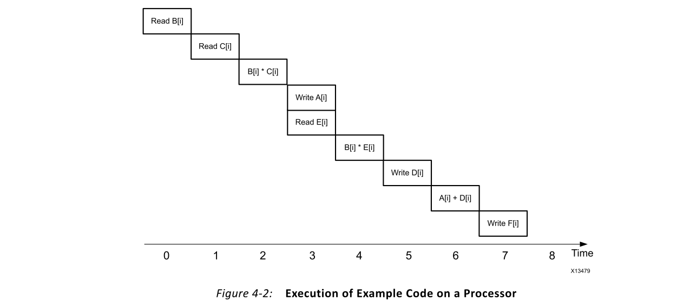
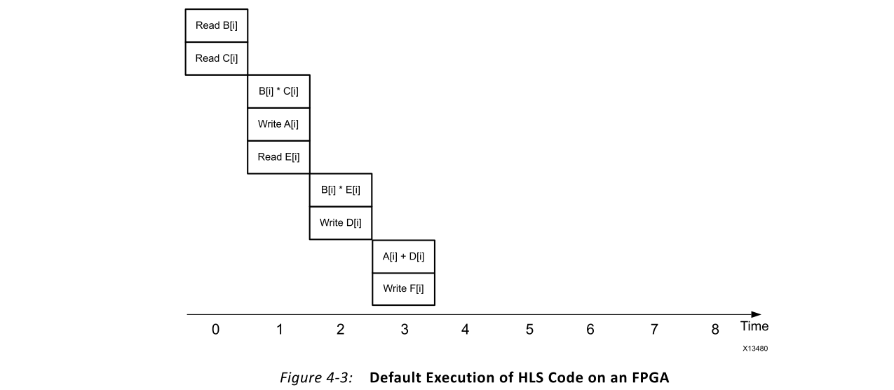
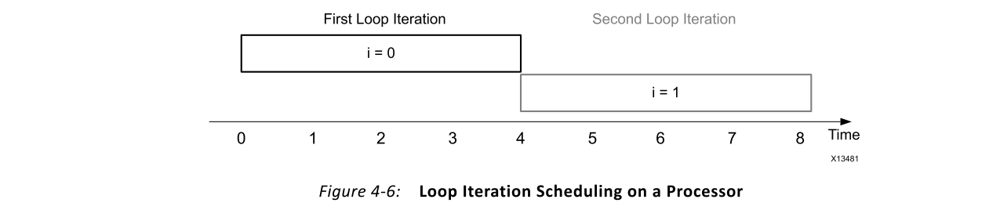
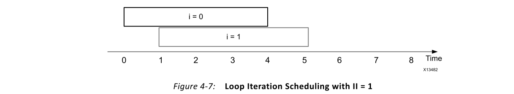

# Ch4 Vivado High-Level Synthesis
## Overview
Xilinx® Vivado® 高级综合（HLS）编译器提供的编程环境类似于可在标准和专用处理器上进行应用程序开发的环境。Vivado HLS与处理器编译器共享关键技术，用于解释，分析和优化C/C++程序。主要区别在于应用程序的执行目标。

通过将FPGA定位为执行结构，Vivado HLS使软件工程师能够针对吞吐量，功耗和延迟优化代码，而无需解决单个存储空间和有限计算资源的性能瓶颈。这允许将计算密集型软件算法实施到实际产品中，而不仅仅是功能演示者。本章介绍Vivado HLS编译器的工作方式以及与传统软件编译器的区别。

针对Vivado HLS编译器的应用程序代码使用与任何处理器编译器相同的类别。Vivado HLS按照以下方面分析所有程序：
- Operations
- Conditional statements
- Loops
- Functions

重要信息：Vivado HLS可以编译几乎所有C/C++程序。Vivado HLS的唯一编码限制是使用具有单个内存空间的处理器中典型的动态语言结构。使用Vivado HLS时，要考虑的主要动态结构是本章所述的内存分配和指针。

## Operations
操作指的是计算结果值所涉及的应用程序的算术和逻辑组件。此定义有意**排除比较语句**，因为它们在条件语句中处理。

在进行操作时，Vivado HLS与其他编译器之间的主要区别在于对设计器的限制。对于处理器编译器，固定的处理体系结构意味着用户只能通过限制操作依赖性和操纵内存布局以最大程度地提高缓存性能来影响性能。相反，Vivado HLS不受固定处理平台的限制，而是基于用户输入构建特定于算法的平台。如本节中的示例所示，这使HLS设计人员可以在吞吐量，延迟和功耗方面影响应用程序性能。

图4-1显示了在结果F[i]的计算中涉及的三个操作的集合。

使用处理器，生成的执行配置文件类似于图4-2。此应用程序配置文件仅关注中央处理器（CPU）中指令处理的EXE阶段。这是指令处理中处理器和FPGA之间共享的唯一阶段。在此示例中，执行跟踪是顺序的是因为执行平台而不是算法。基于该算法，可以以任意顺序或同时计算A[i]和D[i]的值。唯一的算法限制是这两个值必须在F[i]之前计算。

图4-3显示了使用Vivado HLS中的默认设置将图4-1中的代码编译到FPGA的结果。生成的执行配置文件与处理器的执行配置文件相似，因为乘法和加法按顺序发生。此默认行为的原因是最大程度地减少了实现用户应用程序所需的构件数量。尽管FPGA没有固定的处理体系结构，但是每个设备都具有可支持的最大数量的构建块。因此，设计人员可以评估FPGA资源，应用性能和每个器件的应用数量。

即使具有默认行为，由于为算法创建的自定义内存体系结构，该实现也优于处理器执行。在处理器上，阵列A，B，C，D，E和F存储在单个内存空间中，一次只能访问一个。相反，HLS检测这些存储器并为每个阵列创建一个独立的存储体，这导致阵列B和阵列C的读取操作之间出现重叠。

在时钟周期1中对阵列E的读取操作的调度显示了Vivado HLS的自动资源优化之一。对于存储器操作，Vivado HLS分析包含数据的存储体，以及在计算过程中消耗该值的位置。尽管阵列E的读取可以在时钟周期0内进行，但Vivado HLS会自动将存储器操作尽可能地靠近消耗数据的位置，以减少电路中的临时数据存储量。因为使用E值的乘法器要到时钟周期2才运行，所以安排读取访问的发生要早于时钟周期1没有好处。

Vivado HLS帮助用户控制生成的电路大小的另一种方法是通过提供用于变量大小确定的数据类型。与所有编译器类似，Vivado HLS为用户提供对整数，单精度和双精度数据类型的访问。这样可以将软件快速移植到FPGA上，但可以掩盖算法效率低下的问题，这是处理器中可用的32位和64位数据路径的结果。

例如，假设图4-1中的代码仅需要数组B，C和E中的20位值。在原始处理器代码中，这些位大小将要求数组A，D和F能够存储64位值，以避免精度损失。Vivado HLS可以按原样编译代码，但是这会导致效率低下的64位数据路径消耗的资源比算法所需的资源更多。

图4-4显示了如何使用Vivado HLS任意精度数据类型重写图4-1中的代码的示例。通过使用这些数据类型，可以快速进行软件级的探索，并验证算法正确性所需的最低精度。除了减少实现计算所需的资源数量之外，使用任意精度的数据类型还可以减少完成操作所需的逻辑级别。反过来，这减少了设计的等待时间。

如第3章“硬件设计的基本概念”，流水线化或将计算划分为较小的寄存器绑定区域，这是实现目标时钟频率的基本FPGA设计技术。根据操作的大小，此优化由Vivado HLS自动执行。Vivado HLS将大型操作划分为多个计算阶段，并相应增加了电路等待时间。

## Conditional Statements
条件语句是程序控制流语句，通常以if，if-else或case语句的形式实现。这些编码结构是大多数算法不可或缺的一部分，并被包括HLS在内的所有编译器完全支持。编译器之间的唯一区别是如何实现这些类型的语句。

使用处理器编译器，条件语句将转换为可能会或可能不会导致上下文切换的分支操作。引入分支会影响到接下来要从内存中提取哪个指令的依赖关系，从而破坏了图3-2中所示的最大指令执行包。这种不确定性导致处理器执行流水线中出现气泡，并直接影响程序性能。

在FPGA中，条件语句对性能的潜在影响与在处理器中的影响不同。Vivado HLS创建条件语句的每个分支所描述的所有电路。因此，条件软件语句的运行时执行涉及两个可能结果之间的选择，而不是上下文切换。
## Loops
循环是表达迭代计算的通用编程结构。一种常见的误解是在使用像HLS这样的编译器时不支持循环。尽管对于FPGA的早期编译器来说可能是这样，但HLS完全支持循环，甚至可以进行超出标准处理器编译器能力的转换。图4-5显示了一个简单循环的示例。

出于说明目的，假设该循环每次迭代花费四个时钟周期，而与实现平台无关。在处理器上，编译器被迫按顺序调度循环迭代，总共运行40个周期，如图4-6所示。

HLS没有此限制。因为HLS为算法创建了硬件，所以它可以通过流水线化迭代来更改循环的执行配置文件。循环迭代流水线将操作并行化的概念从循环迭代内扩展到跨迭代。

为了减少迭代等待时间，Vivado HLS进行的第一个自动优化是将**运算符并行化到循环迭代主体**。第二个优化是**循环迭代流水线**。这种优化需要用户输入，因为它会影响FPGA实现的资源消耗和输入数据速率。

**HLS的默认行为是按照与处理器相同的调度执行循环**，如图4-6所示。这意味着图4-5中的代码的处理等待时间为40个周期，输入数据速率为每4个周期一次。在此示例中，输入数据速率由可以从输入中采样B和C值的速度定义。

HLS可以并行化或流水线化循环的迭代，以减少计算延迟并增加输入数据速率。用户通过设置循环初始化间隔（II）来控制迭代流水线的级别。循环的II指定连续循环迭代的开始时间之间的时钟周期数。图4-7显示了将II的值设置为1后得到的循环调度。

为了获得此结果，HLS分析了循环迭代0和1之间的数据依赖性和资源争用，并自动解决了以下问题：
- 为了解决数据依赖性，HLS更改了循环主体中的操作之一，或向用户查询算法更改。
- 为了解决资源争用，HLS实例化资源的更多副本或向用户查询算法更改。

表4-1总结了循环流水线对执行特性的影响。

## Functions
函数是一个编程层次结构，可以包含运算符，循环和其他函数。HLS和处理器编译器中的函数处理都类似于循环。

在HLS中，循环和函数之间的主要区别与术语有关。HLS可以并行化循环和函数的执行。对于循环，这种转换通常称为流水线，因为运算符和循环迭代之间存在明显的层次结构差异。使用函数，循环主体外部和循环内部的操作在同一层次结构上下文中，如果使用术语流水线操作，则可能导致混乱。为了避免在使用HLS时可能出现的混乱，将函数调用执行的并行化称为**数据流优化**。

数据流优化指示HLS为给定程序层次结构的所有功能创建独立的硬件模块。这些独立的硬件模块能够在数据传输期间并发执行和自同步。

## Dynamic Memory Allocation
动态内存分配是C和C++编程语言中可用的内存管理技术之一。用这种方法，用户可以在程序运行时分配必要的内存。分配的内存大小可以在程序执行之间变化，并且可以从第3章“硬件设计的基本概念”中所述的中央物理内存池中分配。表4-2中显示了通常与动态内存分配关联的函数调用。

如第3章“硬件设计的基本概念”中所述，FPGA没有HLS编译器必须适合用户应用程序的固定存储器架构。取而代之的是，HLS根据算法的独特要求来合成内存体系结构。因此，提供给HLS编译器以在FPGA中实现的所有代码**必须仅使用编译时可分析的内存分配**。

为了帮助用户确保提供给HLS的所有代码都是可综合的，编译器在分析设计之前执行了编码合规检查。此代码合规性标记会标记所有不适用于HLS的编码样式。**用户负责手动更改代码并删除所有动态内存分配实例**。

图4-8中的代码在内存中分配了一个区域，用于存储10个32位的值。

尽管此编码示例明确声明了恒定的内存分配，但HLS代码合规性阶段并未分析malloc语句的内容。即使分配是恒定的，HLS也不能综合包含表4-2中任何关键字的代码，如图4-8所示的示例。有两种修改此代码以符合HLS的可能方法。以下代码示例演示了这些方法，并说明了它们对FPGA实现的影响。

图4-9中的代码显示了C/C++程序自动进行的内存分配。HLS严格按照C/C++规定的行为来实现此内存样式。这意味着为存储数组A而创建的内存仅在包含该数组的函数调用期间存储有效数据值。因此，**函数调用负责在每次使用前用有效数据填充A**。

图4-10中的代码显示了C/C++程序的静态内存分配。这种类型的内存分配行为表明，数组A的内容在函数调用之前有效，直到程序完全关闭为止。使用HLS时，只要电路有电，为数组A实现的内存就包含有效数据。

自动和静态内存分配技术都可以增加处理器上运行的算法的总体软件内存占用量。在C/C++中为FPGA实现指定算法时，最重要的考虑因素是用户应用程序的总体目标。也就是说，编译为FPGA时的主要目标不是创建最佳的软件算法实现。相反，当使用类似HLS的工具时，目标是以一种允许工具推断出最佳硬件架构的方式来捕获算法，从而实现最佳实施。
## Pointers
指针是内存中某个位置的地址。C/C++程序中指针的一些常见用法是函数参数，数组处理，指向指针的指针和类型转换。这种语言结构的固有灵活性使其成为C/C++代码的有用且流行的元素。**HLS编译器支持可以在编译时进行完整分析的指针用法**。**可分析的指针用法是可以在笔和纸计算中完全表达和计算的用法，而无需运行时信息**。

图4-8中的代码显示了如何使用指针来引用内存中动态分配的区域。如前所述，HLS不支持此用法，**因为仅在程序执行期间才知道指针的目标地址**。这并不意味着在使用HLS编译器时不支持将指针用于内存管理。图4-11显示了一种有效的编码样式，其中使用了指针来访问内存。

该代码有效，因为可以分析指针pA的所有使用并将其映射回数组A。由于数组A是通过自动内存分配创建的，因此HLS可以完全确定A的属性。

**内存和指针的另一个受支持模型是访问外部内存**。使用HLS时，对函数参数的任何指针访问都意味着变量或外部存储器。HLS将外部存储器定义为编译器生成的RTL范围之外的任何存储器。这意味着该存储器可能位于FPGA的另一个函数中，或者位于片外存储器（例如DDR）的一部分中。

在图4-12所示的代码中，函数foo是HLS的顶层模块，以data_in作为参数。基于对data_in的多指针访问，HLS推断此功能参数是外部存储模块，必须通过硬件级别上的总线协议对其进行访问。诸如高级可扩展接口（AXI）协议之类的总线协议指定了多个功能如何相互连接和通信。

