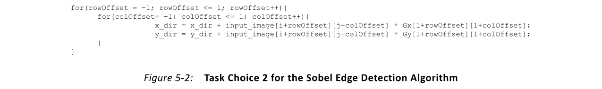
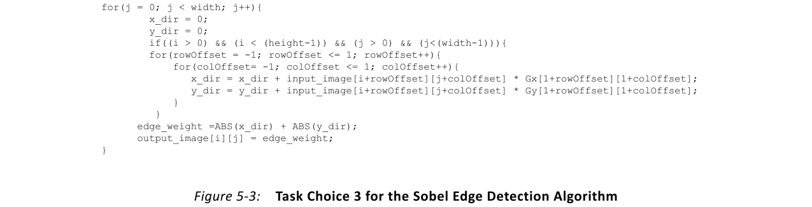
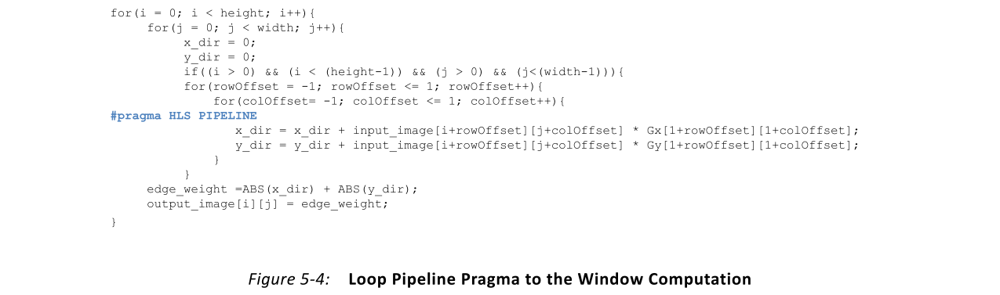
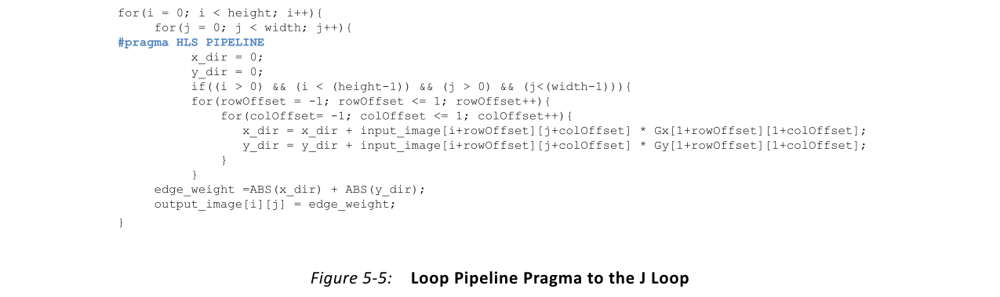
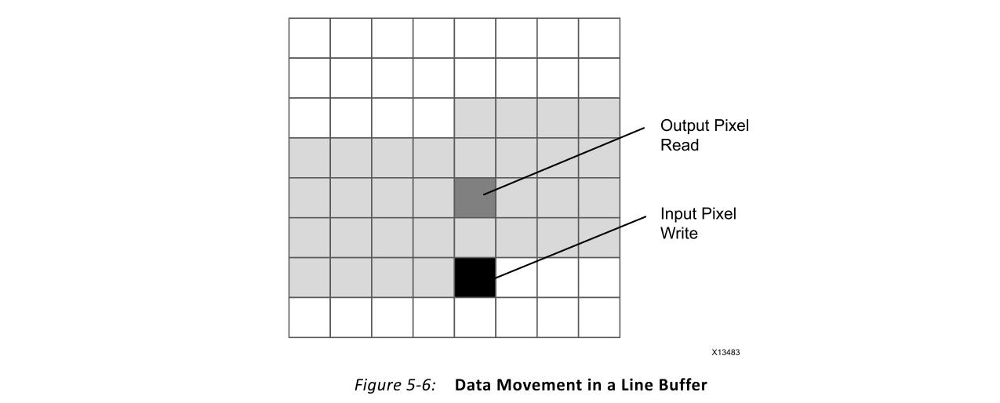
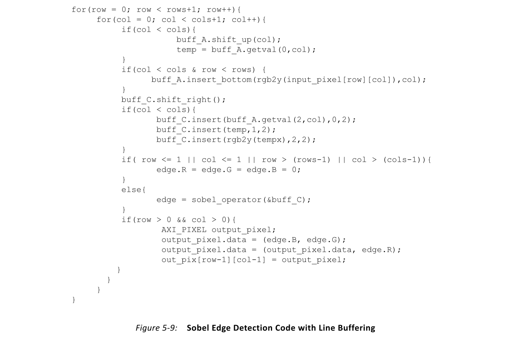

# Ch5 Computation-Centric Algorithms
## Overview
尽管关于算法分析的文献很多，但以计算为中心的算法与以控制为中心的算法的细微差别在很大程度上取决于实现平台。本章在Vivado® HLS编译器和FPGA的上下文中定义了以计算为中心的算法。它还包括示例和最佳实践建议，以最大程度地提高HLS生成的实现的性能。

以计算为中心的算法是为每个任务配置一次的算法，并且在任务持续时间内无法更改其行为。硬件中的任务与C/C++程序中的函数调用相同。任务的大小在HLS用户的控制下。

> 推荐：通常，建议任务的大小基于算法中的自然工作划分。

图5-1显示了Sobel边缘检测操作的代码。这是一个以计算为中心的算法的示例，该算法可以分为不同大小的任务。此算法是二维滤波操作，它通过计算x和y方向上每个像素的梯度来计算图像中区域的边缘。如目前所写，此代码可以由HLS编译为FPGA实现。

为了适当地优化该算法，设计人员必须首先确定任务的大小。任务的大小决定了需要配置生成硬件模块的频率以及接收新一批数据的频率。图5-2和图5-3显示了图5-1中代码的两个可能的任务定义。另一种选择是将图5-1中的代码定义为任务。

任务选择2（图5-2）创建仅用于梯度计算的硬件模块。梯度计算在3x3像素窗口上工作，不支持线或图像帧的概念。该选择的问题是该选择执行的工作量与算法的自然工作分配之间的不匹配。Sobel边缘检测可在完整图像范围内使用。这意味着对于任务大小的选择，设计人员必须确定如何将图像划分为使用HLS构建的任务处理器所需的3x3像素切片。需要处理器或其他硬件模块来完成算法的功能。

任务选择3（图5-3）处理每个任务的完整像素行。这是对“任务选择1”的改进，因为它需要更少的附加模块来实现算法的完整功能。这种方法还将与控制处理器的交互减少到每行一次。将任务的大小设置为一次只能处理一行的问题在于，基础操作需要多行来计算结果。通过这种选择，可能需要一种复杂的控制机制来将图像行排序到HLS生成的硬件模块中。

任务选择1（图5-1）是此算法的最佳选择，因为它与图5-1所示代码中表示的每个函数调用的完整图像匹配。该选择是一项以计算为中心的任务，因为在图像帧的持续时间内，生成的FPGA实现的配置是固定的。可以在帧之间更改已处理图像的大小，但不能在任务开始后更改。

确定适当的任务大小后，用户必须使用HLS编译器选项优化算法实现。对于图5-1中的代码，FPGA实现具有每秒60帧的1080像素的目标图像大小。这转化为硬件模块，该模块能够以150 MHz的时钟频率处理1920x1080像素，每个时钟周期的输入数据速率为1像素。

## Data Rate Optimization

在HLS编译器中，代码优化从基线编译开始。**基准编译的目的是确定实现瓶颈位于何处**，并设置一个基准点来衡量不同优化的效果。基准编译使用最少的FPGA资源和最低的输入数据速率构建算法实现。在本章的示例中，基线编译导致每40个时钟周期1个像素的输入数据速率。

使用HLS编译器时，流水线优化是增加输入数据速率和所生成实现中并行度的方法。如第2章所述，什么是FPGA？在第3章“硬件设计的基本概念”中，流水线将大型计算划分为可以并行执行的较小阶段。当应用于循环时，流水线设置循环的启动间隔（II）。

循环II通过影响开始i+1迭代所需的时钟周期数来控制循环的输入数据速率。设计人员可以选择在算法代码中将流水线优化应用到何处。图5-4显示了流水线编译指示在窗口计算中的应用。

> 注意：有关HLS编译器中可用的编译指示的详细信息，请参见《 Vivado Design Suite用户指南：高级综合（UG902）[参考1]》。

图5-4中的示例显示了作为编译器编译指示直接应用到算法源中的流水线优化。在此级别的代码中，流水线编译指示的作用是每个时钟周期在3x3过滤器窗口中计算一个字段。因此，需要9个时钟周期来计算3x3窗口中的乘法，以及一个额外的时钟周期才能生成结果像素。在应用程序级别上，这意味着输入采样率每10个时钟周期变为1个像素，这不足以满足应用程序要求。

图5-5显示了流水线​​编译指示在j循环中的应用，该循环跨越了图像的各列。通过在此循环上应用管道编译指示，HLS实现可以在每个时钟周期输入数据速率达到1个像素。为了获得新的输入数据速率，编译器首先完全展开窗口计算循环，以便所有梯度乘法可以并行发生。展开过程会实例化其他硬件，并将每个时钟周期对输入映像的存储带宽要求增加到九个存储操作。

尽管HLS编译器可以检测到需要比算法中表示的更高的内存带宽，但编译器无法自动引入影响算法正确性的任何更改。在此示例中，超出HLS生成的模块范围的内存无法满足流水线优化所需的九个并发内存访问。

无论外部存储器上的端口数量如何，由HLS生成的模块只能连接到一个端口，该端口每个时钟周期只能进行一次事务。因此，必须修改算法，以将内存带宽要求从模块输入端口移到由HLS编译器生成的内存。该内部存储器类似于处理器中的高速缓存。对于像Sobel边缘检测这样的图像处理算法，此本地内存称为行缓冲区。

行缓冲器是一个多bank内部存储器，可为生成的实现提供每个时钟周期同时访问来自三个不同行的像素。在开始任何计算之前，实现行缓冲区的算法必须分配时间，以用足够的数据填充结构来满足计算需求。这意味着要满足每个计算结果九次访问的存储要求，该算法必须考虑通过行缓冲区的数据移动以及算法更改所产生的额外带宽。

图5-6显示了图像像素通过行缓冲区的移动。

浅灰色框表示此存储结构当前存储的像素。该块的目的是仅存储功能正确性所需的最小像素数，而不是存储整个图像。如前所述，此存储结构的添加在输入像素采样和输出像素计算之间引入了延迟。对于3x3窗口操作，例如在图5-5中所示的代码中，行缓冲区必须存储两条完整的图像行和第三行的前三个像素，然后才能计算出第一个输出像素。深灰色和黑色框表示此延迟。黑框突出显示从源图像写入下一个输入像素的位置。深灰色框显示当前计算的像素在输出图像中的位置。

HLS使用来自FPGA架构的BRAM资源来实现线路缓冲区。这些双端口存储元件布置在存储体中，其中一个存储体对应于一条线。因此，可用于算法计算的存储器带宽**从每个时钟周期原始的1个像素增加到每个时钟周期3个像素，增加了三倍**。这仍然不足以满足每个时钟周期9个像素的要求。

为了满足每个时钟9像素的要求，设计人员除了行缓冲器外，还必须在算法源代码中添加一个内存窗口。存储器窗口是使用FPGA架构中的FF资源实现的存储元素。该存储器中的每个寄存器都可以独立于所有其他寄存器访问，并且可以同时访问。从逻辑上讲，由FF元素组成的内存可以采用最适合C/C++算法描述的任何形状。

图5-7显示了Sobel边缘检测算法的存储器窗口。

灰色的中心像素突出显示要为其计算梯度的像素。黑柱表示行缓冲器提供的3个像素。在每个时钟周期，窗口的内容向左移动，以便为行缓冲区中的新列腾出空间。窗口内存的数据重用和分布式实现提供了算法所需的九种内存操作。该存储器不会在设计中引入额外的延迟。窗口数据移动操作与行缓冲区的操作同时发生。

图5-8显示了通过分层存储体系结构从输入到计算的整个数据移动。

图5-9显示了实现分层内存体系结构所需的算法代码更改。这种分层的体系结构允许HLS生成的实现实现每时钟周期1像素的输入数据速率。在此代码示例中，算法的计算内核位于sobel_operator函数中。此代码的主要变化是行循环和列循环分别扩展了一个迭代。此扩展解决了行缓冲区引入的额外任务执行时间。另外，通过基于原始图像边界的if条件来保护对行缓冲区的写入操作。该算法的输出写操作基于输出图像的位置，该位置与原始图像有1行1列的偏移。

如图5-9所示，以计算为中心的应用程序可以具有for循环，if-else语句等形式的嵌入式控制语句。这种算法的关键特征是其功能和行为在任务持续时间内是固定的。HLS生成的模块根据给定的配置处理一批数据。可以在每个任务之间更改配置，但不能在任务期间更改。

> 提示：行缓冲区操作库是HLS编译器提供的视频库的一部分。有关更多信息，请参见《 Vivado设计套件用户指南：高级综合（UG902）[参考1]》。

