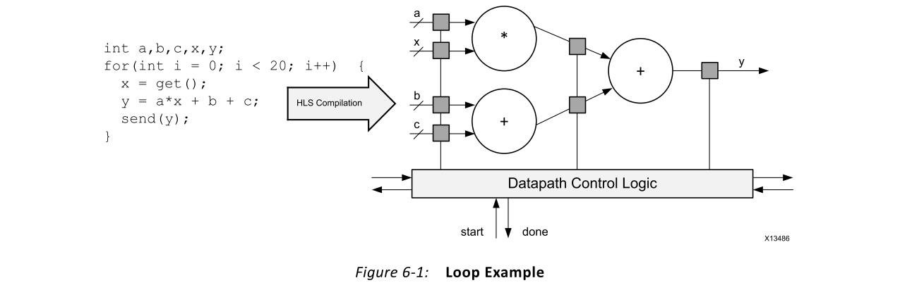
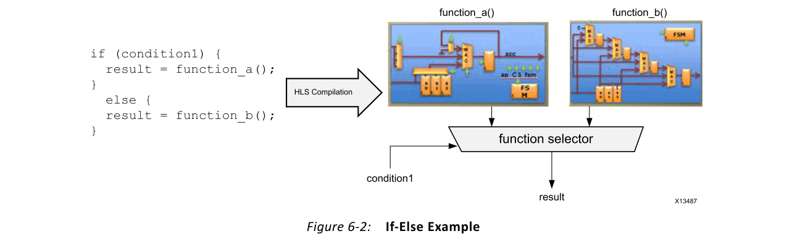
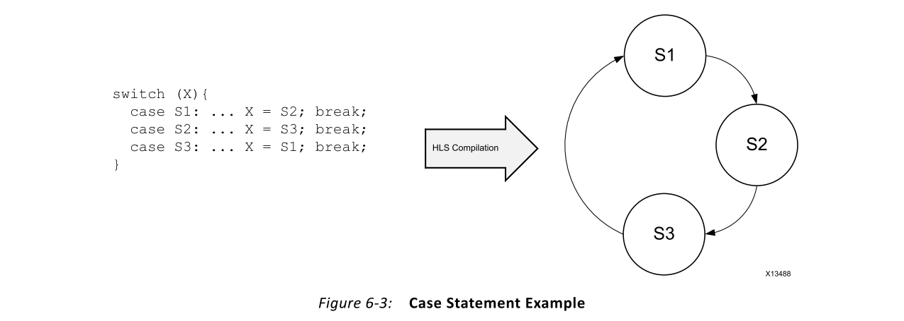
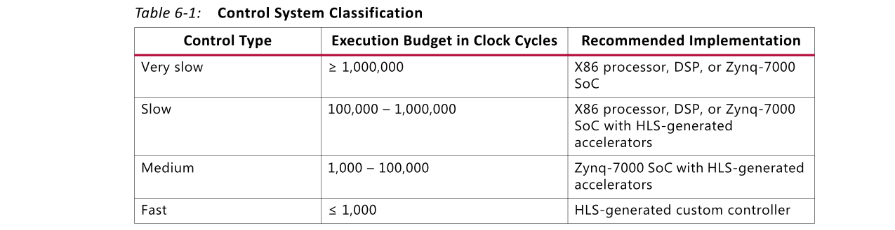
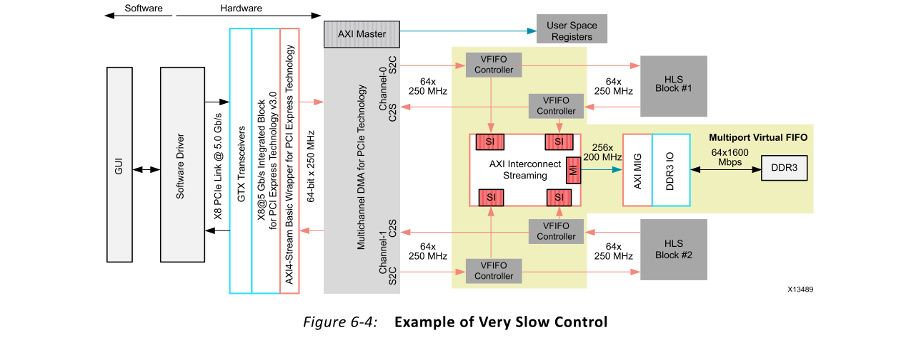
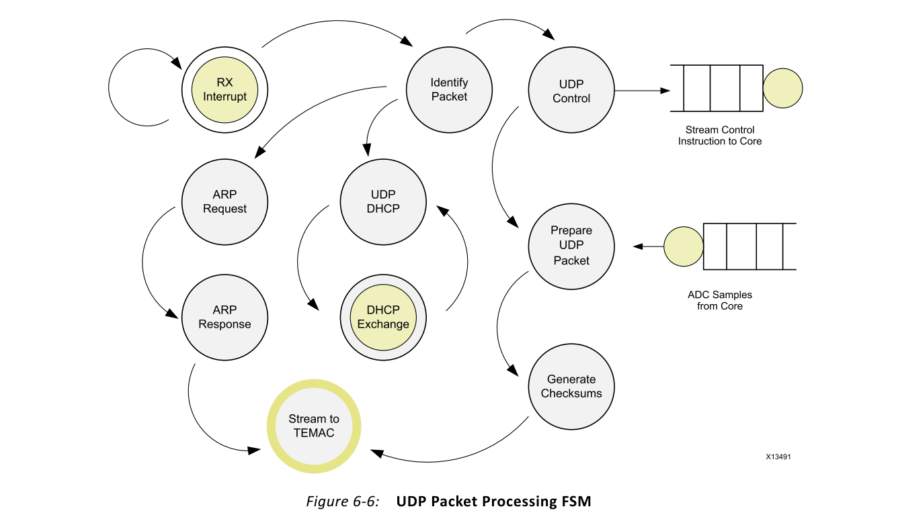
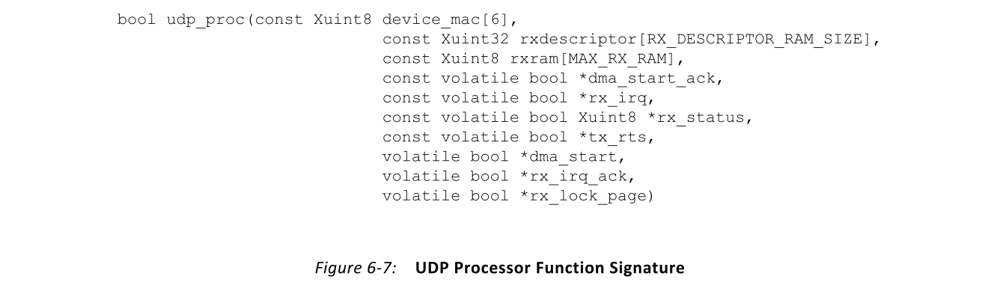
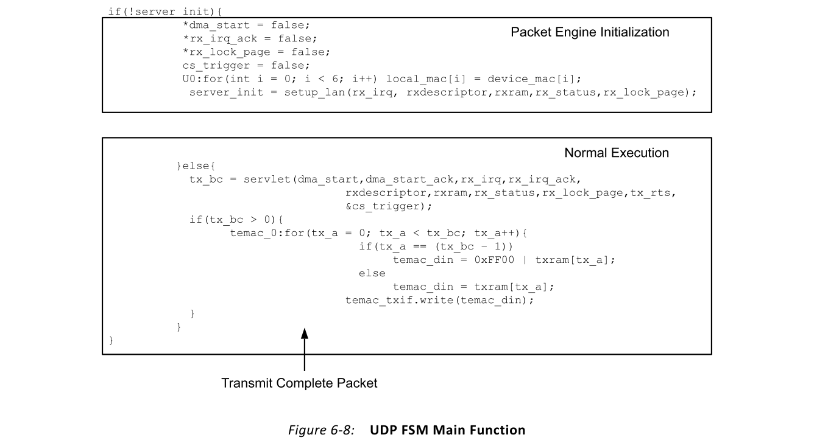

# Ch6 Control-Centric Algorithms
## Overview
以控制为中心的算法是一种可以在任务执行期间根据系统级因素进行更改的算法。以计算为中心的算法在任务持续时间内将相同的运算应用于所有输入数据值，而以控制为中心的算法则根据当前输入端口状态确定其运算。本章介绍了使用Vivado® HLS编译器优化这些类型的应用程序的最佳实践。
## Expressing Control in C/C++
在描述最佳实践之前，重要的是要回顾如何用C和C ++语言表达控制。

### Loops
循环是用于表达迭代计算的基本编程构造。像所有编译器一样，HLS允许将循环表示为for循环，while循环和do-while循环。用Vivado HLS编译的所有类型的应用程序都支持此构造。如第5章以计算为中心的算法中的Sobel边缘检测示例所示，循环对于C/C++中的计算密集型算法至关重要。

图6-1显示了for循环的示例以及Vivado HLS编译的效果。它说明了Vivado HLS编译如何在单个FPGA实现中生成计算和控制逻辑。与上一代用于FPGA结构的代码编译器不同，Vivado HLS编译器不区分控制和计算语言结构。对于该图中的代码，HLS为循环中的数学运算生成流水线式数据路径。这种实现通过在循环迭代之内和之间并行化计算来减少执行延迟。除此逻辑外，Vivado HLS实现还嵌入了循环控制器逻辑。回路控制器逻辑指示执行硬件多少次以计算y的值。

### Conditional Statements
在C和C ++中，条件语句通常表示为if-else语句。在硬件实现中，这将基于触发值在两个结果或两个执行路径之间做出选择。这种有用的结构使设计人员可以在变量或功能级别上对算法进行控制。HLS编译器完全支持这两种用例。

图6-2显示了if-else语句的示例，其中if语句在算法中的两个不同函数之间进行选择。Vivado HLS编译器生成的实现为function_a和function_b分配FPGA资源。这两个硬件电路都是并行运行的，**并且在相同的时钟周期内进行平衡以产生结果**。原始源代码中的条件触发器用于在两个计算结果之间进行选择。

### Case Statements
Case语句根据输入变量的值定义程序中特定的操作或事件序列。尽管此构造可用于以计算为中心的算法，但在以控制为中心的应用程序中更为普遍，在这些应用程序中，系统级别的更改直接影响模块的执行。同样，在大多数使用模型中，case语句明确定义了从一个程序控制区域到另一个程序控制区域的过渡。

图6-3显示了一个示例case语句以及使用Vivado HLS进行编译的结果。编译器将case语句转换为硬件有限状态机（FSM）。FSM的数组表示状态之间的转换，并与代码样本中的大小写转换相对应。FSM中的每个状态还包括程序控制区域内的计算逻辑。

### Control System Classification

使用代码构造以控制为中心的应用程序之后，设计人员面临的下一个决定是在其上运行应用程序的平台。在过去，处理器通常被选为最合适的平台。正如Zynq®-7000SoC所展示的，在许多用例中，处理器是最佳选择。但是，HLS编译器消除了状态机优化和复杂性的问题，这是在FPGA架构中实现控制算法的瓶颈。设计人员可以选择在处理器上运行相同的控制算法，或者作为FPGA架构中由HLS生成的客户控制器运行。然后，根据算法响应时间要求和FPGA架构资源的消耗在这些选项之间进行选择。

表6-1显示了按对外部事件的响应时间分类的控制算法。

对于需要非常慢的响应时间的设计，最佳的实现选择是处理器。这种选择为将以计算为中心的算法编译到FPGA架构中提供了更多空间。图6-4显示了一个具有非常慢的控制响应时间的系统的示例。

对于要求中等速度的设计（如慢速或中等类别所示），实现选择可以是更多的处理器，也可以是FPGA结构中的定制逻辑。在这些情况下，控制算法具有关键功能，必须将其实现为硬件模块。对于这些类型的系统，硬件协处理器的目的是弥补控制处理器中的通信延迟或处理速度不足。图6-5显示了一个需要硬件协同处理元素的系统的示例。

以控制为中心的应用程序的最后一类是快速响应时间类别。此类别是指要求响应时间和计算吞吐量高于处理器所能提供的控制应用程序。自从引入HLS编译器以来，属于该类别的算法范围已经扩大。例如，越来越多地使用HLS编译器来生成Zynq-7000 SoC的处理器加速器模块。

## UDP Packet Processing
用户数据报协议（UDP）是计算机联网应用程序中使用的无状态数据传输协议。该协议不能保证数据包传送，也不能处理丢失的数据包恢复。相反，它在有线或无线通道上尽可能快地传输数据包。该协议可实现的数据速率使其成为Internet电话，视频流和其他应用程序的标准，在这些应用程序中，数据速率比接收传输中的每个数据包都重要。

尽管此协议不能跟踪数据包的传送和状态，但它仍然是一个以控制为中心的应用程序。UDP数据包处理器的控制方面包括：
- 以线路传输速率解析传入的数据包
- 响应来自网络的控制包
- 格式化数据包以进行传输
- 处理传输通道中断

所有这些控制方面都会导致如图6-6所示的复杂状态机。在引入HLS编译器之前，这种复杂的控制级别始终以处理器为目标，即使以牺牲性能为代价。选择此实现方式的主要原因是难以在手动设计流程中有效表达和平衡此大小的FSM。

如图6-6所示，UDP数据包处理FSM是一个由互连状态组成的复杂网络。每个状态处理数据包处理的不同阶段。除了状态之间的复杂交互之外，每个状态都可以被系统级事件中断。这些事件可能会触发来自应用程序的状态信息请求，或者重新配置如何处理下一个数据包。与以计算为中心的应用程序不同，包处理没有明确定义的任务大小。必须分析每个数据包，这意味着只要设备通电，任务的持续时间是无限的。UDP处理FSM的实现始于顶层功能签名。

图6-7显示了针对使用HLS编译器实现FPGA的UDP数据包处理引擎的顶层功能签名。在此功能中，数组用于为该模块与系统其余部分之间的物理通信缓冲区建模。还要注意的重要一点是，使用volatile关键字标记不是数组的每个函数变量。如图6-6所示，该控制器必须能够在任何执行阶段处理系统的中断。这个需求的问题是在C和C++中都指定的函数变量行为。

在C和C++中，在发出函数调用时，对函数变量进行采样并存储在函数存储空间内的本地副本中。这意味着，除了可能在多个内存空间中存储相同的变量之外，C/C++程序直到下一个函数调用时才检测到变量值的变化。volatile关键字是此问题的语言解决方案。嵌入式软件开发人员熟悉的此构造通知C/C++编译器，变量可以在函数调用期间更改值。因此，每次在代码中使用volatile变量时，都必须直接从函数端口访问它。尽管此语言构造可解决数据访问问题，但它不会删除变量的内部副本。

const限定符解决了跨存储空间潜在的数据重复问题。当将此限定符应用于函数端口时，编译器避免在函数存储空间内创建变量的本地副本。相反，读或写操作直接在变量端口上进行。在硬件中，使用const volatile限定符可使系统在任务期间对外部输入做出反应，并减少反应的延迟。

图6-8显示了封装UDP控件FSM的主要处理过程的代码。

UDP控制FSM的执行分为初始化和正常执行阶段。一旦FPGA实现退出复位状态，就会初始化阶段。在此阶段，状态标志设置为默认值，并且从内存中加载该块的媒体访问控制（MAC）地址。MAC地址是为其分配动态主机配置协议（DHCP）地址的唯一网络标识符。UDP控制器可以广播其地址后，它开始处理网络控制数据包，以向网络请求并注册Internet协议（IP）地址。控制器在网络中正确注册后，它将切换到正常操作模式并开始生成UDP数据包。除了特定的功能之外，此代码还演示了如何在单个以控制为中心的应用程序中组合控制和计算编码元素。

图6-8中的代码显示了基于两个执行阶段的单层控制层次结构。实际上，以控制为中心的应用程序比该示例更为复杂，并且具有分层的控制结构。以与处理器相同的方式捕获控制层次结构的能力，是HLS与其它软件编译器之间的主要区别之一。

图6-9显示了如何为HLS编译器表达层次控制的示例。该图是图6-8中servlet功能的一部分。初始化后，servlet函数控制UDP控制器的所有操作阶段。如该代码所示，该模块与系统级信号具有恒定的交互作用，以确定下一个操作。另外，这种编码风格保留了嵌套的case语句和处理器代码典型的计算功能的混合。这有助于捕获C/C++中的功能，并有助于代码从处理器迁移到FPGA。

可以使用HLS编译器在以FPGA为中心的以控制为中心的应用程序中进行编译和实现。因此，实现这种类型的代码的决定减少到控制代码的需求与应用程序中所有其他功能的需求之间的资源折衷。通过使用HLS编译器开发整个应用程序，用户可以确定设计中以控制为中心的功能和以数据为中心的功能在不同性能点上需要多少资源。HLS编译器产生多种假设情景的能力允许探索设计变量，例如吞吐量与面积与延迟。