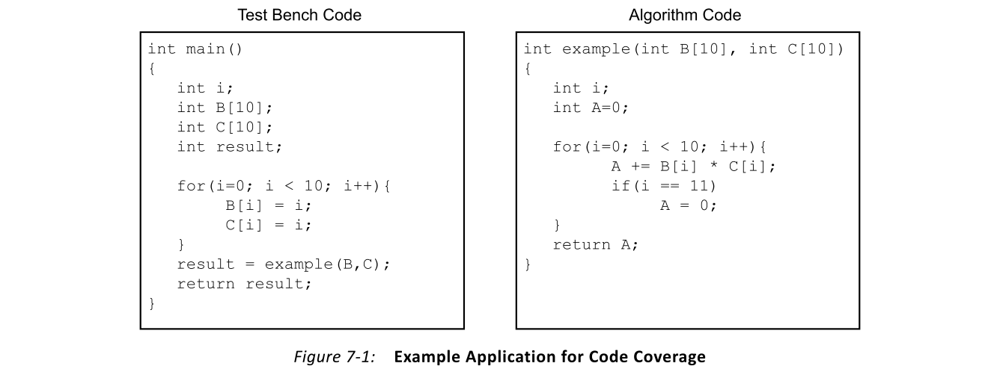
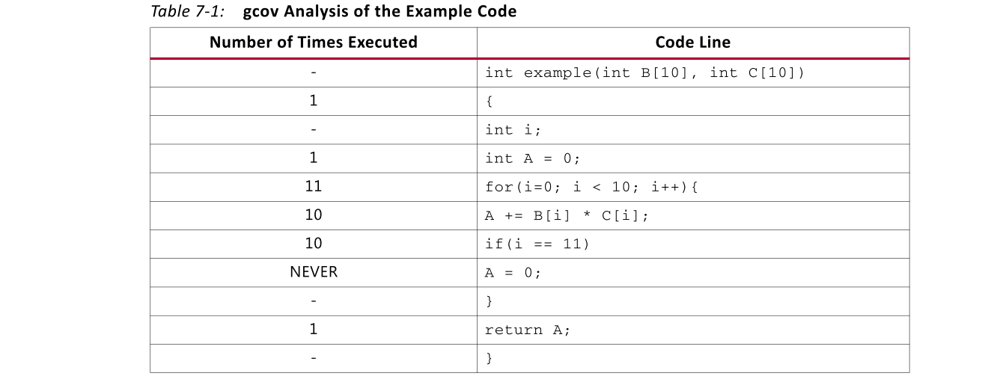
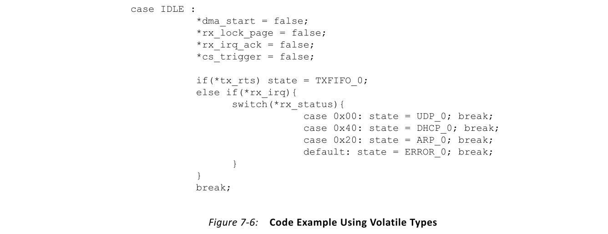

# Ch7 Software Verification and Vivado HLS
## Overview
与处理器编译器一样，Vivado® HLS编译器输出的质量和正确性取决于输入软件。本章回顾了适用于Vivado® HLS编译器的推荐软件质量保证技术。**它提供了典型编码错误的示例及其对HLS编译的影响，以及每种问题的可能解决方案**。它还包括关于无法在C/C++仿真级别上完全验证程序行为的情况下该怎么做的部分。

## Software Test Bench
验证任何由HLS生成的模块都需要一个软件测试平台。软件测试台具有以下重要功能：
- 证明针对FPGA实现的软件运行且不会产生分段错误
- 证明算法的功能正确性

像其他任何编译器一样，段错误在HLS中是一个问题。但是，在检测导致问题的编码错误方面存在差异。在基于处理器的执行中，段错误是由试图访问处理器未知的存储位置的程序引起的。导致此错误的最常见原因是用户程序尝试在分配内存并将其附加到指针之前访问与指针地址关联的内存中的位置。根据以下事件序列，在运行时检测此错误相对简单：
1. 处理器检测到内存访问冲突，并通知操作系统（OS）。
2. OS向引起错误的程序或进程发出信号。
3. 从操作系统收到错误信号后，程序终止并生成一个核心转储文件以进行分析。

在HLS生成的实现中，由于没有处理器，也没有操作系统监视程序执行，因此很难检测到段错误。段故障的唯一指示是电路生成的结果值不正确。仅凭这一点还不足以确定细分错误的根本原因，因为存在多个可能触发错误结果计算的问题。

> 建议：使用HLS时，建议设计人员确保软件测试平台可以编译并执行功能，而不会在处理器上出现问题。这保证了HLS生成的实现不会导致段错误。

软件测试平台的另一个目的是证明针对FPGA执行的算法的功能正确性。对于生成的硬件实现，HLS编译器仅保证与原始C/C++代码的功能等效。因此，需要一个良好的软件测试平台来最小化硬件验证和确认方面的工作。

一个好的软件测试平台的特征是对算法的软件实现执行数千或数百万的数据集测试。这使设计人员可以高度自信地断言算法已正确捕获。但是，即使有许多测试向量，有时仍可能在FPGA设计的硬件验证期间检测HLS生成的输出中的错误。在硬件验证过程中检测到功能错误意味着软件测试平台不完整。将有问题的测试向量应用于C/C++执行会发现算法中的语句不正确。

> 重要说明：不能直接在生成的RTL中修复错误。功能正确性的任何问题都是软件算法功能正确性的直接结果。

> 提示：用于测试针对使用HLS实现FPGA的算法的软件测试平台没有任何编码风格限制。软件工程师可以自由使用任何有效的C/C++编码样式或结构来彻底测试算法的功能正确性。
## Code Coverage
代码覆盖率表明设计中语句的多少百分比被测试基准代码运行到。该指标可以通过gcov之类的工具生成，从而可以了解用于执行该算法的测试向量的质量。

至少，**测试平台必须获得90％的代码覆盖率分数**，才能被认为是对算法的充分测试。这意味着测试向量会触发case语句，条件if-else语句和for循环中的所有分支。除了总体覆盖率指标之外，由代码覆盖率工具生成的报告还提供了执行功能的哪些部分以及哪些部分没有执行的见解。

图7-1显示了使用gcov测试过的示例应用程序。

运行gcov要求使用附加的标志编译代码，这些标志生成用于profiling程序执行所需的信息。假设文件example.c中存在图7-1的代码，则可以使用图7-2中所示的命令序列运行gcov。

gcov结果表明，执行了92.31％的程序行，这满足了HLS的最低90％代码覆盖率要求。但是，gcov产生的更有趣的结果是每行代码执行的次数，如表7-1所示。

结果表明，永远不会执行在for循环内发生的分配A = 0。该语句通过条件语句控制分配给用户警告可能的问题。门控条件语句i == 11对于图7-1中所示的循环边界永远不可能成立。该算法必须检查这是否是预期的行为。HLS将C/C++中无法访问的语句（例如A分配给0）检测为要从电路中消除的无效代码。

## Uninitialized Variables
未初始化的变量是不良的编码样式的结果，在这种编码样式中，设计人员在声明时未将变量初始化为0。图7-3显示了一个示例代码片段，其中包含未初始化的变量。

在此代码片段示例中，变量A永远不会造成问题，因为在读取变量之前先对其进行分配。问题由变量B创建，变量B在分配值之前用于计算。B的这种用法在C和C++中都属于未定义行为的类别。尽管某些处理器编译器通过在声明时自动为B分配0来解决此问题，但HLS并未使用这种类型的解决方案。

HLS假定可以从最终实现中优化用户代码中的任何未定义行为。这触发了优化级联效应，可以将电路缩减为零。用户可以通过注意生成的实现的空RTL文件来检测这种类型的错误。

检测此类错误的更好方法是使用代码分析工具，例如valgrind和Coverity。这两个工具都在用户程序中标记未初始化的变量。与所有软件质量问题一样，在使用HLS编译代码之前，必须解决未初始化的变量。
## Out-of-Bounds Memory Access
在HLS中，内存访问被表示为对数组的操作或通过指针对外部存储器的操作。在越界访问内存的情况下，重点是由HLS转换为内存块的数组。图7-4显示了具有越界内存访问的代码示例。

此代码尝试在超出分配的内存范围的位置将数据写入数组A。在处理器编译器中，这种类型的地址溢出触发地址计数器复位为0。这意味着在处理器执行图7-4中的代码时，位置A[0]的内容为15，而不是5。结果在功能上不正确，这种错误通常不会导致程序崩溃。

使用HLS，访问无效地址会触发一系列事件，从而导致生成的电路中出现不可恢复的运行时错误。因为HLS实现假定已正确验证了软件算法，所以错误恢复逻辑未包含在生成的FPGA实现中。因此，通过对存储数组A的值的BRAM资源元素执行图7-4中的代码，将生成无效的内存地址。然后，BRAM发出HLS实施不希望的错误条件，并且该错误将无人看管。BRAM中的无人值守错误导致系统挂起，只能通过重新引导设备来解决。

为了在电路编译之前发现这种情况，建议通过动态代码检查器（例如valgrind）执行该工具。Valgrind是一套旨在检查和分析C/C++程序质量的工具。valgrind Memcheck工具执行已编译的C/C++程序，并在执行期间监视所有内存操作。该工具标记以下关键问题：
- Use of uninitialized variables (Figure 7-3)
- Invalid memory access requests (Figure 7-4)

> 推荐：在使用HLS编译软件功能以执行FPGA之前，建议设计人员解决由动态代码检查器标记的所有问题。

## Co-Simulation
用于C/C++程序分析和功能测试的工具可解决影响HLS实施的大多数问题。但是，这些工具无法验证并行化后的C/C++程序是否保持功能正确性。在HLS编译器中，通过协同仿真解决了此问题。

协同仿真是一个过程，在该过程中，生成的FPGA实现由软件仿真期间使用的同一C/C++测试平台执行。HLS以对用户透明的方式处理C/C++测试平台与生成的RTL之间的通信。作为此过程的一部分，HLS调用硬件模拟器（例如Vivado模拟器）来模拟RTL在设备上的运行方式。此仿真的主要目的是检查用户提供的并行化指导是否会破坏算法的功能正确性。

默认情况下，HLS在并行化之前遵守所有算法依赖关系，以确保与原始C/C++表示功能等效。在无法完全分析算法依赖性的情况下，HLS采用保守的方法并服从依赖性。这可能会导致编译器生成保守的实现，而该实现无法实现应用程序的目标性能目标。图7-5显示了触发HLS中保守行为的代码示例。

该代码显示了在数组A和B上运行的循环，并且分析问题发生在数组A上。数组A的索引取决于循环变量i和变量k。在此示例中，变量k表示编译时未知值的函数参数。因此，HLS无法证明对A[k+i]的写入与在计算B[i]中使用的A[i]的读取不同。基于这种不确定性，HLS假定存在一种算法依赖性，从而迫使A[k+i]和B[i]的计算按原始C/C++源代码中的顺序进行。用户有能力克服这种依赖性，并迫使HLS生成其中并行计算A[k+i]和B[i]的电路。该替代的影响仅影响所生成的电路，因此只能通过协同仿真进行验证。

使用协同仿真时，请务必记住这是对处理器上执行的并行硬件的仿真。因此，它比C/C++仿真慢大约10,000倍。同样重要的是要记住，**协同仿真的目的不是验证算法的功能正确性。相反，其目的是检查用户对HLS编译器的指导是否破坏了算法**。

> 推荐：建议仅在算法功能验证期间使用的部分测试向量上运行协同仿真。

## When C/C++ Verification Is Not Possible

HLS的大多数用例都在可以通过C/C++仿真完全验证其功能正确性的算法中。但是，在某些情况下，HLS编译之前无法完全验证算法的C/C++表示形式。图7-6显示了此类代码的示例。

此代码显示了C中描述的UDP数据包处理引擎的代码段。在此示例中，所有指针都使用volatile关键字声明。在设备驱动程序开发中很常见的volatile关键字的用法会警告编译器，指针已连接到在执行功能期间可能会更改的存储元素。每次在源代码中指定该指针时，都必须对其进行读写。用于合并指针访问的传统编译器优化也可以通过volatile关键字来关闭。

volatile数据的问题在于，在C/C++仿真中无法完全验证代码的行为。C/C++模拟不能在测试功能执行过程中更改指针的值。因此，此类代码只能在HLS编译后的RTL仿真中完全验证。用户必须编写一个RTL测试平台，以在所有可能的情况下为C/C++源代码中的每个volatile指针测试生成的电路。协同仿真不适用于这种情况，因为它受到可以在C/C++仿真中使用的测试向量的限制。