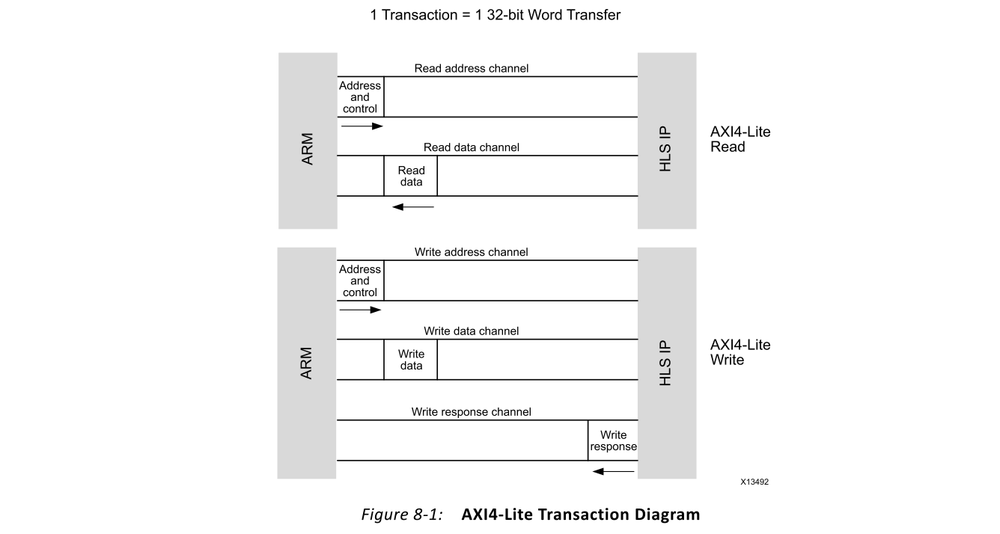
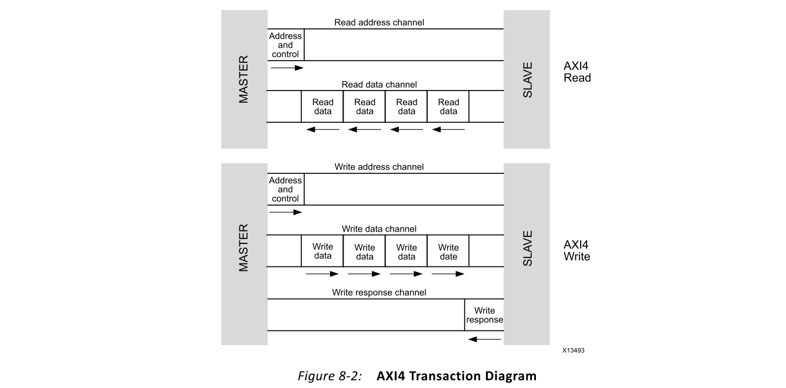
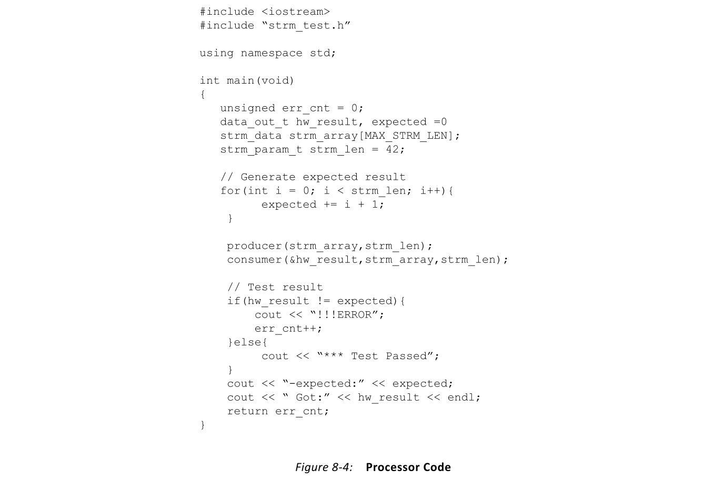
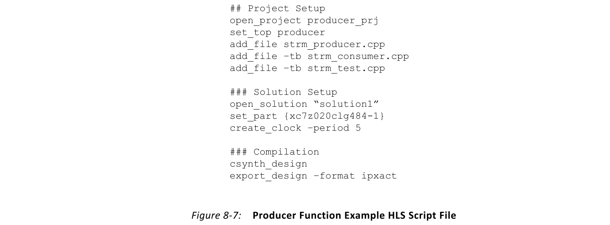
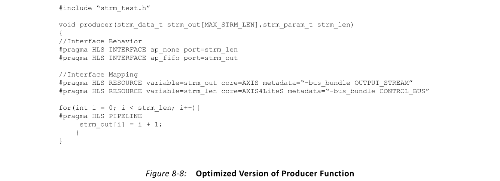
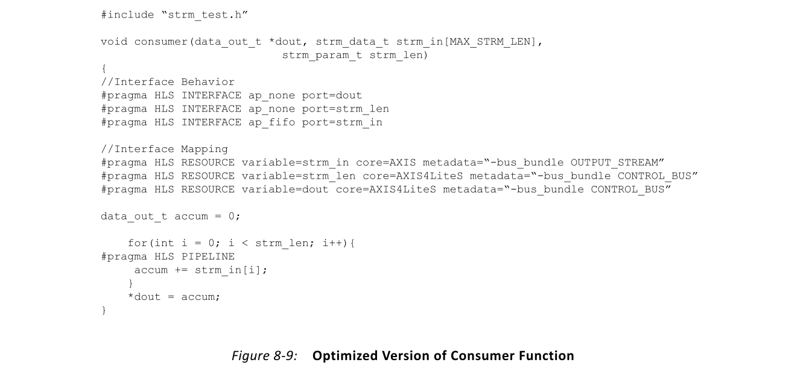
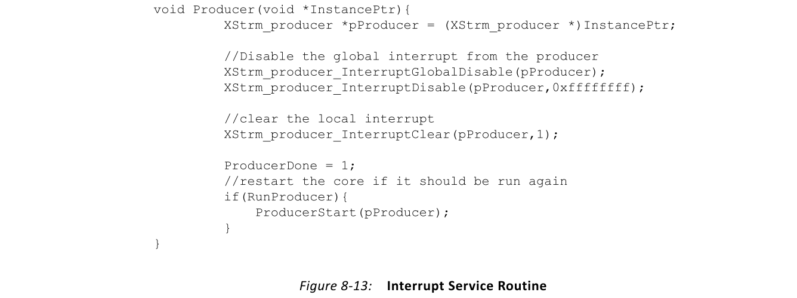
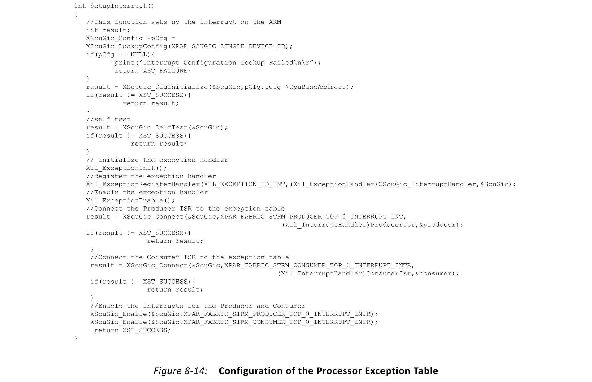
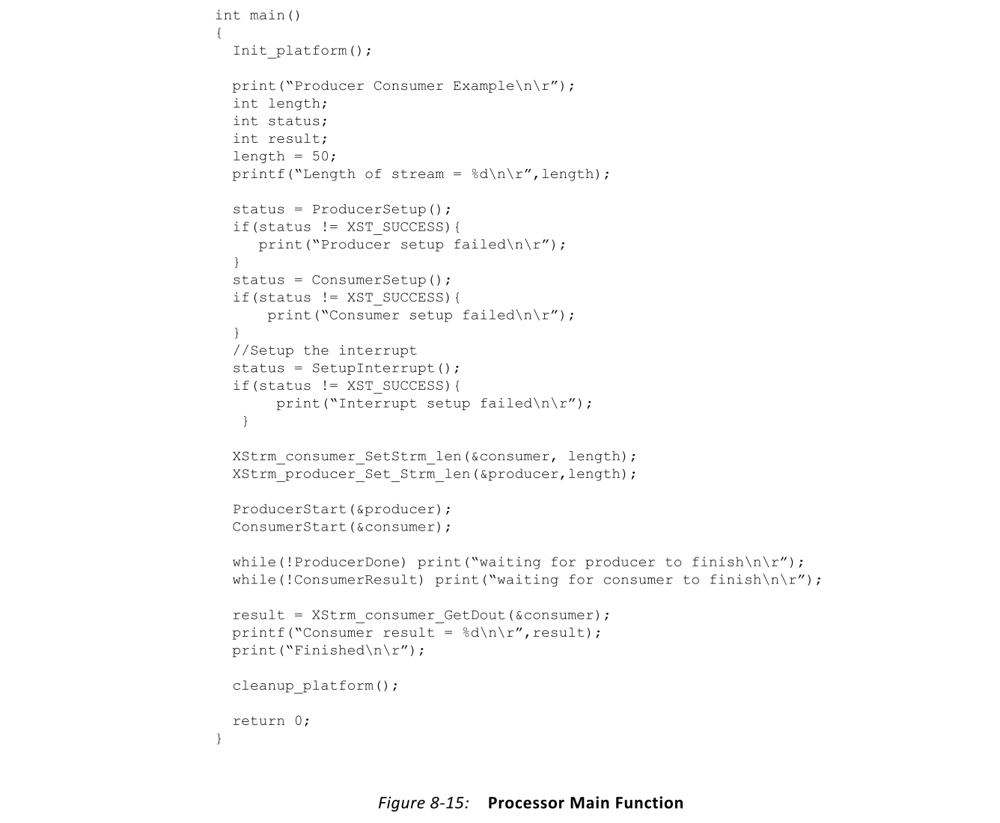

# Ch8 Integration of Multiple Programs
## Overview
正如大多数处理器运行多个程序来执行一个应用程序一样，FPGA实例化多个程序或模块来执行一个应用程序。本章重点介绍如何连接FPGA中的多个模块以及如何使用处理器控制这些模块。本章中的示例使用Xilinx®Zynq®-7000SoC来演示处理器与FPGA架构之间的互连。

Zynq-7000 SoC是针对低功耗软件执行的新型设备中的第一款。该器件在单个芯片中结合了Arm®Cortex™-A9多核处理器和FPGA架构。该设备的集成度消除了与协处理器或加速解决方案相关的通信延迟和瓶颈。该器件还无需PCIe®桥接器即可在处理器上运行的代码与Vivado®HLS为FPGA编译的代码之间传输数据。相反，这两个计算域的互连是通过使用高级可扩展接口（AXI）协议进行的。
## AXI
AXI是Arm高级微控制器总线体系结构（AMBA®）系列微控制器总线的一部分。该标准定义了系统中的模块之间如何传输数据。适用于Zynq-7000 SoC上运行的应用程序的AXI通信用例为：
- Memory mapped slave
- Memory mapped master
- Direct point-to-point stream

> 注意：有关AXI及其如何为Xilinx FPGA实现的更多信息，请参见《 AXI参考指南（UG761）[参考2]。

### Memory Mapped Slave
AXI4-Lite是一种内存映射的从设备连接，它使用与基于处理器的系统中的设备驱动程序相同的通信机制。处理器代码通过向设备驱动程序发出函数调用来访问从加速器内核。Vivado HLS自动生成的设备驱动程序访问加速器中的寄存器以配置和触发任务执行。这些寄存器也可以直接安装在处理器的存储空间中，而无需驱动程序也可以直接访问。

FPGA架构中的从加速器无法自行启动任何数据传输。具体而言，这种类型的接口不允许加速器启动与主存储器的数据传输以完成其任务。该接口的事务图如图8-1所示。此图显示了在事务处理期间花费时钟周期的位置。了解事务序列和时序预算可使设计人员正确确定此接口的适用性和对应用程序性能的影响。

### Memory Mapped Master
AXI4是存储器映射的Master接口，它允许HLS生成的模块启动到设备（例如DDR存储器）的数据事务，而无需处理器的干预。具有此接口的块可以消除处理器从主存储器复制和传输数据所花费的时间，从而提高应用程序的计算吞吐量。

重要的是要记住，处理器无法访问与AXI4接口关联的函数端口。因此，对于具有AXI4接口的模块，建议包含与AXI4-Lite接口相连的某些功能参数，这是推荐的最佳实践。从接口允许处理器传送基址，函数应从基址获取其任务数据。设置事务基地址后，可以从内存和加速模块之间的数据传输中删除处理器。

图8-2显示了AXI4接口的事务时序图。该图显示了事务序列和相关的开销，这使设计人员能够确定该接口对特定应用的适用性。

### Direct Point-to-Point Stream
AXI4-Stream是FPGA架构中两个模块之间的直接点对点通信通道。与AXI4一样，该传输通道在处理器的存储空间中不可见。它也没有与寻址和从内存中获取数据相关的任何开销。而是通过FIFO在模块之间传输数据。

类似于软件开发中函数之间的队列，AXI4-Stream是编译到FPGA架构上的函数之间的首选数据传输通道。连接到这种类型的数据传输通道的函数并行运行，并根据通道的状态自同步。只要通道中有空间，在流输入处连接的函数即生产者就可以传输数据。只要通道报告它不为空，在流输出处连接的函数即使用者，就可以接收数据。

消费者和生产者都独立地与AXI4-Stream通道进行交互。根据通道的状态，函数可以完成事务或等待直到通道就绪。只要功能的总吞吐能力满足系统级要求，就不会丢失或跳过数据。

图8-3显示了AXI4-Stream数据传输通道的事务时序图。该通道不提供寻址逻辑，并且具有用户定义的存储量。默认情况下，AXI4-Stream的深度为1，这使生产者和使用者之间保持同步。生产者与消费者之间的耦合程度可通过更改AXI4-Stream通道中的存储量来影响。

## Design Example: Application Running on a Zynq-7000 SoC
该设计示例展示了如何获取处理器代码并将其转换为可在Zynq-7000 SoC上运行的应用程序。本示例在迁移过程中完成了以下步骤：
- Analyzing and partitioning the processor code
- Compiling the program in Vivado HLS
- Composing the system in Vivado IP integrator
- Connecting processor code and FPGA fabric functions

> 注意：Zynq-7000设备中的Arm Cortex-A9处理器可以支持单程序执行和完整的操作系统，例如Linux。在任何一种情况下，构建应用程序所需的步骤都是相同的。因此，本示例着重于单个程序执行模型，该模型演示了应用程序迁移过程。

### Analyzing and Partitioning the Processor Code
面向Zynq-7000设备的大多数软件应用程序都是在标准x86处理器或DSP处理器上执行的应用程序开始的。因此，移植设计的第一步是为Arm Cortex-A9处理器编译程序并分析其性能。在Arm处理器上运行的程序的性能分析数据可指导设计人员选择如何在处理器和FPGA架构之间划分原始代码。

图8-4显示了此示例的原始处理器代码。

该设计由一个main 函数组成，该功能调用了两个子功能：生产者和消费者。编译到Arm处理器后，有两种方法可以分析程序性能：
- 测量时间

  此方法涉及使用计时器来检测代码，并测量处理器上每个子功能的执行时间。

- 使用代码分析工具

  这种侵入性较小的方法使用诸如gprof之类的工具来测量花费在函数上的时间量，并提供有关函数被调用次数的统计信息。

在此示例中，gprof的结果表明生产者和消费者函数是应用程序中的性能瓶颈。因此，决定在FPGA架构中实现这两个函数。将函数标记为FPGA实现后，必须分析函数端口以确定最合适的硬件接口。

图8-5显示了生产者函数的签名。

生产者函数包括以下端口：
- strm_out

  此端口是用于函数输出的数组，并连接到消费者函数中的相应输入。**由于生产者和使用者功能均以顺序队列的形式访问此阵列，因此最佳的硬件接口是AXI4-Stream**。

- strm_len

  此功能参数是输入，必须由处理器提供。因此，该端口必须**映射在AXI4-Lite接口**上。

图8-6显示了消费者函数的函数签名。

图8-6显示了消费者函数的函数签名。
- strm_in

  该数组端口连接到与生产者函数相同的数组。因此，该端口必须连接到**AXI4-Stream接口**。

- strm_len

  此函数参数的作用与生产者函数相同。与生产者函数相同，此端口被实现为**AXI4-Lite接口**。

- dout

  这是一个输出端口。由于设计中没有其他FPGA架构模块，因此唯一的选择是将值传送回处理器。通过发出处理器中断，可以将数据从FPGA架构直接传输到处理器。确认中断后，处理器将在其内存空间中查询数据。dout函数参数必须映射到**AXI4-Lite接口**，以便可以从处理器程序访问。

### Compiling the Program in Vivado HLS
在确定了要在FPGA架构中运行的功能之后，设计人员将准备用于Vivado HLS编译的源代码。在此示例中，生产者和使用者功能在FPGA架构中实现为独立模块。一个编译项目产生了FPGA架构中的一个模块。因此，在此示例中，设计人员必须运行两次HLS才能生成相应的模块。

> 推荐：当使用多个项目或模块时，建议将源代码分成不同的文件。这种简单的技术可以防止一个模块的编译问题影响设计中的另一个模块。

可以使用工具命令语言（Tcl）脚本文件来控制HLS编译。Tcl脚本文件类似于编译Makefile，它指示编译器实现哪些函数到FPGA器件中。

图8-7显示了用于生产者函数的HLS编译Tcl脚本文件。

该脚本分为以下几节：
- Project setup

  本节包括源文件和要编译的函数的名称。指导Vivado HLS编译器是一个将指令或编译指示应用于设计源代码的迭代过程。设计的每个连续改进都称为解决方案。所有项目至少都有一个解决方案。

- Solution setup 

  本部分建立了为其编译软件功能的时钟频率和设备。如果设计人员通过使用指令引导编译器，则解决方案指令将包含在脚本的此部分中。

- Compilation

  此部分驱动RTL的生成和打包。将HLS程序组装成完整的Zynq-7000设备应用程序时，需要使用Vivado IP集成器，它是一种系统组合工具。IP集成商要求将模块打包为等效于软件对象文件。

> 注意：有关IP和IP集成器的更多信息，请参见《Vivado设计套件用户指南：使用IP设计》（UG896）[参考3]和《Vivado设计套件用户指南：使用IP集成器设计IP子系统》（UG994）[参考4]。

生产者和消费者函数的优化需要使用编译指示来确定所生成模块及其接口的并行性。图8-8显示了生产者函数的优化代码。

生产者函数通过pipeline编译指示并行化。这创建了一种实现，其中i和i+1迭代的开始时间被一个时钟周期隔开。除了pipeline编译指示外，该代码还显示了interface编译指示的使用。

interface编译指示定义了模块在FPGA架构中的连接方式。定义过程分为接口行为和接口映射。在此的示例，发生以下情况：
1. strm_out端口的ap_fifo接口编译指示将数组转换为硬件FIFO。
2. 物理FIFO通过resource编译指令映射到AXI4-Stream接口。
3. 首先将strm_len函数参数分配给ap_none接口行为，然后将其映射到AXI4-Lite接口。

> 注意：AXI4-Lite接口处理来自处理器的strm_len值的正确排序。因此，HLS生成的模块不需要在此端口上强制执行其他同步。

图8-9显示了消费者函数的代码。此函数具有与生产者函数相同的优化和编译指示。

### Composing the System in Vivado IP Integrator
Vivado IP集成器是用于系统组成的Xilinx FPGA设计工具。该工具的一种用途是获取HLS编译器生成的块，并将其连接到执行用户应用程序的处理平台。用软件开发术语来说，IP集成器类似于将所有程序对象组合到单个bitstream中的链接器。bitstream是用于对FPGA架构进行编程的二进制文件。

### Connecting Processor Code and FPGA Fabric Functions
在IP集成器中创建FPGA架构编程二进制文件后，设计人员必须创建在处理器上运行的软件。**该软件的目的是初始化FPGA架构功能，启动执行并从架构中接收结果**。为了使整个应用程序在功能上等同于原始处理器代码，在FPGA架构中运行的**每个函数都需要在Arm Cortex-A9处理器上运行的代码中具有以下功能**：
- Address mapping
- Initialization
- Start function
- Interrupt service routine (ISR)
- Interrupt registration in the processor exception table
- New main function to run the system

此函数适用于在FPGA架构中运行的生产者和消费者函数。因此，图8-10中仅显示了生产者函数的代码。

此代码显示了处理器程序空间中生产者硬件模块的配置。第一个参数指出正在构造中访问生产者函数的哪个实例。由于FPGA中只有生产者的一个实例，因此此参数的值为0。基址定义由IP集成器中的系统组成步骤提供。此地址表示可从处理器访问的内存映射加速器在内存空间中的位置。

图8-11显示了使生产者硬件模块可用于处理器上运行的程序所需的初始化功能。

图8-12设置了生产者硬件模块以开始执行任务。该功能负责将模块中断设置为已知状态并开始执行任务。

图8-13中所示的ISR描述了处理器如何响应FPGA架构中生产者函数的中断。ISR的内容是特定于应用程序的。此代码显示了与Zynq-7000设备中的HLS生成的模块正确交互所需的最低ISR。

所有中断服务程序必须在处理器异常表中注册。处理器中断控制器初始化之后，主程序可以开始执行用户应用程序。图8-14显示了如何为Zynq-7000设备配置异常表。

图8-15显示了该应用程序的新主程序。在设置好硬件并配置了处理器环境之后，对于本示例来说，处理器上没有剩余的计算量。通过使用HLS编译，所有计算都移到了FPGA架构中。在这种情况下，处理器的目的是在每个硬件模块上启动任务，并在模块完成任务后收集结果。

