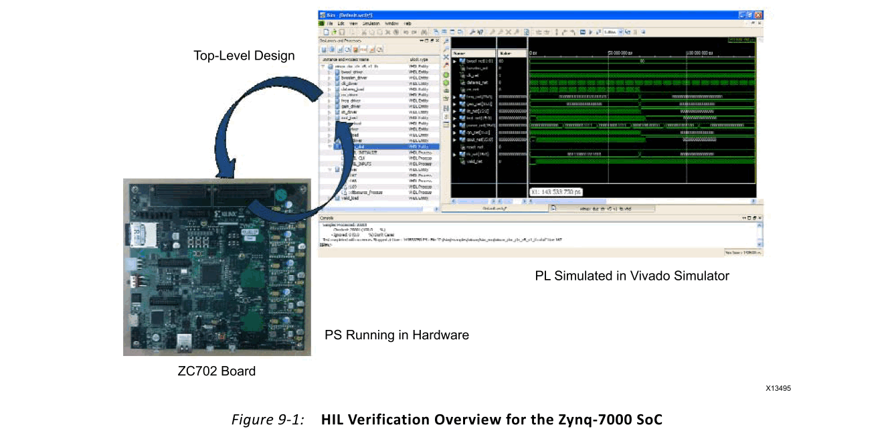

# Ch9 Verification of a Complete Application
## Overview
在FPGA设计中，一个完整的应用程序是指一个硬件系统，该系统实现了由设计的软件表示所捕获的功能。可使用Vivado®HLS编译器在FPGA上构建的系统主要有两类：
- 独立计算系统
- 基于处理器的系统
## Standalone Compute Systems
独立计算系统是由一个或多个HLS生成的模块创建的FPGA实现，这些模块连接在一起以实现软件应用程序。在这些类型的系统中，算法的配置是固定的，并在设备配置期间加载。由HLS编译器生成的模块连接到外部FPGA引脚，用于数据发送和接收事务。这是最容易验证的系统。
独立系统的验证分为以下几个阶段： 
- Module verification
- Connectivity verification
- Application verification
- Device validation
### Module Verification
第7章，软件验证和Vivado HLS中详细介绍了HLS生成块的模块验证。在软件和协同仿真中完全验证了该模块的功能正确性之后，设计人员必须测试该模块的系统误差容限。

软件仿真和协同仿真都专注于单独测试算法的功能正确性。也就是说，对算法和编译模块进行了测试，以确保以理想方式处理所有输入和输出时的正确功能。全面的测试有助于确保将数据提供给模块后的正确性。通过消除模块的内部处理核心作为可能的错误源，它还有助于减少后续阶段的验证负担。此方法未处理的唯一模块级问题是验证模块可以从其接口处的错误握手中完全恢复。

系统内测试测试HLS生成的模块如何响应其输入和输出端口的不正确切换。该测试的目的是消除I/O行为，因为它可能导致崩溃或以其他方式不利地影响被测模块。用这种方法测试的不当用例的类型是：
- 不稳定的时钟信号切换
- 复位操作和随机复位脉冲
- 输入端口以不同速率接收数据
- 输出端口以不同速率采样
- 接口协议冲突

这些测试是系统级行为的示例，可确保HLS生成的模块在所有情况下均按预期运行。此阶段所需的测试量取决于接口的类型和集成方法。通过使用HLS默认设置生成符合AXI的接口，设计人员可以避免编写详尽的错误的系统级行为的测试平台。符合AXI标准的接口已由HLS编译器的开发人员进行了全面测试和验证。

### Connectivity Verification
连接性验证是一系列测试，用于检查应用程序中的模块是否正确连接。与模块验证一样，所需的测试量取决于系统集成方法。如第8章中讨论的那样，可以手动或在FPGA设计工具的帮助下组装应用程序。

Xilinx®系统生成器和Vivado IP集成器设计流程均提供了FPGA设计工具帮助。这些图形模块连接工具可处理与模块连接有关的所有方面。作为这些流程的一部分，每个工具都会检查应用程序中每个模块的端口类型和协议符合性。如果每个模块都经过了模块验证，则无需使用这些流程中的任何一个进行其他用户控制的连接测试。

手动集成流程要求用户在RTL中编写应用程序顶级模块，并手动连接组成应用程序的每个模块的RTL端口。这是最容易出错的流程，必须进行验证。通过使用HLS编译器默认设置并为每个模块端口生成AXI接口，可以减少所需的测试量。

对于围绕AXI接口构建的系统，可以通过使用总线功能模型（BFM）验证连接性。BFM提供了Xilinx验证的AXI总线和点对点连接的行为。这些模型可用于流量生成器，作为RTL模拟的一部分，有助于证明HLS生成的模块的正确连接。

重要提示：请记住，此模拟的目的仅是检查连接性和通过系统的数据正确流动，这一点很重要。连接验证步骤不验证应用程序的功能正确性。
### Application Verification
在FPGA器件上运行应用程序之前，应用程序验证是最后一步。该流程中的先前步骤着重于检查组成一个应用程序的各个算法的质量，以及检查一切是否正确连接。**应用程序验证的重点是检查原始软件模型是否与FPGA实现的结果匹配**。如果应用程序由单个HLS生成的模块组成，则此阶段与模块验证相同。如果应用程序由两个或多个HLS生成的模块组成，则验证过程将从原始软件模型开始。

设计人员必须从软件模型中提取应用程序输入和输出测试向量，以用于RTL仿真。由于硬件实现的构造需要分多个阶段进行验证，因此应用程序验证不需要进行详尽的仿真。仿真可以根据需要运行任意数量的测试向量，以使设计人员对FPGA实施充满信心。

### Device Validation
在使用自动或手动集成流程将应用程序组装到RTL中之后，设计将经历一个附加的编译阶段，以生成对FPGA进行编程所需的二进制或比特流。在FPGA设计的术语中，将RTL编译成比特流称为逻辑综合，实现和比特流生成。生成比特流后，即可对FPGA器件进行编程。硬件在设计人员指定的时间内正确运行之后，将对应用程序进行验证。

## Processor-Based Systems

对于模块和连接性验证阶段，基于处理器的系统的验证流程与独立系统相同。主要区别在于应用程序的一部分正在处理器上运行。在Zynq®-7000SoC中，这意味着应用程序的一部分在嵌入式Arm®Cortex™-A9处理器上运行，并且一部分由HLS编译以在FPGA架构上执行。这种划分带来了验证挑战，可以通过使用以下技术来解决：
- 硬件在环（HIL）验证
- 虚拟平台（VP）验证

### Hardware in the Loop Verification
HIL验证是一种验证方法，其中在FPGA架构中对被测系统的**一部分进行仿真**。在Zynq-7000 SoC中，针**对处理器的应用程序代码在设备中实际的Arm Cortex-A9处理器上执行**。使用**HLS编译的代码在RTL仿真中执行**。

图9-1概述了Zynq-7000设备的HIL验证。该图中的系统是一个实验设置，包括ZC702评估板（目前是商用板）和Vivado模拟器。该图还介绍了处理系统（PS）和可编程逻辑（PL）单元的概念。PS指的是双Arm Cortex-A9处理器，也称为处理子系统。PL指Zynq-7000器件内部的FPGA逻辑，这是HLS生成的模块映射到的器件部分。

> 提示：HIL验证需要一块板才能访问处理器，并且该技术可在任何Zynq-7000 SoC板上使用。

HIL验证与验证的主要优点是：
- 处理器模型与实际处理器之间没有仿真矛盾
- 处理器上运行的代码以FPGA器件的速度执行
- 可以通过RTL仿真全面了解每个生成的模块的工作方式

使用HIL验证时，记住该技术的性能特征很重要。尽管处理器代码在实际的硬件中运行，但FPGA架构完全在设计人员的工作站上仿真。如第8章“集成多个程序”中所述，RTL模拟是一个相对较慢的过程。因此，仅建议使用HIL验证来**验证处理器与FPGA架构之间的主要交互**，而不是应用程序中的每个用例。使用HIL验证检查的关键应用程序行为是：
- Vivado HLS驱动程序集成到处理器代码中
- 从PS到PL写入配置参数
- 从PL到PS中断
  
与软件算法的RTL实现一起，**Vivado HLS编译器会生成处理器与所生成的硬件模块进行通信所需的软件驱动程序。Vivado HLS的驱动程序处理加速器的启动和停止，配置以及数据传输**。该驱动程序可用于Linux和独立软件应用程序。

> 注意：独立软件应用程序是一个系统，其中处理器仅执行一个程序，不需要操作系统支持。

### Virtual Platform Verification
虚拟平台技术是一种成熟的软件和硬件开发重叠方法，可用于Zynq-7000 SoC。虚拟平台是对应用程序及其在其上运行的硬件平台的软件模拟。用于设计的PL部分的模型可以是C，C++，SystemC或RTL。该仿真平台可以用作其他推荐的验证阶段的代理，并且对硬件实现的保真度也有所不同。

在虚拟平台的最快使用情况下，从提供给Vivado HLS编译器的C/C++源代码模拟针对PL的应用程序模块。此设置会产生功能上正确的仿真，使设计人员可以测试算法以进行正确的计算。当使用Vivado HLS对模块进行优化和编译时，生成的RTL可以替代模块的软件版本，以实现连通性测试和时序驱动器仿真。

> 重要说明：请记住，添加RTL模块会影响虚拟平台上的运行时并减慢执行速度，这一点很重要。

### Device Validation
设备验证的目的是检查处理器与FPGA架构交互的所有应用用例。与独立执行一样，此过程涉及在Zynq-7000 SoC上运行整个应用程序一定时间。该测试的目的是检查与设计的PS和PL部分之间的交互有关的所有应用特定情况。